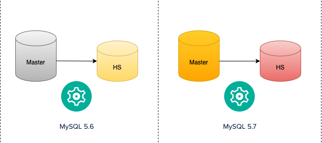
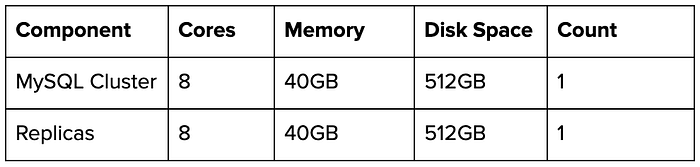
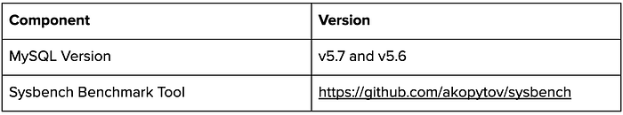
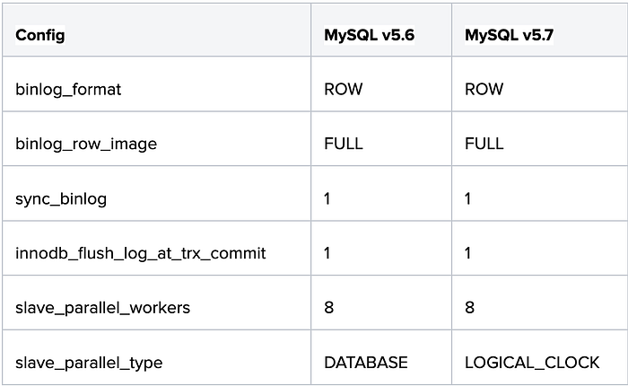
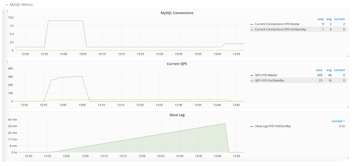
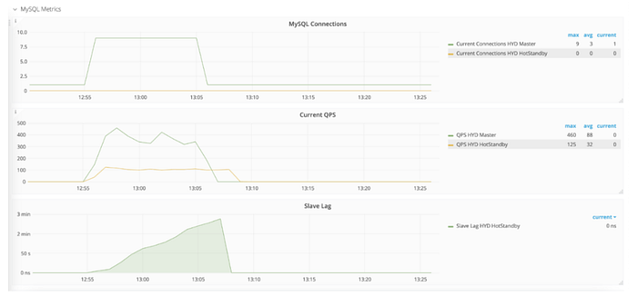
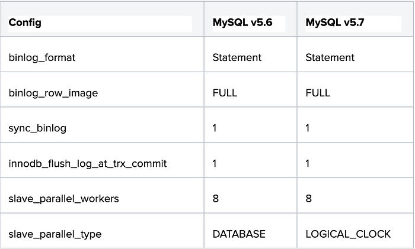
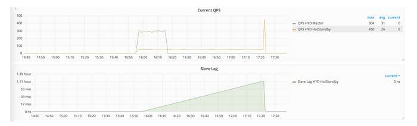
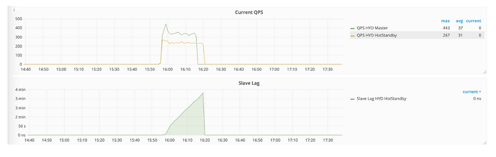

# MySQL Replication Lag Analysis

## The High Replication Lag Issue

MySQL is one of the most popular and trusted transactional data stores in the world and it should come as no surprise that Flipkart manages one of India’s largest fleets of MySQL because of e-commerce as a domain, which is super heavy on transactional data processing.

Anyone who has worked with MySQL is well aware of replication lags when the system experiences high scale. While it is not uncommon to have replication lag, the size, scale, and frequency of data being handled throughout the year and especially during the sale, we cannot sideline the functional, operational, and business impact caused by the replication lags. During Flipkart’s Big Billion Day Sales, a good number of clusters were always used to build replication lag on replicas, and the Altair team rebuilt the nodes to fix the issue. We identified clusters facing high replication lag issues and reason out the same.

In our capacity as a central platform, we analyzed varied kinds of workloads, schemas, and query patterns to come up with a well-documented guide on managing Replication lags.

This article is an account of the investigation, analysis, tests, results, and recommendations to manage the replication lag as a part of the centrally managed MySQL fleet at Flipkart.

## The Analysis

Altair is a DBaaS for MySQL service built on top of the Flipkart Cloud Platform constructs which offers a seamless MySQL provisioning/maintenance/cluster management experience and abstracts infrastructure provisioning with complete platform service integration.

## Stats and Observation

Altair (Flipkart’s DBaaS) manages around 700 clusters as of today and out of these, 450 odd clusters are running on MySQL v5.7 and 250 odd clusters are still running on MySQL v.5.6. These clusters run different workloads, for example, Order, Shipment and Warehouse management systems, Accounting systems. As for the data size, these clusters range from 500GB to 3TB.

We started the analysis by collecting replication lag observed over a period of the last 3 months on all the clusters in Altair. Along with replication lag, we collected cluster MySQL version and binary log format used in the cluster and also QPS observed on the cluster when the replication lag was high (> 1000 seconds).

**Total clusters: 700**

**High Replication Lag MySQL 5.6 Clusters: 26**

**High Replication Lag MySQL 5.7 Clusters: 3**

Most high replication lag in the replica instances was observed in MySQL version 5.6. In the clusters on MySQL version 5.7, the QPS was high on the Master.

## What is Replication Lag?

MySQL supports the replication of data into several other nodes (VMs or Pods) called replicas for getting better reliability and availability. These nodes into which data is replicated are simply known as Replicas. They store the entire data and not just partial data (unlike some other distributed systems) — however, this data could either be completely in sync (or consistent) with the Source node or be async (or eventually consistent) with the Source node.

There are different aspects of replicating data:

1. Using a file/pointer called Binary Logs or a Global Transaction Identifier
2. Using ASYNC or SEMI-SYNC or SYNC modes of syncing this data (each has its pros and cons)

This Replication is done in two phases typically to preserve data integrity:

1. **Network transfer — also called the IO thread — pulls data from the Source to the Replica into a file called relay log.**
2. Apply on MySQL — also called the SQL thread — reads from the relay log and writes to MySQL preserving the order.

MySQL 5.5 had a single SQL thread to apply relay log events, and MySQL 5.6 introduced a parallel replication (multiple SQL threads) to apply relay logs at a database/schema level. In MySQL 5.7, we can have multiple SQL threads on the replica to apply relay log events for the same group commit.

The Replication Lag is the addition of the delay caused by both the threads — in terms of time — the difference between the time a query was executed on the Source MySQL and the time it was executed on the Replica MySQL.

## Why does Replication Lag matter?

Here’s a simple example of what could happen if systems are designed without considering the replication lag.

Let’s consider an overly simplistic e-commerce website with a simple order management system (OMS) powered by MySQL — whenever someone orders an item from the website, it is written to this database. And when someone wants to know the status of their order, it is read from this database. The team thinks it is best to redirect the reads to a different node in order to reduce the load on the Primary.

So technically, order writes are happening to the Primary while the order details are being read from the Replica and shown on the website. It seems like a fair thing to do when there’s not much scale; i.e. — on most days / BAU — however, here’s what can happen, if there is a significant scale and a replica lag.

Let’s assume there is one more system here — the Warehouse Management System (WMS), which processes the orders from the warehouse.

Now imagine there’s a sale and because of the huge load on the systems, the Replica is lagging by 10 hours. This means it will reflect the state of the order nearly 10 hours back, in which case, this is how things now look:

1. Someone placing an order on the website does not see it immediately on the ‘My Orders’ page — leading to unnecessary customer care escalations.
2. If an order has been **_dispatched_**, the customer still sees the 10-hour-old update which is **_reserved_** and this can also lead to unnecessary escalations.
3. If an order is actually **_dispatched_** and we show it as **_reserved_**, which may prompt the customer to ‘cancel’ the order.
4. Such cancellations cost a lot to the organization because the product has already been **_dispatched:_**

> Cost of transporting the product back to the warehouse

> Cost of QA checks

> Cost of packaging

These extra costs are not just monetary, but also amount to loss in the effort, time, and customer satisfaction, although the customer wanted the product, and the workflow was going on per plan.

## Why do some teams point their reads to Replica?

Sometimes the use case isn’t affected by the Replica’s lag or systems could also be designed for eventual consistency. For example,

Let’s talk about inventory updates — if 1000 quantity of a particular inventory has been in warded into a warehouse at time t0 while the update to the order management system is happening from a Replica which is running at a lag of a few hours, then there is no harm done except that placing of orders get delayed by so many hours (there’s still a notional loss here).

Or another example is — if reports are being generated from a database that is typically running at a few hours of replication lag, then the reports don’t really get affected because it is known that they are not querying the latest data but are more interested in the last month’s data which is anyway in sync (assuming that there are no updates happening on the older data).

That said, sometimes teams start off with genuine use cases where there is little or no impact because of the replication lag on the specific use case, but eventually also onboard some features that are still okay with bounded lags but not unbounded lags. Another reason teams do this is to reduce pressure on Primary and divert some of the traffic to multiple Replicas.

We ran experiments to understand whether an upgrade of the cluster version from 5.6 to 5.7 can help in mitigating the replication lag issues. This helped us test our hypotheses without blindly trusting any external benchmarks.

## The Test Setup

We deployed two MySQL clusters, one with MySQL 5.6 and another with MySQL 5.7, with each cluster containing two nodes, a Master and a Hot Standby.



## Hardware Details

We picked some of the most commonly deployed hardware configurations for the test:



## Software Details



## MySQL Configurations

We concluded by conducting the exercise by tuning the below configurations as they affect replication lag.



## Benchmark Tool

In the Flipkart platform team, we prefer running benchmarks using various benchmark tools available for the initial set of validations and then involving a functional team for validating use cases.

There are several benchmarking tools available in the market which help us in testing many database scenarios. Each of these tools offers different workloads that can be suited for different sets of databases and their capabilities.

- **YCSB**: Provides simple workloads, best suited for NoSQL database evaluations.
- **TPC-C**: Simulates OLTP workload. It has more complex transactional types and simulates wholesale supplier systems, more common in e-commerce systems. Basically used for measuring the system throughput and stability.
- **Sysbench**: Offers workloads best suited for MySQL (DBMS) and is customizable, as per the requirement.

In our testing, we preferred using the Sysbench tool as it provided a transactional workload with multiple tables.

## Command

```
sysbench --db-driver=mysql --mysql-user=sbtest --mysql-host=10.54.2.218 --mysql-password='test' --mysql-db=test --mysql_storage_engine=innodb --table_size=10000000 --tables=8 --threads=8  /usr/share/sysbench/oltp_write_only.lua --time=1200 run
```

## Test Plan

- Deploy MySQL v5.6 and v5.7 clusters with the above-mentioned hardware details.
- Add the configuration mentioned above in the config file and restart the server.
- Use oltp_write_only Sysbench workload and start the test with 8 threads, 8 tables, and 10 Million records.
- Run the test for 1200 seconds and capture the QPS and replication lag on the replica.

## Test Results

_MySQL 5.6 Load QPS and Replication lag_



_MySQL 5.7 Load QPS and Replication lag_



From the graph, we see that the load has been running for the same duration both in the 5.7 and 5.6 clusters. A 30 min replication lag was observed on 5.6 clusters whereas 3 min replication lag was seen on 5.7 clusters.

In our analysis, we also noticed that some clusters with high replication lag issues were also using STATEMENT-based replication. So we wanted to understand if multi-threaded replication on 5.7 works well with STATEMENT-based replication as well.

We repeated the test case using ****binlog_format = statement****. Here is the test configuration specification:



## Benchmark Tool

**Sysbench**

Command

```
sysbench --db-driver=mysql --mysql-user=sbtest --mysql-host=10.54.2.218 --mysql-password='test' --mysql-db=test --mysql_storage_engine=innodb --table_size=10000000 --tables=8 --threads=8  /usr/share/sysbench/oltp_write_only.lua --time=1200 runTest Results
```

_MySQL 5.6 Load QPS and Replication lag_



_MySQL 5.7 Load QPS and Replication lag_



From the graph, we see that load has been running for the same duration both in the 5.7 and 5.6 clusters. An hour’s replication lag was observed on 5.6 clusters, whereas 3 min replication lag was seen on 5.7 clusters.

While both 5.6 and 5.7 MySQL versions offer multi-threaded replication, MySQL 5.6 supports only the “Database” replication type. This improves the replication performance to some extent only when the cluster has multiple databases. MySQL 5.7 supports both “Database” and “Logical_clock” replication types. In the LOGICAL_CLOCK type, transactions that are part of the same binary log group commit on a master are applied in parallel to a replica. There are no cross-database constraints, and data does not need to be partitioned into multiple databases.

## Improved Replication performance in v8.0

MySQL v8.0 brings a few more improvements in the replication performance. It adds a much improved parallel applier by relying on transaction WRITESETs (roughly the set of rows changed). This also allows the applier to install changes in parallel even for single-threaded workloads coming in from replication. There is an improved synchronization mechanism between the receiver and applier threads, which translates into less contention between the receiver and applier threads.

## Recommendations

If your setup is like the one presented in this article, here are a few informed suggestions that may be useful to bring down the replication lag significantly:

- **Use Row-based replication: **Even when there is a lower speedup, the execution time is much smaller in ROW-based replication with minimal images than in STATEMENT-based replication.
- **Use MTS threads frugally: **Too many MTS threads often increase the synchronization effort between threads and reduce the benefits. While a lot of these decisions are based on workloads, we suggest an estimated usage of 4 to 8 threads for ROW-based replication, a slightly higher number for STATEMENT-based replication, and a few more to accommodate the durability requirements.
- **Upgrade MySQL versions incrementally: **Upgrade from MySQL v5.6 to v5.7 and then to v8.0 if you are already using MySQL v5.6. For new MySQL deployments, directly install v8.0.
- **Don’t parallelize too much: **Too many parallel applier threads increase the synchronization effort between threads and may bring reduced benefits.
- **Relax the durability setting: **If your replica bottlenecked at high I/O, and high amount of content pending a flush to disk, and If your system can tolerate some data loss under rare conditions, you might decide to relax durability settings like sync_binlog = 0 and ​​innodb_flush_log_at_trx_commit = 0. This will help reduce overhead when you COMMIT transactions.

## Credits

Vaidyanathan, Shan Predson, Sukan M

---
**Tags:** MySQL · Replication Lag · High Replication Lag · Replication Performance
