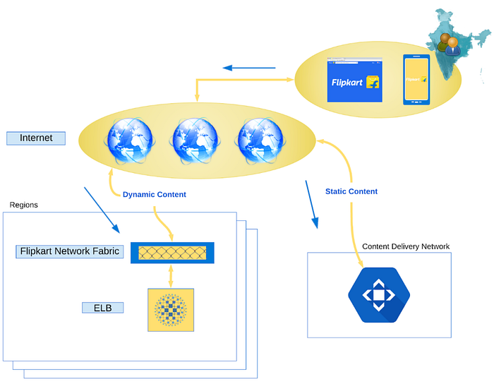
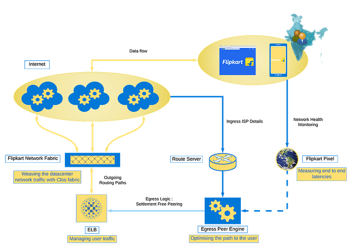
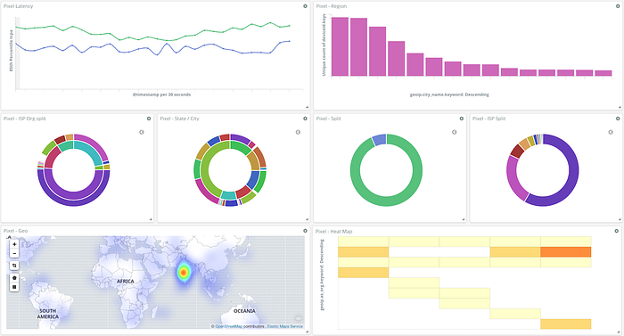
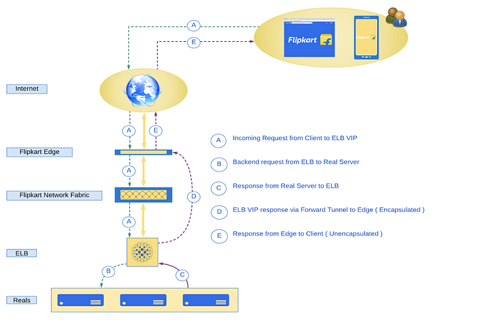
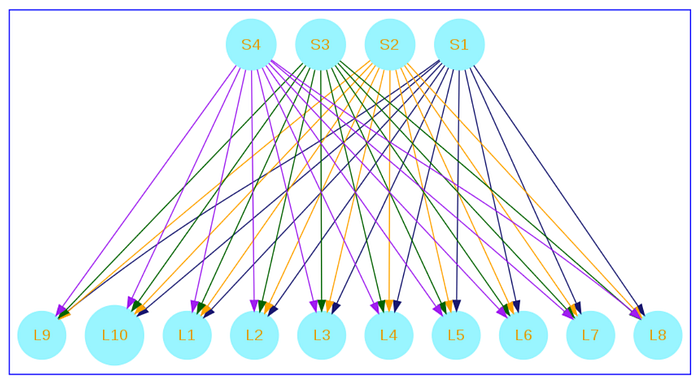
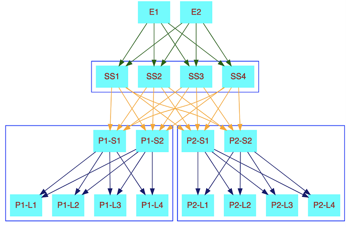

# Network Optimizations in Flipkart’s Data Centers — SlashN 2019

> This post is based on SlashN 2019 talk by Raghdip and Giridhar Yasa

Flipkart’s private cloud infrastructure spans two data centers with tens of thousands of servers, managing petabytes of data over hundreds of Gbps internet lines and data center interconnects. It runs a variety of applications ranging from Databases, Web Services, Big data infrastructure, and ML models.

In this article, we’ll cover details of how data traverses a virtualized host, data centers, and the Internet to reach Flipkart’s end users, along with the optimizations we do in Flipkart.

## Network Traffic Routing in Flipkart

Website contents are of two types — Static content such as images, JavaScript, and CSS that are constant for every user ; Dynamic content such as recommendations, and search results. We serve the static content via a Content Delivery Network (CDN) and dynamic web content from regions via the Flipkart Network Fabric.

In our constant effort to reduce network latencies and improve availability, we chose Selective [Peering](https://www.flipkart.com/peering) Policy over IP Transit in our network design. This optimized network model is fail-proof, supports consistent network relays, and encourages troubleshooting to be a collective commitment for all providers in the peering group.

## Optimizing the Network Infrastructure

The following picture illustrates the various Infrastructure Optimizations that we have done in FK network to address connectivity, latency, and user experience challenges:

Various optimizations fall under the following buckets:

- Measuring end-user Latencies
- Optimizing the path to the users
- Managing user traffic
- Weaving the data center network fabric

## Measuring end-user latencies

Every functional, operational, or technical change on the network may cause an impact on the network performance or user experience. We make informed decisions of change based on the inputs from an in-house Real-time User Monitoring (RUM) platform — Pixel.

We have designed Pixel for the following use cases:

- Capture degradation in the user experience
- Capture performance implications of the Alpha/Beta tests
- Intelligence to power the FCP Egress Peer Engineering Framework

Pixel tracks latency and degradation in all regions using network performance indicators such as TCP round trip time, and HTTP request latency. This helps in determining the most optimal path to reach customers.

## Optimizing the path to the users

We employ Egress Peer Engineering to ensure we are safe from various perils of open internet, and route user’s traffic in a secure and performant way.

Egress Peer Engineering uses _Border Gateway Protocol (BGP)_ route servers, which establishes multi-hop peering with service providers.

This helps by:

- Determining the most optimal path to reach customers.
- Dropping invalid routes received from upstream peers by leveraging [Internet Routing Registry](https://en.wikipedia.org/wiki/Internet_Routing_Registry) (IRR)
- Preventing routing of egress traffic to incorrect service providers because of invalid or erroneous route announcements.

_Border Gateway Protocol (BGP) path data along with latency information gathered by Pixel helps to identify a slow-performing regional server and re-route traffic to faster servers elsewhere on the network._

## Managing user traffic

Our Elastic Load Balancer (ELB) stack is scalable, secure, discoverable, and observable. It can handle unpredictable traffic as well, which can be several times the normal traffic levels.

While offering standard feature sets such as HTTP/S, HTTP2, GRPC load balancing; ELB also offers matured and scale-tested features such as distributed rate limiting and telemetry.

## Weaving the Datacenter Network Fabric

We chose Layer 3 [Clos network](https://en.wikipedia.org/wiki/Clos_network) fabric to facilitate large data center deployments that could support up to 100k bare metals in one location.

Layer 3 Clos Fabrics are complete bipartite graphs where every vertex of the first set is connected to every vertex of the second set, making it a highly available network.

This offers predictable latencies to all the connected servers. We replicate this and use it as the building block to create a multistage Clos fabric.

We have designed our data center fabric with an optimized RIB/ FIB scale, feature sets, and Merchant silicon for easy isolation of a faulty node in the event of a failure. Additionally, we have automated our network deployments and streamlined the lifecycle management, with an abstract, vendor-neutral configuration approach in our modular network fabric design.

This model helps us to:

- develop each component independently and introduce more features as needed.
- be future-ready and scale to tens of thousands of servers in existing and new Data centers.

## Way Forward

- Self-healing infrastructure, which can find issues quickly and remediate them without human intervention, which will become the need of the hour as the network expands.
- Building a cloud-native network with multi tenant capabilities.
- Disaggregated storage for improving infrastructure utilization.

---
**Tags:** Data Center · Backend · Slashn · Networking · DevOps
