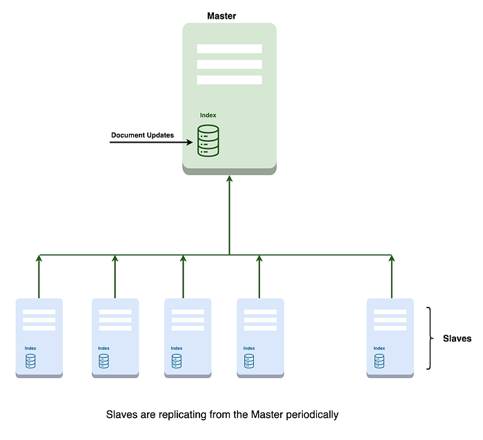
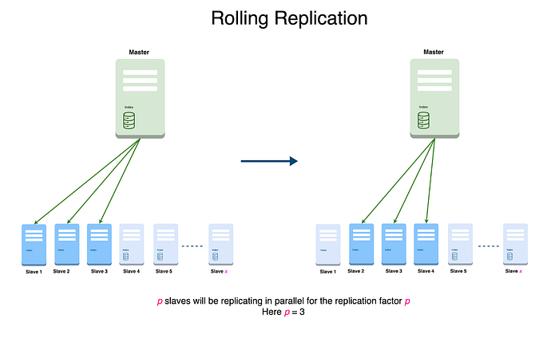
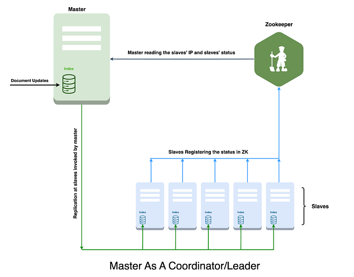
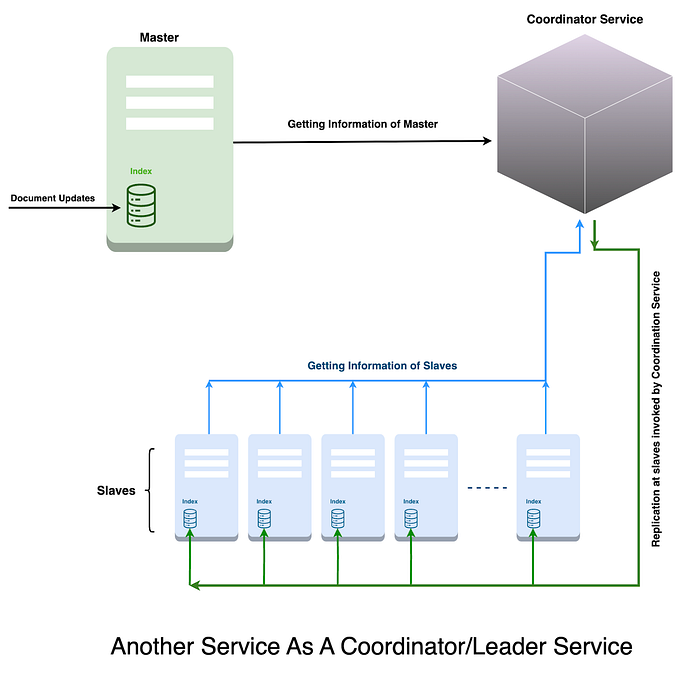
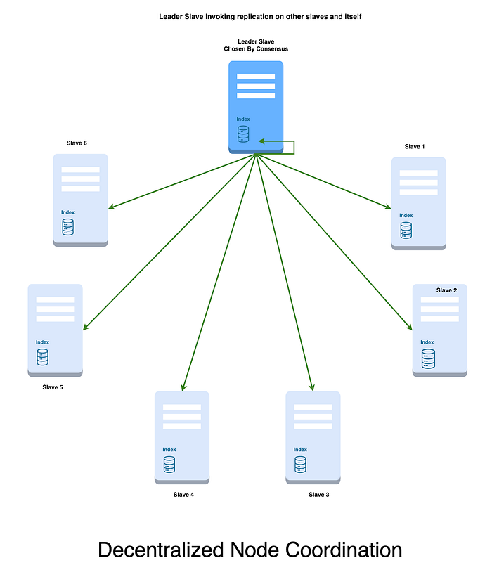
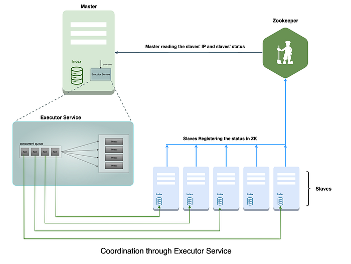

# Node Coordination System

> A Key to Leader-Follower Replication Success

On any e-commerce website, the search feature continues to be prominent. The users need to find what they are looking for as quickly as possible. At Flipkart, the search index guides the users and its architecture serves as the repository for data about the enormous volume of structured product listings.

With millions of products constantly evolving, our leader-follower architecture manages this extensive search dataset. This blog explains the details of our search index architecture and coordinated replication approach within the leader-follower framework.

## Introduction

The Search Index comprises detailed product information and dynamic seller-specific listings that change almost in real time. We developed a [Near Real-Time (NRT)](https://blog.flipkart.tech/sherlock-near-real-time-search-indexing-95519783859d) data store to ensure that our systems are updated promptly with recent changes and deliver an up-to-the-minute user experience.

The challenge of maintaining a seamless mapping of products to their associated listings lies in managing the dynamic nature of product and listing attributes and also in the voluminous write and read operations.

**In our search engine orchestration:**

- The Solr indexes the product entities.
- NRT stores hold listings related to the products.
- The Leader node takes charge of all write operations, while the follower nodes manage the read operations.
- The Follower replicates the data from the Leader to ensure real-time synchronization between leader and follower nodes.

**For product updates:**

- The Leader generates fresh segments of the index that the followers replicate.
- The follower nodes update their NRT stores, ensuring that the user experience remains consistently current when the replication is complete.

**Real-time updates of listings:** Leveraging a Redis store as the repository for listing data, the follower nodes, upon replication, cross-reference the listings for the products and retrieve the latest data from Redis to populate their NRT stores.

In this fast-paced e-commerce environment, the orchestration of our search index architecture ensures that our users find precisely what they’re looking for every time they engage with Flipkart. This blog post is your ticket to the backstage, offering insights into our node coordination systems, a key player in our leader-follower replication strategy.

## Existing replication strategy

When the leader node receives product updates, it compiles a segment of the updated products periodically and commits the update. Each follower node has a scheduled cron job that replicates on its own from the leader node. This cron job acts as the conductor, orchestrating the replication process at specific scheduled intervals, ensuring a harmonious and synchronized system.

Upon initiation of replication, a follower node embarks on a two-fold mission:

- Retrieves the index from the leader node, ensuring it captures the latest product updates and creates in-memory reverse indexes that are optimized for matching and filtering.
- Engages in a comprehensive update of the Near Real-Time (NRT) store

This task involves interacting with the Redis store to fetch listing data for all updated products, a procedure that demands querying Redis for a substantial number of listings.

Creating in-memory reverse indexes and updating the NRT store can be computationally intensive, potentially impacting the read operations of the follower node. In our proactive approach to reduce this strain on the system, we scheduled cron jobs at distinct times on each follower node. This staggered schedule not only distributed the computational load more evenly but also ensured that read operations on the follower nodes remained robust and responsive.

The design of this replication process not only guarantees timely and updated product information across the system but also emphasizes the need for optimizing system performance that balances the intricacies of data synchronization with the operational demands of a dynamic e-commerce platform like Flipkart.

## Issues with the current replication strategy

**Reduced system uptime:**

The size of the segment that a follower retrieves from the leader for replication decides its performance. As the segment size increases, the time to load the overall index in the follower also increases. The performance of a follower may decline when it is engaged in replicating a sizeable segment. When multiple followers are engaged in replication, the overall system uptime reduces considerably. This happens because multiple followers replicate and occupy their resources with replication and also serve user requests simultaneously which leads to a latency increase.

**Reduced customer experience:**

The constant updates to various product attributes lead to gradual fragmentation of the index over time, leading to latency in query execution. To mitigate this issue, we created a fresh search index daily based on ranking signals. This new index transitioned onto the leader node and propagated to the followers through the replication process. If the follower nodes replicate a new index, which can be of substantial size (reaching up to 62 GB) in high production traffic, the entire cluster can encounter latency problems and potentially affect the customer experience. Towards this concern, we introduced a coordinated replication strategy that incorporated fresh indexes into the system without compromising the user experience even during peak traffic times. That’s how we have refined our systems to provide an unparalleled and uninterrupted shopping service to our customers.

## Rolling Replication Strategy and Node Coordination for replication

## Rolling Replication

Rolling replication is a technique in distributed systems to replicate data among nodes with minimal disruption. It is valuable in situations where maintaining consistency in data, high availability, and minimal downtime are paramount. This strategy involves selecting a subset of nodes for replication based on a replication factor (**_p_**), which is typically a percentage of the total node count. Factors such as cluster size and read traffic patterns influence the determination of **_p_**. Once the system identifies the subset, the nodes replicate. As replication progresses on one or more nodes, additional nodes are systematically brought into the replication process, ensuring that only a fraction of the total nodes (**_p_**) undergo replication. The diagram below illustrates the rolling replication process.

## Node Coordination for Replication

A robust node coordination system plays a pivotal role in orchestrating seamless communication and information sharing among nodes. Various techniques, such as leader election, consensus algorithms, and distributed locking, help achieve effective node coordination.

We devised several strategies for coordinating follower node replication, categorizing them broadly into two groups: Centralized Node Coordination and Decentralized Node Coordination.

## 1. Centralized Node Coordination

Centralized node coordination involves a single central node, often referred to as the coordinator node or leader node, taking on the responsibility of coordinating the actions of other nodes within the distributed system. There are two approaches to coordinate the nodes in a centralized coordination manner.

### 1.1 Search Index leader as a coordinator/leader

In this approach, the search index leader takes on the role of the central coordinator, managing both updates and the replication of follower nodes. For each shard, the Leader serves as the coordinator, monitoring all active nodes. It initiates the replication process in a controlled manner, for example, 10% at a time, and once a follower completes replication, another is added to ensure all nodes have the latest changes. This meticulous approach aims optimal resource utilisation, fault tolerance, and scalability.

Pros:

- **Unified Management**: There is no need to create and maintain a separate service for coordination, as the index Leader handles both updates and replication of the followers.
- **Fault Tolerance**: The absence of a single point of failure is a significant advantage. If the leader node experiences downtime, replication halts temporarily but can resume once the Leader recovers.
- **Scalability and Resource Efficiency**: This approach offers improved scalability and more efficient resource utilisation.

Cons:

- **Increased Load on Leader**: The leader node bears a heavier load, as it’s responsible for processing updates and maintaining the replication of multiple followers. This can strain the leader node’s resources.

Overall, this approach provides a streamlined and fault-tolerant solution but requires careful resource management for the leader node to handle the increased workload effectively.

### 1.2 Another Service as a coordinator/leader

In an alternative approach, a dedicated coordinator service is assigned the role of managing the replication of follower nodes and handling coordination tasks without affecting the primary system functions.

Pros include the isolation of responsibilities, allowing the primary system to focus on core tasks, and resource distribution to prevent overloading the leader node.

Cons involve the added complexity of implementing a separate coordinator service, requiring additional development and maintenance. There’s also a potential single point of failure, requiring redundancy and failover mechanisms.

This approach offers flexibility and scalability but requires careful design and management to ensure smooth coordination of replication tasks.

## 2. Decentralized Node Coordination

In a decentralized node coordination approach, replication tasks are distributed among nodes, eliminating the need for a central coordinator or dedicated service. This reduces the risk of a single point of failure, enhances scalability, and simplifies architectural design.

Pros include reduced single points of failure, scalability, and a simplified architecture. However, challenges include the potential for complex coordination logic, conflicts without a central authority, and the need for careful resource management to avoid overloading any single node.

Decentralized node coordination offers a distributed and resilient system but requires robust coordination mechanisms and diligent resource management for efficient replication processes.

Following a comprehensive evaluation of all available approaches, we have chosen Search Index Leader as a coordinator approach and Rolling Replication Strategy as it most closely aligns with the requirements and specifications of our specific use case.

## Proposed Solution

We have opted for a centralised node coordination system where the leader assumes the role of the leader/coordinator. The replication of followers is entirely contingent on the leaders, meaning that if the leader were to go offline, replication to followers would be impossible. As the leader is already responsible for coordination and serves as a single point of failure for updates, there was no need to introduce a new service to handle coordination in this context. This approach aligns seamlessly with our use case as we adhere to a leader/follower architecture.

## How it works

### Architecture Overview and Zookeeper Integration

In our Solr architecture, the relationship between Leader and followers is asymmetrical. While followers possess information about their leader node, the leader lacks details about individual followers. To address this, each follower registers itself with Zookeeper upon service bootup, irrespective of its rotation state. In case of failure, followers deregister themselves, ensuring that Zookeeper consistently holds the up-to-date information about all running followers. Moreover, a dedicated Zookeeper directory maintains comprehensive information about all followers, whether in or out of rotation. This integration with Zookeeper facilitates coordination and replication processes among the followers efficiently.

### Coordination Initiation and Cluster State Calculation

The node coordination service begins on the leader by retrieving follower information from Zookeeper. It then calculates the current cluster state, considering both out-of-rotation and in-rotation followers. During replication, followers are temporarily taken out of rotation to ease their workload. However, this practice raises concerns about cluster stability, particularly the risk of insufficient followers to handle incoming traffic.

### Precautions and Validation Criteria

Before initiating replication, precaution is taken to ensure that the number of in-rotation followers surpasses a specific threshold. This threshold, determined offline based on Non-Functional Requirements (NFR) numbers for each cluster, acts as a safeguard against potential service disruptions. Once validated, the Node Coordination (NC) service establishes a queue of followers, prioritising out-of-rotation ones, followed by in-rotation followers.

### Replication Process and Thread Management

A batch percentage, currently set at 15%, determines the proportion of followers undergoing parallel replication — termed the replication factor. The NC service employs an executor service with the replication factor as the thread pool size. Nodes from the queue are submitted to the executor service, ensuring consistency in the processing sequence. The executor service manages the assignment of threads for each node, and when the maximum number of threads is reached, submitted tasks of the remaining nodes will wait for existing threads to finish their tasks.

Each thread executes a series of tasks on followers such as:

- **Replication Necessity Validation:** This step involves comparing the versions of the leader and follower to identify differences, guiding the decision on whether replication is needed based on these disparities.
- **Replication Initialization:** This step involves starting the replication process, enabling the replication and synchronization of data from the leader to the designated followers.
- **Replication State Monitoring:** The NC service systematically observes the replication status of each follower at predefined intervals, patiently ensuring the completion of the replication process. This meticulous monitoring guarantees that data or changes initiated on the leader are thoroughly and accurately replicated on the designated followers.
- **Replication Success Validation:** After the replication process, validation is performed to confirm its success. This entails verifying that the data from the leader have been accurately and completely replicated onto the designated followers, ensuring the integrity and consistency of the replicated information.

Failures may occur at different stages of these tasks. Here are potential scenarios and their corresponding resolutions.

## Failure Scenarios and their Resolutions

**Unresponsive follower during Replication:**

**Scenario**: If a follower fails to respond during replication.

**Resolution**: Designate the unresponsive follower as unhealthy, and increment the failure count. Investigate and address the underlying cause, which may include network issues, server overload, or other connectivity issues.

**Version Mismatch after Replication:**

**Scenario**: Versions of the follower and leader do not match after replication.

**Resolution**: Mark the follower with version mismatch as a non-replicating follower. Emit a metric to identify the cause of the replication failure. Investigate potential reasons such as insufficient space on the follower, I/O failures, or manual disabling of replication. Address the specific issue to ensure successful future replications.

**Excessive Failed Followers:**

**Scenario**: The number of failed followers surpasses half of the replicator factor.

**Resolution**: The Node Coordination (NC) service takes preventive measures. It halts the execution of threads assigned to perform tasks to prevent the cluster from becoming unstable (with followers potentially going out of rotation). Simultaneously, the service emits a metric to facilitate the identification of the reasons behind the failures and to propose resolutions for the issues at hand. This proactive approach helps avert further complications and aids in the prompt diagnosis and resolution of problems within the cluster.

These resolutions collectively contribute to a proactive approach in averting further complications, facilitating prompt diagnosis, and ensuring the continuous and stable operation of the replication process within the cluster.

## Conclusion

Implementing this solution successfully raised the overall system uptime from 99.03% to an impressive 99.93%. Now, we can seamlessly execute a full index swap even during peak loads, ensuring a smooth and uninterrupted user experience.

## Future scope

The described service exhibits a level of generality that allows it to manage coordination among a set of nodes and execute a sequence of tasks, including handling failures effectively. Given its versatility, this service can be repurposed and exposed as a library for use within a centralized coordination system. By encapsulating its functionality as a library, it can become a reusable component that other systems or applications can leverage to facilitate node coordination, task execution, and robust failure handling in a centralized environment. This modular and adaptable design promotes flexibility and can contribute to the development of more resilient and efficient coordination systems.

Credits: [Shubham Verma](https://medium.com/@montyv36) — Contributor, co-author.

---
**Tags:** Solr · Replication · Node Coordination · E-commerce · Flipkart Search
