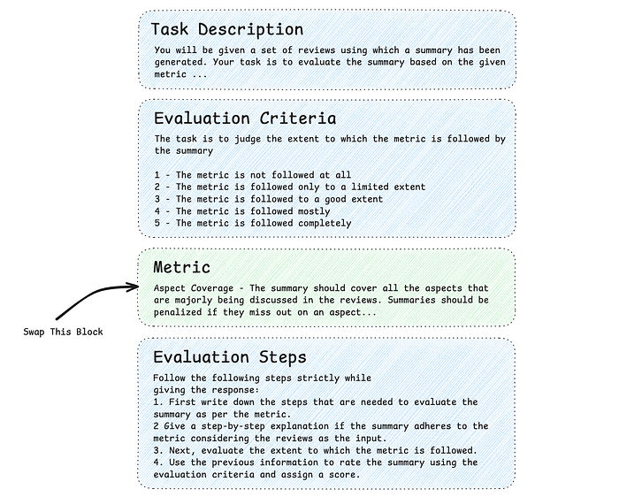

# One Prompt To Rule Them All: LLMs For Opinion Summary Evaluation

*Image Source: Google Nano Banana*

**TL;DR —** Traditional automatic scores (like ROUGE) for assessing opinion summaries aren’t comprehensive and don’t align well with human judgments. Our work addresses this by introducing a new dataset called SUMMEVAL-OP, encompassing 7 critical dimensions for opinion summary evaluation and proposes a new prompting method, OP-I-PROMPT, to use LLMs as evaluators. Our experiments demonstrate that OP-I-PROMPT emerges as a good alternative for evaluating opinion summaries, achieving a high correlation (0.70) with human judgments, surpassing prior approaches. We also illustrate the critical need for this evaluation using a Flipkart use case, demonstrating how high-quality summaries can drive key business metrics like increased conversion rates and reduced product returns.

## Why High-Quality Summaries Matter: A Flipkart Use-Case

Imagine a customer on Flipkart browsing for a new smartphone, confronted with hundreds of user reviews. Sifting through this feedback to get a clear picture of the product’s quality is a time-consuming and often confusing task. This is where **opinion summarization** becomes crucial. In an e-commerce context, it’s the process of using AI to analyze all customer reviews and generate a brief, balanced summary.

*Figure 1. LEFT: Scrolling through reviews which is a tedious and time-consuming process. RIGHT: A corresponding summary makes the task easier. Source: Flipkart.*

The quality of the summary is directly tied to a better customer experience. A high-quality summary helps customers make faster, more informed decisions by reducing information overload and building trust through transparency. This, in turn, has a direct impact on key performance indicators: it can **increase conversion rates** by giving customers the confidence to purchase, **improve customer satisfaction** by creating a more helpful shopping experience, and **reduce product return rates** by setting realistic expectations.

## The Evaluation Crisis: Why Current Metrics Fail

How do we know if an AI-generated summary is actually _good_? Traditionally, NLP has relied on metrics like [ROUGE](https://aclanthology.org/W04-1013/) to answer this question. But there is a problem: these metrics prioritize lexical overlap over meaning, often missing the coherence, faithfulness, etc. that actually matter to the readers.

This disconnect is especially problematic for **opinion summarization**. We found that standard metrics fail to provide a comprehensive assessment of opinion summaries and show poor correlation with human judgment.

In our ACL 2024 paper, [**One Prompt To Rule Them All: LLMs for Opinion Summary Evaluation**](https://aclanthology.org/2024.acl-long.655/)**,** we present a solution to this evaluation crisis. By tackling the lack of high-quality datasets and the limitations of current metrics, we provide:

- **SUMMEVAL-OP:** A novel benchmark dataset covering **7 critical evaluation dimensions**: fluency, coherence, relevance, faithfulness, aspect coverage, sentiment consistency and specificity.
- **OP-I-PROMPT:** An innovative **single prompt strategy** that allows LLMs to evaluate all these dimensions effectively without any fine-tuning.

## Building A Reliable Benchmark

Before we could improve evaluation methods, we needed a reliable ground truth. Existing datasets didn’t fully capture the complexity of opinion summarization, so we built our own: **SUMMEVAL-OP**.

**Domain-Focused:** It uses reviews from the [Amazon test set](https://aclanthology.org/2020.acl-main.461/), making it highly relevant for real-world e-commerce applications.

**Comprehensive:** The dataset includes 2,912 expert annotations on summaries generated by 13 different models (from older systems to modern LLMs) for 32 different products.

**Multi-Dimensional:** Crucially, summaries aren’t just given a single _good_ or _bad_ score. They are numerically rated (a 1–5 scale) across **seven critical dimensions**:

1. **Fluency:** Is the summary grammatically correct and easy to read?
2. **Coherence:** Do the sentences flow logically together?
3. **Relevance:** Does it focus on the most important and widely-held opinions?
4. **Faithfulness:** Is every piece of information in the summary directly supported by the source reviews?
5. **Aspect Coverage:** Does the summary mention all the key topics (e.g., battery life, screen quality, customer service)?
6. **Sentiment Consistency:** Does it accurately reflect the positive, negative, or neutral sentiment for each aspect?
7. **Specificity:** Does it provide detailed information rather than vague, generic statements?

## The Core Innovation: A Smarter Way To Prompt LLMs

With a robust dataset in hand, we needed a reliable way to use LLMs as evaluators. Our solution is **OP-I-PROMPT**, a dimension-independent framework designed to streamline the evaluation process.

**The _Plug-and-Play_ Architecture: **Unlike other methods that either use overly simplistic prompts or require a unique, handcrafted prompt for every evaluation dimension, OP-I-PROMPT uses a **modular design**. It uses a fixed _skeleton_ prompt containing the Task Description, Evaluation Criteria (a 1–5 scale), and Evaluation Steps. To test a different dimension, you simply swap out a single block of text: the **Metric Definition**.

*Figure 2. Our OP-I-PROMPT is simpler and has Task Description, Evaluation Criteria, and Evaluation Steps fixed for a dimension/metric independent evaluation. Here, only the Metric part needs to be changed for evaluating any dimension/metric.*

**Why It Works:** Beyond its versatility, OP-I-PROMPT is designed to improve accuracy:

- **Standardized Input:** By keeping the instruction format constant, the LLM’s behavior remains stable across different metrics.
- **Chain-of-Thought Reasoning:** The prompt explicitly instructs the model to perform a step-by-step analysis _before_ assigning a score. This forces the model to justify its reasoning, leading to evaluations that correlate much more closely with human judgment.

## The Results: A New Standard For Evaluation

When we put **OP-I-PROMPT** to the test, the results confirmed our hypothesis: a single, well-structured prompt can outperform complex, resource-heavy alternatives. The method achieved an **average Spearman correlation of 0.70 with human judgments**, demonstrating a strong alignment with how human experts evaluate summaries. This demonstrated that the model wasn’t just guessing — it was evaluating the text with near-human intuition.

*Figure 3. An illustrative example contrasting the depth of our proposed evaluation method against standard ROUGE metrics. While ROUGE provides a singular overlap score, our approach decomposes quality into specific dimensions like Faithfulness, Aspect Coverage, and Sentiment Consistency.*

![Table 1. Spearman (ρ) and Kendall Tau (τ) correlations at summary-level on 7 dimensions for the SUMMEVAL-OP dataset. For closed-source (GPT 3.5), OP-I-PROMPT performs comparably to G-EVAL, whereas for open-source (Mistral) it outperforms alternatives. ∗ represents significant performance (p-value < 0.05) to G-EVAL-MISTRAL computed using Mann-Whitney U Test. HUMANS- averaged correlation of each annotator with the overall averaged ratings. Scores are measured on 7 dimensions: fluency (FL), coherence (CO), relevance (RE), faithfulness (FA), aspect coverage (AC), sentiment consistency (SC), and specificity (SP).](../images/ace708a94fa3c971.png)
*Table 1. Spearman (ρ) and Kendall Tau (τ) correlations at summary-level on 7 dimensions for the SUMMEVAL-OP dataset. For closed-source (GPT 3.5), OP-I-PROMPT performs comparably to G-EVAL, whereas for open-source (Mistral) it outperforms alternatives. ∗ represents significant performance (p-value < 0.05) to G-EVAL-MISTRAL computed using Mann-Whitney U Test. HUMANS- averaged correlation of each annotator with the overall averaged ratings. Scores are measured on 7 dimensions: fluency (FL), coherence (CO), relevance (RE), faithfulness (FA), aspect coverage (AC), sentiment consistency (SC), and specificity (SP).*

Here are the key findings that make this work so impactful:

1. **Dominance on Open-Source Models:** While performing well on closed-source models like [ChatGPT-3.5](https://chatgpt.com/), **OP-I-PROMPT** truly shone on open-source models like [**Mistral-7B**](https://arxiv.org/abs/2310.06825), where it significantly outperformed [G-EVAL](https://aclanthology.org/2023.emnlp-main.153/), another popular LLM-based evaluator. This is a huge win, as it shows that high-quality, automated evaluation is accessible without relying solely on the largest proprietary models.
2. **LLMs Generate Superior Summaries:** We discovered that the human raters consistently preferred the opinion summaries generated by modern LLMs (like [GPT-4](https://chatgpt.com/), [Solar-10.7B](https://arxiv.org/abs/2312.15166), and Mistral-7B) over summaries from older models and even over the human-written reference summaries (check Figure 3). This underscores the massive leap in quality that LLMs represent.
3. **Traditional Metrics are Obsolete:** As suspected, reference-based metrics like ROUGE and [BERTSCORE](https://www.semanticscholar.org/paper/BERTScore%3A-Evaluating-Text-Generation-with-BERT-Zhang-Kishore/295065d942abca0711300b2b4c39829551060578) showed very poor (and sometimes negative) correlation with human ratings, confirming they are inadequate for assessing the output of modern generative models.
4. **A New Performance Hierarchy:** The study provides a clear ranking of summarization models, with **GPT-4** at the top, closely followed by **Solar-10.7B** and **Mistral-7B**, which both outperformed **ChatGPT-3.5**.

*Figure 4. Evaluation performance of different models as rated by human annotators. We observe that GPT-4 performs the best followed by Solar-10.7B and Mistral-7B. Self-supervised models perform worse. In general, all the LLMs perform better than human annotated summaries.*

## Why Does This Research Matter?

**One Prompt To Rule Them All** is more than just an academic exercise. It provides a clear, practical roadmap for a new era of NLP evaluation.

- **For Researchers:** It offers a high-quality dataset and a reliable, reference-free method for benchmarking new summarization models.
- **For Practitioners:** It demonstrates that open-source LLMs can be turned into powerful evaluation tools with smart prompt engineering, lowering the barrier to entry for sophisticated model assessment.
- **For the Field:** It solidifies the shift away from rigid, reference-based metrics towards more holistic, AI-driven evaluation that better aligns with human perception of quality.

By creating a better way to measure progress, this work paves the way for building even better opinion summarization systems in the future. We plan to extend this work to handle large-scale and multi-source evaluations.

## References

1. [One Prompt To Rule Them All: LLMs for Opinion Summary Evaluation](https://aclanthology.org/2024.acl-long.655/) (Siledar et al., ACL 2024)
2. [G-Eval: NLG Evaluation using Gpt-4 with Better Human Alignment](https://aclanthology.org/2023.emnlp-main.153/) (Liu et al., EMNLP 2023)
3. [ROUGE: A Package for Automatic Evaluation of Summaries](https://aclanthology.org/W04-1013/) (Lin, 2004)
4. [Unsupervised Opinion Summarization as Copycat-Review Generation](https://aclanthology.org/2020.acl-main.461/) (Bražinskas et al., ACL 2020)
5. OpenAI. 2023. ChatGPT (August 3 Version). [https: //chat.openai.com](http://chat.openai.com/)
6. [Solar 10.7b: Scaling large language models with simple yet effective depth upscaling](https://arxiv.org/abs/2312.15166) (Kim et al., 2023)
7. [Mistral 7b](https://arxiv.org/abs/2310.06825) (Jiang et al., 2023)
8. [BERTScore: Evaluating Text Generation with BERT](https://www.semanticscholar.org/paper/BERTScore%3A-Evaluating-Text-Generation-with-BERT-Zhang-Kishore/295065d942abca0711300b2b4c39829551060578) (Zhang et al., 2019)

---
**Tags:** Opinion Summarization · Llms · Summary Evaluation · Prompt Engineering · Data Science
