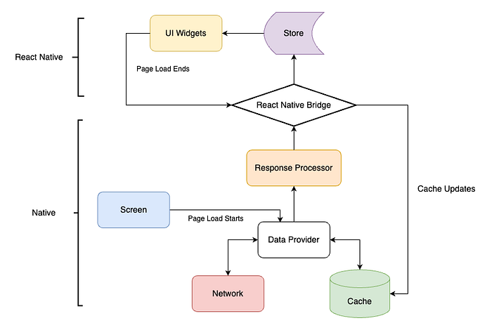
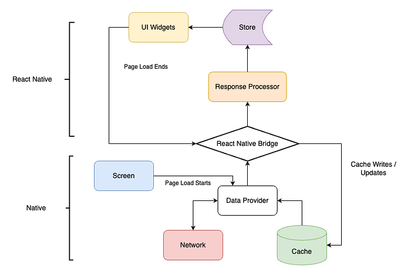
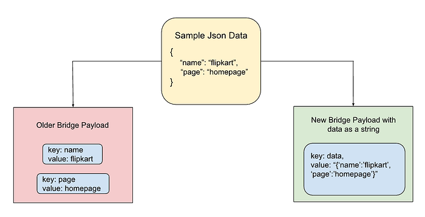
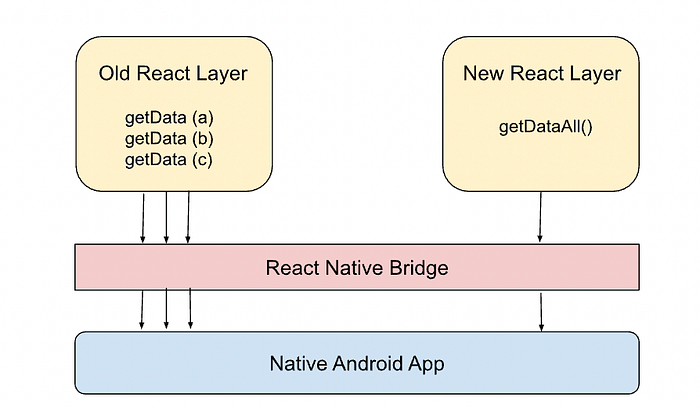
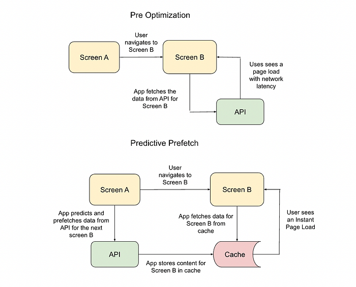
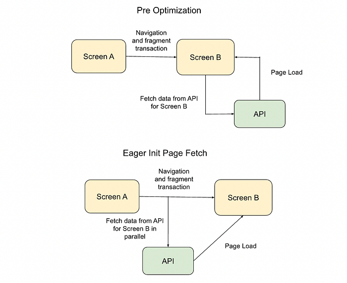

# Optimising Page Load Times in Flipkart Mobile App

## Introduction

A successful mobile application requires a good user experience, an attractive design, and strong performance. Quicker application load times and page load times are some of the key performance indicators for app performance.

The Flipkart Android app has over 180 million downloads and over 500 million weekly visits. With many users belonging to tier-2 and tier-3 cities, flaky networks and low-end devices are commonplace. For these scenarios, it is important that the app be fast and optimized down to the millisecond. At Flipkart, we have been actively working for over a year to improve page load times and provide a super-fast app for our users.

The following are the critical real user metrics (RUM) we monitor continuously and strive to improve.

**Page load time: **The time taken for a screen to load in response to the click of a button or link on the app.

**App load time: **The time taken for the Flipkart application home page to load in response to a click on the Flipkart icon.

This article is an attempt to take you through the journey of optimization and performance improvement in the Flipkart app.

## What did we do?

At Flipkart, we use React Native (RN) to build most of our app’s features. In a hybrid app such as ours, while the UI was built on the RN stack, the native database still acted as the single source of truth, and the core business logic for processing the UI widget data still resided on the native layer.

*The previous page load architecture*

We revamped our page load architecture to be React store-first, where the screen is rendered first and the UI widget data is cached in the database after the render. As part of this revamp, we also dove deep into the React Native architecture to identify performance bottlenecks affecting page load times.

**Subsequently**, we analyzed the network load flows and identified optimizations to speed up page load times.

## Improved Architecture

In the new architecture, the native app merely functions as a placeholder to read data from the network or cache and write data to the cache. All the business logic related to data processing or manipulation has now been moved to the React layer to enable over-the-air updates and faster adoption.

*The new page load architecture*

During this re-architecture, we focused on the React Native integration with the app and specifically the bridge interactions, which are the primary bottleneck for React Native performance. The next section goes deeper into the performance improvements.

## Performance Bottlenecks and Improvements

### Writable Native Maps and Arrays have expensive writes

We noticed that the creation of RN bridge payloads was expensive. Every ‘write’ operation to an RN bridge object requires synchronization to acquire locks and commit the data to the underlying native object. These operations are slow and naturally affect the bridge's performance.

In the new architecture, we sent the data as a string to the React layer, as opposed to the erstwhile “deeply nested bridge” payload. This reduced the number of writes by almost **3x**. As a result, we could emit the bridge payload much earlier than before. This optimization led to a **15–20% **improvement in page load times.

**The key takeaway:**

**The trade off is that locks and synchronization performance of object creation outweighs that of string deserialization. It is preferable to transfer data as a string and then deserialize it in the React layer rather than create a deeply nested bridge payload.**

### RN Bridge calls at high frequencies cause choking

We analyzed the page creation flows and discovered that, along with the page load, we have also been querying some configuration data in the React layer from the native layer through the RN bridge.

While the page load was not blocked on this data, there were a huge number of read calls (in the hundreds) happening in parallel and affecting the bridge's performance.

We refactored the code to query all this data in a single read call over the bridge. By reducing the number of bridge calls significantly, we could improve the page load times by another **5–10%, **even though the amount of data being queried was the same.

**The key takeaway:**

**The number of bridge calls impacts performance more than the amount of data being transferred.**

## Network Improvements

When we analyzed the data further, we identified that the largest contributors to our page load times were the network load times. Network load time refers to the time taken to receive the page data from the server.

The following optimizations for the network load times led to faster page load times for the users:

### 1. Predictive Page Fetch

The idea here was to design a heuristic to predict the next screen or screens that the user is likely to navigate to and prefetch the content for those screens.

When the user navigated to these prefetched screens, they saw an instant page load because the screen had already been pre-cached. We observed that ~**10%** more users experienced an instant page load due to this optimization.

### 2. Eager Init Page Fetch

The idea here was to parallelize the Android fragment transaction to create the new screen and the network call for fetching the response to the same. As a result, the API call, which started after the fragment creation previously, is now triggered even before the fragment transaction.

Due to the parallelization of the fragment creation and the network fetch, we were able to further improve the network page load times by around **5 to 10%.**

### 3. Brotli Compression

The general-purpose lossless compression algorithm called Brotli from Google shows a higher compression ratio than Gzip. We migrated our network layer to use Brotli compression over the air instead of Gzip, and as a result, we loaded fewer bytes over the air for API calls and assets.

We did not observe a major improvement in page load times for smaller payloads, but for use cases with larger payloads, this optimization can be significant.

## Conclusion

Flipkart app’s home and page load times improved by up to **30%** with our focus on:

1. Identifying bottlenecks in React Native
2. Reducing the perceived network load times of the users

We ran AB experiments to validate our hypothesis that faster page load times in the application lead to more engagement and conversion. The results showed a cumulative **0.5%** increase in overall revenue.

App performance and vitals are core metrics for us here at Flipkart. We will continue to focus on the app’s performance to provide a smooth and seamless experience for our users.

---
**Tags:** React Native · Page Load Time · App Performance · Flipkart Mobile App · Mobile
