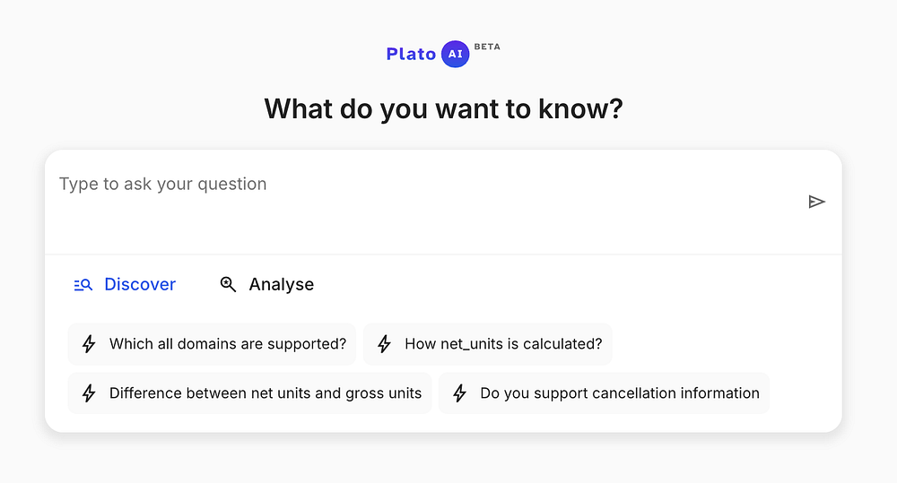
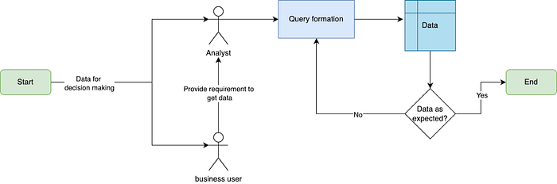
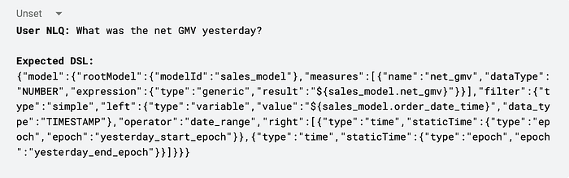
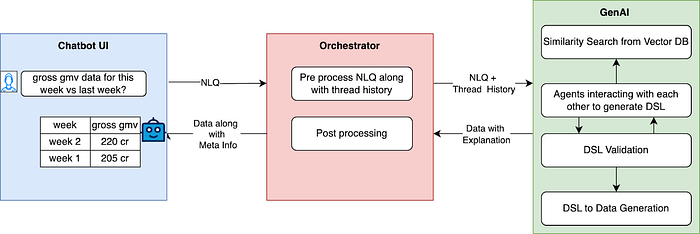
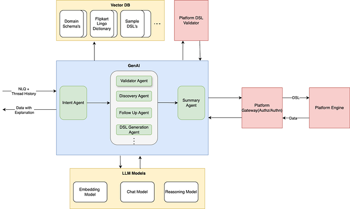
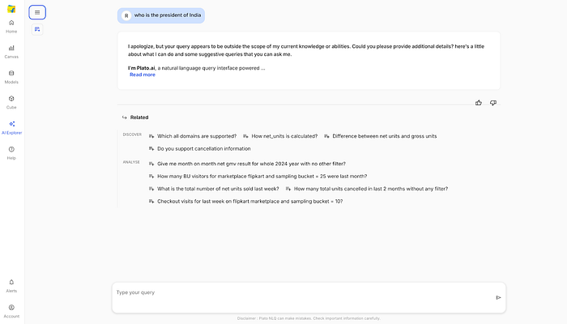
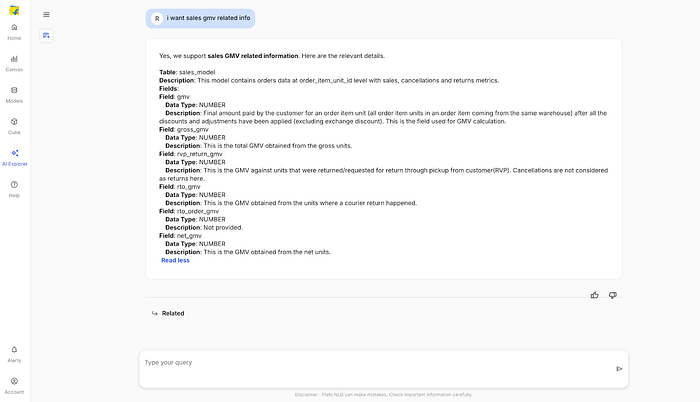
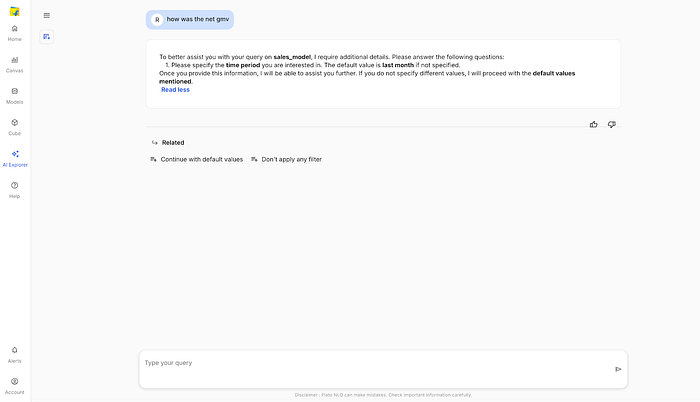
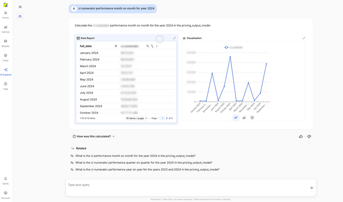
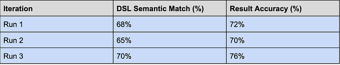

# Plato AI: Revolutionising Flipkart’s Data Interaction with Natural Language

## Introduction

> At Flipkart’s scale, with millions of daily transactions and customer interactions, data is at the heart of every decision — from business actions and product strategy to supply chain optimisation and customer experience enhancements. The right data at the right time is among the highest-impact levers for effective decision-making.

Currently, more than** 2 lakh ad-hoc SQL queries** are fired every month with use cases ranging from:

1. **Data Discovery: **Users check table structures or sample values to understand if a dataset meets their needs.  
**Ex**: Determining whether a column called order_payment_type contains information about payment method (prepaid vs. COD) or payment instrument (UPI, card, etc.)
2. **Simple Use Case Querying: **Creating Queries to get updated values of some key metrics.  
**Ex: **Retrieving timely updates on orders placed, GMV, delivery SLA’s, and other critical metrics.
3. **Complex Use Case Querying: **Analysts join multiple tables to answer nuanced questions, often for use cases such as Root Cause Analysis (RCA).  
**Ex:** Did a drop in website visits contribute to a dip in orders?

Moreover, accessing data for the aforementioned use cases requires users to:  
1. Rely on internal data experts just to locate the right tables.  
2. Navigate complex schemas and master SQL.  
3. Undergo multiple trials and errors to validate data and generate actionable insights.

*Typical Workflow for Accessing Data for Decision Making (Pre-Plato AI)*

Our aim with this project is to focus on leveraging recent advancements in AI to eliminate these blockers and ensure:

1. **Democratize data access** for non-technical users
2. **Drastically reduce insight generation time,** which today can range from a **few minutes to several days**, by streamlining both data discovery and query creation, especially for high-frequency use cases like RCA

---

## Approach

With **Plato-AI**, our internal NLQ (Natural Language Query) to Data tool, we’re reimagining how people interact with data. Instead of writing complex SQL or navigating unfamiliar data platforms, users can simply ask a question in plain English — and get back relevant results, complete with basic visualisations.

Plato-AI abstracts away the complexity of data access. No need to understand schema intricacies or know which table lives where. Just ask, and get answers.

---

## Architecture

Throughout our implementation, we made deliberate decisions to ensure our solution could adapt to the rapid advancements in AI models and technologies.

### Selecting the Appropriate Query Language:

In traditional setups, data retrieval heavily depends on engine-specific query languages like **SQL, HiveQL, Spark SQL**, or other **NoSQL** syntaxes. However, in a dynamic and evolving data ecosystem like Flipkart’s, this tight coupling between query logic and engine syntax becomes a major bottleneck.

To solve this, we introduced a **Domain Specific Language (DSL)** — a standardised, engine-agnostic **JSON-based contract** between the **client (UI/Chatbot)** and the **platform (query engine)**.

- **Engine Independence:** Query languages evolve. What’s standard today (e.g., HiveQL) might get deprecated tomorrow in favour of newer engines (e.g. Presto, Trino, BigQuery). Migrating thousands of ad-hoc or scheduled queries each time is painful and error-prone.
- **Simplified Migration:** With DSL as the intermediary layer, we only need to translate the DSL to the target engine’s query syntax. This eliminates rewriting logic on the client side every time we switch or upgrade engines.

In essence, **DSL decouples business logic from backend complexity**, enabling a more resilient, scalable, and maintainable query system for Flipkart-scale data needs.

**Sample DSL equivalent to user NLQ:**

### Establishing the Backend Infrastructure(Plato AI Current Design):

*Plato AI Component Diagram*

1. **💬Chatbot UI:**  
This is the primary touchpoint for users interacting with Plato AI.  
- Users enter queries in **natural language** (NLQ), such as “Show me last week’s GMV for electronics.  
**- **The UI captures this query and forwards it to the **Orchestrator** for further processing.  
**-** The interaction is designed to feel conversational, with a focus on minimal user effort.
2. **🔁Orchestrator:**  
The Orchestrator acts as the central control unit, orchestrating the entire query lifecycle.  
- It receives the user’s query from the Chatbot UI and preprocesses the data.  
- It then retrieves relevant conversation history of the user from the database and passes it to GenAI along with the query.  
- Finally, it performs post-processing on the results, and returns the data to the Chatbot UI.
3. **🤖GenAI:**  
This is the brain behind translating user intent into action.  
- GenAI receives the natural language query and relevant context from the Orchestrator.  
- It then executes a workflow of agents that interact with each other, vector databases, and LLM models to generate a DSL query.  
- The DSL is iteratively refined and validated until it meets all correctness criteria.  
- Once finalised, the DSL is executed by the data platform to **fetch the required data**.

This modular, agent-driven architecture ensures that users, whether business folks or analysts, can move from question to insight with minimal effort and maximum accuracy.

### Deep Dive into GenAI Workflow:

*GenAI Workflow*

**Intent Agent:  
**_The _**_Intent Agent_**_ is one of the _**_most critical components_**_ in the GenAI workflow. Its job is to deeply understand the user’s natural language query and break it down into a representation of what the user wants to achieve._

- **Why is this important?  
**Without accurate intent detection, even the best LLM can hallucinate or misinterpret user goals. The Intent Agent provides a deterministic, rule-driven foundation that ensures:  
- Higher accuracy of generated DSLs  
- Fewer clarifications  
- Better user trust and satisfaction

**Validator Agent:  
**_The _**_Validator Agent_**_ acts as a gatekeeper for Plato AI. Before any further processing is done, this agent ensures that the incoming query is within the supported scope of the system, both in terms of domain relevance and technical feasibility._

One such out-of-scope query sample: “W**ho is the president of India?**”

- **Why is this important?  
- System Efficiency**: Prevents unnecessary load on the downstream pipeline (LLMs, data engines).  
- **Clarity of Purpose**: Sets clear expectations with users about what the platform can and cannot do.

**Discovery Agent:  
**_The _**_Discovery Agent_**_ is designed to help users who _**_don’t know exactly what to ask_**_, but have a general sense of the information they need. It bridges the gap between _**_vague user intent_**_ and _**_precise, actionable queries_**_ by guiding the user toward the right metrics, dimensions, and datasets._

One such vague query sample: “**I want sales gmv related info**”

- **Why is this important?  
- Lowering the Barrier to Entry:** Not every user is data-savvy. This agent makes the platform usable for non-technical stakeholders, too.  
- **Boosts Discoverability:** Often, users don’t know what’s available. Discovery Agent promotes relevant metrics/dimensions based on context.  
- **Increases Query Success Rate:** By front-loading clarification, it reduces the chances of misfired or incomplete queries downstream.

**Follow-up Agent:  
**_The _**_Follow-up Agent_**_ plays a key role in enabling a smooth _**_human-in-the-loop interaction_**_ whenever the system needs _**_additional information_**_ from the user to proceed. It ensures that query generation doesn’t break midway due to missing context or incomplete input._

One such incomplete query sample:** “How was the net gmv?”**

- **Why is this important?  
- Improves Query Success Rate**: Without it, incomplete queries would fail or lead to incorrect results.  
- **Enhances UX**: The system feels more human and supportive, especially for non-technical users.  
- **Supports Conversational Querying**: Enables a dynamic, back-and-forth interaction that mimics how users talk to analysts.

**DSL Generation Agent:  
**_The _**_DSL Generation Agent_**_ plays a pivotal role in translating natural language intents into executable, structured _**_Domain Specific Language (DSL)_**_ queries. These DSL queries act as a contract between the user-facing intelligence layer (Plato AI) and the backend data platforms that serve the response._

This agent isn’t just doing a single-pass transformation — it operates as a **multi-stage reasoning and refinement engine**.

- **Contextual Retrieval**:  
- Performs **semantic search** over a vector DB to fetch: relevant metrics, domain-specific terms and sample DSL snippets.
- **Iterative Generation Loop**:  
- **Generate** DSL based on user intent + retrieved context  
- **Validate** with the platform’s DSL validator  
- If **valid**, proceed; else feed it back and **regenerate**

**Summary Agent:  
**_The _**_Summary Agent_**_ maintains _**_contextual continuity_**_ by summarising interactions between the user and Plato AI. It helps the system remain aware of previous conversations and decisions._

**Platform Gateway:  
**_The _**_Platform Gateway_**_ is the secure middleware layer that interfaces between Plato AI and the actual data processing systems. It ensures only authorised access to data. Ensures _**_data security and governance_**_ compliance._

**Platform Engine:  
**_The _**_Platform Engine_**_ is the actual data execution environment — the system that runs the final query and returns results._

**Vector DB:  
**_The Vector Database stores embeddings of data and metadata, enabling efficient similarity searches and retrieval of relevant context for the GenAI workflow._

- **Why is this important?  
- **Makes Plato AI **context-aware** and capable of learning from prior queries.  
- Reduces manual effort by surfacing relevant content quickly.  
- Enhances **accuracy** and **personalisation** of query generation.

**LLM Models (Large Language Models):  
**_LLMs are the _**_brains of the GenAI workflow_**_, powering natural language understanding, reasoning, and generation tasks across multiple agents. They power various agents within the GenAI workflow._

> **Note**: We intentionally avoid naming specific models here, as our architecture is designed to be **model-agnostic**. It’s **plug-and-play** by design, allowing us to swap or upgrade models over time based on performance, cost, and use case fit.

---

## Glimpse of Plato-AI in Action

---

## Benchmarking & Evaluation

To ensure the reliability and accuracy of Plato AI’s DSL generation capabilities, we maintain a rigorous benchmarking framework.

### Golden Set for Evaluation:

We’ve curated a **golden set** of user Natural Language Queries (NLQ’s) mapped to valid DSL’s. This dataset is sourced from different teams across domains and includes a wide range of query types, such as simple metric fetches, complex filters and conditions, trend analyses, comparative queries, etc.

### Evaluation Strategy:

- The golden set is used as the **ground truth** to validate DSL generation.
- We test both:  
- **DSL semantic correctness** (structure, field mappings, operators)  
- **End-to-end result correctness** (final output matching expected data)
- Due to the **non-deterministic** nature of LLM’s, the same input may yield different outputs. Hence, we run **multiple iterations** and average the scores for stability.

### Iterative Runs (300 Queries x 3 Iterations):

We continue to iterate on model prompting strategies, context retrieval improvements, and validation loops to steadily improve these benchmarks.

> **Note**: This benchmark serves as a continuous health check to measure progress and catch regressions as we evolve the system.

---

## Learnings

Working with **nascent technologies like LLM’s** over the past year allowed us to **experiment, fail fast, iterate**, and deeply understand how **agents and large language models interpret user queries** and generate structured responses. While building Plato AI, we encountered several unique challenges specific to enterprise-grade data systems, and below are some of our key learnings from the process:

### 1. Hallucination in Multi-Domain Contexts:

One of the biggest challenges we faced was **hallucination**, where LLM’s confidently generate **plausible but incorrect answers**.

- **Key Issue:  
**When multiple **domains with overlapping or similar metric names** exist (e.g., GMV in Sales vs. GMV in Returns), the model can:  
- Select the **wrong domain** entirely.  
- Choose a **metric** that sounds correct but is **semantically different**.  
- Mix logic across domains, creating invalid or misleading DSLs.
- **What We Learned:  
- **Introduce **stronger grounding techniques** like embedding-based vector lookups.  
- Use **domain-enforcing prompt patterns** to constrain the model’s scope.  
- Introduce a **Validator + Discovery Agent loop** to mitigate hallucinated selections before query generation.

### 2. User Queries Aren’t Always Clean:

Not all users are technically fluent, especially **business or leadership users**. Many queries include:  
- Typos or misspellings  
- Domain-specific **lingos or acronyms  
- **Vague intent (“I want yesterday’s business performance”)

- **What We Learned:  
- **Use **robust NLP preprocessing** to normalise inputs.  
- Implement **slang-to-metric mapping dictionaries** and **lingo resolvers**.  
- Enable **interactive follow-ups** via the Follow-up Agent for ambiguous cases.  
- Contextual memory (via the Summary Agent) helps reduce clarification needs in multi-turn conversations.

### 3. Non-Deterministic Nature of LLMs:

LLMs are **non-deterministic** by nature. This means:  
- The **same query and prompt** can yield **different responses** across runs.  
- Slight changes in context/history may significantly alter the response.  
- It’s harder to enforce predictability, especially for enterprise-grade use cases.

- **What We Learned:  
- **Set a **fixed temperature value** during inference to control randomness.  
- Use **prompt templating + structured validation layers** to post-check DSL.  
- Incorporate **deterministic post-processing rules** to stabilise final outputs.  
- Cache validated DSL’s for known queries to improve response stability over time.

### 4. Challenges in DSL Construction:

Unlike widely adopted languages like **SQL, HiveQL, or SparkSQL**, our **Flipkart-specific DSL** is:  
- Proprietary and custom-built  
- Evolving over time as new use cases emerge  
- **Not a part of the public LLM training data**

This creates unique challenges when using LLMs to generate DSL from NLQs.

- **What We Learned:  
- **We had to **continuously fine-tune prompts** with clear **grammar rules, examples, and fallback strategies**.  
- Prompt templates had to evolve **with every DSL schema change**.  
- Implementing **rule-based validators and auto-healers** helped align LLM output with the expected DSL structure.  
- Use of a **few-shot examples in prompt chains** dramatically improved output quality.

---

## Upcoming Features & Improvements

As Plato AI continues to evolve, we’re focused on enhancing intelligence, personalisation, and user experience across the board. Here’s a sneak peek into what’s coming next:

### 1. Anomaly Detection(Data Insights):

Plato AI will soon be equipped with the capability to **automatically detect anomalies**, such as drops in **sales**, **visits**, or other Flipkart-specific KPIs — and generate hypotheses in real-time.

**What it solves:**

- Reduces 10–18 hours of manual effort across **multiple teams**.
- Replaces scattered root cause exploration with a **centralized, explainable flow**.
- Leverages **historical trends, metric dependencies, and causal mapping** to offer insights.

### 2. User-Specific Knowledge Base:

We’re building a **personalised memory layer** that learns from each user’s preferences, interactions, and feedback.

**What it enables:**

- Plato AI becomes smarter **per user**, adapting over time.
- Offers **tailored metric recommendations** based on past behavior.
- Incorporates user feedback to **fine-tune future DSL generation** and reduce clarifications.

### 3. Autocomplete & Smart Suggestions:

A smart **autocomplete engine** is in the works to assist users in formulating complete and precise NLQs.

**Key Benefits:**

- Reduces friction for non-technical users by **auto-suggesting metrics, filters, and timeframes**.
- Helps avoid typos, incomplete queries, or missing required parameters.
- Context-aware — adapts suggestions based on the **user’s previous queries** and domain focus.

---

## Conclusion:

Building **Plato AI** has been a transformative journey in bridging the gap between natural language understanding and enterprise-scale data access. What once required technical expertise in SQL, Hive, or Spark can now be achieved through simple, conversational interactions — unlocking data accessibility for analysts, business teams, and leadership alike.

By introducing a modular agent-based architecture, a custom Domain Specific Language (DSL), and a robust orchestration layer, we’ve laid the foundation for a scalable, adaptable, and intelligent data interface.

While we’ve tackled complex challenges like hallucination, ambiguity in user queries, and DSL generation from scratch, we know this is just the beginning. With upcoming features like RCA Agents, personalised knowledge bases, and query autocompletion, we’re moving toward a future where data-driven decisions are not only faster, but smarter and more intuitive.

At its core, Plato AI reflects our vision:

> **Democratize data access across Flipkart — for everyone, not just experts.**

We’re excited about what’s ahead and continue to push boundaries at the intersection of LLM’s, agents, and enterprise data.

---

## Acknowledgement:

Bringing Plato AI to fruition, a collaborative endeavor by Flipkart’s data platform team encompassing Engineering and Product Management, was heavily reliant on the expertise of [Rahul Rana](https://medium.com/u/36fa8ff01f1a?source=post_page---user_mention--081644ac6b16---------------------------------------)**(SDE-3)** in leading development, the strategic guidance of [Vikas Jain](https://medium.com/u/7ec8f421eee7?source=post_page---user_mention--081644ac6b16---------------------------------------)**(Senior Engineering Manager)**, [Mahabaleshwar Asundi](https://medium.com/u/55efb21f296a?source=post_page---user_mention--081644ac6b16---------------------------------------)**(Director Of Engineering)** and the architectural insights of [Venkata Ramana](https://medium.com/u/c933056df0e0?source=post_page---user_mention--081644ac6b16---------------------------------------)**(Senior Principal Architect)**. The product direction provided by [Sahil Arora](https://medium.com/u/5887d8dba4ce?source=post_page---user_mention--081644ac6b16---------------------------------------)**(Group Product Manager)** and [Mayank Thar](https://medium.com/u/46647b438c14?source=post_page---user_mention--081644ac6b16---------------------------------------)**(Technical Product Manager)**, coupled with the user-centric design by [monika maheshwari](https://medium.com/u/e051e0c98866?source=post_page---user_mention--081644ac6b16---------------------------------------)**(UI Engineer 3)**, was also pivotal.
