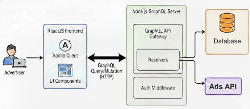
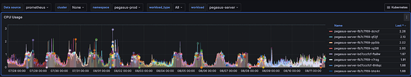
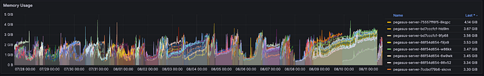
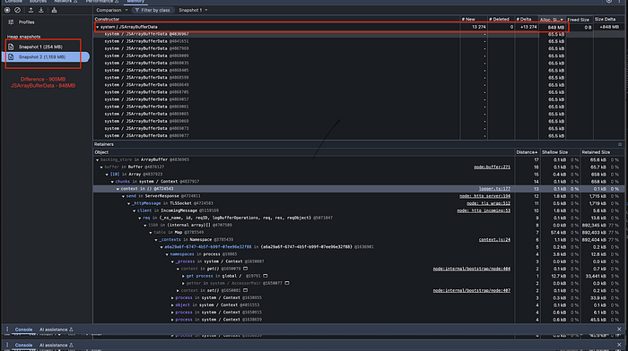
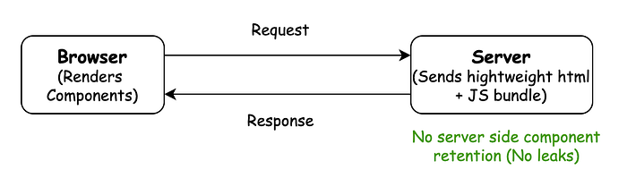
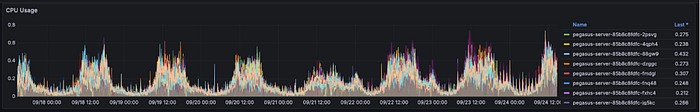
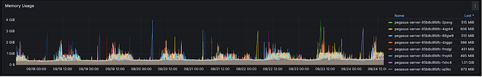
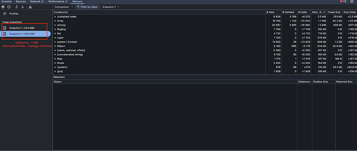

# Plugging Node.js Memory Leaks: Optimisation Insights

Brand Self Serve (BSS) is a core web application within Flipkart([https://advertising.flipkart.com/](https://advertising.flipkart.com/)), designed for advertisers (Brands and Sellers) to create and manage advertisements in multiple formats. These ads are strategically placed on designated slots across flipkart.com pages, ensuring visibility and engagement with millions of shoppers.

The platform offers advertisers a seamless, intuitive user interface, built with ReactJS on the frontend and powered by a Node.js GraphQL server on the backend. This architecture efficiently handles complex ad creation workflows, campaign management, and real-time API requests, making the system both flexible and scalable.



Given its central role in helping advertisers reach customers, the reliability of this service is critical. During periods of sustained traffic, particularly when query rates spiked, the system experienced challenges that affected stability. These issues highlighted areas where advertiser workflows were interrupted, causing delays and disruptions that affected their ability to configure and manage ads smoothly.

This blog describes how the issues were diagnosed, the patterns applied effectively, and the trade‑offs considered to maintain performance without compromising system integrity. It also emphasizes the importance of continuously strengthening scalability and resilience in the service’s backend, ensuring advertisers continue to have a smooth experience even during sustained traffic load.

The performance results are presented at the overall level, highlighting the cumulative effect of all optimisations. Instead of isolating incremental changes, the narrative underscores the substantial transformation achieved through collective improvements.

### Optimisation Highlights

- **Stability:** Successfully eliminated system restarts caused by resource exhaustion.
- **Efficiency:** Reduced peak CPU load near total saturation to 20% and transitioned from persistent memory leaks to a lean 15% footprint.

## The Crisis

Our Node.js GraphQL service hit a breaking point. At first, everything seemed fine, but once traffic hit a sustained load of around 300 queries per second, the cracks began to show. Latency and Memory usage spiked, pods became unresponsive and eventually they crashed with the dreaded Out Of Memory (OOM) errors. What looked like a routine load test quickly turned into a firefight, forcing a deeper investigation into what was really happening beneath the surface. The investigation revealed recurring patterns affecting performance

- **High Latency:** Pods became progressively slower to respond, eventually causing basic _/health_ checks to fail.
- **Continuously Rising CPU:** CPU usage rose endlessly, never settling.
- **Out Of Memory Crashes:** Pods eventually crashed with _FATAL ERROR: JavaScript heap out of memory_.
- **GC Thrashing:** Logs from crashed pods showed frequent, ineffective Garbage Collection cycles right before the OOM error.

Together, these patterns pointed to instability in handling concurrent requests and underscored the importance of examining resource management and application behavior under sustained load. The following screenshots illustrate the CPU and memory spikes observed during these periods of instability.

**CPU**

- Limit = 2.2 ; Used = >2 in few pods and will eventually reach 100% and crash



**Memory**

- Memory usage continued to grow until it reached the configured 4 GB limit.



**Heap Analysis**

- _Snapshot 1:_ Heap memory at server start with a few navigations — 254 MB
- _Snapshot 2:_ A few minutes later, after repeated navigations — 1,159 MB
- _Observation:_ Memory usage continued to increase over time.



## The Investigation

During the initial analysis, database connections, slow queries, in‑memory cache usage, and dependent API response latencies were examined, with relevant fixes and config changes applied where appropriate. However, both memory and CPU issues persisted.

A deeper investigation was then conducted using load testing, heap dump comparisons, log inspections using tools such as Chrome Profiler for runtime analysis and K6 for load testing. This analysis gradually revealed three distinct issues:

- Logging overhead
- Use of Continuation‑Local Storage (CLS) in request context
- Memory retention in Server‑Side Rendering (SSR)

## The Resolution

### Resolution 1: Addressing Memory and CPU Spikes via Winston Logger Fixes

Winston is a popular logging library for Node.js, widely used to capture and manage application logs in production systems. It supports multiple transports (e.g., console, files, external services) and is often chosen for its flexibility and structured logging features. This logging library became a major driver of memory pressure and CPU spikes while logging large objects.

### What Went Wrong

In the version being used, Winston had known issues with stream backpressure and buffer management. Log chunks were retained in memory longer than necessary, which caused memory accumulation and triggered frequent, costly Garbage Collection cycles. As a result, logging which is typically considered a lightweight background task became a source of performance degradation, slowing down the overall system under load.

### Fix

Upgrading Winston to version 3.11.0 or later addressed the memory management issues and eliminated the overhead. Further details on Winston’s memory management problems and their resolutions can be found here:

- [Winston Issue #1871](https://github.com/winstonjs/winston/issues/1871)
- [Winston Issue #2114](https://github.com/winstonjs/winston/issues/2114)

### Impact

Following the upgrade, logging remained stable under high load. The excessive memory and CPU overhead was addressed, which resulted in improved system performance without logging acting as a hidden bottleneck.

### Key Take Away

Performance problems can originate from unexpected areas, including logging. Keeping dependencies up to date and monitoring system behaviour under stress helps prevent inefficiencies from escalating into major outages.

### Resolution 2: Addressing Memory Leaks in httpContext

Node.js applications rely on asynchronous callbacks and event-driven execution, which makes it difficult to preserve request-specific context across multiple layers without explicitly passing data through each function. To handle this, Continuation Local Storage (CLS) was utilized in the application. CLS provides a way to maintain state across asynchronous operations, similar to thread-local storage in other environments.

The Heap dump analysis showed that each incoming request was retaining approximately 65KB of data. Over time, this accumulation degraded performance under heavy load and resulted in out-of-memory crashes.

### What Went Wrong

Prior releases of the express‑http‑context library stored the entire request (req) and response (res) objects to simplify context management.

```
const httpContext = require('express-http-context');
app.use(httpContext.middleware);
app.use((req, res, next) => {
  // ❌ Storing the full request object
  httpContext.set('reqObject', req);
  next();
});

// Later in the request lifecycle
const reqObject = httpContext.get('reqObject');
logger.info(`Handling client with ID: ${reqObject.user.clientId}`);
logger.info(`Request URL: ${reqObject.url}`);
```

While this approach initially solved the problem of propagating request data, it introduced hidden inefficiencies that became critical under high traffic. In practice, the way CLS was used created several serious issues that compounded over time:

- **Request and response objects are large and cyclical.** They contain nested references that make them poor candidates for context storage.
- **CLS holds onto values for the lifetime of the asynchronous chain.** By storing req and res directly, they are effectively pinned in memory.
- **Garbage collection was blocked.** Since CLS retained references to these objects, they could not be freed.
- **CLS is prone to leaks if misused.** Use CLS with lightweight contextual data (like request IDs, correlation IDs, or user metadata), not heavy objects like application entities.

As a result, the application’s memory usage increased steadily, with each request leaving behind objects that the garbage collector was unable to reclaim.

### Fix: Redesigning Context Usage

To resolve the memory retention issues caused by storing large request and response objects in CLS, the context handling strategy was redesigned. Instead of persisting entire objects, the context was restricted to a lightweight request identifier.

```
const httpContext = require('express-http-context');
const { v4: uuidv4 } = require('uuid');
app.use(httpContext.middleware);
app.use((req, res, next) => {
  const requestId = uuidv4();
  // ✅ Store only lightweight identifiers
  httpContext.set('reqObject', {
    clientId: req.user?.clientId,
  });
  httpContext.set('requestId', requestId);
  next();
});

// Later in the request lifecycle
const reqObject = httpContext.get('reqObject');
const requestId = httpContext.get('requestId');
logger.info(`Handling client with ID: ${reqObject?.clientId}`);
logger.info(`Handling request with ID: ${requestId}`);
```

This change preserved the benefits of CLS by maintaining request-specific data across asynchronous boundaries, while eliminating the risk of memory leaks. By limiting the stored context to minimal, non‑cyclical data, garbage collection could operate effectively, and overall memory stability improved under load.

### Migration to AsyncLocalStorage

Following this immediate fix, the next step is to migrate from CLS to Node.js’s native “AsyncLocalStorage” API. It is built directly into Node.js and leverages the underlying async hooks API and tracks asynchronous execution contexts natively, without interfering with the event loop. It is significantly faster and lighter than the user-land JavaScript wrappers used by CLS. This migration provides a more robust foundation for request tracking and context propagation as the service evolves.

```
const { AsyncLocalStorage } = require('async_hooks');
const { v4: uuidv4 } = require('uuid');
const asyncLocalStorage = new AsyncLocalStorage();

app.use((req, res, next) => {
  const requestId = uuidv4();
  const clientId = req.user?.clientId;
  // Run the request inside its own async context
  asyncLocalStorage.run(
    new Map([
      ['requestId', requestId],
      ['clientId', clientId],
    ]),
    () => next()
  );
});

// Helper functions
function getRequestId() {
  const store = asyncLocalStorage.getStore();
  return store?.get('requestId') || null;
}
function getClientId() {
  const store = asyncLocalStorage.getStore();
  return store?.get('clientId') || null;
}

// Example route
app.get('/example', (req, res) => {
  res.send(
    `Request handled with ID: ${getRequestId()}, Client: ${getClientId()}`
  );
});
```

### Impact

- Reduced per‑request memory footprint, improving scalability.
- Reduced the frequency of restarts caused by excessive memory use.
- Improved performance under sustained load.

### Key Take Away

- Avoid storing heavy objects such as request and response in CLS or similar libraries.
- Use context only for minimal identifiers (e.g., request IDs, correlation IDs)
- Prefer AsyncLocalStorage for modern Node.js applications.
- Perform regular heap dump analysis to detect hidden leaks before they reach production.

Resolution 1 and Resolution 2 helped in reducing the memory leak in the system. However, the issue was not fully resolved, so further investigation was carried out. During this process, a third potential cause was identified.

### Resolution 3: Service Side Rendering (SSR)

Server-Side Rendering (SSR) is a technique where the server generates the full HTML for a page, including data and components, before sending it to the browser. This allows the browser to display a fully rendered page immediately, improving perceived performance and Search Engine Optimisation(SEO) compared to Client-Side Rendering (CSR), where the browser must first download JavaScript and then build the page.

Heap analysis revealed that the SSR process was retaining objects, components in memory long after the request–response cycle had finished. This created a significant memory bottleneck, contributing to instability and crashes under load.

### What Went Wrong

While SSR offers clear benefits, it also introduces additional complexity. Each incoming request requires the server to construct a fresh component tree, manage subscriptions, and handle asynchronous data fetching. Once the response is sent, all of these resources must be properly cleaned up to avoid lingering references in memory.

In this case, the cleanup process was incomplete:

- Subscriptions (e.g., Apollo Client), timers, and event listeners were not properly disposed of.
- Lingering references : The Apollo Client’s in‑memory cache persisted across requests leading to uncontrolled memory growth that occurred without proper teardown.

As a result, the SSR process retained objects and components long after the request–response cycle had finished, creating a significant memory bottleneck and contributing to instability under load.

### Fix

To address stability concerns, a two phase approach was adopted.

- An interim solution : The application’s use of Server-Side Rendering (SSR) was restricted to shell components (e.g., left and top navigation). Since disabling SSR had no effect on page load performance or user experience, the application was transitioned to a Client-Side Rendering (CSR) model.
- The Path Forward: The memory leak in SSR was traced to the Apollo Client version in use (3.1). Upgrading to a newer release is expected to address the issue, as documented in the Apollo Client repository: [Apollo Client issue](https://github.com/apollographql/apollo-client/issues/7942).
- For the current requirements, disabling SSR has proven effective, while the upgrade can be planned and executed incrementally. This approach eliminated the problematic SSR lifecycle from the server, reducing the risk of memory retention.

**SSR Flow (Before)**


**CSR Flow (After)**



### Impact

- Completely eliminated SSR-related memory leaks.
- Ensured consistent page load experience through effective client-side caching, end-users experienced no noticeable degradation in perceived page load performance.
- Stabilized application performance under production workloads.

### Key Take Away

- SSR adds complexity that requires careful cleanup of subscriptions, timers, and event listeners; unmanaged memory leaks can escalate into major stability issues.
- SSR must be paired with robust teardown logic and regular package upgrades to ensure scalability and long-term reliability.
- SSR excels at SEO, faster initial loads, and user experience on content‑heavy sites, but aspects such as server overhead, caching challenges, and slower navigation must be carefully managed. Its value depends on context.

The cumulative effect of addressing all three bottlenecks set a new baseline for stability and efficiency. The results are presented below.

## The Result

**CPU**

- Usage dropped to < 20%, even after running continuously for multiple days.



**Memory**

- Memory usage consistently stayed within the 500–600 MB range, even after running continuously for multiple days.



**Heap Analysis**

- _Snapshot 1:_ Heap memory at server start with a few navigations — 254 MB
- _Snapshot 2:_ A few minutes later, after repeated navigations — 265 MB
- _Observation:_ Memory increase was contained, and no leaks were observed.




---

## Best Practices for Long-Term Stability

- **Minimal Context Management**: Limit stored values to lightweight identifiers (e.g., request IDs) rather than large objects.
- **Efficient Logging**: Configure loggers efficiently to balance observability with resource usage.
- **Proactive load testing, monitoring and alerting**: The right benchmarking of traffic growth and addressing performance issues early before they escalate into production outages.
- **Future-Proofing**: Upgrading to latest packages and APIs (AsyncLocalStorage).
- **Rendering Strategy**: Rendering strategies should be selected based on the specific needs of the application, ensuring scalability, reliability, and long-term maintainability.

## Conclusion

By systematically addressing logging, context handling, and rendering, the application evolved from unstable and leak-prone to stable, scalable, and resilient one. From an infrastructure ROI perspective, server costs were reduced by nearly half, highlighting the measurable benefits of these optimisations. The key insight is that small design choices at different layers can accumulate into major risks, but when corrected methodically, they deliver lasting improvements in reliability and performance.


---

_Authored by _[_Pavithra_](https://medium.com/@pavithrac1607)_ & _[_Sowmiya Devarajan_](https://medium.com/@sowmiya11)

### Acknowledgements

We would like to thank [Karthik Bhat](https://www.linkedin.com/in/karthikbhat339) and [Praveen Bonthala](https://www.linkedin.com/in/praveen-bonthala-5a91a145) for their valuable contributions to the improvements described in this blog. Their expertise and teamwork were instrumental in achieving the outcomes highlighted.

---
**Tags:** Nodejs · Performance Optimisation · Advertising · Backend Engineering · Memory Leaks
