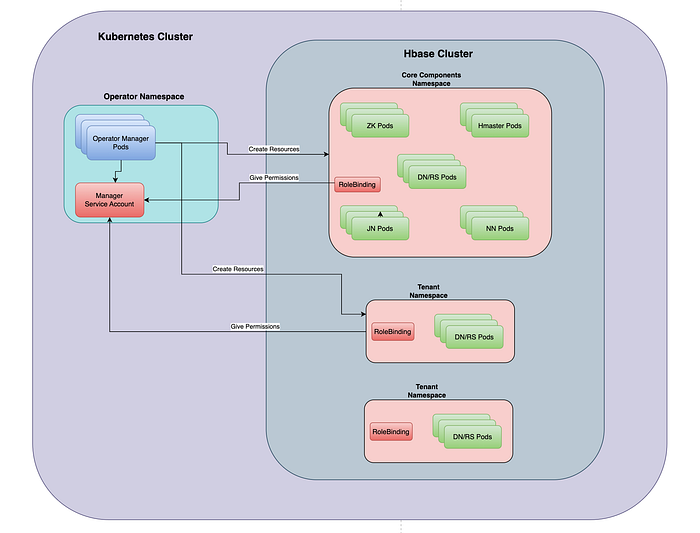

# Postmortem: Latency spikes in Apache Hbase on kubernetes

## Introduction

Apache HBase is an open-source non-relational distributed database modeled after Google’s Bigtable and written in Java. It is developed as part of Apache Software Foundation’s Apache Hadoop project and runs on top of HDFS, providing Bigtable-like capabilities for Hadoop.

Incidents occur in complex softwares and more so in a distributed database like Apache HBase deployed on a distributed platform like Kubernetes. This article explains how we root-caused one such error message that led to a bigger underlying issue.

### Background:

We are a platform team at Flipkart hosting Apache HBase for over 180 business use cases primarily OLTP workloads, with over 1.6 PetaByte data, 11000+ vcores, and 70TB of RAM provisioned capacity.

Our Apache Hbase clusters are entirely deployed on Kubernetes with the help of [Kubernetes Hbase Operator](https://github.com/flipkart-incubator/hbase-k8s-operator). [Here is a blog post](./challenges-and-learnings-in-building-hbase-k8s-operator-d074c0a55fe1.md) which explains the same.

### Deployment Architecture:



[Apache HBase](https://hbase.apache.org/book.html) is deployed as a multi-tenant cluster with:

- [strict resource isolation](./hbase-multi-tenancy-part-i-37cad340c0fa.md), with each group of nodes for a single tenant being deployed in its own namespace.
- an Operator manager pod deployed in its own namespace which converts Apache HBase CRD into Kubernetes resources.
- Core components such as zookeepers, journalnodes, namenodes, hmasters and default regionservers/datanodes deployed on single namespace.
- Each [Regionserver group](https://hbase.apache.org/book.html#rsgroup) being deployed on its own namespace with rolebindings to allow operators to create resources.


---

## Problem Statement

After we migrated our Apache HBase clusters from virtual machines to Kubernetes, we saw random timeouts in regionservers while fetching blocks from Datanodes during the read rpc calls from clients.

Following exceptions were seen during the timeouts on regionservers.

```
2024-01-12T16:19:15,744 WARN  [RpcServer.default.FPRWQ.Fifo.read.handler=118,queue=50,port=16020] hdfs.DFSClient: Connection failure: Failed to connect to /10.48.148.87:9866 for file /hbase/data/mpca/groups_mpca/db3f2ae8e3c12d45bde1dafa7acf72c2/default/043d409f09da49ad94584b540ad9dd7a for block BP-343834734-10.53.201.33-1682354034044:blk_1120791796_4984638:
org.apache.hadoop.net.ConnectTimeoutException: 2000 millis timeout while waiting for channel to be ready for connect. ch : java.nio.channels.SocketChannel[connection-pending remote=/10.48.148.87:9866]
        at org.apache.hadoop.net.NetUtils.connect(NetUtils.java:538) ~[hadoop-common-3.2.4.jar:?]
        at org.apache.hadoop.hdfs.DFSClient.newConnectedPeer(DFSClient.java:2973) ~[hadoop-hdfs-client-3.2.4.jar:?]
        at org.apache.hadoop.hdfs.client.impl.BlockReaderFactory.nextTcpPeer(BlockReaderFactory.java:826) ~[hadoop-hdfs-client-3.2.4.jar:?]
        at org.apache.hadoop.hdfs.client.impl.BlockReaderFactory.getRemoteBlockReaderFromTcp(BlockReaderFactory.java:751) ~[hadoop-hdfs-client-3.2.4.jar:?]
        at org.apache.hadoop.hdfs.client.impl.BlockReaderFactory.build(BlockReaderFactory.java:381) ~[hadoop-hdfs-client-3.2.4.jar:?]
        at org.apache.hadoop.hdfs.DFSInputStream.getBlockReader(DFSInputStream.java:733) ~[hadoop-hdfs-client-3.2.4.jar:?]
        at org.apache.hadoop.hdfs.DFSInputStream.actualGetFromOneDataNode(DFSInputStream.java:1141) ~[hadoop-hdfs-client-3.2.4.jar:?]
        at org.apache.hadoop.hdfs.DFSInputStream.fetchBlockByteRange(DFSInputStream.java:1093) ~[hadoop-hdfs-client-3.2.4.jar:?]
        at org.apache.hadoop.hdfs.DFSInputStream.pread(DFSInputStream.java:1452) ~[hadoop-hdfs-client-3.2.4.jar:?]
        at org.apache.hadoop.hdfs.DFSInputStream.read(DFSInputStream.java:1416) ~[hadoop-hdfs-client-3.2.4.jar:?]
        at org.apache.hadoop.fs.FSDataInputStream.read(FSDataInputStream.java:92) ~[hadoop-common-3.2.4.jar:?]
```

In the logs, we see the regionserver connects to a datanode ip address which results in a timeout. We found the ip address assigned to the datanode changed with the pod restart.

We noticed that this ip address was not associated with any DNS entry at the time of the call. From the DNS entry below, you can see that the last DNS entry update was made 20 minutes before the exception occurred.

```
{
 "ip_addr": "10.48.148.87",
 "updated_at": "2024-01-12T15:59:30.555+05:30",
 "hostname": "xxxxx",
}
```

When we look at it carefully, we understand that unlike virtual machines, containerization embraces the ephemeral nature of pods where the datanode ip addresses change with pod restart. The dfs client in the HBase region server caches these ip addresses to improve performance. The time-outs during READs were because the ip addresses differed from the cache data.

In [this section](https://github.com/apache/hadoop/blob/rel/release-3.2.4/hadoop-hdfs-project/hadoop-hdfs-client/src/main/java/org/apache/hadoop/hdfs/DFSClient.java#L877), a namenode call is made to fetch the block details for a few blocks and in [this section](https://github.com/apache/hadoop/blob/rel/release-3.2.4/hadoop-hdfs-project/hadoop-hdfs-client/src/main/java/org/apache/hadoop/hdfs/DFSInputStream.java#L561) fetch is from cached blocks. Refer to [this section](https://github.com/apache/hadoop/blob/rel/release-3.2.4/hadoop-hdfs-project/hadoop-hdfs-client/src/main/java/org/apache/hadoop/hdfs/DFSInputStream.java#L138) for periodic refresh of blocks with configuration _dfs.client.refresh.read-block-locations.ms. _The_ _[default behavior is to never cache the blocks](https://github.com/apache/hadoop/blob/branch-3.2.4/hadoop-hdfs-project/hadoop-hdfs-client/src/main/java/org/apache/hadoop/hdfs/client/HdfsClientConfigKeys.java#L157), as blocks get recreated on compaction and hence are automatically purged beyond a certain period.


---

## Solution Approach:

We have established that the staleness of the cached ip is unavoidable with scale. To reduce the probability of IP address becoming stale while connecting to datanodes, we identified the following approaches with hdfs-client configurations:

- Refresh Cache Blocks
- Use DNS instead of IP Address

## Refresh Cache Blocks:

The hdfs-client has [a configuration](https://hadoop.apache.org/docs/r3.2.4/hadoop-project-dist/hadoop-hdfs/hdfs-default.xml) to enable cache expiry with configuration _dfs.client.refresh.read-block-locations.ms. _This ensures that the cached blocks expire at certain intervals, requiring to be re-fetched often.

As the experiments showed some end user rpc call latencies as performance penalty, we did not proceed with this option.

### Use DNS instead of IP Address:

HDFS client provides a configuration that allows you to use hostnames for datanode connections. This is disabled by default. [Here is the configuration](https://hadoop.apache.org/docs/r3.2.4/hadoop-project-dist/hadoop-hdfs/hdfs-default.xml) with the key being _dfs.client.use.datanode.hostname_. With this configuration, regionservers (hdfs-clients) connect to datanodes using hostname instead of the IP address.

This ensures that:

- Cache expiry is limited to DNS TTL expiry, which is typically configured to a few tens of seconds.
- Stale ip’s effect is for a limited duration and can also be controlled.

When we enabled this configuration, the connection timeout because of stale ip address stopped but there were frequent DNS resolution failures with error — **_Temporary failure in name resolution_**_ _on certain use cases_. _This resulted in rpc call failures for our customers.

```
2024-01-25T19:10:27,760 WARN  [RpcServer.default.FPRWQ.Fifo.write.handler=3,queue=3,port=16020] net.NetUtils: Failed to resolve hostname. Defaulting to unresolved. Exception: prod-checkout-hyd-2-dn-18.prod-checkout-hyd-2.yak-tenant-co-prod.svc.cluster.local.: Temporary failure in name resolution
java.net.UnknownHostException: prod-checkout-hyd-2-dn-18.prod-checkout-hyd-2.yak-tenant-co-prod.svc.cluster.local: Temporary failure in name resolution
        at java.net.Inet4AddressImpl.lookupAllHostAddr(Native Method) ~[?:?]
        at java.net.InetAddress$PlatformNameService.lookupAllHostAddr(InetAddress.java:933) ~[?:?]
        at java.net.InetAddress.getAddressesFromNameService(InetAddress.java:1534) ~[?:?]
        at java.net.InetAddress$NameServiceAddresses.get(InetAddress.java:852) ~[?:?]
        at java.net.InetAddress.getAllByName0(InetAddress.java:1524) ~[?:?]
        at java.net.InetAddress.getAllByName(InetAddress.java:1381) ~[?:?]
        at java.net.InetAddress.getAllByName(InetAddress.java:1305) ~[?:?]
        at java.net.InetAddress.getByName(InetAddress.java:1255) ~[?:?]
        at org.apache.hadoop.security.SecurityUtil$StandardHostResolver.getByName(SecurityUtil.java:580) ~[hadoop-common-3.2.4.jar:?]
        at org.apache.hadoop.security.SecurityUtil.getByName(SecurityUtil.java:566) ~[hadoop-common-3.2.4.jar:?]
        at org.apache.hadoop.net.NetUtils.createSocketAddrForHost(NetUtils.java:239) ~[hadoop-common-3.2.4.jar:?]
        at org.apache.hadoop.net.NetUtils.createSocketAddr(NetUtils.java:219) ~[hadoop-common-3.2.4.jar:?]
        at org.apache.hadoop.net.NetUtils.createSocketAddr(NetUtils.java:166) ~[hadoop-common-3.2.4.jar:?]
        at org.apache.hadoop.net.NetUtils.createSocketAddr(NetUtils.java:155) ~[hadoop-common-3.2.4.jar:?]
        at org.apache.hadoop.hdfs.DFSInputStream.getBestNodeDNAddrPair(DFSInputStream.java:1079) ~[hadoop-hdfs-client-3.2.4.jar:?]
        at org.apache.hadoop.hdfs.DFSInputStream.chooseDataNode(DFSInputStream.java:984) ~[hadoop-hdfs-client-3.2.4.jar:?]
        at org.apache.hadoop.hdfs.DFSInputStream.chooseDataNode(DFSInputStream.java:967) ~[hadoop-hdfs-client-3.2.4.jar:?]
        at org.apache.hadoop.hdfs.DFSInputStream.fetchBlockByteRange(DFSInputStream.java:1123) ~[hadoop-hdfs-client-3.2.4.jar:?]
        at org.apache.hadoop.hdfs.DFSInputStream.pread(DFSInputStream.java:1487) ~[hadoop-hdfs-client-3.2.4.jar:?]
        at org.apache.hadoop.hdfs.DFSInputStream.read(DFSInputStream.java:1451) ~[hadoop-hdfs-client-3.2.4.jar:?]
        at org.apache.hadoop.fs.FSDataInputStream.read(FSDataInputStream.java:92) ~[hadoop-common-3.2.4.jar:?]
        at org.apache.hadoop.hbase.io.util.BlockIOUtils.preadWithExtraOnHeap(BlockIOUtils.java:325) ~[hbase-common-2.5.3-hadoop3.jar:2.5.3-fk4]
        at org.apache.hadoop.hbase.io.util.BlockIOUtils.preadWithExtra(BlockIOUtils.java:313) ~[hbase-common-2.5.3-hadoop3.jar:2.5.3-fk4]
        at org.apache.hadoop.hbase.io.hfile.HFileBlock$FSReaderImpl.readAtOffset(HFileBlock.java:1465) ~[hbase-server-2.5.3-hadoop3.jar:2.5.3-fk4]
        at org.apache.hadoop.hbase.io.hfile.HFileBlock$FSReaderImpl.readBlockDataInternal(HFileBlock.java:1700) ~[hbase-server-2.5.3-hadoop3.jar:2.5.3-fk4]
        at org.apache.hadoop.hbase.io.hfile.HFileBlock$FSReaderImpl.readBlockData(HFileBlock.java:1503) ~[hbase-server-2.5.3-hadoop3.jar:2.5.3-fk4]
        at org.apache.hadoop.hbase.io.hfile.HFileReaderImpl.readBlock(HFileReaderImpl.java:1331) ~[hbase-server-2.5.3-hadoop3.jar:2.5.3-fk4]
        at org.apache.hadoop.hbase.io.hfile.HFileReaderImpl.readBlock(HFileReaderImpl.java:1252) ~[hbase-server-2.5.3-hadoop3.jar:2.5.3-fk4]
        at org.apache.hadoop.hbase.io.hfile.NoOpIndexBlockEncoder$NoOpEncodedSeeker.loadDataBlockWithScanInfo(NoOpIndexBlockEncoder.java:346) ~[hbase-server-2.5.3-hadoop3.jar:2.5.3-fk4]
        at org.apache.hadoop.hbase.io.hfile.HFileBlockIndex$CellBasedKeyBlockIndexReaderV2.loadDataBlockWithScanInfo(HFileBlockIndex.java:514) ~[hbase-server-2.5.3-hadoop3.jar:2.5.3-fk4]
        at org.apache.hadoop.hbase.io.hfile.HFileReaderImpl$HFileScannerImpl.seekTo(HFileReaderImpl.java:661) ~[hbase-server-2.5.3-hadoop3.jar:2.5.3-fk4]
        at org.apache.hadoop.hbase.io.hfile.HFileReaderImpl$HFileScannerImpl.reseekTo(HFileReaderImpl.java:646) ~[hbase-server-2.5.3-hadoop3.jar:2.5.3-fk4]
        at org.apache.hadoop.hbase.regionserver.StoreFileScanner.reseekAtOrAfter(StoreFileScanner.java:323) ~[hbase-server-2.5.3-hadoop3.jar:2.5.3-fk4]
        at org.apache.hadoop.hbase.regionserver.StoreFileScanner.reseek(StoreFileScanner.java:242) ~[hbase-server-2.5.3-hadoop3.jar:2.5.3-fk4]
        at org.apache.hadoop.hbase.regionserver.StoreFileScanner.enforceSeek(StoreFileScanner.java:442) ~[hbase-server-2.5.3-hadoop3.jar:2.5.3-fk4]
        at org.apache.hadoop.hbase.regionserver.KeyValueHeap.pollRealKV(KeyValueHeap.java:351) ~[hbase-server-2.5.3-hadoop3.jar:2.5.3-fk4]
        at org.apache.hadoop.hbase.regionserver.KeyValueHeap.generalizedSeek(KeyValueHeap.java:296) ~[hbase-server-2.5.3-hadoop3.jar:2.5.3-fk4]
        at org.apache.hadoop.hbase.regionserver.KeyValueHeap.requestSeek(KeyValueHeap.java:260) ~[hbase-server-2.5.3-hadoop3.jar:2.5.3-fk4]
        at org.apache.hadoop.hbase.regionserver.StoreScanner.reseek(StoreScanner.java:1081) ~[hbase-server-2.5.3-hadoop3.jar:2.5.3-fk4]
        at org.apache.hadoop.hbase.regionserver.StoreScanner.seekAsDirection(StoreScanner.java:1072) ~[hbase-server-2.5.3-hadoop3.jar:2.5.3-fk4]
        at org.apache.hadoop.hbase.regionserver.StoreScanner.seekOrSkipToNextColumn(StoreScanner.java:812) ~[hbase-server-2.5.3-hadoop3.jar:2.5.3-fk4]
        at org.apache.hadoop.hbase.regionserver.StoreScanner.next(StoreScanner.java:720) ~[hbase-server-2.5.3-hadoop3.jar:2.5.3-fk4]
        at org.apache.hadoop.hbase.regionserver.KeyValueHeap.next(KeyValueHeap.java:145) ~[hbase-server-2.5.3-hadoop3.jar:2.5.3-fk4]
        at org.apache.hadoop.hbase.regionserver.RegionScannerImpl.populateResult(RegionScannerImpl.java:339) ~[hbase-server-2.5.3-hadoop3.jar:2.5.3-fk4]
        at org.apache.hadoop.hbase.regionserver.RegionScannerImpl.nextInternal(RegionScannerImpl.java:510) ~[hbase-server-2.5.3-hadoop3.jar:2.5.3-fk4]
        at org.apache.hadoop.hbase.regionserver.RegionScannerImpl.nextRaw(RegionScannerImpl.java:275) ~[hbase-server-2.5.3-hadoop3.jar:2.5.3-fk4]
        at org.apache.hadoop.hbase.regionserver.RegionScannerImpl.next(RegionScannerImpl.java:253) ~[hbase-server-2.5.3-hadoop3.jar:2.5.3-fk4]
        at org.apache.hadoop.hbase.regionserver.RegionScannerImpl.next(RegionScannerImpl.java:240) ~[hbase-server-2.5.3-hadoop3.jar:2.5.3-fk4]
        at org.apache.hadoop.hbase.regionserver.HRegion.checkAndMutateInternal(HRegion.java:4735) ~[hbase-server-2.5.3-hadoop3.jar:2.5.3-fk4]
        at org.apache.hadoop.hbase.regionserver.HRegion.lambda$checkAndMutate$13(HRegion.java:4662) ~[hbase-server-2.5.3-hadoop3.jar:2.5.3-fk4]
        at org.apache.hadoop.hbase.trace.TraceUtil.trace(TraceUtil.java:216) ~[hbase-common-2.5.3-hadoop3.jar:2.5.3-fk4]
        at org.apache.hadoop.hbase.regionserver.HRegion.checkAndMutate(HRegion.java:4662) ~[hbase-server-2.5.3-hadoop3.jar:2.5.3-fk4]
        at org.apache.hadoop.hbase.regionserver.RSRpcServices.checkAndMutate(RSRpcServices.java:3083) ~[hbase-server-2.5.3-hadoop3.jar:2.5.3-fk4]
        at org.apache.hadoop.hbase.regionserver.RSRpcServices.mutate(RSRpcServices.java:2984) ~[hbase-server-2.5.3-hadoop3.jar:2.5.3-fk4]
        at org.apache.hadoop.hbase.shaded.protobuf.generated.ClientProtos$ClientService$2.callBlockingMethod(ClientProtos.java:44994) ~[hbase-protocol-shaded-2.5.3-hadoop3.jar:2.5.3-fk4]
        at org.apache.hadoop.hbase.ipc.RpcServer.call(RpcServer.java:415) ~[hbase-server-2.5.3-hadoop3.jar:2.5.3-fk4]
        at org.apache.hadoop.hbase.ipc.CallRunner.run(CallRunner.java:124) ~[hbase-server-2.5.3-hadoop3.jar:2.5.3-fk4]
        at org.apache.hadoop.hbase.ipc.RpcHandler.run(RpcHandler.java:102) ~[hbase-server-2.5.3-hadoop3.jar:2.5.3-fk4]
        at org.apache.hadoop.hbase.ipc.RpcHandler.run(RpcHandler.java:82) ~[hbase-server-2.5.3-hadoop3.jar:2.5.3-fk4]
```

**The Stack Trace Analysis**

When you look into the stack trace, it points to this piece of code from the function [InetAddress.getByName](https://github.com/apache/hadoop/blob/rel/release-3.2.4/hadoop-common-project/hadoop-common/src/main/java/org/apache/hadoop/security/SecurityUtil.java#L580) which invokes [getaddrinfo](https://github.com/openjdk/jdk/blob/jdk-17-ga/src/java.base/unix/native/libnet/Inet4AddressImpl.c#L109) (which is nothing but invoking standard c library method [getaddrinfo](https://man7.org/linux/man-pages/man3/getaddrinfo.3.html)) from java native code. We attempted to debug and found no problems.

Then we invoked a [kubernetes debug container](https://kubernetes.io/docs/tasks/debug/debug-application/debug-running-pod/) to take [tcp dump](https://www.tcpdump.org/) from the pod on DNS queries. It revealed that there was no problem with either the DNS server or the network, as also cross-verified from DNS server logs. You can see from the logs below:

```
19:10:17.751675 IP 10.48.170.95.49020 > 10.60.64.10.53: 30508+ A? prod-checkout-hyd-2-dn-18.prod-checkout-hyd-2.yak-tenant-co-prod.svc.cluster.local. (133)
19:10:17.752165 IP 10.60.64.10.53 > 10.48.170.95.49020: 30508*- 1/0/0 A 10.53.181.50 (264)
19:10:22.754410 IP 10.48.170.95.49020 > 10.60.64.10.53: 30508+ A? prod-checkout-hyd-2-dn-18.prod-checkout-hyd-2.yak-tenant-co-prod.svc.cluster.local. (133)
19:10:22.756173 IP 10.60.64.10.53 > 10.48.170.95.49020: 30508*- 1/0/0 A 10.53.181.50 (264)
19:10:27.758512 IP 10.48.170.95.54842 > 10.60.64.10.53: 39121+ A? prod-checkout-hyd-2-dn-18.prod-checkout-hyd-2.yak-tenant-co-prod.svc.cluster.local.yak-tenant-acc-ekl-prod.svc.cluster.local. (175)
19:10:27.759117 IP 10.60.64.10.53 > 10.48.170.95.54842: 39121 NXDomain*- 0/1/0 (268)
19:10:27.759260 IP 10.48.170.95.52104 > 10.60.64.10.53: 23915+ A? prod-checkout-hyd-2-dn-18.prod-checkout-hyd-2.yak-tenant-co-prod.svc.cluster.local.svc.cluster.local. (151)
19:10:27.759744 IP 10.60.64.10.53 > 10.48.170.95.52104: 23915 NXDomain*- 0/1/0 (244)
19:10:27.759802 IP 10.48.170.95.34866 > 10.60.64.10.53: 29851+ A? prod-checkout-hyd-2-dn-18.prod-checkout-hyd-2.yak-tenant-co-prod.svc.cluster.local.cluster.local. (147)
19:10:27.760473 IP 10.60.64.10.53 > 10.48.170.95.34866: 29851 NXDomain*- 0/1/0 (240)
```

DNS resolution happens as expected but retries 2 times with 5 seconds gap in between and then uses [ndots](https://man7.org/linux/man-pages/man5/resolv.conf.5.html) the 3rd time after exact 5 seconds gap and eventually fails the dns resolution. This pattern repeated every time there was a dns resolution failure.

When checked for [resolv.conf](https://man7.org/linux/man-pages/man5/resolv.conf.5.html) documentation, default configuration found [here](https://man7.org/linux/man-pages/man5/resolv.conf.5.html) reveals that by default, the dns resolution timeout is at 5 seconds and it retries 2 times. This is exactly what seems to be happening in the above case.

```
timeout:n
   Sets the amount of time the resolver will wait for
   a response from a remote name server before
   retrying the query via a different name server.
   This may not be the total time taken by any
   resolver API call and there is no guarantee that a
   single resolver API call maps to a single timeout.
   Measured in seconds, the default is RES_TIMEOUT
   (currently 5, see <resolv.h>).  The value for this
   option is silently capped to 30.

attempts:n
   Sets the number of times the resolver will send a
   query to its name servers before giving up and
   returning an error to the calling application.  The
   default is RES_DFLRETRY (currently 2, see
   <resolv.h>).  The value for this option is silently
   capped to 5.
```

From earlier debugging we found that, [getaddrinfo](https://github.com/openjdk/jdk/blob/jdk-17-ga/src/java.base/unix/native/libnet/Inet4AddressImpl.c#L109) is timing out, concluding that it is outside the application (Apache HBase) domain.

After some further narrowing down (a lot more details will be shared in another blog post), we installed bpftrace and ran the following command to see the network latency return codes.

```
sudo su

apt install bpftrace
BPFTRACE_STRLEN=200 gethostlatency.bt
Attaching 9 probes...
Tracing getaddr/gethost calls... Hit Ctrl-C to end.

TIME      TID    COMM              LATms HOST
01:23:45  2085037 java             - __udp_enqueue_schedule_skb finished ret=-12 skb_truesize=1280 sk_fa=3328 (pid=574837)
01:23:45  2085037 java             - __udp_enqueue_schedule_skb finished ret=-12 skb_truesize=1280 sk_fa=3328 (pid=574837)
01:23:54  0       swapper/48       - __udp_enqueue_schedule_skb finished ret=-105 skb_truesize=896 sk_fa=0 (pid=0)
```

We can see that it drops a packet with error code -105 representing [ENOBUFS](https://elixir.bootlin.com/linux/v5.10.162/source/net/ipv4/udp.c#L1551) meaning no buffer space available to enqueue for udp packet. Based on [the implementation](https://elixir.bootlin.com/linux/v5.10.162/source/net/ipv4/udp.c#L1547), we can see it tries to raise memory for socket using ___sk_mem_raise_allocated_ in case the required skb truesize is higher than _sk_forward_alloc._

At a similar timestamp, we can also see cgroup memory utilization (_cat /sys/fs/cgroup/memory.current_) is tending toward the applied container limit (_cat /sys/fs/cgroup/memory.max_). Since [___sk_mem_raise_allocated_](https://elixir.bootlin.com/linux/v5.10.162/source/net/core/sock.c#L2600) returns zero, as [__udp_enqueue_schedule_skb](https://elixir.bootlin.com/linux/v5.10.162/source/net/ipv4/udp.c#L1511) tries to enqueue packet, it is apparent that dns resolution fails when memory pressure is high on the cgroup because of the increase in page cache. When a certain amount of page cache memory is reclaimed (sufficient to charge / account socket memory under cgroup limits) by the kernel to relieve memory pressure, dns resolution resumes.

```
$ cat /sys/fs/cgroup/memory.current
35432849408
$ cat /sys/fs/cgroup/memory.max
35433480192
```

The error did not surface in the following scenarios:

1. When DNS resolution was done via tcp (instead of udp) by enabling [use-vc](https://man7.org/linux/man-pages/man5/resolv.conf.5.html) for dns resolution via resolv.conf as shown below.

```
$ tail -2 /etc/resolv.conf
nameserver xx.xx.xx.xx
options use-vc ndots:5
```

2. When the kernel was upgraded from v5.10 to v6.1. You can read more details in this [commit](https://github.com/torvalds/linux/commit/720ca52bcef2).

### Key Observations:

- DNS vs IP address — With tech stacks such as hbase/hadoop that are not tuned to run on containers by default, there is a learning curve with it and [challenges faced](./challenges-and-learnings-in-building-hbase-k8s-operator-d074c0a55fe1.md) while running on containers. Using DNS should be preferred when hbase is run on containers with the ephemeral nature of pods and its ip address.
- UDP vs TCP — UDP is expected to be lossy but was not expected to be so in a reliable network within a single Region. We realized that the other factors on the operating system, including memory pressure can exploit the lossy nature of UDP. When complicated systems are run on ephemeral environment such as Kubernetes, it is better to configure DNS on TCP to do away with any assumptions on factors such as network, operating system.
- [Kernel v5.10 vs v6.1](https://github.com/torvalds/linux/commit/720ca52bcef2) — Subtle differences in how memory pressure is handled such as packet drop with DNS over UDP made so much difference to the end user application stack (Apache Hbase).

## Summary

Incidents in a distributed database like Apache HBase deployed on a distributed platform like Kubernetes can happen because of a bug, handling of an edge case scenario, a misconfiguration, etc. It takes quite a lot of effort to find the root cause of a few incidents. In this post, we shared one such interesting postmortem, where one finding led to another and eventually led to how v5.10 Linux kernel handles UDP packet during memory pressure scenarios on Linux cgroup containers and how it can cause a seemingly unrelated error. We hope this account will help in giving a perspective in how to root cause incident which involves distrubuted systems.

---
**Tags:** Regionserver Time Outs · Dns Instead Of Ip · Udp Vs Tcp · Hbase On Kubernetes · Latency Spikes In Hbase
