# Powering strongly consistent multi-region applications with TiDB

## Introduction

Flipkart, being one of the largest e-commerce companies, serves millions of customers and needs to support millions of requests every second. With such demanding scale comes the additional challenges in maintaining data integrity at scale, with high throughput and low latency.

We have a complex infrastructure that is spanning across multiple regions to better serve our customers. As the data goes beyond a single region, there are a new set of challenges to solve, such as round trip latency between different regions because of geographical placements.

As an example, consider you are buying a pair of shoes, and have added a few to your wish list from the catalog. You may choose to share your shopping list with your friends and they should be able to see all the modifications to your list. So it’s imperative that the data is always available across regions with acceptable levels of performance.

In this article, we explore how we provide such guarantees and discuss the challenges we faced during deployment of databases across regions.

## Cursory glance at our Tech and Infra

Let’s understand a few details about the infrastructure and tech we use in Flipkart.

At Flipkart, for use cases relying on relational schema and those needing horizontal scaling, we use **TiDB** to provide a distributed RDBMS solution. It supports out-of-the-box scalability, consistency, availability, multi-site deployment topology and many more features. As a distributed database, TiDB has multiple components which communicate with each other and form a complete TiDB system.

**TiKV: **It is a distributed transactional key-value data store which keeps the data in left closed-right open range. Data is kept in shards having multiple replicas, TiKV uses raft protocol for replication.

**PD: **Placement driver (PD) keeps the metadata of the cluster such as shard replica locations, and it’s also responsible for scheduling the shards across TiKV nodes. PD leader handles such tasks while other nodes maintain high availability.

**TiDB:** It is the stateless SQL processing component which provides the client facing endpoints to the user. It locates the correct TiKV node to connect, from PD, to get the data.

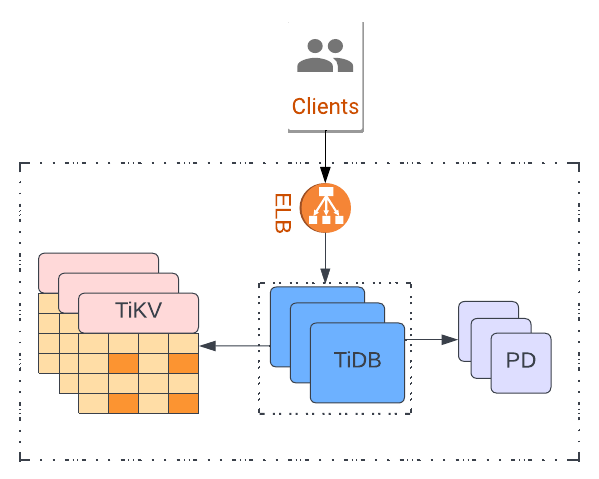
*TiDB Architecture*

TiDB uses Raft protocol to ensure data integrity and availability. It is highly compatible with the MySQL client. Any application built to operate on MySQL Database can easily switch to TiDB with minimal or no code changes.


---

In Flipkart, we follow containerised deployment using Kubernetes. The databases are deployed using Kubernetes stateful sets which are maintained by a dedicated Kubernetes operator. Flipkart’s infrastructure spans across multiple regions, each region has its own Kubernetes cluster. There can be multiple TiDBs deployed in a region. We maintain a specific TiDB operator to manage these TiDBs in a region. Every region deploys its own operator.

We use Istio for network layer communications. Istio mesh enables the pods to resolve the DNS for other pods and binds the infrastructure pieces across regions in one network mesh.

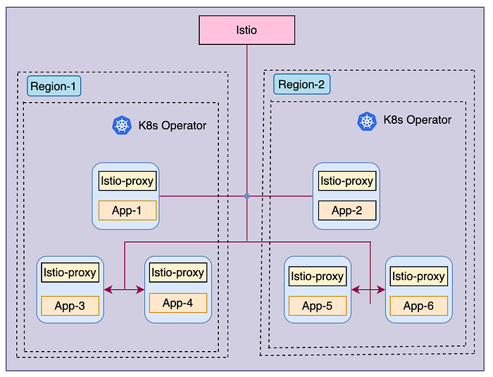
*Multi region infrastructure view with cluster level kubernetes operator and istio network mesh*

## Multi-region challenges — A quick preface

At Flipkart, the users are sharded across different regions based on their customer identifier. A user is pinned to a region, and all the generated traffic is served from that region. Such an access pattern does not create any contention on ‘writes’ as the read-write workloads are always independent.

In scenarios where data generated by one customer (for example, a wish list) needs to be shared with another customer in a different region, we need to provide the guarantees of strong consistency. As in, the user sharing the data will expect that as soon as they add a new item to the wish list, the same should reflect to other users when they open the link.

This implies we’ll need a database solution that:

- Guarantees strong consistency.
- Provides cluster locality (keeping the application and database close to each other to reduce the latencies) that helps minimise latencies and adhere to the SLAs.

In similar scenarios with multi region applications, we want to solve for:

- Strong multi-region consistency
- Availability and data durability in region level failure scenarios
- Optimal performance

## Viewpoint

**Approach One**: A TiDB cluster is strongly consistent, and when deployed within a single region, we get strong consistency within a region. TiDB uses raft protocol to achieve integral and consistent data state, where every write goes through the shard replica leader and gets replicated to all replicas. Replication of data to shard replicas happens synchronously, so TiDB gives write acknowledgement only after all replicas are updated.

**Problems with this approach:**

1. Majority node failure or a failure of the entire region makes the cluster unavailable and the data might be lost.
2. In case clients are deployed to different regions, cross-region client calls to the DB will be latent as the database is deployed in a single region.

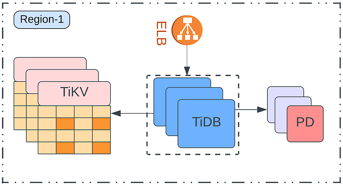
*single region TiDB deployment view*

**Approach Two:** In a multi-region environment, setting up a passive cluster works as a backup for active clusters. When a region fails, you can switch to a passive cluster and minimise the data loss. This approach solves for minimal data loss, but there can be some loss of data equivalent to lag in the replication pipeline.

**Problems with this approach:**

1. As there will be a lag of a few seconds or milliseconds, the data can not be read from the passive cluster just after writing it to the active one. It would provide an eventual consistent solution
2. We may not be able to guarantee zero data loss (zero RPO) on the passive cluster because of the lag.

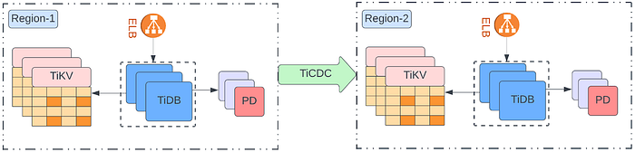
*Active-Passive setup for two regions TiDB deployment with TiCDC*

Though the aforementioned approaches have some shortcomings, we see strong consistency in the first approach and better availability of clusters in the second one.

Let’s see how we merge the above two solutions and come up with a better approach, which might solve our problems.

## The close-to ideal Implementation

To solve for this, we deploy two clusters across regions and connect them as a single standalone cluster. For network layer communication, the istio mesh is used:

- When you deploy the first fragment, add spec.acrossk8s: true in the manifest file of the cluster. This is to imply that it is a fragment spread across multiple k8s clusters.

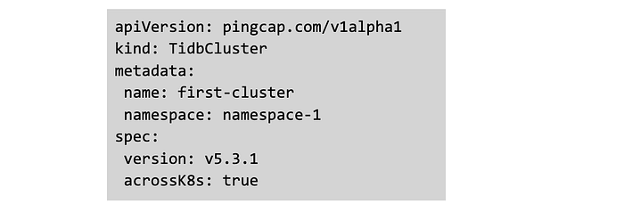

- When you deploy another cluster fragment, you need to add the details of the k8s cluster on which first fragment is deployed, in addition to acrossK8s configuration:

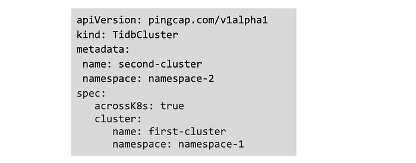

Using this approach, we enabled the second fragment to join with the first one, and it treats the PD leader of the first fragment as the cluster’s PD leader. All components get merged to join both fragments, and it becomes a single cluster spanning across two regions.

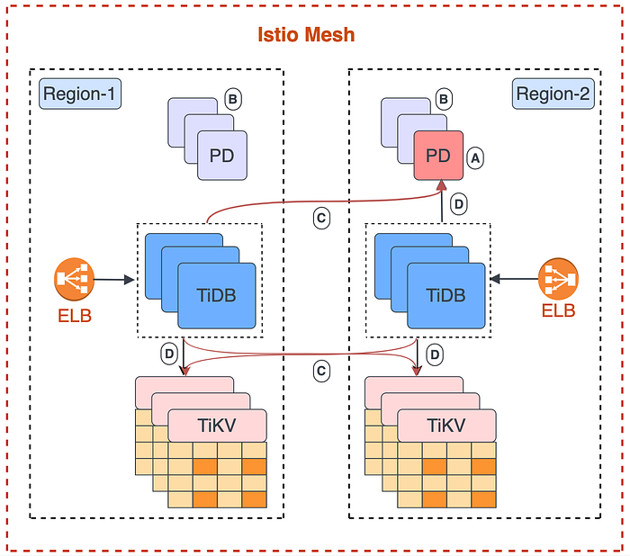
*Active-Active (A-A Sync) Topology — Multi region cluster*

- A - leader among placement drivers (PD)
- B - PD follower nodes
- C - Cross region calls from TiDB to other cluster components
- D - local region (cluster locality) calls

## Here’s how we solve for challenges

With this implementation set up, let’s discuss solutions for the aforesaid challenges in the following sections:

- Consistency and Region level failures
- Cluster locality
- Multi-Region Cluster With 2 Regions
- Three Region deployment
- Performance

## Consistency and Region level failure

On default setting, TiDB may choose to place all the replicas of a shard in a single region. Such a setup does not tolerate region level failures. We need to change the shard placement configuration to mitigate this challenge.

TiDB uses placement driver (PD) to schedule or spawn a shard replica. All TiKV nodes are labeled based on their geographical region. Using PD level location-label configuration, we can enforce the placement of shard replication across the designated nodes in the regions.

TiDB shard spread on multiple regions provides high-availability to the cluster even in case of region-level failures.

This helps us to achieve following goals:

- **Strong Consistency: **Transactions sanity is ensured by the sync cluster, which provides the client with read-after-write consistency.
- **Availability and data durability in case of region-level failures:** If there is a region failure, having a spread of shard replicas in 1:1:1 ratio in three regions ensures the availability of at least two replicas, and the leader can be elected between them. This ensures high-availability of the cluster.

## Cluster locality

Cross region communication adds to the network latency. If the client applications are deployed in one region, communicating with the database in another region increases the latencies and might breach the SLAs. Cluster locality helps in reducing the network hops. While the database internal communication can be cross DC but the application to database connectivity would be local.

We deploy TiDB instances (the stateless SQL processing component) at every region and applications access these instances using a local ELB to reduce cross-region communications. The TiDB instances internally make cross-region calls to the TiKVs but the application to TiDB request hop and the response hop is always local. This way, the client applications don’t need to communicate with databases deployed in another region; rather, it can connect with local ELB.

Cluster locality helps in reducing the latencies while serving the clients within agreed SLAs. It also saves some of the cross-region network bandwidth.

## Multi-Region Cluster With 2 Regions

If you were to stretch TiDB deployment in 2 regions, then this is how you can solve for shard placements.

This solution proposes the introduction of majority and minority regions based on the number of shard replicas. The region with the higher number of replicas is termed as ‘majority’ while other one with lesser number of replicas is named as ‘minority’ region.

Raft protocol needs a viable quorum to work. If the quorum is unavailable, the cluster cannot choose the leader and will be in ‘Down’ state. Currently, our quorum is set at 3, so TiDB ensures having at least 3 replicas for each shard. If over 2 replicas go down, the quorum does not work, and the cluster becomes non-functional.

At least two out of three shard replicas must be available at all times to ensure we have better cluster availability. We can make this possible by pinning replicas to specific regions. This step also makes the cluster available with a two-region cluster setup.

**2 Region setup with Partial Availability**

As the number of replicas is 3 and the distribution can only be done in 2:1 ratio across two regions, the high availability can not be ensured with two regions only. To solve this problem, we need to have at least three regions. Hence, we solve for partial availability. If the ‘Minority’ region goes down, the cluster will still be functional as, for each shard, at least 2 replicas are available to hold the raft protocol. In case of the ‘Majority’ region going down, the cluster will become unavailable.

Leaders for each shard can also be pinned to a specific region, but we have not done that to minimize cross-region connection.

Voter (shard replica) pinning for shards is achieved via PD rules to enforce two shard replicas residing in one region while another shard replica gets scheduled in another region. Majority and Minority region provides the partial availability.

Pinning the shard replicas to a specific region needs all nodes in the region to be labeled. For example, consider you have a region in Delhi and one in Mumbai; You want Delhi region to be ‘Majority’ while Mumbai as ‘Minority’ region.

- Label all nodes in a region with specific labels. Example: “**region: delhi**”.
- Use that label to have label constraints in PD rules for shard replica scheduling.


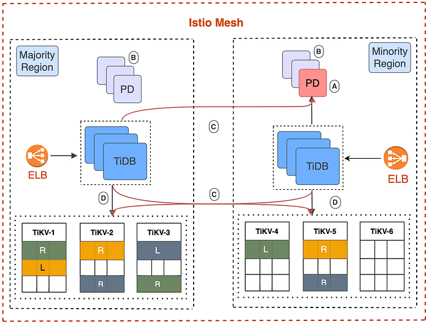
*two region Active-Active deployment for TiDB with shard replicas pinned to the regions.*

- Colour pattern on TiKVs - same shard with their replica spread across different TiKV nodes.
- L - specific replica is a leader among other shard replicas.
- R - follower/voter shard replicas
- Blank rows - indicative of left out space in TiKV nodes
- As we are not pinning the shard replica leader to any specific region, the leader can be elected from any cluster in all the regions.
- PD leader is also not restricted to be elected in any specific region.
- Two shard replicas are pinned to the ‘Majority’ region while one is pinned in the ‘Minority’ region.

## Three region deployment

Deploying TiDB clusters spread across 3 regions enforces the spread of shard across all regions. All 3 replicas of a shard may get scheduled to a single region. We use location-label configurations in PD to solve for skewed shard placements.

- All nodes in a region are labeled with specific labels.
- Use the same labels to apply location-label via PD.

```
./pd-ctl config set location-labels “region”
```

If we have region availability in three cities, Delhi, Mumbai, and Bengaluru, we label each node. For example, for nodes in Delhi region, the label can be “region: delhi” and corresponding region labels for nodes in other regions.

Now with location-label in PD configuration, using the same labels we can instruct PD to schedule shard replicas across nodes with different labels. This can help create a cluster with replicas spread in a 1:1:1 ratio.

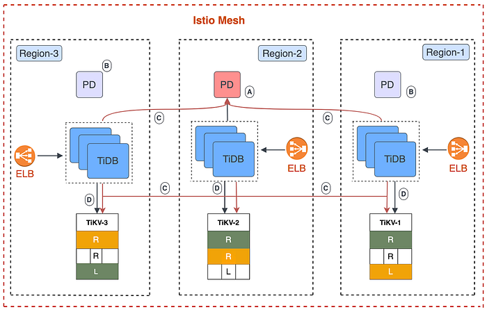
*three region deployment view of Active-Active TiDB deployment with shard replica distribution*

- Color pattern on TiKVs shows the same shard with their replica spread across different tikv nodes.
- Shard replicas are spread across regions in a 1:1:1 ratio.
- L - shows that the specific replica is a leader among other shard replicas.
- R - shows the follower/voter shard replicas.
- As we are not pinning the shard leader to any specific region, the leader can be elected from any cluster in all the regions.
- PD leaders are also not restricted to be elected in any specific region.

## Performance

In this section, we will showcase what we discussed so far.

- Voter pinning rules rearrange the replicas within the cluster, which provides better spread across multi-region setup.
- Performance on a multi-region cluster degrades by 35% to 40%, compared to single-region tests.

### Experiment-1: Voter Pinning

We deployed a TiDB cluster across two regions with voter pinning rules and bootstrapped the cluster with 140GB of data against the cluster capacity of 1.9TB. TiDB created 630 shards (region in TiDB terminology) with 3 replicas each. We use a replication factor of 3 where each shard contains one primary shard, which is the leader and two replica shards, which are the followers.

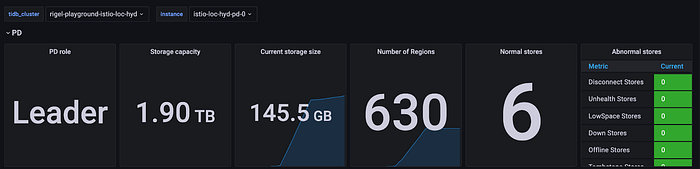

Voter pinning logic enforces placement of two shard replicas to majority cluster and one replica to minority cluster. With 630 shards, the majority region had 1260 replicas while the minority cluster had 630 replicas.

**Majority cluster:**

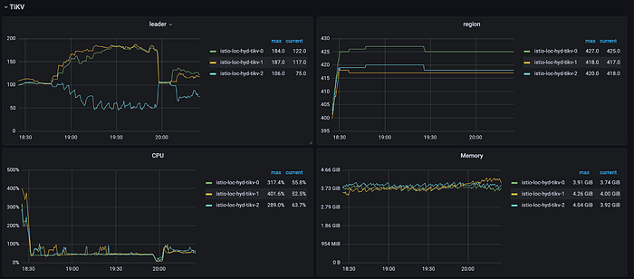

**Minority cluster:**

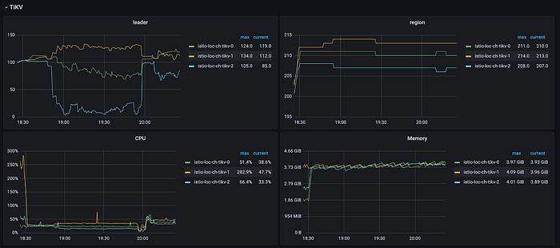

### Experiment-2: Performance Benchmarking

For performance benchmarking using YCSB (Yahoo! Cloud Serving Benchmark), we first setup a single region TiDB cluster with following specifications and later setup a multi-region TiDB cluster with shard pinning.

Benchmarking was done at 6 different thread concurrency for read and updates.

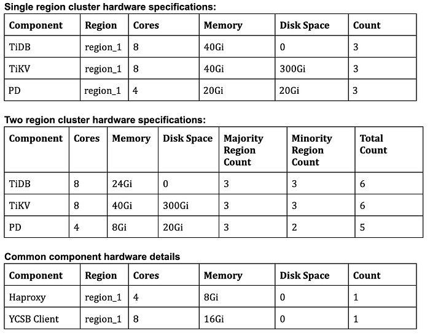

**YCSB workload config**

```
recordcount=50000000
operationcount=5000000
workload=site.ycsb.workloads.CoreWorkload
readallfields=true
readproportion=0.5
updateproportion=0.5
scanproportion=0
insertproportion=0
requestdistribution=uniform
```

**Test Plan**

1. Load **50 million records** into the table.
2. Run the YCSB Workload with varying concurrency 20, 40, 80, 160, 320, 640 and each run comprises a total **5 million operations.**

**Results:**

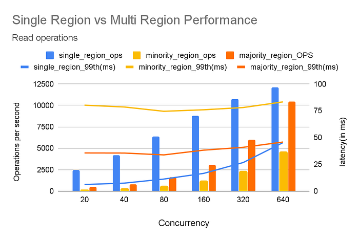
*performance comparison between a single region and two region cluster deployments with read queries.*

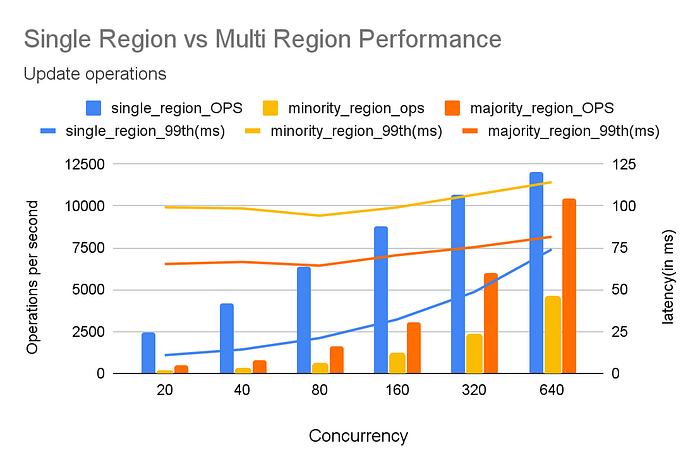
*Update query performance comparison between single region and multi-region cluster*

## Limitations

1. Cluster joining works only on empty databases.
2. Metrics are not unified out of the box. Requires external aggregation with use of tools such as Thanos.

## Conclusion

In this post, we have explored TiDB deployment in a multi-region setting. We discussed read-after-write consistency across multiple regions with tolerance to single region failure. The local presence of the DB endpoints helps the application avoid cross-region calls. With Voter pinning and connection locality, we could solve the problems identified with single-region setup and improve on the multi-region implementation.

At Flipkart, we are live on production with applications, who have benchmarked the multi-region cluster setup with reasonably large volumes and they were able to achieve the performance of above thousands of requests per second and with less than 100ms of latency. At Flipkart, We are continuously adding more use cases that need strong consistency and durability across regions.

_— Thanks to _[_Sharath B P ( Tech - VS)_](https://medium.com/u/129d4fe1959c?source=post_page---user_mention--166c18e3486b---------------------------------------)

## References

1. [https://docs.pingcap.com/tidb/stable](https://docs.pingcap.com/tidb/stable)
2. [https://raft.github.io/raft.pdf](https://raft.github.io/raft.pdf)
3. [https://docs.pingcap.com/tidb-in-kubernetes/dev/deploy-tidb-cluster-across-multiple-kubernetes](https://docs.pingcap.com/tidb-in-kubernetes/dev/deploy-tidb-cluster-across-multiple-kubernetes)
4. [https://docs.pingcap.com/tidb/stable/configure-placement-rules](https://docs.pingcap.com/tidb/stable/configure-placement-rules)
5. [https://github.com/brianfrankcooper/YCSB](https://github.com/brianfrankcooper/YCSB)

---
**Tags:** Tidb · Distributed · Database · Consistency · Availability
