# Predicting your next query even before you type!

E-commerce users often visit [Flipkart](https://flipkart.com/) platform with a wish list in their minds. For instance, you may shop for a tie to wear at your friend’s wedding and also explore the wedding gift options. You may visit the platform multiple times before you find the best buy options.

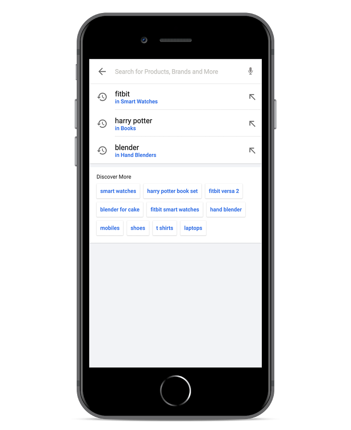
*Flipkart autosuggest’s initiation screen*

On the Flipkart website, when you click inside the Search box, you’ll see a list of **auto-suggestions** that help you plan the best query with less typing effort.

We introduced the ‘**Discover More**’ feature just below the auto-suggestions list, which displays **personalized** **queries** based on user’s past shopping activities on Flipkart**_ _**and some popular user queries across different categories.

---

## Behind the Scenes of auto-suggestions

A shopping journey store captures a typical customer’s shopping journey on Flipkart. Our Extract-T**ransform-Load **(ETL) pipelines capture the search events and the corresponding product clicks from the shopping journey store and aggregate them for a period. This data becomes one input to a Content Generation Framework (CGF). We establish relations between the search queries and multiple related destination queries in the CGF. The CGF writes these relations into a Distributed Key-Value Store so the Autosuggest module can consume them.

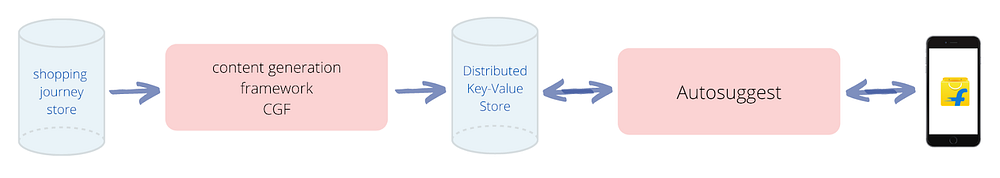

Autosuggest is a stateless service that returns suggestions for a user typed prefix. With changing text in the search box, ‘Autosuggest’ engages relevant suggestion providers, blends their outcomes and returns the final list of suggestions. We use the inferences from CGF in one such provider to render personalized auto-suggestions in the ‘Discover More’ section.

## Understanding the Shopping Journey Store

The searches, product clicks, product views, and purchases etc are some events that help capture the customer’s shopping journey on Flipkart.

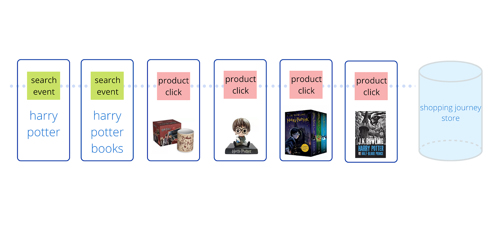
*a sample user journey (L); events recorded for the shown user journey (R)*

## Content Generation Framework — What does it do?

The CGF is the backbone of various contents shown to the users across multiple touchpoints on Flipkart. It enables meaningful conversations with the users to glean their intent better, similar to a shopkeeper interacting with a customer to understand their needs in an offline world.

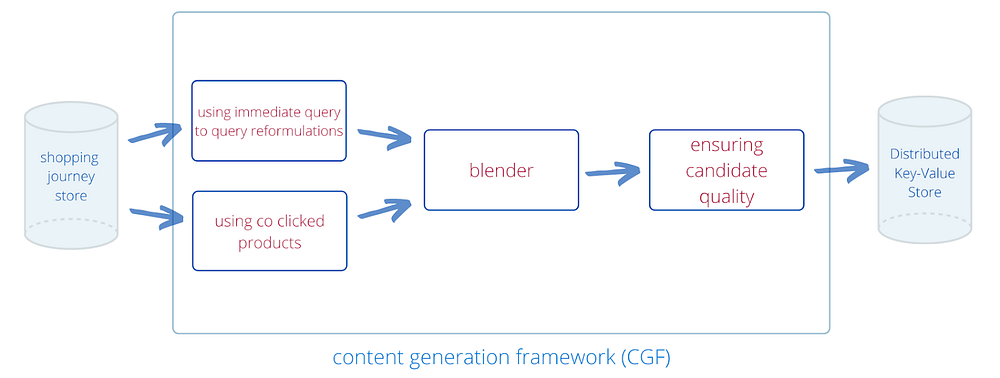

The CGF computes a relatedness score among pairs of candidate queries and ranks the destination queries for each source query based on a function of relatedness score. It operates in the following stages:

1. Finding related queries.
2. Arriving at relatedness-score using blender.
3. Ensuring candidate quality.

## Finding Related Queries

We derive the related queries in two ways :

1. Immediate query to query reformulations in a user session
2. Common (Extent of intersection between) products clicked on the search results page of two different queries: co-clicked products

## Using immediate query to query reformulations

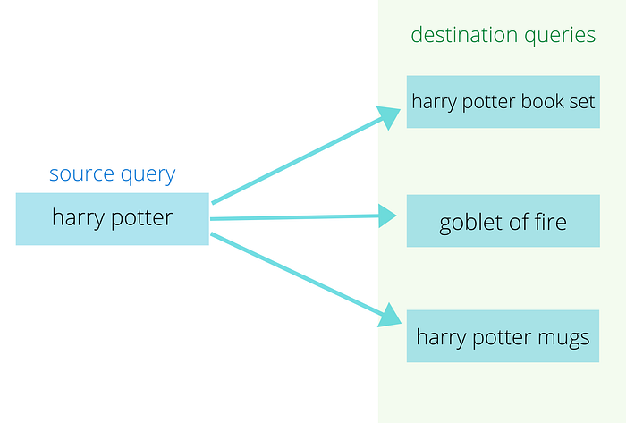
*Representation: Probable destination queries for a source query*

From the user journeys represented as a stream of events, we find the probability of a user reformulating to a next query using the ‘search’ events. For the ‘source query’ → ‘destination query’ pairs which have the same category intent, we compute the probability of reformulating to the ‘destination query’ from the ‘source query’. (Read more about Flipkart’s query understanding [here](https://tech.flipkart.com/whats-in-a-query-slashn-2018-31bd171ed47f)).

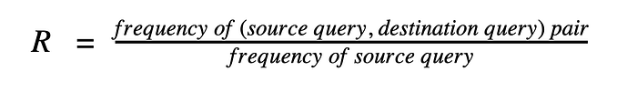

_Where R is the relatedness score of source query, destination query pair_

## Using co-clicked products

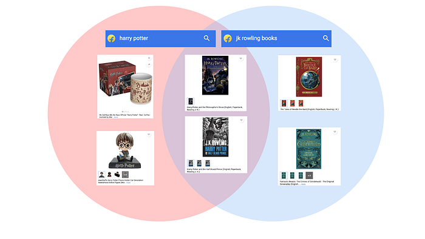
*Common products being reached from different queries on Flipkart*

Co-clicked products are an important signal of relatedness of queries as the users looking for the same set of products may express their intent through different queries. The extent of overlap between product clicks for different queries represents the extent of relatedness between the queries.

The relatedness score is a function of two probabilities :

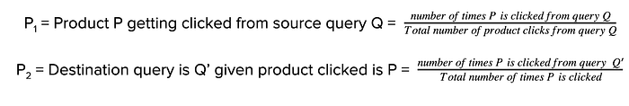

## Arriving at relatedness score with Blender

For the source query **harry potter**, we merge the candidates from the two sources as shown below, to arrive at a blended result with final scores.

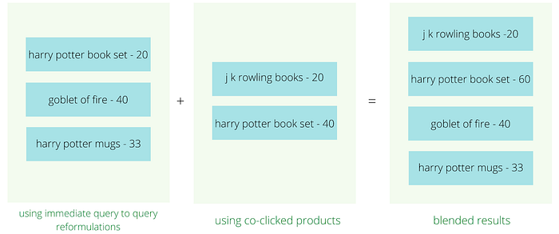

While the current blending function weighs both sources equally, it is expected to evolve towards a weighted function with machine learnt weights.

## Ensuring candidate quality

This phase eliminates poor quality queries to arrive at the final pool of related queries in the following steps:

## Spell Correction

Often, queries in the actual user journeys are prone to misspellings, as the user may have written in a hurry, is unaware of the spelling, or may not be proficient with the spellings in the language. All query candidates go through Flipkart Search’s Semantic Spell Module (read more about it [here](https://tech.flipkart.com/adapting-search-to-indian-phonetics-cdbe65259686)) to rectify the misspelled queries.

## Deduplication

We eliminate the duplicates or similar query suggestions. The current version of deduplication considers the following kinds of query duplicates :

- Same stemmed tokens → ‘shirt for boys’ ~ ‘shirts for boy’  
(We use [porter stemmer](https://tartarus.org/martin/PorterStemmer/) here)
- Same character stream → ‘backpack’ ~ ‘back pack’

Among duplicate queries, we retain the one that has better relatedness score with the source query.

For example, in a source query, out of the 10 destination queries, if there are two duplicates, then we’ll retain only the one with a higher relatedness score from the two.

**school bag → (backpack, 80), (back pack, 50), (barbie school bags, 40), **.

Here, ‘back pack’ is eliminated from the list of destination queries as its score 50 < 80 (that of the corresponding duplicate query).

## Performance Check

We fetch the historic performance numbers (click-through-rates, popularity, etc.,) of all destination queries and eliminate the ones that do not meet certain threshold values (based on historic distribution). This way, we ensure users see the apt search results which assist in the ‘buy’ decisions.

The following is a representation of the chosen related queries for a source query:

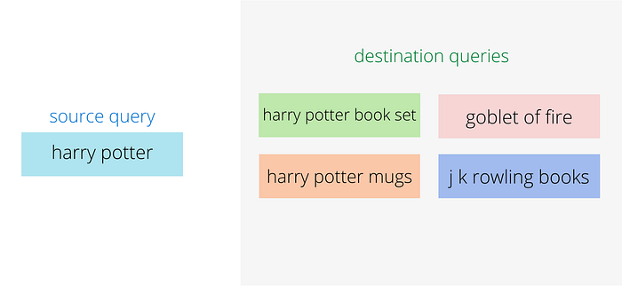
*Representation of destination queries for a source query — Related Searches*

The CGF module operates as a series of[ Spark](https://spark.apache.org/) jobs in our ETL pipelines that are orchestrated via[ Airflow](https://airflow.apache.org/) and their frequency is determined based on freshness requirements of the result and how rapidly the input signals change. These jobs run over Flipkart’s Data Platform — FDP (read more about FDP[ here](https://tech.flipkart.com/overview-of-flipkart-data-platform-20c6d3e9a196)).

## Understanding the need for Distributed Key-Value Store

The CGF operates as ETL pipelines with the output saved in HDFS. The scale of this data is about 10s of million rows. This section addresses how this data is made available for Autosuggest’s service to be consumed with each applicable request.

For data consumption by an application, we needed to transfer this data from HDFS to another data store that could support the scale of data size, rate of requests coming from Autosuggest, and the latency constraints.

We chose the data store on the following constraints:

1. Data retrieval should be fast enough to meet with Autosuggest’s latency constraint of single-digit milliseconds.
2. The data store should be scalable in terms of the size of data it can store and requests per second (RPS) it can serve.

While in-memory alternatives such as Guava Cache can adhere to constraints of high RPS and low latency, these cannot scale for the size of data we get from the CGF. We thus concluded on using a distributed key-value data store which meets our needs on scalability, latency, and availability.

The distributed key-value data store is updated with the latest data from the CGF periodically. Let’s find out how this data is employed to render the ‘Discover More’ suggestions in Autosuggest.

## Personalising ‘Discover More’ in Autosuggest

Consider a user who has searched for — blender, Harry Potter and Fitbit, in the recent past. When the user opens Flipkart app and searches, we’ll show her the following suggestions:

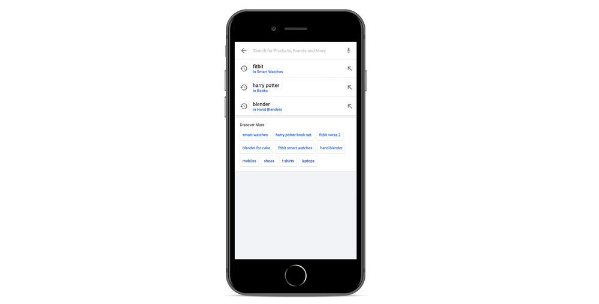

Let’s see how the Autosuggest feature arrives at ‘personalized’ suggestions and present selective query suggestions in the **Discover More** section.

The suggestion providers in Autosuggest that get engaged when the user has just tapped on the search box are:

1. Personalized Suggestion Provider (PSP)
2. popular suggestion provider

A lightweight core layer aggregates the suggestions retrieved from multiple providers, handles presentation of all suggestions retrieved and returns the end results for the user.

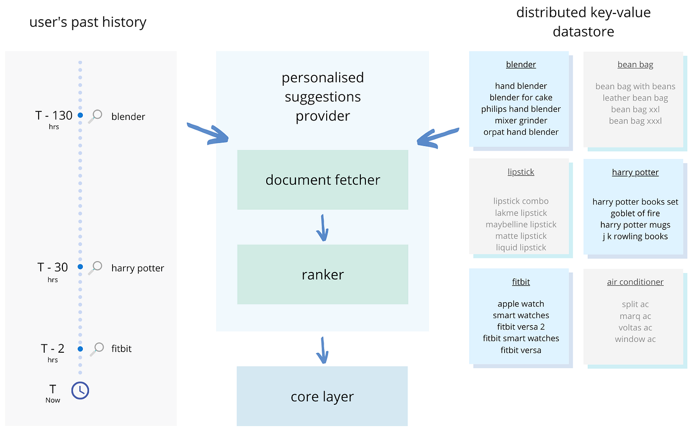

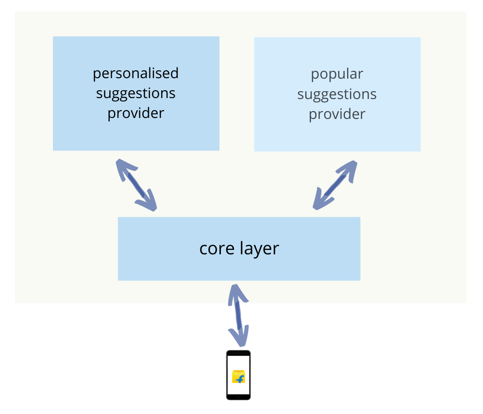
*Autosuggest’s internal working to derive personalised suggestions for ‘Discover More’*

## Knowing the user’s search history

Personalized Suggestions Provider (PSP) takes in relevant search history as input to process the list of personalized suggestions. Whenever a user performs any activity on the Flipkart app, we push it to the local activity queue on their devices and get the user’s history attached with each request from the device. This removes the overhead of interacting with another service for past activities of a user.

Before consuming the information we filter out only recent and relevant activities that can be made available to Autosuggest in the API request.

We may not know the user’s app activities on her other devices. This is a known trade-off that won’t exist when our user-context store gets ready.

## Working of the Personalized Suggestions Provider

The PSP has the following components:

- Document Fetcher
- Ranker

## Document Fetcher

This component uses the user’s search history for each request. It also fetches the corresponding related searches along with their relatedness score from the distributed key-value store.

Our offline analysis shows that a typical user has about 15 relevant history activities. When we make a bulk ‘get’ call to the distributed key-value store about 99.5% of the requests take less than 4 milliseconds to fetch CGF insights. This network call to the data store happens on an isolated thread pool. The overall autosuggest system is fault-tolerant as it isolates failures on the distributed key-value store by a typical bulkhead pattern ([Hystrix](https://github.com/Netflix/Hystrix), here).

## Ranker

All documents retrieved by the fetcher are passed on to the online ranker for relative ranking of destination queries got from those documents.

The ranking currently is a function of the relatedness score and recency of the query. We do an exponential decay over the scores based on the time since the event accounted for the recency signal. The weights for these signals are heuristically derived. The top k ranked queries become the output of PSP and are returned to the lightweight core layer.

## Arriving at Results using the Core Layer

The core layer of autosuggest fetches suggestions from PSP and ‘Popular Suggestions’ from another provider. These are blended based on the priority of the providers for a request and ranking scores from the respective providers. This blended set is then handed over to the components that handle the user facing rendering of the ‘Discover More’ section.

## Sample Results

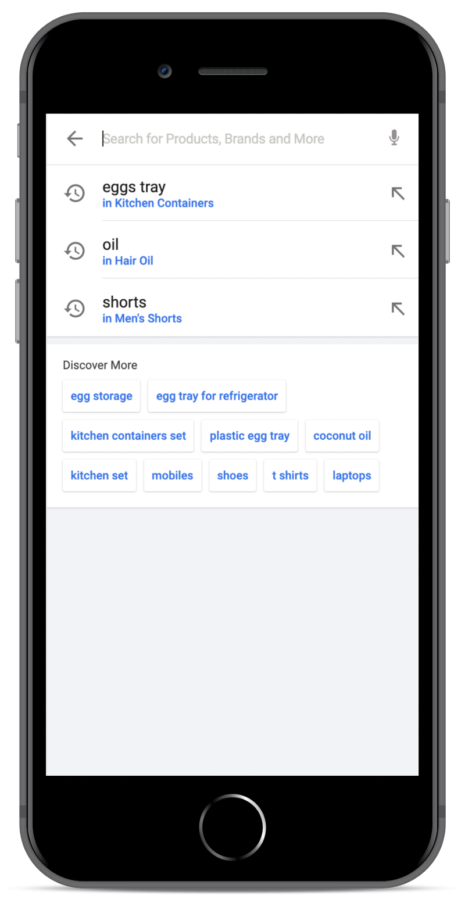

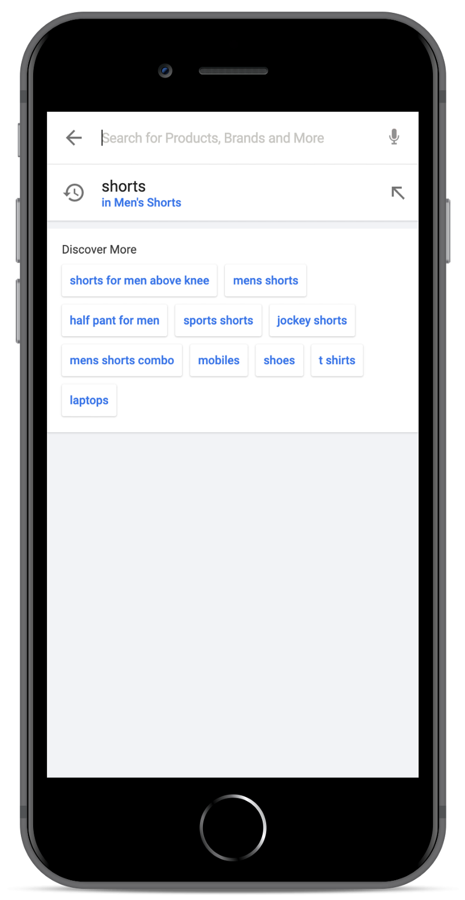

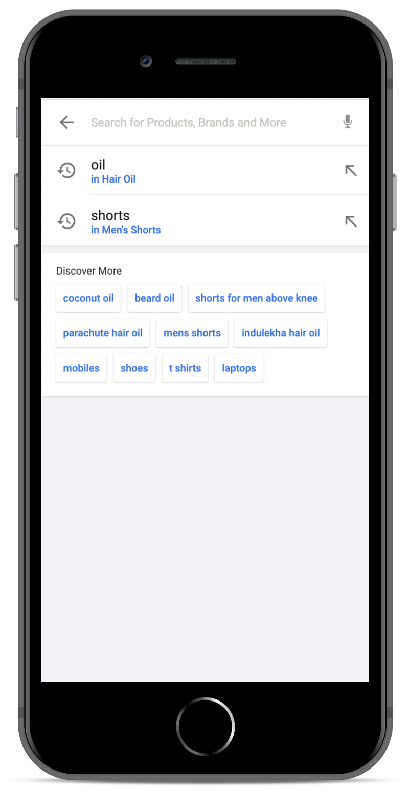

## Conclusion

The knowledge of globally related searches is relevant for multiple features powering discovery on Flipkart. We’re experimenting with ML models and distinct features to compute the relatedness score , beyond just the query-to-query reformulations and co-clicked products.

For ‘Discover More’ in Autosuggest, matching feature will be capable of:

- handling typing errors in the users’ search history.
- understanding semantic similarities among candidates.

We are looking at moving Online ranking from heuristically derived weights to machine-learned weights. In addition to relatedness score, we plan to include features such as a user’s demographics, location, and affinity towards attributes such as brand, and colour to curate the best autosuggestions for the users.

> _Authored by _[_Pranjal Sanjanwala_](https://medium.com/u/a1343b3b9841?source=post_page---user_mention--83487a34109d---------------------------------------)_ & _[_Ritam Mallick_](https://medium.com/u/f62214407fe0?source=post_page---user_mention--83487a34109d---------------------------------------)_ who are engineers in Search Autosuggest team at Flipkart._

---
**Tags:** Backend · Search · Ecommerce · India · Startup
