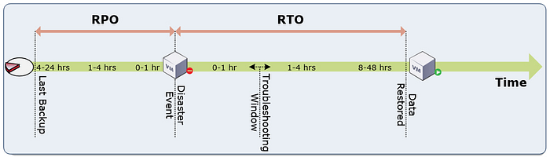
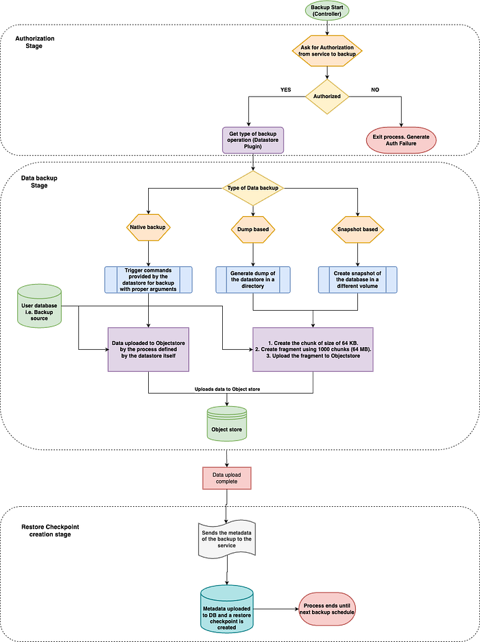
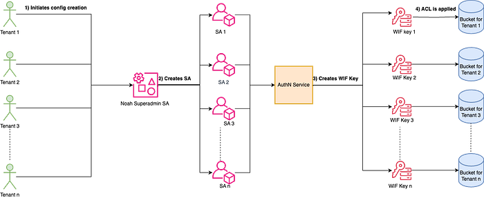
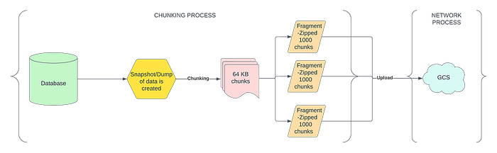
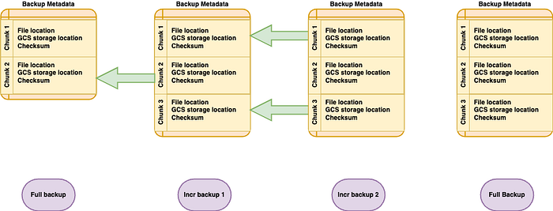

# Providing Backup and Disaster Recovery as a Service

## Introduction and Context

_‘_**_A great flood is coming_**_’ _— this is what Noah said when he knew that an apocalyptic flood was coming to destroy everything, and eventually saved the world with his great Ark.

Flipkart experienced a similar story in December 2015 during Chennai floods. It was a disaster that disrupted the lives of 3 million families, took 500 lives, and created an estimated loss of 3 billion USD. Back then, Flipkart operated through its data centers in Chennai. The floods affected the functioning of our data center in Chennai, leading to unprecedented downtime. This got us thinking along the lines of how quintessential a backup system can be.

No one can predict the occurrence of such colossal disasters. Huge organizations like Flipkart need to have layers of protection for their data against system disasters, acts of god, manual errors, etc. Implementing a robust backup system is also crucial for safeguarding data against potential loss, corruption, or cyber threats.

We understood that a disaster recovery solution not only needs to protect data but also must provide a way to identify quickly where backup data exists, the last backup checkpoint in the event of an emergency, as well as to restore that data efficiently to the right location.

This article is about Flipkart’s disaster recovery solution, BRaaS (Backup & Restore as a Service), as we call it. It is a managed service where a secure off-site cloud repository stores the data. It takes care of all the aforementioned necessities of a great disaster recovery solution.

## Scale of Flipkart

Flipkart, being one of the largest e-commerce companies, deals with a massive amount of data. We store data across 14+ different data stores such as MySQL, Redis, and Elasticsearch.

We do more than 7k backups every day across 1500 active configurations, moving approximately 500 TB of data every day.

Considering this scale and diversity of data, we had to build some in-house backup systems to ensure disaster resilience of these systems.

Hence we designed **Noah**, an integrated solution for all the backup woes inside Flipkart.

## Key terminologies to understand

### RPO — Recovery Point Objective (RPO)

RPO is the measure of permissible data loss within a stipulated time in the event of a disaster. In other words, the interval of time before the quantum of lost data exceeds the BCP’s maximum allowable threshold or ‘tolerance’.

### RTO — Recovery Time Objective (RTO)

It is the maximum acceptable amount of time for restoring a backup and regaining access to data after an unplanned disruption. In other words, how quickly can one recover from a disaster?

## Types of backups

- **Full backup **— Backs up the whole data of the cluster.
- **Incremental backup**- Backs up only the data that has changed since the last backup.

## Ways of Data Backups

The huge ecosystem of Flipkart has different types of data stores, which backup data in different ways:

### Snapshot/Dump based backups

**a) Snapshot**

In data stores like MySQL, we take a point-in-time snapshot and then back up the data. Reference: MySQL ( [MySQL backup strategy](https://dev.mysql.com/doc/refman/8.0/en/backup-types.html) ).

**b) Dump**

These include Aerospike, Zookeeper, etc where we take a dump of the data store and the backup of the directory that stores the database dump.   
Reference: Aerospike ( [Aerospike backup strategy](https://aerospike.com/docs/tools/backup) ).

After the file list is created, Noah takes up the responsibility of moving the files to the object store.

### Native backups

In datastores like Elasticsearch, HBase, etc., where the datastore itself provides a way to do the backup natively, our program will just act as a scheduler for the backups.

Reference: Elasticsearch ( [Elasticsearch native support for backups](https://www.elastic.co/guide/en/elasticsearch/reference/8.11/repository-gcs.html) ), Hbase ( [Hbase backup](https://hbase.apache.org/book.html#backuprestore) )

## Challenges / Expectations from BaaS in Flipkart

For such diverse data stores, we needed a generic backup solution where in the event of disaster, we could abstract the restoration process to a single interface, bringing better user experience and stability to the backup ecosystem.

We had to meet the following expectations:

### Scale

_How to back up over 500 TB of data across thousands of backups per day?_

We run around 7000 backups from over 3000+ Virtual Machines daily. During festive times, mostly BBD (Big Billion Day), the size of the data grows at a rapid pace. The system has to be robust and optimized for storage utilization so that the constant backup operations themselves do not :

- generate any load on the tenant servers.
- hamper the real-time operations.

### Usability

We need the backup service to be generic, automatic, and supportive of multiple data stores without pre-processing. It also means that a single system should be able to support dump, snapshot, native, full, and incremental backups.

### User Experience

With many teams getting onboard BRaaS, onboarding should be simple with easy access to dashboards, APIs, and reports. It is also important to provide automated maintenance and timely alerts.

### Easy Restorability

_What is the use of BRaaS if the user cannot restore their systems easily in case of a disaster?_

Hence, the restoration process should be self-serve and should require minimum interaction from the team maintaining the BRaaS and lead to lower RTOs as well.

### Reliability

Backup systems need to be as reliable as possible. The backups also needed to be highly available and restorable. We ensure auto-restoration of some backups periodically to ensure the integrity of backups. We also mock the disaster scenarios in-house to verify the backup system’s integrity.

## Flipkart’s BRaaS

Almost all the Flipkart data stores use a BaaS service. Considering the amount of data being generated daily, any single disaster can lead to a huge financial loss.

In Flipkart, a BaaS system has the following components:

**1) Noah Packages**

We install the following packages in a bundle in each VM from where the data needs to be backed up:

- **Core — **It has all the basic components such as abstraction layers and core SDK components that are common to all kinds of data stores.
- **Controller — **It is a processing layer between the core and plugin packages responsible for mediating the backups. It redirects requests according to the data store plugin-specific logic.
- **Datastore plugin** — There are as many plugins as the number of data stores we support. These plugins have Data store-specific code and support the native commands and logic.

**2) Service**

It is a single service to do CRUD operations on the metadata of all the backups. It is also responsible for the authentication and authorization of VM packages for a backup/restore.

You can refer to the diagram below to understand how the interaction between packages and services.

## Backup Process

Let’s quickly look at the high-level architecture of the backup system in Flipkart. This overview will help us understand the process and components inside the system.

Noah's backup system works in three stages —

### 1) Authorization Stage

The team owns the configuration. In a cross-functional system, it is necessary to ensure that one team does not use the other’s configuration inadvertently to take the backup. We need to verify if each configuration is linked to a specific Virtual Machine in the config owner’s jurisdiction.

Before any backup, the agent sends the instance metadata regarding the virtual machine to the service, to ask if the backup can be taken on the same VM. If the request is validated, the service returns a token. This authorization token is used to create the restore checkpoint in the later stages.

**_But, How do you make sure at the object store level, the segregation of data across config is maintained and that the data is not compromised from the external network?_**

For this, we use **Service Accounts** and link each config to a single service account. A bucket is created for every configuration. The Access Control Lists (ACLs) restrict the access to each bucket to the Service Account for a specific config.

To protect data from external access, we use **Workload Identity Federation, WIF**. We have created a mediator layer between the Object store and VMs which identifies the origination of the requests and validates it for usage authorization.

### 2) Data backup Stage

The actual backup happens in this stage and involves the following steps:

**— Pre-backup preparation according to the type of backup**

- According to the type of backup (dump, snapshot, or native), the datastore plugin may require a few prerequisite steps. For example, in a snapshot-based backup such as in MySQL, the agent takes a snapshot of the data volume.

**— Chunk and upload to offsite storage**

- In this stage, we perform the main backup. We would already have our dump or snapshot ready with us. The agent now starts the chunking process and starts uploading the blocks to the offsite cloud storage.

**Chunker** breaks down large files into 64KB consistent-sized chunks. These smaller chunks, often referred to as blocks, are merged into fragments and then individually processed, transmitted, and stored. This approach offers efficient data transfer and also allows us to have incremental backups.

Datastores that support native backups have their support of chunking and uploading to object-store.

- For incremental, we make sure that only the updated data gets uploaded. We maintain metadata at the chunk level to keep track of the latest changes.

### 3) Restore checkpoint creation Stage

This stage is the metadata collection stage. After each backup, it’s important to register the backup time as the latest restore checkpoint. Hence, we collect the offsite blob information related to that specific backup and store it in our database. This is used later during the restore to list out all the restore checkpoints available for restoration.

## Restoration Process

Restoration requires the list of available restore checkpoints and a way to combine the chunks uploaded to the offsite storage and create a file.

**_During backup for a non-native data store, we break the files into chunks of 64 KBs. So how do we find which chunks to merge and create the original file? How are we able to restore the incremental updates independently?_**

Well, this is done using checksums. We store all the building blocks of each file as a manifest which helps to collate the list of all chunks to build up a file. These chunks can be spread across incremental backups.

## Conclusion

The backup system usually stays in the backseat of any system, but when it is required, it becomes the most critical component. These systems need to be reliable as they can’t afford disasters.

At Noah, we have made sure that our system is independent of any other system so that in case of disaster we can support our users without any dependency delays.

We are improving further to provide as little RPO as possible. More work is also in progress to build a data lifecycle manager to improve cost and storage usage.

---
**Tags:** Backup And Restore · Backup · Backup Software · Ecommerce · Flipkart
