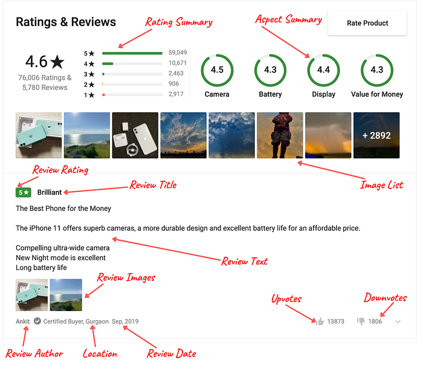
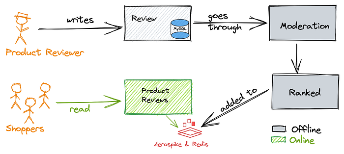
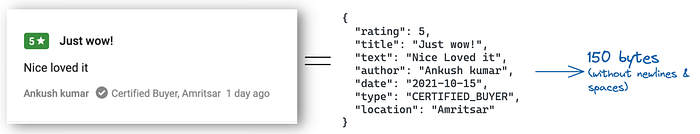
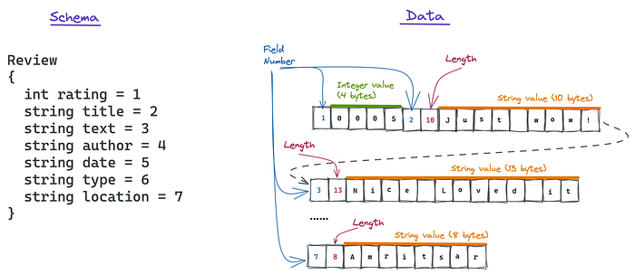
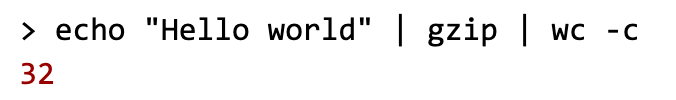

# Ratings & Reviews @ Flipkart [Part 1]

As with all other e-commerce websites, in Flipkart, ratings and reviews play an integral role in helping a customer buy a product with confidence.

In Flipkart, we have millions of products and hundreds of millions of product reviews. We also have millions of customers shopping the product and writing and reading reviews not only in English but also in various other vernacular languages such as Hindi, Tamil, Marathi etc. This blog captures the key architecture of the Ratings & Reviews system and also describes some of the learnings from a recent revamp performed which gave us a data size reduction of over **90%** and an increase in throughput of over **5x**.

## Ratings and Reviews — an Illustration

*Ratings & Reviews — Illustration*

Ratings & Reviews (RnR) is given for a particular product. The primary entities are

1. Review — This is the actual review written by a user. The review is composed of a Rating (1–5 stars), a title, review text, author name, author location and the upvotes and downvotes.
2. Rating Summary — A histogram of the count of 1-star to 5-star ratings along with the overall rating.
3. Images — A consolidated view of multiple images across all the reviews for a product.
4. Aspects — These are finer pivots about the product components/features/elements (eg. Battery, Display, Camera) which have their own Rating (1 star to 5 stars).

## RnR — High-level architecture

A customer writes a review or provides a rating. As part of the review, a customer may also upload images. The review is stored in a durable datastore. It then goes through a moderation pipeline, which is a combination of ML and human moderation. Once the moderation and review approval are complete, we use an ML algorithm to rank the review. The up votes and down votes and data in the review help decide the Ranking. The ranked reviews are then shown on the product’s page for other customers to view..

*Review Lifecycle*

As with any e-commerce company, the number of reviews a customer writes is significantly smaller than the number of reviews a customer reads. This directly translates into the RPS of the read and write flows. The write flow is around a few hundred RPS and the reads are a few **hundred thousand** RPS. (100 vs 100000 for writes vs read). Also, the latency to fetch reviews needs to be significantly lower (10ms) compared to the latency required to write a review (300ms). So the system needs to scale for high-throughput low latency reads.

To support the reads & writes, the architecture follows a [CQRS](https://martinfowler.com/bliki/CQRS.html) pattern. We store the reviews written by a customer in an [RDBMS](https://en.wikipedia.org/wiki/Relational_database) system. To serve the reads, we use a [KeyValue](https://en.wikipedia.org/wiki/Key%E2%80%93value_database) (KV) store. The KV stores contain “[materialised views](https://en.wikipedia.org/wiki/Materialized_view)” to serve the reads at scale (eg. Top 10 reviews for a product are materialised and stored in the KV store).

## RnR data optimisation — why?

The ‘Read’ data was served from a combination of Aerospike & Redis. Aerospike stored the review information (Key — ReviewId, Value — Review Details) and Redis housed the complex data-structures such as ‘sorted sets’. The materialised views of the data stored in the KV stores enabled us to scale to the throughput requirements at low latency.

Flipkart is now available in multiple vernacular languages like Hindi, Tamil, Marati etc. and to enable customers to read the reviews in vernacular languages, we machine translate the reviews in the vernacular languages. This further increases the number of reviews. Assuming a 5x increase in the number of reviews and the launch of 15 vernacular languages, our review data will increase 75x. The data to serve for reads was stored in memory in KV stores and was a few terabytes in size. A 75x increase will make it a few **hundred** **terabytes** in size. With such a lot of data to handle, we needed to re-look at how we stored and served the reads.

We used multiple strategies to optimise the data. Here is a quick look.

- Data Cleanup
- Data Serialisation
- Data Compression
- Data deduplication

## Data Cleanup

The first step at optimising the data was to clean it up and remove unwanted fields from the data. The low-level design had a uniform interface for both the read and write path. This meant the POJOs were common for the ‘Read’ and ‘Write’ path. To store the data in a KV store, the entire POJO was serialised. This increased the data size, and we found certain fields stored in Review were never used in the ‘Read’ path (E.g. AccountId).

As a primary step in data optimisation, we removed the unused fields and with minor code refactoring, we could reduce the data size by around 10%.

**_Our learning: _**_When data grows, data size is more important than uniform Read and Write interfaces._

## Data Serialisation

We wanted to re-look at how the data was stored in the data stores, which led to better understanding of data serialisation.

### Understanding data serialisation

Serialising means representing the data in a linear byte array. Byte arrays can be stored and passed through the network. The most common way to serialise data is to convert it to a string. Strings are char arrays which are essentially byte arrays. We use different serialisation formats to represent the data as a String (e.g. JSON, XML). JSON is the ubiquitous human-readable serialisation format.

Let’s take an example of review data and see how it is serialised as a JSON.

*JSON Encoding of a Review*

As seen above, the JSON representation of the above review takes around 150 bytes. This serialised data can be stored in any storage system. While this is human readable, it is quite verbose and slow to parse. Let’s see if we can optimise this further..

In the example, the field names take up 60 bytes, which is ~40% of the space. If the schema is fixed, then we can keep it separate from the data and save space. This is exactly what new serialisation formats such as [Avro](https://avro.apache.org/docs/current/), [ProtoBuf](https://github.com/protocolbuffers/protobuf), and [Thrift](https://thrift.apache.org/) take advantage of to reduce the serialised data size.

If you are unaware of how Avro, ProtoBuf or Thrift work, the following illustration might help.

To serialise the above data, let’s first define a map which has a field name — number/ordinal mapping. We will call it the schema. Now, instead of using semicolon, comma, double quotes to demarcate fields and values, we keep the length of the value of each field encoded in the data and use it to demarcate them. For the above example, the schema and data will look like this:

*Separating Schema & Data*

Here, we use a single byte to represent the field number. We also use a single byte to represent the length of the value wherever necessary (for integers, length of the value is known as 4 bytes). We can read this byte array byte by byte and, using the schema, we can deserialise the data. In this representation, the size of the data is 85 bytes, which is a 44% reduction in data size.

The illustration given above is a rudimentary representation of the serialisation without considering multiple aspects such as complex data types, enums, decimals. We also need to look into how schemas can evolve, be backward compatible, and accommodate optional values, etc. These issues are solved by the serialisation formats such as[ Avro](http://avro.apache.org/docs/current/),[ ProtoBuf](https://developers.google.com/protocol-buffers/) &[ Thrift](http://thrift.apache.org/) etc.

As the data is not human readable and is encoded in binary, these formats are also called _binary formats_. They have rich support for complex data types, schema versioning, and also have serialisation and deserialisation libraries, in various languages such as Java, Python, and Go.

## Review Encoding

We used the binary format Avro, to serialise our data. While all binary formats naturally reduce the data sizes, choosing the right data types and configurations maximise the encoding benefits of binary serialisation..

The following strategies can help optimise the serialisation further.

1. **Use ENUM types rather than Strings** — ENUMs occupy significantly less space compared to String values. For example, a review contains information about the City and State of the reviewer. We modelled State as an Enum. The field State is now stored as a number between (1–35) that can be represented in one byte. If stored as a String, even the smallest state name “Goa” would take three bytes. Consider the size reduction when you store a longer State name such as “Andaman and Nicobar”. Avro schemas are [versioned](https://martin.kleppmann.com/2012/12/05/schema-evolution-in-avro-protocol-buffers-thrift.html) and hence if a new State is added, we can make a version of the schema to add the new State data in the ENUM.
2. **Use Integers wherever possible **— Integers and Long values are written using[ variable-length](https://lucene.apache.org/java/3_5_0/fileformats.html#VInt)[ zig-zag](https://code.google.com/apis/protocolbuffers/docs/encoding.html#types) coding. This[ reduces](https://avro.apache.org/docs/current/spec.html#Data+Serialization+and+Deserialization) the number of bytes taken by an integer when we are dealing with small integers.
3. **Specify the precision for decimal values **— In most cases, we might not require decimal values to the greatest precision. For instance, the rating requires a maximum precision of two digits. Lesser the precision, the lesser the size required to store the decimal value.
4. **[Extreme] Optimise the way Ids are stored **— This is an extreme optimisation. All our ImageIds have a common prefix followed by the year, month and date. E.g. `blobio-2019–06–25-<uuid>`. The prefix and date are 17 characters long, which takes up 17 bytes. To reduce the size, we converted `blobio`to an ENUM (so that we can add more prefixes) and converted the date to a number (days since 1st Jan 2000). This would need 3 bytes (1 byte for ENUM & 2 bytes for int date) as compared to 17 bytes if they are stored as Strings. However, this needs to be carefully done with fallbacks.

Using Avro and the techniques mentioned above, we could reduce the size of review data by **70**%.

**_Our Learning:_**

- _Instead of storing the data in KV stores as JSONs, if we store the data in a binary format, there is significant reduction in data size and parsing times. This holds true even for passing the data from one service to another._
- _Using ENUMs, Integers and decimals with precision, we can further reduce the encoded data size._

## Data Compression

In text messages, _IMHO_ (In my honest opinion), we compress text all the time. Apart from using abbreviations, we also use other techniques like omitting or replacing characters as in “_C u l8r_”.

Computers can also compress the data and there are multiple compression algorithms available. Before choosing a compression algorithm, it is important to understand the type of data being stored and choose a compression algorithm which works well for that type of data. Choosing the right compression algorithm will help reduce the size better and sometimes choosing the wrong algorithm could potentially even bloat up the data.

*Gzip compression of 11 characters (bytes) leads to 32 bytes*

Some algorithms are good with textual compression, while some others are for general binary compression. We used a combination of algorithms to get the best of both worlds.

- For the review text, we used [Shoco](https://ed-von-schleck.github.io/shoco/). Shoco performed better w.r.t to both performance and speed of textual data.
- We used [Snappy](https://github.com/google/snappy) to compress the entire serialised data in Avro. Snappy worked well to compress binary data.

A combination of Shoco (11%) and Snappy (25%) reduced the size of our reviews by **35**%. Since we also used the right compression algorithms for the right type of data, the latency of compression and decompression was also quite low and insignificant (~microseconds) compared to our service latencies (~milliseconds).

**_Our Learning: _**_While using any compression algorithm is usually good, understanding the type of data being stored and choosing a compression algorithm which works well for that type of data can provide better benefits._

## Conclusion — Part 1

The above three strategies reduced our overall size by around 60%. We did not stop and went further to reduce the overall size by over 90% using various other strategies. We optimised the storage of common data types such as text, UUIDs & Integers. We also came up with interesting ways of performing sorting and filtering. All of this is covered in the subsequent article on this series. [Rating and Reviews @ Flipkart, Part 2](./ratings-reviews-flipkart-part-2-574ab08e75cf.md)

---
**Tags:** Java · Software Engineering · Scalability · Encoding · Data
