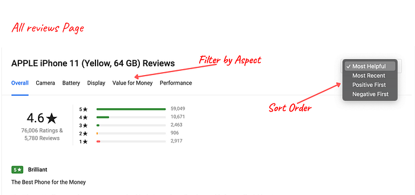
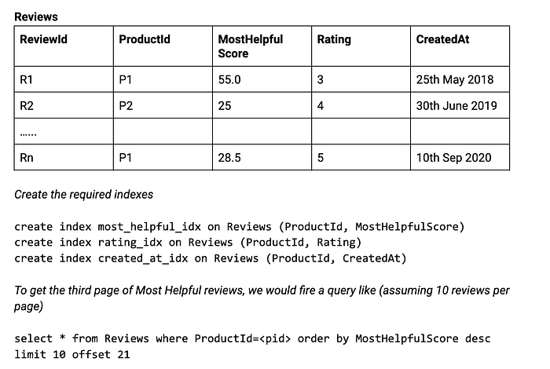
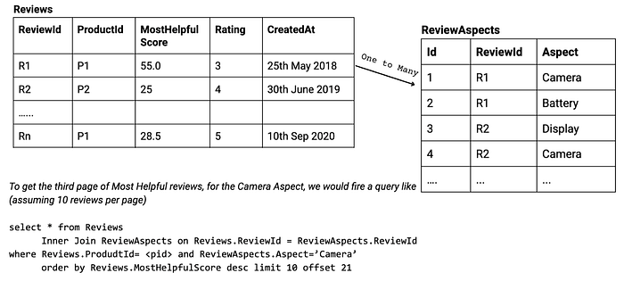
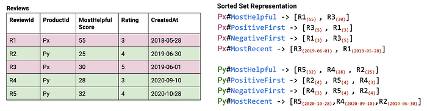
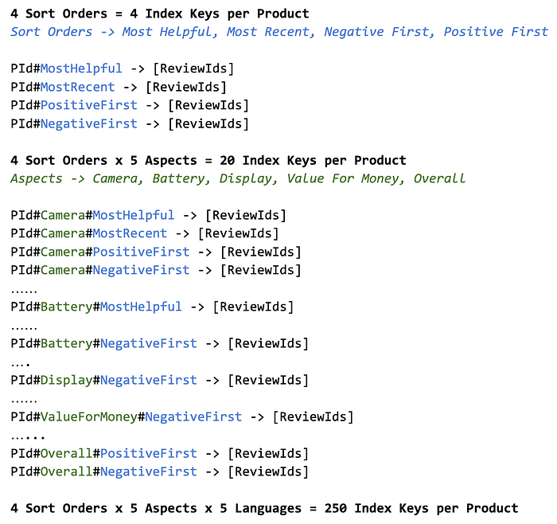
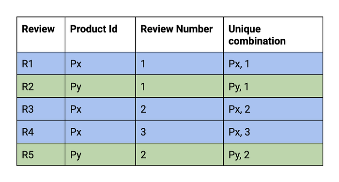
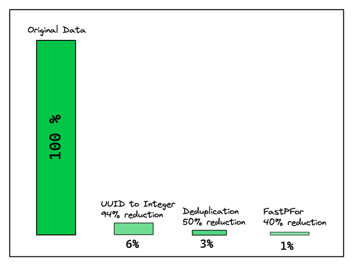
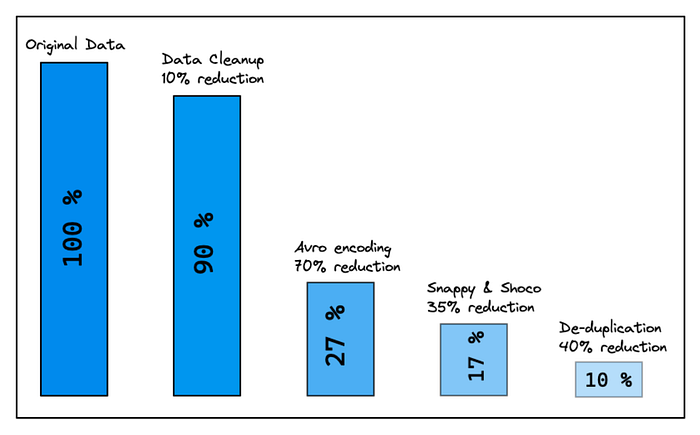
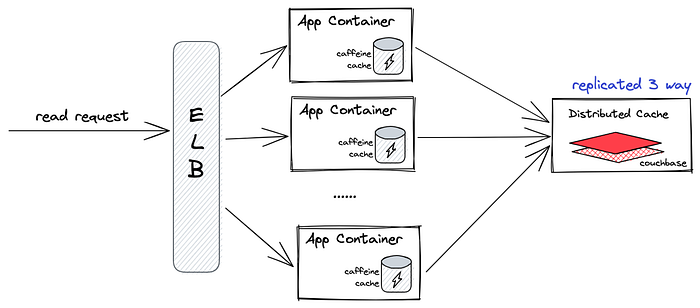

# Ratings & Reviews @ Flipkart [Part 2]

This article follows from the [Ratings & Reviews @ Flipkart [Part 1]](./ratings-reviews-flipkart-part-1-797aa3687109.md). In the previous article we discussed about the architecture of the Ratings & Reviews ecosystem, the need for optimisation and some strategies used to reduce the data size.

This article discusses the optimisation around sorting and filtering of reviews and data deduplication, and closes with the road ahead.

## Sorting & Filtering reviews

In the Flipkart product page, the customers can sort reviews by “Most Helpful, Most Recent, Positive First, and Negative First”.

*All Reviews Page — An Illustration*

To see reviews specific to an Aspect such as Camera or Battery of a product, customers apply these filters on the Aspect. This can be thought as a common paginated Sort & Filter problem.

## RDBMS Solution

In a traditional RDBMS system, we will have a table with the Review details. Let’s first solve for sorting. We will create[ composite indexes](https://dev.mysql.com/doc/refman/8.0/en/multiple-column-indexes.html) on the ProductId and the fields/columns we want sorting on and then use the[ limit & offset](https://dev.mysql.com/doc/refman/8.0/en/select.html) capabilities of SQL SELECT statements to support pagination.

*Pagination using RDBMS*

Pretty simple right! Now lets solve for Filtering.

A review can talk about multiple Aspects such as Camera, Battery & Display. If we have a column/field named `Aspect`, we need to add multiple values into it for a single review. To address this requirement, we create another table ‘Review Aspect’ with one row for each ReviewId-Aspect combination and join it or, create multiple rows in the Reviews table itself._ If you are thinking that we could dump all the values as a comma separated list in the column and perform a %LIKE% query, stop thinking right now!_

*Sort & Filter using RDBMS*

This does[ not scale](https://www.eversql.com/faster-pagination-in-mysql-why-order-by-with-limit-and-offset-is-slow/) for our read requirements and can also have performance issues for offset based queries. This coupled with JOINs is not the most optimal solution for our use case.

Here’s what we did to resolve this issue better. We used[ Sorted Sets](https://redis.io/topics/data-types#sorted-sets) data structure provided by Redis. In a Sorted Set, every entry has a score associated with it and the set is sorted based on the score of the element.

We create a Sorted Set for each Product, Sort Order combination to support the sorting requirement. The Set contains a list of reviewIds along with the value of the corresponding sort pivot.

*Sorted Set Representation of Pagination Index*

Lookup on the sorted set based on Index, is an O(1) operation. which makes it scalable to perform offset and limit based pagination queries.

When a pagination query is received here’s what happens:

1. Identify the Sort Order in the request.
2. Construct the key to query Redis.
3. Get the list of reviewIds from the corresponding Sorted Set based on the required offset.
4. Perform a bulk call on Aerospike with the reviewIds to get all the Review detail information.

While this is optimised for Reads, it has the following issues.

1. The list of indexes should be known beforehand — This is a fair expectation to have for a read-heavy system.
2. The number of Keys in Redis might increase if filtering pivots are added — To support the Sort & Filter by Aspect use-case described above, we will need to create a Sorted Set for each Aspect & Sort Order combination. When a customer browses in a vernacular language, we also need to apply a language filter while displaying the reviews. The keys in Redis become a cross product of Language x Aspect x Sort Order. This can easily explode.

*Sorted Set Explosion*

While this is a scalable approach, the size of the data in Redis storing these pagination index information is around half a terabyte and growing, as more Aspects & Languages are added. We needed to optimise the storage of these values. Before we dive deep into how we optimised these values, let’s understand UUIDs better, as all our reviewIds (values against the index keys) are UUIDs.

## UUIDs — How to represent?

UUIDs are used by programmers to guarantee global uniqueness. While it is useful, it is usually not necessary and might even be[ detrimental](https://rclayton.silvrback.com/do-you-really-need-a-uuid-guid) to system performance.

UUIDs have a size of 128 bits. They are usually represented as Strings with 32[ hexadecimal](https://en.wikipedia.org/wiki/Hexadecimal) (base-16) digits, displayed in five groups separated by hyphens, in form 8–4–4–4–12 for a total of 36 characters (32 hexadecimal characters and 4 hyphens). For example: `5f011f46-c502–4f41-a17f-44c01faaa46f`. This takes up 36 bytes or 288 bits. This means that the String representation of UUID is 125% bigger than the byte representation of it.

Many modern databases like[ MySQL](https://dev.mysql.com/doc/refman/8.0/en/miscellaneous-functions.html#function_uuid-to-bin),[ MongoDB](https://docs.mongodb.com/manual/reference/method/UUID/) & encoding formats such as[ Avro](https://avro.apache.org/docs/current/spec.html#UUID),[ Thrift](http://hltcoe.github.io/concrete/schema/uuid.html) support UUID as a first-class data type and reduce the space required to store them by storing them in binary. Choosing to store UUIDs in binary is always space-efficient compared to storing them as Strings.

In our case, every review was uniquely identified by a reviewId which was a UUID. To hold a list of reviewIds in Redis, we were storing them as Strings in Redis[ sorted sets](https://redis.io/topics/data-types#sorted-sets). This increased the data size in Redis.

We took a fresh look at the need for UUIDs before deciding to store them as binary data. Reviews are always for a particular product and go through a moderation pipeline. We could safely generate a unique integer for every review within the scope of a Product.

Let’s assume there are two products Px & Py. The first review written for Px will have Review Number 1. The first review written for Py will also have Review Number 1. A combination of the ProductId & Review Number will uniquely identify a review.

*ReviewId based on Product & Review Number*

The table depicts how Review Numbers are generated as new reviews arrive for Products Px & Py. With MySQL as the database where reviews are first stored, this was easy to achieve.

Now, when we have to store a list of reviewIds for a particular product in a particular order, we only need to store the list of Review Numbers which are integers. These integers are usually small numbers, as a product usually has hundreds or thousands of reviews. With [variable-length encoding,](https://lucene.apache.org/core/3_5_0/fileformats.html#VInt) it would take on an average of 2 bytes or lower compared to 36 bytes if they were stored as String UUIDs. This is a 94% reduction in the index’s size.

## Reducing duplicates

Flipkart reviews are available in many languages. Some of these reviews are written while others are machine-translated. There was a lot of duplication in the way data was stored across languages..

1. Duplication of non-language specific fields — While the review might be language-specific, the Rating Summary which is a histogram of 1-star to 5-star count is not language-specific. In the same way, for translated reviews, some fields such as Author Name, Review Date, Location, Upvote count, Downvote count. are not specific to a language. Only the review Title and Text are language-specific. By keeping a single copy of the non-language specific attributes, we reduced the space taken by the duplicated data.
2. Duplication of review indexes — While the review content might be language-specific, the order of reviews for various combinations of Sort Order & Aspects might be common across languages. Since the index data was stored as a list of Integers, we could easily de-duplicate them if they were the same across combinations of Sort Order & Aspects or languages. This might not have been trivial if we had relied on a database (like ElasticSearch or MySQL) to create our compound indexes.

Reducing the duplication of data reduced the size by over 40%.

## In Summary

A combination of deduplication and moving away from UUIDs to Integers reduced the index size by over 97%. To put this in perspective, a list of 1000 reviewIds which took 35KB before, stored as UUIDs, took just 0.3KB now when stored as integers.

*Review index reduction*

We did not find the need to keep the data as a sorted set in Redis as the data was small and could be brought into the application memory and looked up. We stored the index as an Array of Integers and encoded it using Avro. We additionally also used[ FastPFor](https://github.com/lemire/FastPFor) to further reduce the size occupied by the array of integers. This reduced the index size further by 99%.

*Review data reduction*

On the other hand, a combination of Data cleanup, Avro encoding, Snappy & Shoco compression and data-deduplication, and holding only 10 pages of reviews in the cache, reduced the review data size by 92%. Given this, our overall data stored across Redis & Aerospike reduced from a few terabytes to a few hundred gigabytes. An overall reduction of about 96%.

---

## Storage Design — a relook

With a reduced data size, we wanted to re-look at the architecture and storage design. We now had a working set of less than 100 GB. This meant that we could heavily cache the data in the application hosts serving the data too. This could serve as our hot cache.

We used[ Caffeine](https://github.com/ben-manes/caffeine) as the hot cache. It resided in the App container as a part of the JVM Heap. Caffeine had a[ low heap memory overhead](https://github.com/ben-manes/caffeine/wiki/Memory-overhead) and used an[ LFU](https://github.com/ben-manes/caffeine/wiki/Efficiency) eviction strategy as opposed to an LRU strategy used commonly by other caches. This improved the hit rate on the hot cache. During the peak sale periods, we saw a hit rate of over 95%.

## Reaped Benefits

1. Very low throughput requirements from the Distributed cache as most of the data is in the App Container’s Memory.
2. We had a huge farm of Redis and Aerospike storing data of a few TBs of data in memory. We now have a small cluster of 3 machines storing around 100 GB of data.
3. Our overall latencies were reduced. We dropped from a p99 of 400ms to a p99 of 10ms. Most of the data was served from the App memory and the hottest products had the least latency.
4. Since the data was encoded in Avro, we required almost 30% less compute to deserialise the data as opposed to JSON deserialisation. We were also caching the Avro objects in-memory (Caffeine) which allowed us to store more objects in-memory as they were small, thereby increasing the hit rate. This not only reduced the latencies but also improved the throughput served per host.
5. The in-memory caching and reduced deserialisation time increased the per-host throughput by around **5x**.
6. We did not need any complex data structures such as Sorted Sets and all our data were just an array of bytes. This meant that any KV store would suffice to store this information. We have currently hosted the cache on[ Couchbase](https://www.couchbase.com/), but we can move to any KV cache/datastore.
7. Lower memory footprint and lower cluster sizes meant lesser operational overload, easier maintenance and also reduced $$.

## Our Key Learnings

1. Encode data in Binary when you store data in KV stores. Binary encoding not only reduces the data size but also reduces the compute required to serialise and deserialise the data.
2. Use the right data type for your data. Eg. Use the right precision when storing decimals, use ENUMs as opposed to Strings.
3. Use UUIDs wisely. To start with, don’t store UUIDs as Strings, store them as bytes.
4. Choose the right compression technique for your data. All compressions do not work well for all types of data.
5. Relook at the data periodically to prune and optimise duplicates / unused data.

## What next?

While we have come a long way and have seen a lot of improvements, we still can optimise further. The new architecture has left us with a new set of challenges that need to be taken care of.

1. Cold start of application as most of the data is stored in Caffeine cache. How do we load the cache aggressively so that we can serve with low latencies faster?
2. As data is getting updated in the distributed cache, the cache in the individual app containers needs to be refreshed. We are working on a pub-sub model to notify cache refresh to all application containers, so that the customers see a consistent view of the data.
3. Building a hot-warm-cold layer to reduce the data further. Eg. The data for all the products need not be loaded into the distributed cache. Or, the data for all the pages of reviews need to be loaded and can be loaded only when the user reaches a certain page. Or, the data for all languages need not be treated alike. English and Hindi are more common than Marathi & Gujarati from a customer base standpoint. We need to be more efficient in what data we are loading into the cache. We are working on a strategy to solve this.

## Conclusion

This experience has taught us that re-looking and optimising the data periodically is key to scaling systems and when we do it, we feel **_Less is More!_**

---
**Tags:** Java · Software Development · Uuid · Caching · Data
