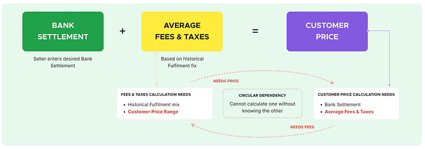
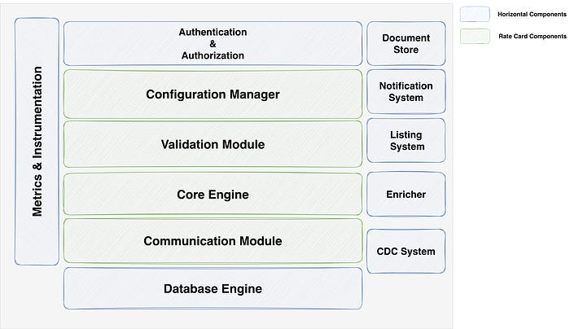
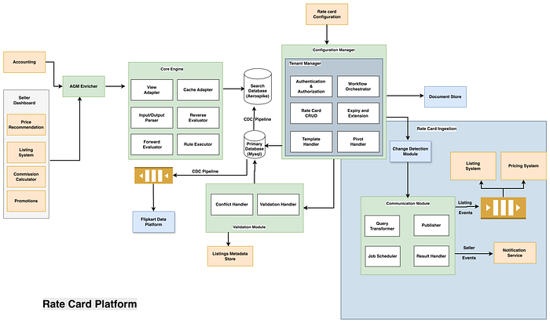
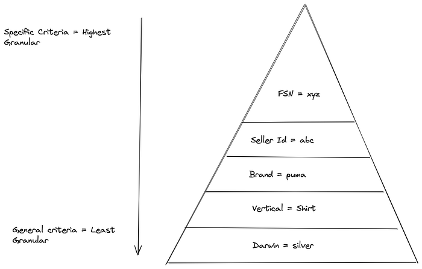
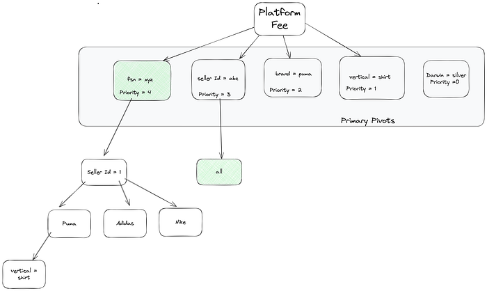
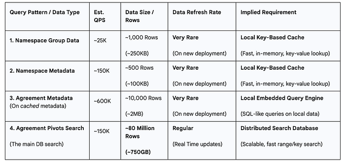
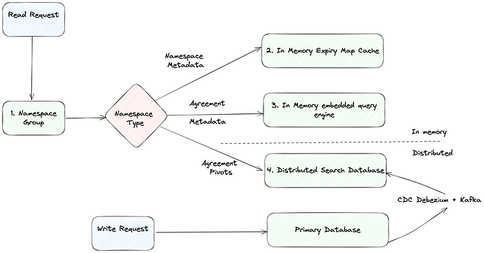
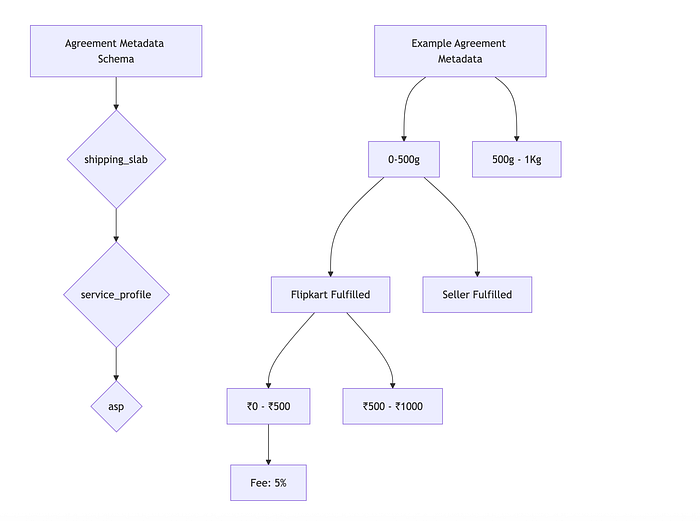
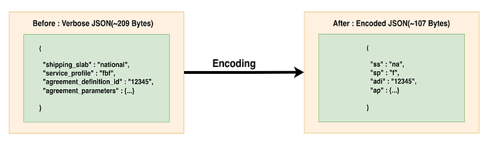

# Re-architecting Flipkart’s Rate Card Engine: The Journey to Building a High-Scale, Generic Rate Card Platform

## Introduction

In the hyper-competitive world of **e-commerce** every cent matters. How marketplace fees are calculated, charged and displayed to millions of sellers at Flipkart directly impacts revenue, seller trust, and business agility. For years, the legacy system responsible for this task was the **Agreement Master (AGM)**.

AGM served as the single source of truth for all seller fees across millions of products. But as Flipkart scaled, introducing new businesses like **Shopsy and Minutes**, this system became a critical bottleneck.

This article tells the story of how we re-architected this entire system into the new **Rate Card Platform (RCP)** built to serve all of Flipkart’s Marketplaces (Flipkart, Shopsy, Minutes). We engineered it from the ground up, targeting **thousands of QPS** at a **P99 latency of <100ms** for fee calculation.

We’ll take a deep dive into the architectural decisions that made this possible:

1. **Architecture:** We designed a **Hierarchical + Priority-Based Rule Engine** to manage all the Rate cards.
2. **Performance:** We chose a **Denormalized Read Pattern** over traditional JOINs to achieve fast, key-based lookups.
3. **Database Choices:** We preferred a combination of an **in-memory Expiry Map cache**, **CQEngine** for embedded queries, and **Aerospike** as our primary distributed Search/KV store, backed by an asynchronous **CDC** write strategy.
4. **Flexibility:** We solved complex business needs like **reverse calculation** of Customer Price from Settlement Price and partial metadata configurations by co-locating metadata with pivot data, reducing network calls, and simplifying logic.


---

## Problem and Context

The system worked, but it was a product of a simpler time. As Flipkart scaled into a multi-business ecosystem, this system began to buckle under the strain.

### The Architectural Shift: Settlement-Based Pricing

The problem increased multifold when Flipkart’s pricing strategy underwent a revolutionary transformation to **Settlement-Based Pricing** — a paradigm shift that required significant QPS: calculating both S**eller Commission Fees and Customer-Facing Prices** simultaneously, while maintaining sub-millisecond response times for every API call.

This wasn’t just a _“nice to have”_ feature; it was a core business requirement that multiplied our existing problems tenfold. Business teams and sellers don’t just think _“forward” (what’s the fee ?). They think “backward” _:

> As a seller, I want to earn **exactly Rs 100** on this item. What should I price it at ?

This is Settlement-Based Pricing (SBP), or the “**Reverse Calculator**.” To answer this, you have to flip the equation:

```
Forward: Settlement = Customer Price - Marketplace Fees - Taxes...
Reverse: Customer Price = Settlement + Marketplace Fees + Taxes...
```

**Marketplace Fees** = Fee charged to the seller for an order. Function of Rate card, product attributes and seller tier.

**Settlement** = Seller's input of desired settlement.


*Settlement-Based Pricing*

The old AGM, which needed multiple DB calls for _one_ forward calculation, stood zero chance of performing this complex, iterative calculation at scale. This challenge alone justified a complete re-architecture.

Beyond scale, SBP required an architectural change. The system now had to perform dual calculations: resolving seller settlements while simultaneously deriving listing prices for millions of products.


---

## Solution: Defining the New Vision

We didn’t just want to rebuild AGM. We wanted to build a platform that was capable of powering _all_ of Flipkart’s current and future business use cases.


*Rate card Platform Component view​​*


---

## Architecture

With our principles defined, we designed the architecture.


*Rate Card Platform HLD*


---

### The Approach: Solving the “ Which Rule? ” Problem

Our first major decision was _how_ to find the “**best matching rate card**.” The old AGM system used a complex web of rules that was slow and hard to debug.

We rejected a traditional, flat rule engine as it would be impossible to manage at our scale. Instead, we implemented a **Hierarchical + Priority-Based Evaluation** model.

Instead of a single, flat database table with millions of rules, we treat the pivots as a hierarchy. Business logic dictates that a specific rule (e.g. fsn = “xyz”) is more important than a general rule (e.g. for a whole vertical = “shirt”).

**FSN (Flipkart Serial Number)**: A unique identifier assigned to each product listed on the Flipkart marketplace.

Our engine models this by searching in order of priority:

1. Check for a rule matching the **Primary Pivot** (e.g. _FSN == “xyz”_).
2. If not found, check for the next Pivot (e.g. _Seller ID == “abc”_).
3. If not found, check _Brand == “puma”_.
4. …and so on, down to the bottom-most pivot Vertical == “shirt” level.

Once a matching Primary Pivot is found, we apply the same logic to **Secondary Pivots** (combinations like Seller ID + Brand). This allows for highly specific overrides. This approach is not only efficient but also deterministic and maps directly to how the business _thinks_ _about rules_.




*Hierarchical + Priority-Based Evaluation*

Here’s how it works:

1. **Pivots:** We define all the conditions/criteria on which a fee can depend (e.g. _fsn, seller_id, brand, vertical, service_profile_).
2. **Hierarchy:** We organize these pivots into a strict hierarchy.  
- **Primary Pivots:** These are single-condition rules, our first level of filtering (e.g. fsn = “xyz”).  
- **Secondary Pivots:** These are compound-condition rules (e.g. brand = “puma” AND seller_id = “1”).

3. **Priority:** System assigns a priority to each pivot (e.g. for Commission Fee, an FSN-level rule has a higher priority than a Brand-level rule, which is higher than a Vertical-level rule).

This approach helped us to transform a complex, multi-row search problem into a structured, high-priority-first query system.


---

### Query Pattern: Denormalization for Speed

The hierarchical approach defined **_what_** we needed to find. The read query pattern defined **_how_** we would find it.

```
Example :Find the active agreement for namespace commission_fee with inputs
fsn:xyz, seller:abc, brand:puma, vertical:shirt, asp:100...
```

Rather than the traditional approach, we prioritized fast data retrieval by creating a single, comprehensive key that directly stores all necessary pivot information within the Agreement table itself.

```
GET ... 
from Agreement WHERE pivot_key IN (...) AND date > ... 
ORDER BY primary_priority DESC...
```

- **✅ Pro:** This results in a simple, fast, key-based lookup (a batch IN query) on a single table, drastically improving read performance for high read QPS.
- **❌ Con:** The primary drawback is data duplication, some information is repeated across records.

### The Trade-off: Handling Write Amplification via Async Fan-Out

Denormalisation optimises the **Read Path** at the expense of the **Write Path**. A single rate card change introduces **Write Amplification**, requiring updates to multiple agreement records. We mitigate this using an **Event-Driven “Fan-Out” Architecture**:

1. **Decoupled Ingestion:** The Configuration Manager follows a **Transactional Outbox pattern**. It commits the source-of-truth definition to a relational MySQL store and simultaneously emits a lightweight event. By using **CDC (Debezium+Kafka)**, we ensure that the Search DB update is decoupled from the user-facing configuration action, preventing slow writes.
2. **Scalable Worker Fan-Out:** Events are consumed by a fleet of distributed workers. When a “global” change occurs, the worker identifies impacted agreement IDs and spawns a **parallel fan-out**.
3. **Idempotent Upserts:** Workers perform **idempotent upserts** to Aerospike. If the same event is processed twice, the resulting state is identical.
4. **Backpressure & Throttling:** The async nature of the fan-out allows us to implement **write-throttling**. During massive bulk updates, we can rate-limit the workers to ensure we do not saturate Aerospike’s IOPS, maintaining a stable “_headroom_” for real-time read traffic.
5. **Consistency Model:** We rely on **Eventual Consistency**. Since >99% of rate card changes are future-dated (effective after 6 hours), the async replication lag (_milliseconds_) has zero impact on the correctness of real-time traffic.


---

## Deep Dive: Deconstructing the Query Patterns and Database Choices

Building for this scale required us to make critical database and caching choices. Our LLD broke down the QPS requirements by component, revealing an incredibly high read profile:

Our target of **25,000 QPS** for a single “Group Call” (calculating all fees for one order) was just the tip of the iceberg. A single “Group Call” isn’t one query; it’s a **fan-out of multiple, distinct queries, each with its own profile**.

For example, one “Group Call” might need to fetch 6 different fees (Fixed, Commission, etc.) and each of those might have on average 4 metadata definitions. This cascades the QPS:

- **25K QPS** (Group Call)
- …multiplies to **150K QPS** (Namespace Metadata)
- …multiplies to **600K QPS** ( Agreement Metadata)
- …multiplies to **150K QPS** (Agreement Pivots)

Understanding this “QPS explosion” was the most critical step in our design. We couldn’t just build one “database” for 25K QPS; we had to build a composite system to handle **four different high-performant query patterns**. We broke down our data needs as follows:




*Database Search Query Flow*

This query model created three distinct types of data needs, each with its own QPS, data size, and refresh-rate profile. No single database could handle all of them efficiently.

- **Local key-based caches** for rarely changing Namespace groups and Namespace metadata like definitions.
- **Local embedded query engine** for agreement metadata mapping.
- **A distributed search database** for finding the matching agreement.

1. **Local Key-Based Cache (Namespace Metadata)**

- **Use Case:** Storing config data that _rarely_ changes, like Namespace Groups and Namespace Metadata (the formulas).
- **Requirement:** ~175K QPS, ~1MB data size, very rare refresh.
- **Loading Strategy:** We chose **Pre-loading (Cold-Start)**. All 1MB are loaded into the application’s local memory at startup. We use **Async Batch Processing** to do this in parallel and not slow down app boot time.
- **Tech Choice:** We compared Caffeine, Guava, and our **In-Memory Cache-Store (Expiry Map)**.
- **Decision:** We chose our **In-Memory Cache-Store**. It was well-tested in our ecosystem and supported async loading, whereas Guava had known blocking issues.

**2. Local Embedded Engine (Agreement Metadata)**

- **Use Case:** Performing SQL-like queries on the _locally_ cached Agreement Metadata (the 2MB of rule definitions).
- **Requirement:** ~600K QPS, ~2MB data size, very rare refresh.
- **Tech Choice:** We compared **CQEngine, SQLite, and H2**.
- **Decision:** We chose **CQEngine**. Our NFRs showed CQEngine handling 60K QPS @ 1ms latency, while SQLite was an order of magnitude slower at 7.3K QPS @ 7ms. This NFR was done on a single 8-core machine.

**3. Distributed Search Database (Pivots)**

- **Use Case:** The main event. Finding the matching Agreement from millions of records using the denormalized pivot_key and date ranges.
- **Requirement:** ~150K QPS, ~750GB (and growing) data size, regular refreshes.
- **Tech Choice:** This was our most critical decision. We benchmarked MongoDB, Aerospike, MySQL, ElasticSearch and HBase.
- **Decision:** We chose **Aerospike**.

**Why Aerospike ?**

It met our **QPS** needs, **Query Pattern Fit, **is **horizontally scalable**, and is offered as a **centrally managed** PaaS by our internal Platform team (low KTLO). It supports batch-get operations, which maps perfectly to our pivot_key IN (…) query pattern. Its **Hybrid Storage Architecture**( In-memory index + SSD data storage) is built for persistence.

**Aerospike Write Strategy: CDC to the Rescue**

**Now, how do we keep our primary DB (MySQL) and our read-optimized Aerospike in sync ?**

- **Async Write Pattern:** We opted for a SAGA pattern using **Change Data Capture (CDC)**, which was acceptable as agreements are future-dated, allowing for eventual consistency and preventing double writes.

We chose our internal CDC platform. The flow is simple and robust.

```
MySQL Binlog --> Debezium --> Kafka --> Consumer --> Aerospike
```

### Search Agreement Logic: Forward and Reverse

One final challenge emerged from our business team: they weren’t always ready to provide **full metadata** (e.g. they wanted to configure a fee for an ASP range of 300–500, but not for 0–299 or > 501)

This breaks our logic. What do we charge if the ASP is 250 ?

**Approach 1 (Rejected): Fallback Logic.**

- **_Idea_**_:_ If no rule matches in Aerospike, make a _second_ call to a “Base Rate Card” stored in the local cache.
- **_Why Rejected_**_:_ This was complex. It meant managing cache consistency for this Base Rate Card across all pods and introduced an extra network hop (or cache miss) on a failed lookup. It was also inflexible to future business requirements.

**Approach 2 (Chosen): Store Metadata with Pivot Data.**

- **_Idea_**_:_ We decided to store the Agreement Metadata (the 750GB of slab data) in the _same Aerospike table_ as the 30GB of Pivot data.
- **_Trade-off_**_:_ This slightly increased our network data transfer size per call (~2KB), but it **reduced our network calls from two to one**.
- **_Why Chosen_**_:_ We consolidated rule and metadata retrieval into a single **Aerospike Multi-Get**, cutting network hops by half. By shifting ASP range validation to the application layer, we simplified the logic: if no matching slab is found, the engine seamlessly triggers a deterministic fallback based on the pre-defined priority hierarchy.


---

## Agreement Metadata Optimization: Reducing Datastore Storage by 50–60%

### Data Characteristics: The Schema-less JSON Problem

A core challenge was the nature of our Agreement metadata. It’s stored as **JSON without a fixed schema**, meaning its structure varies significantly based on the business use case (e.g. zonal vs. national shipping) and marketplace.

**Key Characteristics:**

- **Schema-less JSON:** No predefined structure. Each agreement can have a unique metadata layout.
- **Hierarchical Nesting:** Data is often deeply nested (slabs -> service profiles -> ASP ranges -> parameters).
- **Size Variability:** A simple agreement might be ~100 bytes, while complex rate cards can be ~11KB.

This schema-less, variable structure makes traditional schema-based binary serializations (like Avro or Protocol Buffers) difficult to implement and inefficient for small objects.


*Agreement Metadata Example*

### The Challenge: Bloated Storage

With millions of agreements, these verbose JSON structures consumed significant storage and network bandwidth, especially in our Aerospike cluster (~750GB).

### Solution: Key-Value Encoding Strategy

We evaluated multiple approaches, including compression algorithms (Snappy, LZ4, Gzip) and serialization libraries (Avro, Protocol Buffers). Our key requirements were massive storage reduction with **zero impact on search speed** and **minimal decompression overhead**.

### Comprehensive Technique Comparison

The results were clear: while some compression libraries offered slightly better reduction on _large_ files, they failed catastrophically on small files and added unacceptable CPU overhead for decompression during reads.

**Key Findings**

- **Encoding Wins:** Our key-value encoding delivered a consistent **50–60% storage reduction** with **zero search speed impact** and **zero read-time decompression overhead**.
- **Compression Fails:** Avro + Snappy was _increasing_ the size of our normal (99%) rate cards by **348%** due to schema overhead, while adding **1.16ms of latency _per evaluation_**.
- **The Cost of Latency:** For a request needing 10 agreement evaluations:  
- **Compression:** 10 x 1.16ms = **12ms** of added latency.  
- **Encoding:** 10 x 0.01ms = **0.1ms** of added latency.

### Our Encoding Approach

We simply converted verbose JSON keys to abbreviated forms during the write process


*Metadata Key-Value Encoding*

## 🚀 Encoding Goodness

This simple encoding strategy had a massive, system-wide impact.

- **Storage Reduction:  
- Aerospike:** Reduced from **~750GB to** **~300–360GB**.  
- **CQ Engine (In-Memory):** Enabled **4–5x more agreements** to fit in the same 2GB memory footprint per instance.
- **Network Bandwidth:** **50–60% reduction** in data transfer for CDC and replication.
- **Performance:** Maintained sub-millisecond evaluation latency by ensuring **zero decompression overhead** on the critical read path.


---

## Learnings

This journey from a legacy system to a high-scale platform taught us several invaluable lessons:

1. **One Size Fits All is a Myth.** No single database could solve our problem. We had to break our query patterns down (**Local KV, Local Embedded Query, Distributed Search**) and use three different, fit-for-purpose storage solutions to meet our extreme NFRs.
2. **Denormalize for Reads.** For our 150K QPS read path, the performance gain of a key-based lookup by avoiding JOINs was the most important LLD decision we made. The cost of data duplication was a tiny price to pay for speed and scalability.
3. **Databases Choice.** Our decision to reject other Databases for Aerospike was critical. Reducing operational overhead (KTLO) is as important as raw performance, and leveraging a managed service enabled our team to focus on business logic, not cluster maintenance.
4. **Push Complexity to the Right Layer.** We consciously moved complexity (like sorting and filtering) from the database (Aerospike) to the application layer. This allowed the database to do what it does best (fast key-based lookups) and let our application handle the business logic.
5. **Embrace Async Writes.** SAGA patterns with CDC are more resilient, decoupled, and practical for replicating data to read-optimized stores than complex 2-Phase Commits.
6. **Solve the _Actual_ Business Problem.** Our initial “fallback” logic for partial metadata was a complex tech-first solution. By collaborating with the business and choosing to co-locate metadata simplified the architecture, reduced network calls, and built a more extensible system.


---

## Conclusion

The journey from the old AGM to the new Rate Card Platform was a foundational shift. We moved from a challenging legacy system to a generic, multi-tenant, and highly performant platform(**10x Scale** at a **P99 latency of <100ms**) that now serves as the financial backbone for all of Flipkart’s businesses. By implementing a **Hierarchical + Priority Based evaluation model**, we were able to handle all our complex business rules.

We focused on our core design tenets — **Consistency, Scalability, and Flexibility** — and making deliberate, hard trade-offs in our database and caching strategies, we built a system ready for the next couple of years of scale requirements. We took critical technical decisions — like choosing CQEngine over SQLite, or Aerospike over other Databases — that helped us to enable flexible and scalable solutions for our sellers and customers.

---
**Tags:** Ecommerce · Distributed Systems · Rate Card · Database · Software Architecture
