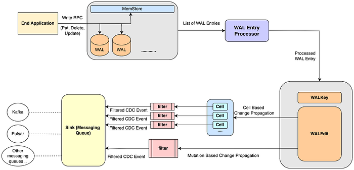
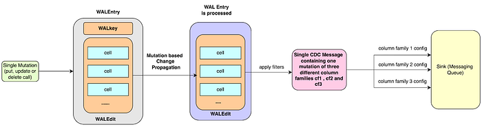
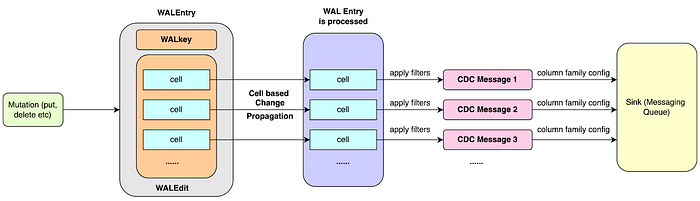
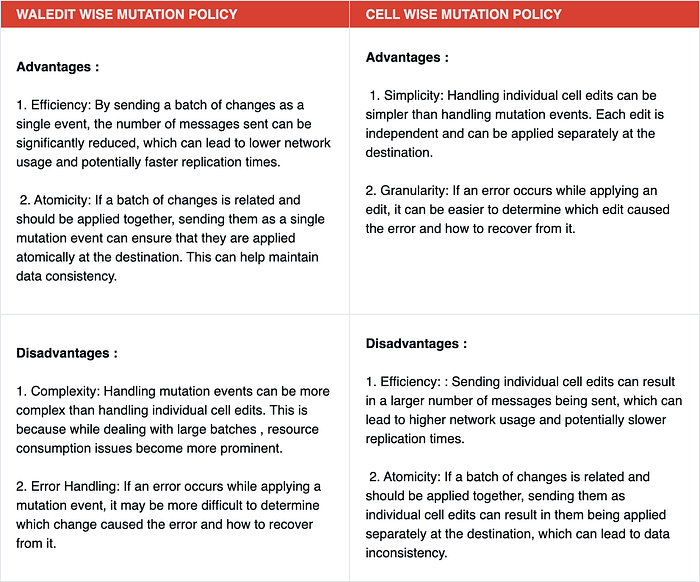
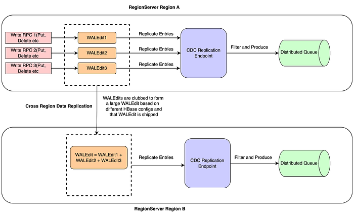

# Real-Time Data Propagation with HBase: Exploring Change Data Capture and Its Challenges

## Introduction

Change Data Capture (CDC) is a design pattern that gives capability to track and capture the changes occurring to data and making them available in a form that can be used and acted upon by other systems. It’s a crucial component for many data-driven applications, including distributed transactions, replication, caching, data warehousing, event-driven architectures, and more.

**In the context of DataBase**, CDC refers to the process of capturing changes occurring in a data store and making them available for other systems to consume and perform what are called “side effects”. These changes are typically replicated to a distributed queue such as Apache Kafka.

[Apache HBase](https://hbase.apache.org/) is an open-source, distributed, non relational data store designed to provide quick random access to large amounts of structured data. Built on top of [HDFS](https://hadoop.apache.org/docs/r1.2.1/hdfs_design.html#Introduction) and modeled after [Google’s Bigtable](https://cloud.google.com/bigtable), HBase provides low-latency, high throughput reads and writes, making it ideal for handling vast amounts of structured data within Hadoop ecosystems. In HBase, CDC can be implemented by accessing HBase’s Write Ahead Log (**WAL**). [**WAL**](https://hbase.apache.org/2.5/devapidocs/org/apache/hadoop/hbase/wal/WAL.html) records each change to data called mutation in HBase to file-based storage.

At Flipkart, our platform team manages Apache HBase to support over 220+ business use cases, primarily focused on OLTP workloads. There are multiple services leveraging this CDC functionality inside Flipkart . Some prominent use cases are ad campaigns, payment and other e-commerce transactional systems etc. The [code](https://github.com/flipkart-incubator/hbase-cdc) is open-source and can be accessed with the provided link.

### Terminology

- [**Cell**](https://hbase.apache.org/2.5/apidocs/org/apache/hadoop/hbase/Cell.html)**: **In the context of HBase, cell denotes the smallest unit of data storage. It is an intersection of a row, column family and column qualifier containing actual data with a timestamp.
- [**WALEdit**](https://hbase.apache.org/2.5/devapidocs/org/apache/hadoop/hbase/wal/WALEdit.html): The WALEdit contains the actual data change. It is a collection of cell instances, where each cell represents a unit of data in HBase. A cell encapsulates a value and its associated row, column family, and qualifier. The WALEdit can represent multiple changes to different cells that are part of the same operation.
- [**RegionServer**](https://hbase.apache.org/apidocs/org/apache/hadoop/hbase/regionserver/package-summary.html)**: **RegionServer is a server responsible for managing and serving regions which are subsets of tables. It handles read and write requests for all the regions it hosts, performs other region related functions etc.
- [**MemStore**](https://hbase.apache.org/2.5/devapidocs/org/apache/hadoop/hbase/regionserver/MemStore.html)**: **MemStore refers to in-memory data structure. It acts as a write buffer in HBase that stores data in memory before it is flushed to disk as HFiles.
- [**HFiles**](https://hbase.apache.org/2.5/devapidocs/org/apache/hadoop/hbase/io/hfile/HFile.html)**: **HFiles are the underlying storage format for HBase tables, storing the actual data on the Hadoop Distributed File System (HDFS).
- [**WALKey**](https://hbase.apache.org/devapidocs/org/apache/hadoop/hbase/wal/WALKey.html): The WALKey is a composite key that contains metadata about the change occurred in the data stored in HBase such as inserted, updates or deletes. This includes the ID of the region where the change occurred, the ID of the cluster that made the change, the sequence number of the change, and the timestamp when the change was made. The WALKey is used to order the changes in the WAL.
- [**WALEntry**](https://hbase.apache.org/2.5/devapidocs/org/apache/hadoop/hbase/wal/WAL.Entry.html)**: **WALEntry represents a single log entry in HBase’s Write-Ahead Log (WAL). It encapsulates information related to the changes (mutations) made to the HBase tables. Each WALEntry consists of a WALKey and a WALEdit.
- **Sink:** In the context of HBase Change Data Capture CDC, a “sink” refers to the destination where the captured changes (data modifications such as inserts, updates, and deletes) are sent.
- [**ReplicationEndpoint**](https://hbase.apache.org/2.5/devapidocs/org/apache/hadoop/hbase/replication/ReplicationEndpoint.html)**: **It is an interface that defines a contract for replicating HBase write-ahead log (WAL) entries to a remote cluster or another system.

### Use Cases for CDC in HBase

Traditional methods of data integration involve querying the HBase for changes, which can put a significant load on the system. CDC reduces this load by capturing changes as they happen. Here are the few use cases of CDC in HBase :

- CDC in HBase allows for the synchronization of data across multiple systems. When data changes in HBase, those changes can be captured and propagated to other systems, ensuring data synchronization.
- CDC with Hbase can be used to populate a secondary HBase DB by replicating the captured changes to a secondary database, ensuring it stays in sync with the primary database. This approach can be useful for supporting different read patterns.
- HBase’s built-in inter cluster replication works in a similar way as Change Data Capture (CDC) by capturing changes in one HBase cluster and propagating them to another cluster. This functionality ensures that multiple HBase clusters remain synchronized, which is useful for fault tolerance, disaster recovery, geographical distribution of data etc.

## HBase CDC Architecture at Flipkart



- The application performs a write operation (such as a put, delete, or update) to HBase, which records the mutation in the Write-Ahead Log (WAL) and the MemStore. When the MemStore reaches a certain size, its contents are flushed to disk as an HFile.
- The WAL entries are kept until a certain preconfigured threshold(specific number of entries/files, size etc) is reached and all the dependencies(such as replication) are resolved. Once the changes are successfully persisted in HFiles on disk, WAL entries are safely discarded during the next WAL cleanup process.
- HBase CDC pushes a batch of Write-Ahead Log (WAL) entries to the destination.
- The method starts by [iterating](https://github.com/flipkart-incubator/hbase-cdc/blob/main/sep/src/main/java/com/flipkart/yak/sep/commons/MessageQueueReplicationEndpoint.java#L225) over each entry in the provided list of WAL entries.
- For each entry, it extracts the WAL key and the WAL edit and performs some checks on that, applies filters, and then sends it. [Send](https://github.com/flipkart-incubator/hbase-cdc/blob/main/sep/src/main/java/com/flipkart/yak/sep/commons/MessageQueueReplicationEndpoint.java#L387) is an abstract method here. It provides a generic way to send the edits (changes) to the destination, but the actual implementation of how to send these edits is dependent on the specific type of message queue being used. The implementation for kafka can be found [here](https://github.com/flipkart-incubator/hbase-cdc/blob/main/sep/src/main/java/com/flipkart/yak/sep/KafkaReplicationEndPoint.java) and for pulsar [here](https://github.com/flipkart-incubator/hbase-cdc/blob/main/sep/src/main/java/com/flipkart/yak/sep/PulsarReplicationEndpoint.java).

### Architectural Elements of HBase CDC Implementation

**WALEntry Processor**

The WALEntry processor operates on the list of [WALEntries](https://hbase.apache.org/2.5/devapidocs/org/apache/hadoop/hbase/wal/WAL.Entry.html). Each WALEntry is processed, [segregated into WALKey and WALEdit](https://github.com/flipkart-incubator/hbase-cdc/blob/main/sep/src/main/java/com/flipkart/yak/sep/commons/MessageQueueReplicationEndpoint.java#L226). All the relevant meta information is extracted from the WAL Entry and sent further in a couple of ways depending upon the type of change propagation policy applied.

**Filters**

After each WALEntry is processed, a set of [filters](https://github.com/flipkart-incubator/hbase-cdc/blob/main/sep/src/main/java/com/flipkart/yak/sep/filters/SepFilter.java) is applied to it to determine if it should be replicated or not. There are two types of filters to which Hbase CDC applies. One is based on column families and column qualifiers, which allows only whitelisted column families and qualifiers to propagate. The other one, [WALOriginBased Filter](https://github.com/flipkart-incubator/hbase-cdc/blob/main/sep/src/main/java/com/flipkart/yak/sep/filters/WALOriginBasedFilter.java) is based on clusterID, which allows only events coming from specified HBase clusters to propagate.

1. **Columns and column qualifier-based filters**: [These](https://github.com/flipkart-incubator/hbase-cdc/blob/main/sep/src/main/java/com/flipkart/yak/sep/commons/MessageQueueReplicationEndpoint.java#L332) types of filters are essential for controlling the propagation of mutations from specific column families and column qualifiers. By default, HBase CDC allows mutations coming from all column families to propagate. However, one can choose selected column families as well. Similarly for column qualifiers, one can choose selected column qualifiers. In this case, only[ qualifiers specified in whitelisted qualifiers are allowed](https://github.com/flipkart-incubator/hbase-cdc/blob/main/sep/src/main/java/com/flipkart/yak/sep/utils/CFConfigUtils.java#L76) to propagate.
2. **WAL Origin Based Filters**: [These](https://github.com/flipkart-incubator/hbase-cdc/blob/main/sep/src/main/java/com/flipkart/yak/sep/commons/MessageQueueReplicationEndpoint.java#L343) types of filters are crucial for handling events coming from other DC/regions. It is required for effectively managing and controlling the propagation of events in multi cluster HBase environments.  
For more details, how Flipkart’s HBase deployment handles multi DC/regions refer to this [blog](./case-study-handling-multi-dc-region-with-apache-hbase-3dbf187a842e.md).

Each WALEdit contains clusterIds. [ClusterId](https://github.com/apache/hbase/blob/rel/2.5.3/hbase-client/src/main/java/org/apache/hadoop/hbase/ClusterId.java#L34) is a UUID that serves as a unique identifier for HBase clusters.

Each WAL entry stores meta information about all the HBase clusters that the record has passed through as a list of clusterIds. The clusterIds helps in tracking the origin and path of the data changes as they propagate through different clusters. At Flipkart, we have built HBase CDC with filters based on the origin of WAL entries as well. The filtering is determined by the [WALOrigin policy](https://github.com/flipkart-incubator/hbase-cdc/blob/main/sep/src/main/java/com/flipkart/yak/sep/filters/WALEditOriginWhitelist.java), which specifies how the events should be propagated based on their source of origin. The [following](https://github.com/flipkart-incubator/hbase-cdc/blob/main/sep/src/main/java/com/flipkart/yak/sep/filters/WALEditOriginWhitelist.java) are the types of filtering supported :

- **_LOCAL_ORIGIN_**: [Only events that are generated from the same Hbase cluster where CDC is running are propagated](https://github.com/flipkart-incubator/hbase-cdc/blob/main/sep/src/main/java/com/flipkart/yak/sep/filters/WALOriginBasedFilter.java#L35). Events coming from other clusters via replication are blocked and do not proceed further for CDC.
- **_WHITELISTED_ORIGIN_**: [Only those events are propagated whose source of origin is present in the whitelisted origin list](https://github.com/flipkart-incubator/hbase-cdc/blob/main/sep/src/main/java/com/flipkart/yak/sep/filters/WALOriginBasedFilter.java#L38). All other events are blocked.
- **_ANY_ORIGIN_**: [All incoming events are propagated, independent of the cluster in which event was generated](https://github.com/flipkart-incubator/hbase-cdc/blob/main/sep/src/main/java/com/flipkart/yak/sep/filters/WALOriginBasedFilter.java#L44). This is also the default origin policy.

### Methods of Change Data Propagation

We have built two distinctive methods for propagating changes from HBase to downstream systems. These methods define how mutations (changes made to HBase tables) are captured and transmitted as events. With context to HBase, mutation refers to an operation (put, delete or update) that modifies the data stored in a table. Following are the two methods that define how mutations can be captured and sent as events.

1. **Mutation Based Change Propagation**



- [Here](https://github.com/flipkart-incubator/hbase-cdc/blob/main/sep/src/main/java/com/flipkart/yak/sep/commons/MessageQueueReplicationEndpoint.java#L291) at Flipkart, we have built this mutation based change propagation policy to emit events per WALEdit. Each WALEdit represents a collection of edits (cell/key value objects) that came in as a single mutation. All the edits for a given mutation are written out as a single record.
- If there is column-level configuration provided, the whole mutation will be propagated corresponding to each column-family configuration provided, [if the mutation contains changes of that column family](https://github.com/flipkart-incubator/hbase-cdc/blob/main/sep/src/main/java/com/flipkart/yak/sep/commons/MessageQueueReplicationEndpoint.java#L295). Since mutations may contain changes of different column families, hence each mutation may get propagated multiple times according to the column family configuration.
- While sending events to the downstream system, it [provides groupId as rowKey](https://github.com/flipkart-incubator/hbase-cdc/blob/main/sep/src/main/java/com/flipkart/yak/sep/KafkaReplicationEndPoint.java#L137). GroupId is a byte array that represents the key for the messages being produced. In cases where multiple mutations are present in one WALEdit coming from different rowKeys, it gives groupId as the rowKey of the [first cell present in mutation](https://github.com/flipkart-incubator/hbase-cdc/blob/main/sep/src/main/java/com/flipkart/yak/sep/commons/MessageQueueReplicationEndpoint.java#L312).
- For the events originating from the same HBase cluster (LOCAL_ORIGIN), generally each put/batchPut creates a single WALEdit, which is translated into a single event.
- For the events coming from other HBase clusters (via replication), each WALEdit in the destination cluster contains multiple WALEdits from the source cluster. This behaviour is controlled by multiple HBase regionserver configurations, as described later in the challenges section.
- Since WALEdits are getting clubbed before being shipped to another HBase cluster, WALEdit present in the destination cluster contains multiple WALEdits from the source having different row keys.
- To avoid the message containing mutations of different row keys, in case of Mutation Based Change Propagation for destination clusters, [WALEdit is further broken down into row-wise mutation](https://github.com/flipkart-incubator/hbase-cdc/blob/main/sep/src/main/java/com/flipkart/yak/sep/commons/MessageQueueReplicationEndpoint.java#L246). This means that each WALEdit in the cluster coming from some other HBase cluster will translate to the number of mutation events equal to different row keys present in that WALEdit.

**2. Cell Based Change Propagation**



- In [cell based change propagation](https://github.com/flipkart-incubator/hbase-cdc/blob/main/sep/src/main/java/com/flipkart/yak/sep/commons/MessageQueueReplicationEndpoint.java#L259), each WALEdit is broken down into the smallest unit of mutation possible, i.e., at the cell level.
- This is also the default policy for replication. Here, HBase change propagation emits events per cell. In a table, when a cell is updated or created, then change propagation will emit the event for that cell.

**Example Scenario**

Lets consider an example where a put operation occurs and it updates multiple cells in a HBase table .

→ Suppose there is HBase table user_details with schema as   
 RowKey: user_id  
 Column Families: info, stats  
 Columns: info:name, info:data_of_birth, stats:login_count

→ put operation is performed with following updations for user_id = 1  
 info:name = “alice”  
 info:date_of_birth = “21–07–1999”  
 stats:login_count = “5”

→ In **Mutation Based Change Propagation**, the entire put/batchPut operation getting captured as a single WALEdit containing all cell updates will get translated into a single event. Event emitted in above example will be:

```
/*
* Mutation Based Change Propagation: Captures all cell updates in a 
single WALEdit and emits a single event containing all mutations.
*/
{
"groupId": "1",
"mutations": [
{ "column": "info:name", "value": "alice" },
{ "column": "info:date_of_birth", "value": "21–07–1999" },
{ "column": "stats:login_count", "value": "5" }
]
}
```

→ In **cell based mutation**, the entire cell update is captured and transmitted as a separate event. It means that the put operation in this case will translate into multiple events, each representing a cell update. Event emitted in above example will be as:

```
/*
* Cell Based Change Propagation: Breaks down the WALEdit into individual
cell updates and emits separate events for each cell mutation.
*/
{
"groupId": "1",
"mutations": [
{ "column": "info:name", "value": "alice" }
]
}

{
"groupId": "1",
"mutations": [
{ "column": "info:date_of_birth", "value": "21–07–1999" }
]
}

{
"groupId": "1",
"mutations": [
{ "column": "stats:login_count", "value": "5" }
]
}
```



### Sinks

- Once the WALEdits are processed, propagation policy is applied to them and filtered out, and they are ready for shipping to the sink configured.
- The send method responsible for shipping the mutations is the generalized method for sending messages to a sink. This method is abstract, meaning it doesn’t have any implementation in the class itself. Instead, it’s expected that any class implementing this method will provide its own [implementation of the send method](https://github.com/flipkart-incubator/hbase-cdc/blob/main/sep/src/main/java/com/flipkart/yak/sep/KafkaReplicationEndPoint.java#L150). This is done to make sure different messaging queues can be plugged in very easily.
- Currently we have support for [Kafka Endpoint](https://github.com/flipkart-incubator/hbase-cdc/blob/main/sep/src/main/java/com/flipkart/yak/sep/KafkaReplicationEndPoint.java) and [Pulsar Endpoint](https://github.com/flipkart-incubator/hbase-cdc/blob/main/sep/src/main/java/com/flipkart/yak/sep/PulsarReplicationEndpoint.java), where it supports [Kafka](https://kafka.apache.org/documentation/) and [Pulsar](https://pulsar.apache.org/docs/4.0.x/) as sinks.

### HBase CDC(SEP) Data Models

- HBase [CDC (SEP) data-models](https://github.com/flipkart-incubator/hbase-cdc/blob/main/sep-models/src/main/proto/SepMessage.proto) are powered by [Protobuf](https://protobuf.dev/) keeping parity with HBase standard.
- Data Models for each policy are :

1. _Model 1_ : _For _[_Cell Based Change Propagation_](https://github.com/flipkart-incubator/hbase-cdc/blob/main/sep-models/src/main/proto/SepMessage.proto#L16)

```
/**
* SepTableName: This message represents a table name in the system. It has two fields:
* namespace: A required field that represents the namespace of the table.
* qualifier: A required field that represents the qualifier of the table.
*/
message SepTableName {
required bytes namespace = 1;
required bytes qualifier = 2;
}
/**
* SepMessage: This message represents a version corresponding to the Cell Based Change Propagation in the system. It has six fields:
* row: A required field that represents the row of the data.
* timestamp: A required field that represents the timestamp of the data.
* value: A required field that represents the value of the data.
* table: A required field that represents the table of the data. It's an instance of SepTableName.
* columnfamily: An optional field that represents the column family of the data.
* qualifier: An optional field that represents the qualifier of the data.
*/
message SepMessage {
required bytes row = 1;
required uint64 timestamp = 2;
required bytes value = 3;
required SepTableName table = 4;
optional bytes columnfamily = 5;
optional bytes qualifier = 6;
}
```

2. _Model 2 :: For _[_Mutation Based Change Propagation_](https://github.com/flipkart-incubator/hbase-cdc/blob/main/sep-models/src/main/proto/SepMessage.proto#L30)

```
/**
* SepMessageV2: This message represents a version 2 corresponding to Mutation Based Change Propagation in the system. It has five fields:
* table: A required field that represents the table of the data. It's an instance of SepTableName.
* sep_cell: A repeated field that represents the cells of the data. It's an instance of SepCell.
* orig_sequence_id: An optional field that represents the original sequence ID of the data.
* orig_log_seq_num: An optional field that represents the original log sequence number of the data.
* timestamp: An optional field that represents the timestamp of the data.
*/
message SepMessageV2
{
required SepTableName table = 1;
repeated SepCell sep_cell = 2;
optional uint64 orig_sequence_id = 3;
optional uint64 orig_log_seq_num = 4;
optional uint64 timestamp = 5;
}
/**
* SepCell: This message represents a cell in the system. It has six fields:
* row: A required field that represents the row of the cell.
* timestamp: A required field that represents the timestamp of the cell.
* value: An optional field that represents the value of the cell.
* columnfamily: An optional field that represents the column family of the cell.
* qualifier: An optional field that represents the qualifier of the cell.
* type: An optional field that represents the type of the cell.
*/
message SepCell {
required bytes row = 1;
required uint64 timestamp = 2;
optional bytes value = 3;
optional bytes columnfamily = 4;
optional bytes qualifier = 5;
optional string type = 6;
}
```

### HBase CDC Implementation Usage with Flipkart

- In Flipkart, we have developed HBase SEP (side effect processor) as a mechanism for capturing changes (CDC) recorded in HBase. It implements [ReplicationEndpoint](https://hbase.apache.org/2.5/devapidocs/org/apache/hadoop/hbase/replication/ReplicationEndpoint.html) interface and is registered as ReplicationEndpoint [Peer](https://hbase.apache.org/2.5/devapidocs/org/apache/hadoop/hbase/replication/ReplicationPeer.html).
- It is enabled with [circuit breaking](https://resilience4j.readme.io/docs/circuitbreaker), [metric reporting](https://github.com/flipkart-incubator/hbase-cdc/blob/main/sep/src/main/java/com/flipkart/yak/sep/metrics/SepMetricsPublisher.java) and [filtering](https://github.com/flipkart-incubator/hbase-cdc/blob/main/sep/src/main/java/com/flipkart/yak/sep/filters/SepFilter.java).
- Let’s discuss one very prominent use case inside Flipkart, how it relies on HBase CDC functionality that we have implemented . It involves a state transition system.

→ This system takes an initial input, which it processes through various intermediary states and eventually reaches a final status indicating completion or termination  
→ For such state driven systems, a reconciliation mechanism is needed to verify that every transaction initiated has reached a final state, portraying either successful completion or an aborted state

→When this transaction begins, it writes the state to HBase, where CDC captures state changes and forwards them to a downstream messaging system.

→These state transition events from the downstream messaging system are constantly monitored by the reconciliation process running .

→ This reconciliation process runs checks at fixed intervals and ensures that each transaction initiated has reached its final state, ensuring completeness of the entire workflow

## Challenges with HBase CDC

### Challenges with Mutation Based Changed Propagation



In the case of events originating from the same cluster (LOCAL_ORIGIN), let’s say each write(put, delete, update) RPC call is creating a single WALEdit, which is getting translated into a single event. However, for events coming from other HBase clusters (via replication), each WALEdit in the destination cluster contains multiple WALEdits from the source cluster that are getting clubbed, which is largely controlled by multiple HBase regionserver configurations. Out of these configurations, whenever any of the configurations is breached, the replication shipper batches WALEdits into a single large WALEdit and ships them to the other peer configured. The following three factors largely control how WALEdits are shipped to the peer configured:

1. _Replication Batch Size_: This is a configurable parameter (hbase.replication.source.nb.capacity) that determines the maximum number of WAL edits that can be shipped in a single batch. The default value is 25000.

2. _Replication Throttling_: HBase also provides a way to throttle the replication by limiting the maximum size of data that can be shipped per second (hbase.replication.source.size.capacity). This is to ensure that the replication process does not overwhelm the network bandwidth. The default value is 64 MB.

3. _Time Based Trigger_: Even if the WAL size/entry limits are not breached, replication shipper thread wakes periodically to check for new edits that need to be shipped to peers . This is controlled by hbase.replication.source.sleepForRetries whose default value is 1 second .

Due to the above described factors, Mutation Based Change Propagation has the following challenges:

### Disparity in number of events

In case of Mutation Based Change Propagation, for use cases where there is replication enabled between two clusters and CDC is enabled on both clusters, there will be disparity in the number of CDC events flown between the source and destination cluster. This is because each WALEdit generates one message; however, when these WALEdits are shipped to other Hbase clusters, they get clubbed to form a large WALEdit. Hence, for the same write(put, delete, update) RPC calls, there will be different numbers of events translated into the source and destination cluster of replication.

Example::

→ Let’s say there are 3 PUTs that occurred in cluster c1, for row keys r1 and r2, then r1 again within a very short interval of time. Since it will generate 3 WALEdits, they will get translated into 3 different events for cdc in the source cluster.

→ Now, these 3 WALEdits are shipped to cluster c2, where they form one large WALEdit.

→ As mentioned earlier, for destination clusters to avoid large message size problems, HBase CDC breaks WALEdit into row-wise mutations. Hence this large WALEdit will generate two mutation events, one having two mutations of rowKey r1 and the other having a mutation for rowKey r2.

→ Hence there are different numbers of events that are being generated for the same mutations in different Hbase clusters. For cluster c1, there are 3 events, while for cluster c2, there are 2 events for the same update.

### Large Message Size Problem

In case of Mutation Based Change Propagation, since each WALEdit gets translated into a single message, it might happen that, in the case of a large batchPut in the source cluster, it may result in a very large message size. The number of entries that are present in batchPut can be controlled from the application side itself. However, the situation becomes more complex in the case of multiple HBase clusters having replication enabled. Since the multiple WALs that are getting clubbed to form a single WALEdit in the destination cluster cannot be controlled from the client side, it has to be modified through HBase config properties.

However, reducing the size or number of batches in WALEdit has its own repercussions; it slows down the replication. In the destination cluster, WALEdit is further getting broken down into row-wise mutations, decreasing the probability of large size messages, however if too many mutations are done for a single row within a short span of time, large message size issues still may arise. Large messages are generally inefficient and considered an anti-pattern for messaging queues such as kafka.

If this problem arises and the size of the message breaches the maximum allowed message size for that messaging queue, replication gets a halt and all other events coming after are blocked. In this case, only the solution is to increase the maximum message size limit of the corresponding messaging queue.

### Challenges with Cell Based Change Propagation

### Performance Impact

In the case of Cell Based Change Propagation, since each WALEdit gets translated to multiple events where each event corresponds to each cell mutation, it results in a large number of events that are flowing to the sink. Large numbers of small events can overwhelm network resources, causing delays. Contrary to it, in Mutation Based Change Propagation, fewer larger events reduce the number of network transmissions but can create issues if event size exceeds system limits as talked earlier.

Also, in cases where a batch of changes is related and should be applied together, sending them as individual cell edits can result in them being applied separately at the destination, which can lead to potential data inconsistency if replication is interrupted.

## Conclusion

In conclusion, the implementation of Change Data Capture (CDC) in HBase represents a significant advancement in data management, enabling organizations to effectively track and propagate data changes across distributed systems.

The design choices made within the HBase CDC framework allow for flexible replication policies tailored to different use cases. The Mutation Based Change Propagation ensures that related changes are processed as a single event, facilitating atomicity and reducing network overhead. However, this approach also introduces challenges, particularly in scenarios involving multiple clusters. It is crucial for users to understand how these policies affect the granularity and reliability of data replication.

On the other hand, the Cell Based Change Propagation provides a finer level of granularity by emitting events for each individual cell edit. While this enhances clarity in data tracking and error handling, it can lead to a high volume of messages, potentially overwhelming network resources and slowing down replication. This highlights a trade-off that organizations must navigate: balancing the need for real-time data updates against the capacity of their messaging infrastructure.

Through this comprehensive understanding of the design, challenges, and advantages of HBase CDC, organizations can position themselves to respond adeptly to the demands of modern data environments, ensuring that their data ecosystems remain robust and resilient.
