# Optimizing Flipkart’s Serviceability Data from 300 GB to 150 MB in-memory

## What is Serviceability?

Serviceability defines the logistics capability to move an item from Location A to Location B. In Flipkart, before displaying the items to a customer, we identify the sources in which the item is available and check for serviceability between the source and destination locations. We require various levels of serviceability information on different pages.

In use cases such as Search/Browse pages, we need to check only the boolean (the item is serviceable or not) serviceability.

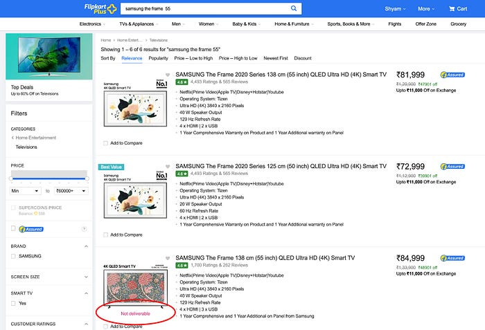
*Search page*

The product and cart pages display the delivery date information.

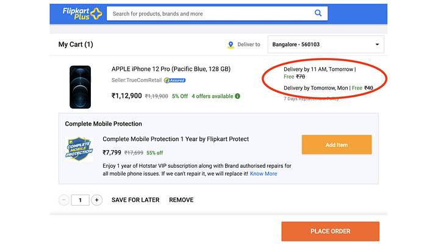
*Cart page*

While providing an SLA (delivery date) to the customer, we identify the sources in which the required item is available, the lanes connecting each source to the customer’s destination, the vendor servicing those lanes, and the applicable policies around them. We choose one option from the list of applicable combinations (fastest, cheapest, etc) to optimize for customer experience.

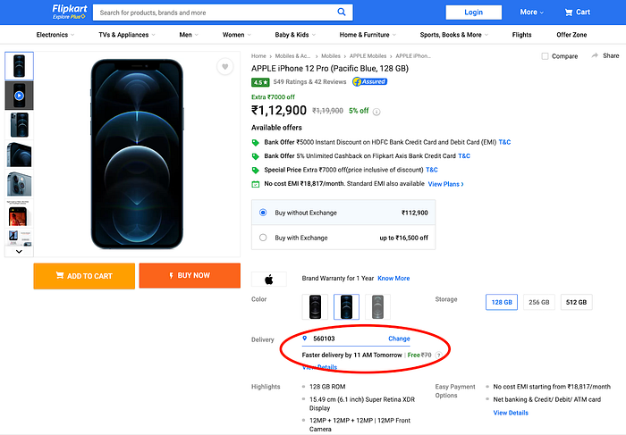
*Product page*

On a broad level, there are multiple ways of moving the item from Location A to Location B which we refer to as **Services** (different delivery options possible over surface or Air), and each Service is provided by multiple **Vendors** (Ekart, BlueDart, FedEx, etc.).

Each Service provided by a Vendor may have restrictions around it being applicable only to certain categories of items (Books, Mobiles, everything large such as Furniture, treadmill, etc.). There may be other additional restrictions such as the Cash-On-Delivery Limit is Rs. 5000. We refer to these governing restrictions as policies.

For every Service, provided by a Vendor on a Lane (Source, Destination combination, for example, Bangalore warehouse Pincode to Mumbai customer Pincode), there is an SLA, Cost, and handover time.

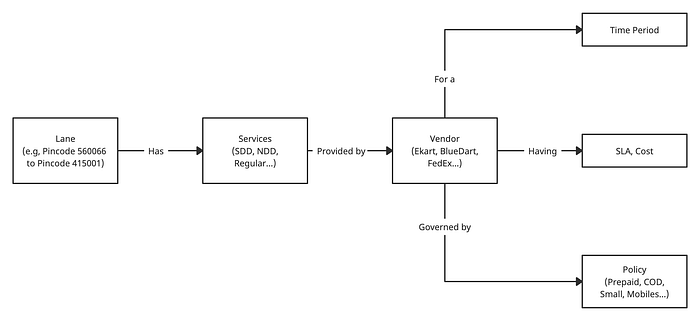

The policy or SLA applicable varies from time to time, making the information temporal in nature.

## How is it modeled?

All the serviceability ingestions are stored in a Document store that acts as a system of record. The computation pipelines fetch the records from this store, do the transformations, and store them in 2 key-value store clusters in a denormalized way to serve the user path queries. One store keeps the detailed information, and the other keeps only lane-level boolean information.

### Detailed serviceability store

In the detailed store, for every combination of [Source (Pincode), Destination (Pincode), Day], all the vendors with the services offered, along with their SLA, cost, and policies, are stored. We have thousands of sources, and the destinations are all India pincodes (~25000), and we store data for 30 days. This amounts to around 760 million keys. The data is kept in an encoded format to optimize size.


*Detailed serviceability store data model*

This store has 80 shards with each shard’s master memory being ~4 GB and the entire cluster’s master’s memory footprint of about _300 GB_.

### Boolean serviceability store

The boolean information store holds the boolean serviceability at source + destination + product attributes granularity.

```
{ Source + Product Attributes --> Set of serviceable pincodes }
```

Product attributes are _Product Type_ (FA/NONFA), _Size_ (Small, medium, large), _Supply chain category _(Books, Mobiles…), etc.

This cluster comprises 20 shards, with each shards’ master memory being 7 GB, so 140 GB is the entire cluster’s master’s memory footprint.

Both the clusters support a few million queries per second with lower double-digit millisecond latencies.

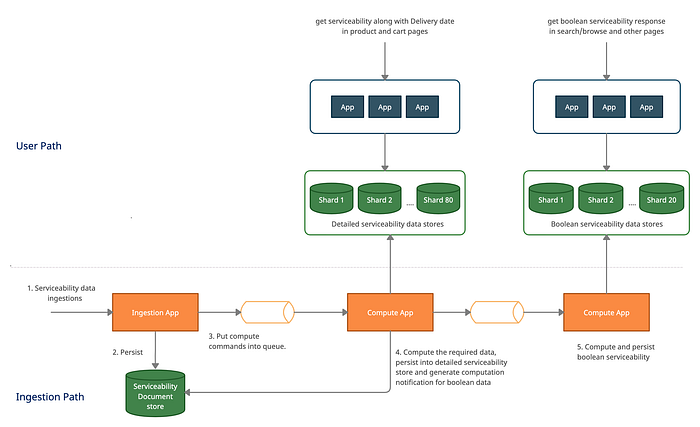
*Existing Architecture*

### Query patterns

We classify the query patterns to serviceability in the user path as follows:

1. Is this product serviceable to this destination?
2. If the answer to (1) is yes, how soon can it be delivered?
3. What are the different services available? (COD, open-box delivery, return, installation, etc.)
4. What are the different services along with their respective varying SLAs and costs available?

The first query is served by the Boolean serviceability store. And the remaining three queries are served using the Detailed serviceability store.

### Characteristics of Serviceability data

**Ingestion rate**: Serviceability data ingestions are done manually by the planning team a few times a day. They are bulky and some delay in reflecting the data is fine.

**Read/Write ratio**: The read:write ratio is upwards of 99 to 1, which requires data model optimization for heavy reads.

## Rethinking Serviceability

As our supply chain network expands and we add new capabilities to it, the serviceability gets complex. In addition, there is an increase in the available choices and the number of use cases needing more accurate serviceability. Example use cases are the display of SLA (and possibly filter) on the search page, show 90 mins delivery option on the landing page, etc.

While the accuracy levels required for each of these use-cases are different and mostly are inversely proportional to scale, the accuracy level expectations as well the scaling requirements are also continually increasing. This, coupled with organic traffic growth to Flipkart further demands a higher scale on serviceability. We will need to rethink various strategies to represent and compute serviceability, to serve these requirements.

## Modeling

Our goal was to represent the serviceability data in a compact form to fit into the App memory with less overhead.

We studied the following data models to address the first query pattern.

### Bloom filters

[Bloom filter](https://en.wikipedia.org/wiki/Bloom_filter) is a probabilistic data structure that says if an element is present in the set. With Blooms false positives are possible, but false negatives are not possible. The false-positive percentage is configured while creating a Bloom filter. Though the data structure is probabilistic, it can store boolean data in a low memory footprint. To answer the yes or no question on serviceability, we will need to keep the data at the following granularity.

```
{ Source, Destination, Product Attributes } --> Yes/No
```

Here the false positives would mean a lane + product combination is shown as serviceable even though in reality it is not serviceable.

There are over a billion key combinations. Storing a boolean value at this granularity took about _1.75GB_ at a false positive percentage of _0.1%_. When we increased the false positive percentage to _1%_, the size reduced to _1.1GB, _still large for app memory. We have seen similar sizes with the[ Cuckoo filter](https://en.wikipedia.org/wiki/Cuckoo_filter) too.

### Custom Bit encoding

The idea is to maintain a map of source_hash to list of destination pincodes. A combination of _Source, Product Attributes_ is a _Source Hash_. There are 52000 source hashes currently.

```
{
  source_hash1 --> {100001, 100003, 100004, 100005},
  source_hash2 --> {100001, 100002, 100008, 100009},
  source_hash3 --> {100001, 100003, 100004, 100005}
}
```

We can maintain a mapping of Pincode to a number (ordinal mapping) to optimize the storage. There are 25 thousand pincodes in India, so we need 25K (1 to 25K) numbers to represent all pincodes.

If we keep a byte array in which each bit represents serviceability to a particular destination Pincode, we would need 25000 bits i.e., 3125 bytes.

```
100001 --> 1
100002 --> 2
100003 --> 3
100004 --> 4
...
...
560001 --> 8212
560002 --> 8213
...
...
620010 --> 20000
...
```

This mapping implies that the source hashes would maintain:

```
{
  source_hash1 --> [10111000 000...],
  source_hash2 --> [11000001 100...],
  source_hash3 --> [10111000 000...]
}
```

If a destination is serviceable, the corresponding ordinal number’s index would be set (used 1-indexed array notation in the example).

To store data for 52K source hashes, we would need 52K byte arrays of size 3125 bytes each. This amounts to _155 MB_.

This approach’s advantage is it is very lightweight to do change propagation, the notification size is only 3125 bytes for any source_hash serviceability change.

### Grouped Bit encoding

This approach is like the custom bit encoding approach. However, assuming that multiple Source Hashes have similar serviceability to multiple destinations, they are not duplicated but a reference of a portion of the bit array is stored and only the overridden values are stored.

Example: Source hash1 is connected to the destination pincode with ordinal 1, 3, 4, 5, 8, 9, 10, and 11.

```
{
  source_hash1 --> d1, d3, d4, d5, d8, d9, d10, d11
  source_hash2 --> d2, d3, d4, d5, d8, d9, d10
  source_hash3 --> d3, d6, d7, d8, d10, d12, d15
  source_hash4 --> d3, d4, d5, d8, d9, d10
}
```

We can see in the above example that the set of destinations [d3, d4, d5, d8, d9, d10] are repeating in multiple source hashes. So we will define an ordinal mapping for it and refer to that instead of keeping the destination ordinals in multiple places. Here we mapped it to _o1_.

```
{
   o1 --> [d3, d4, d5, d8, d9, d10]
}
```

With the ordinal mapping, the final model would be:

```
{
  source_hash1 --> d1, o1, d11
  source_hash2 --> d2, o1
  source_hash3 --> d3, d6, d7, d8, d10, d12, d15
  source_hash4 --> o1
}
```

The worst-case scenario is every Source Hash has an entirely different serviceability value to all destinations which is highly unlikely. This grouping drastically reduces in size and we were able to get to under _50MB_.

That said, all the above models are only capable of providing boolean responses to queries. Adding any additional data which is non-boolean, such as payment limit, fastest SLA, etc. drastically increases the data size.

### Graphs

We looked into graphs to address many more types of queries (2,3,4) mentioned above, and also to reduce the data size. One way to think about serviceability is to represent it as a graph similar to the way a network is created. A source is connected to an MH (Mother Hub), which is connected to one or more MHs/DHs (Delivery Hub) and a DH is connected to multiple pincodes.

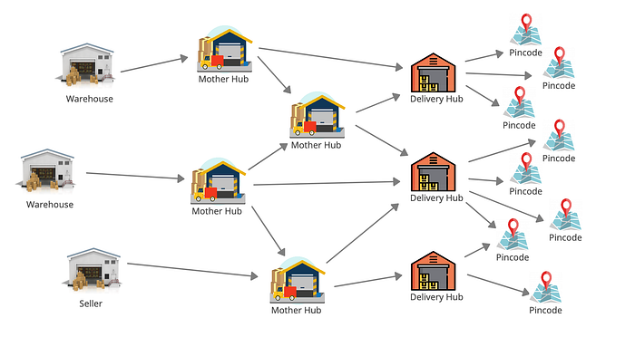
*Supply chain network*

**Network Representation**

One way to model this information is to hold DH level attributes at the DH Vertex, Pincode attributes at Pincode Vertex, and so on. Given that we have multiple vendors in the System, this information had to be stored at a vendor level. The vendor information along with attributes such as SLA, Cost, etc. are maintained at a connection (edge) level. This did not prove to give great benefits. [Neo4j](https://en.wikipedia.org/wiki/Neo4j)’s modeling of this data came to be around 30 GB.

**Adjacency List**

Another way to represent the information was to use the graph for an adjacency list and not store anything on edges. Let us consider the following example. Assume a Vendor can deliver a Mobile from Delhi to Bangalore in 3 days. Similarly, the same vendor can deliver a mobile from Delhi to Hyderabad in 3 days. This, in the network graph, will be modeled as 3 nodes and 2 edges. The data about the SLA will be duplicated on both edges.

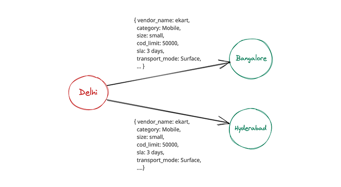
*Network graph*

If we create a node representing “Source + Vendor + 3 days SLA and other attributes”, and connect all the Destinations which are eligible for the same, we would have 3 nodes and 2 edges, but the data on the edge is nil. Instead of creating a node with all the serviceability data, we split the serviceability data into two parts.

**Policy data** — Contains eligibility information for serviceability. — Is Small serviceable, are mobiles serviceable, what is the COD limit, are dangerous goods transportable.

**Service Information** — Contains the SLA and Cost information. How long will a surface transport service take and at what cost, how long will an air transfer take and at what cost, etc.?

A node is created for each Policy, Source & Vendor combination. Also, a node is created for each Service, Source & Vendor combination. These nodes are connected to the destinations where it is valid. This way, we have normalized the combinations of options available and connected them to the right source and destinations.

A side effect of this approach is that the number of nodes/vertices could explode since we are creating nodes with some unbounded attribute combinations like source, vendor, SLA (this is maintained at minute granularity), payment limit, etc. However, in practice, we haven’t seen this happening.

In our final modeling, the number of vertices is less than 600K. The resulting model looks like this.

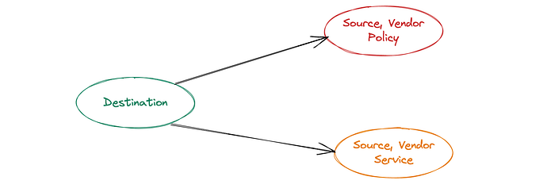

For the above example, the graph would be:

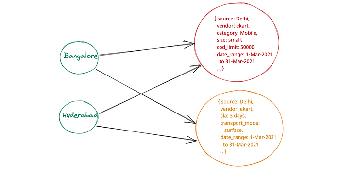

As all query patterns contain a single destination (a customer queries the products for a single destination at any point in time), we always start the traversal from the destination node. A Destination node is connected to multiple Source Vendor Policy and Source Vendor Service nodes. All of them are looked up and used to calculate serviceability.

**We have done trials with different graph models (18 to be precise) before coming up with this vertex modeling where the cardinality is minimal.**

### Implementation

Each node value is hashed and kept in an Ordinal map. The Ordinal map keeps a mapping of Key to Ordinal value. This helps in representing the entire graph as integers.

```
Destinations ordinal map
{
  0: Bangalore
  1: Hyderabad
  2: Delhi
  ...
}
Source vendor service ordinal map
{
  0: { source: Delhi, vendor: ekart, sla: 3days, transport_mode: surface, date_range: 1-Mar-2021 to 31-Mar-2021 ... }
  1: { source: Mumbai, vendor: ekart, sla: 1 day, transport_mode: air, date_range: 10-Mar-2021 to 31-Mar-2021 ... }
  ...
}
```

For example, destination ordinal 0 is connected to source vendor policy ordinals 2, 12, and 15, and source vendor service ordinals 5 and 8. Similarly, destinations 1 and 100 are connected to their respective policy and service ordinals.

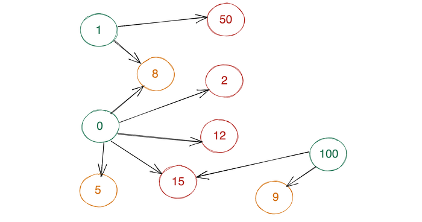
*Example graph*

This entire graph would be modeled using the below 2 arrays. The vertical array is the destination ordinals from where the querying starts. The value of the array has a pointer to an adjacency list which is another array that holds connected vertex ordinals. Instead of maintaining a separate adjacency list for each destination ordinal, a huge single dimension byte array is used to store the connected vertices ordinals. Since only the ordinals are being used and the order of the items in the adjacency list doesn’t matter, we sort the list and store compactly using delta[ variable-length encoding](https://en.wikipedia.org/wiki/Variable-length_quantity) to further reduce the size.

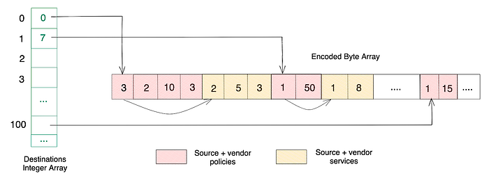
*Internal implementation*

Here destination ordinal 0 keeps a pointer to index 0 of the encoded byte array. The number 3 on this index shows the total number of bytes used to represent the source vendor policy ordinals that are connected to this destination. In case if we are not interested in reading policy ordinals, the number 3 can be used to skip those many bytes and go to the next type of ordinals. The next list of numbers is source vendor service ordinals. Given the numbers are stored in delta encoded form, the connected ordinals 2, 12, 15 are represented using 2, 10, 3 (while reading, the previous numbers’ sum would be added to the current number to get the actual ordinal number i.e., 2, 2 + 10 and 2 + 10 + 3), and 5 and 8 are represented using 5 and 3 (5, 5 + 3).

This modeling has been inspired by[ NetflixGraph Metadata Library](https://github.com/Netflix/netflix-graph). This library provides ways to represent the graph as a simple adjacency list along with capabilities to serialize the graph and store it in a file and build back the graph based on the serialized data. We use these capabilities in our deployment.

Along with the above model, we have done several optimizations around the way we serialize/deserialize and query, to reduce the footprint and computation. E.g, Instead of doing object serialization using apache serialization utils, writing a custom serialization format for our use case allowed us to reduce the data size by 6x and computational overhead by 22x. One useful tool here is[ JMH](https://github.com/openjdk/jmh) (Java Microbenchmark Harness), it allowed us to benchmark different algorithms constantly and analyze the computation time.

### Query & Lookup

All queries are a single lookup on the graph. First, we identify the destination ordinal from the ordinal map, from there we go to the destination's integer array. The array index provides a pointer to the encoded byte array location and using that pointer we identify all the nodes connected to a destination. It has all the Sources, their eligibility, and services. We filter out the required vertices and fetch SLA, cost, etc basis the request parameters.

## Results

With this modeling, the entire serviceability data catering to all the four query patterns listed earlier are represented under _150 MB_** **of App’s heap memory. This has helped in reducing the hardware footprint by allowing us to keep this model in App’s memory and remove both the key-value stores that were present to serve user path traffic while enabling us to scale higher and provide a more accurate serviceability signal.

## Deployment

The graph is an immutable structure, and it is built in a central place periodically and propagated to all the app machines. The apps load this structure in memory and serve the user path queries using it. Here we opted for pull-based clients deployed in each node serving the data instead of a push-based notification mechanism as it might be lossy and would require reconciliation.

### The New Architecture

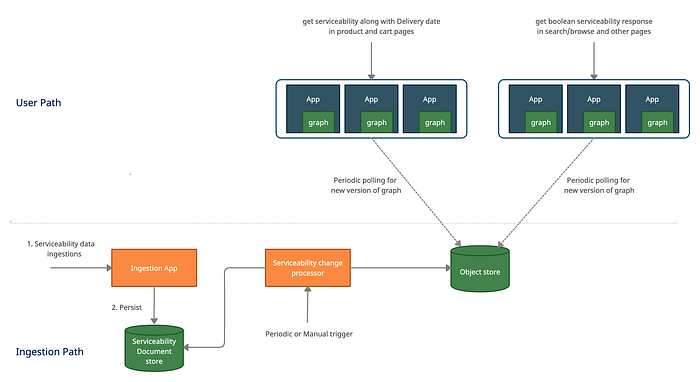

1. All the Serviceability data ingestions are persisted to the Serviceability Document store.

2. The serviceability change processor builds the graph. It periodically

- Fetches all data from the source of truth and creates a graph (or) fetches the ingestions that have been done since the last graph build to the present and creates a new version of the graph by applying these ingestions to the previous graph.
- Serializes the new graph and writes to disk.
- Compresses the graph files written to the disk using the [**_lzma_**](https://en.wikipedia.org/wiki/Lempel%E2%80%93Ziv%E2%80%93Markov_chain_algorithm) algorithm and uploads the compressed file to the Object store with a new version number. We experimented with multiple compression formats with different configurations. lzma worked best in that the compressed output file size is _9 MB._

3. The apps periodically poll the Object store to check if there is a new version of the graph, and whenever they detect a new version, they download the compressed file, decompress it, load it into memory, and keep it as a passive graph object.

4. All the apps would do an atomic swap of an old graph with a new graph version at a specific time based on their clocks (clock skew can still result in inconsistencies) to avoid serviceability inconsistencies being displayed to the customer.

## Way forward

Currently, we are computing the entire graph periodically and propagating it. In future, we plan optimization of the update pipeline to allow delta updates rather than entire snapshot updates. This will enable us to have a faster TAT for updates and also reduce the network bandwidth utilized for updates.

**_References_**:

- [_Bloom filter_](https://en.wikipedia.org/wiki/Bloom_filter)
- [_Cuckoo filter_](https://en.wikipedia.org/wiki/Cuckoo_filter)
- [_JMH_](https://github.com/openjdk/jmh)
- [_Variable-length encoding_](https://en.wikipedia.org/wiki/Variable-length_quantity)
- [_NetflixGraph Metadata library_](https://github.com/Netflix/netflix-graph)
- [_lzma lossless data compression algorithm_](https://en.wikipedia.org/wiki/Lempel%E2%80%93Ziv%E2%80%93Markov_chain_algorithm)

---
**Tags:** Scalability · Design · Architecture · Engineering · Data Modelling
