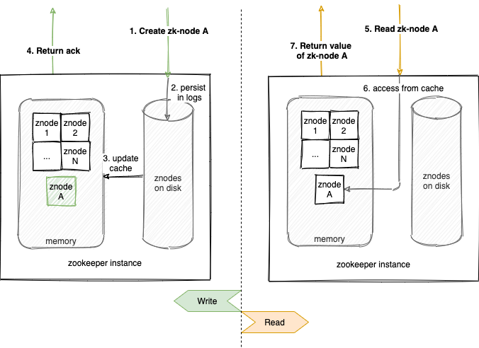
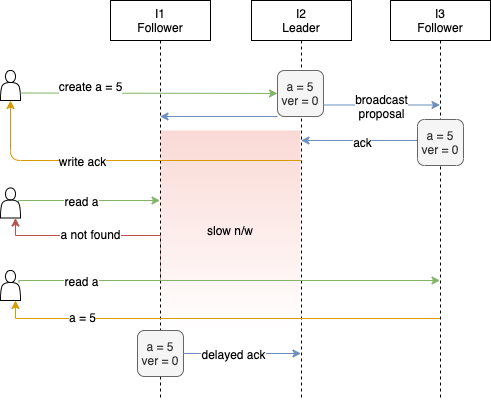
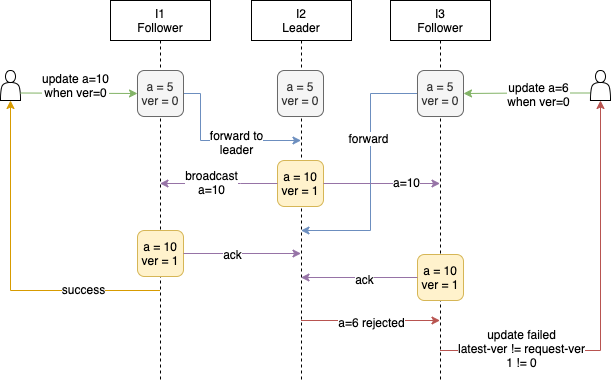
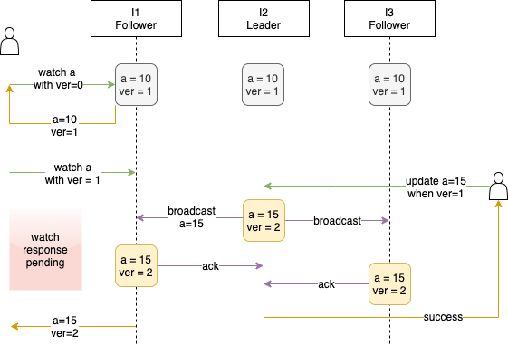
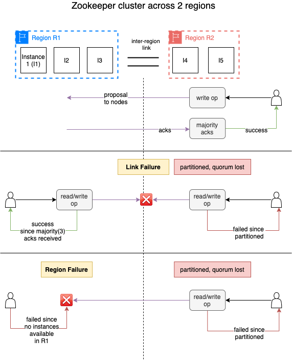
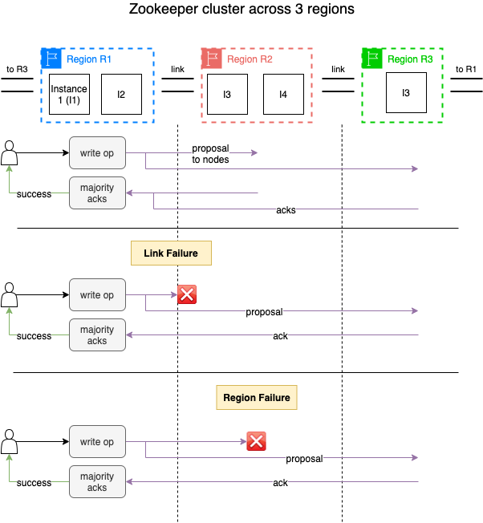
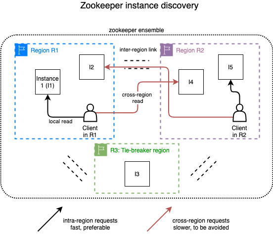
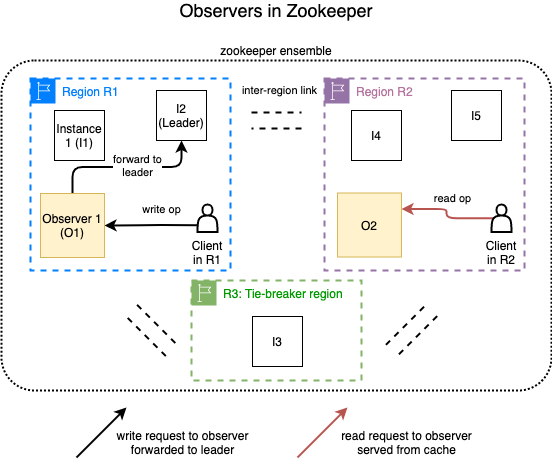
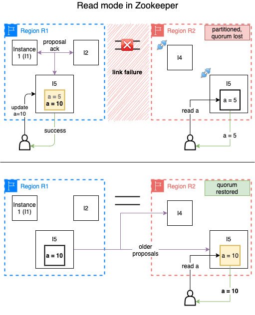

# Running a multi-region Zookeeper

[Zookeeper](https://zookeeper.apache.org/) defines itself as “a centralized service for maintaining configuration information” among other things. To model data, it uses [znodes](https://zookeeper.apache.org/doc/r3.6.2/zookeeperProgrammers.html#sc_zkDataModel_znodes) which have a path as an identifier and hold a value. At Flipkart, we use zookeeper as the backend of choice for a platform which offers configuration management for multiple applications. A znode representing each configuration object stores a small JSON payload. The platform also propagates configuration **changes to the interested clients and influences their runtime behaviour in time-sensitive use-cases.**

At Flipkart, we often deploy applications in active-active mode, serving user or internal traffic from multiple regions. This ensures that we remain resilient to failure of one datacenter or availability region so we can remain available to our customers and sellers alike. Supporting such constantly available applications often demands that our platform offer global configuration objects, i.e. available for reads and writes across regions.

In this article, we begin with an illustrative recap of relevant features and facts of Zookeeper. We further describe a compiled set of best practices that worked well for us at Flipkart, when deploying zookeeper to ensure the following aspects:

1. Strongly consistent writes across regions: Zookeeper to achieve coordination in a multi-region quorum.
2. Handling single region failure or link failure: Zookeeper to be available for reads and writes in other regions even if one region goes down entirely or gets cut off temporarily from others.
3. **Remaining read-available in the isolated region**: Zookeeper to be available for reads if a region becomes isolated from others (multiple link failures).

---

## Zookeeper: An illustrative recap

### KV store that serves from in-memory

Zookeeper can act as a **KV**** ****stor**e for only small datasets since the entire data **has to fit in memory of a single instance**, regardless of the number of instances in the cluster. The flip side of this is that the reads are fast.

The following illustration is a simplified view of reads and writes in a single instance setup.

### Any write operation needs ack from a majority

In a 3-node setup, this means that the write has to be acknowledged by at least 1 more follower (since the leader processes the write request anyway). This can cause other follower(s) to serve [stale data](https://zookeeper.apache.org/doc/r3.6.2/zookeeperProgrammers.html#ch_zkGuarantees) for some period from the point of view of the user. You can read more about sequential read consistency offered by zookeeper [here](https://zookeeper.apache.org/doc/r3.6.2/zookeeperInternals.html#sc_consistency).

> **ZAB Simplification  
> **The following illustration is a much simplified representation of how **consensus is established between zookeeper nodes**. For example, [ZAB Protocol](https://distributedalgorithm.wordpress.com/2015/06/20/architecture-of-zab-zookeeper-atomic-broadcast-protocol/) involves a commit step which we skip here for brevity.

### Writes are ordered

Every znode has a version which gets updated on a successful write operation. The version is used to detect any concurrent modifications that are being made to a znode. Zookeeper rejects such a write proposal and ensures consistency.

### Zookeeper supports adding watches on znodes

It enables building change propagation systems on top of zookeeper while not requiring clients to constantly poll. A client connects with any instance in the zookeeper cluster using a znode path and a known version to set up a watch. The server notifies the client whenever the znode is updated/deleted or created( in case of a non-existent znode).

---

## Multi-region Zookeeper: What, Why & How

We define multi-region zookeeper as a deployment where voting members of the cluster are spread across more than one region. It allows us to offer centralized configurations to active-active applications and insulate the platform against datacenter/region failures and network partitions.

In this section, we look at some of the helpful best practices when deploying zookeeper across regions in a production environment.

### Deploying instances across at least 3 regions

Zookeeper is a consensus-based datastore. The cluster consists of voting members which participate in the quorum and optionally non-voting members too which are covered later in the post. A write is successfully acknowledged to the client once it has been internally [acked by the majority](https://zookeeper.apache.org/doc/r3.6.2/zookeeperInternals.html#sc_activeMessaging) of the voting members. This implies that as long as there are (n/2) + 1 instances available in a zookeeper cluster, it remains available for writes as well as reads.

Typically, the zookeeper is run with an ensemble of size 5 or 7. For a multi-region zookeeper, if you spread 5 instances across two regions fairly, it would mean 3 instances deployed in Region 1 (R1) and 2 instances in R2. This setup has a major drawback. In case of link failure or region failure of R1 (which has majority instances of the cluster), clients in region R2 see unavailability as they cannot do write or read operations.

As compared to the above, if zookeeper instances are deployed across three regions, it is possible to remain available for clients despite a single region failure (any) or a link failure between any two regions out of three. For a cluster of size=5, this would imply deploying 2 instances in R1, 2 instances in R2 and 1 instance in R3.

> **No region should have a majority  
> **The rule of the thumb is that no one region should have a majority of the instances. This ensures availability despite region or link failures. For an ensemble of size=7 nodes, some of the placement strategies that can work are:  
> 3,3,1  
> 3,2,2

### Avoiding cross-region client connections

Clients can connect to any zookeeper instance for issuing reads and writes. While write requests are forwarded to the leader, reads are served by the instance from its in-memory cache.

If clients end up connecting to a zookeeper instance which is not in the same availability region, cross-region latencies will be incurred in every request/response.

This can be avoided by ensuring that clients in an availability region only discover the local instances of a multi-region zookeeper cluster (provided the zookeeper has instances in that region). One way to do this is by keeping region-specific domains for the zookeeper cluster.

> **Caveat**: If there is a partial disaster or network partition which makes the local zookeeper instances unreachable, clients deployed in that region will see unavailability unless they can discover zookeeper instances of other regions.

### Scaling up reads using observers

If cross-region client connections are not preferred, it implies that in a 5 instance cluster across 3 regions, clients can connect to only 2 instances for any read/write request. Since zookeeper is often used in read-heavy workloads, it is often required to scale up “get” and “watch” requests beyond what existing zookeeper instances can offer.

**Observers enable this by acting as a non-voting member of the ensemble and which can serve any read requests of the clients with eventually consistent guarantees, same as that provided by the voting members**. The primary difference is that observers do not take part in the quorum for proposals.

### Enabling zookeeper read mode

When a zookeeper instance gets partitioned from the rest of the cluster, it does not serve reads or writes and clients get disconnected. Some applications for which we use zookeeper as a backend store can do with stale reads (not out of order though) for a short period but cannot compromise on read availability.

In such situations, [zookeeper read mode](https://zookeeper.apache.org/doc/r3.4.13/zookeeperAdmin.html#Experimental+Options%2FFeatures) can be a lifesaver. If enabled on a zookeeper instance, it[ allows stale reads to be served to connected clients](https://cwiki.apache.org/confluence/display/HADOOP2/ZooKeeper+GSoCReadOnlyMode) when it is partitioned from the cluster. When connectivity resumes, this zookeeper instance sends missed updates over watches setup by the clients.

This is especially handy when you have a multi-region zookeeper cluster across only 2 regions. Enabling read-mode allows zk instances in a region to be available for reads, even if that region is partitioned from the other region for a short period. Popular client library “curator” [provides an explicit event](https://curator.apache.org/errors.html) which clients can listen to for getting notified when the zookeeper instance they are connected to has gone into read-only mode.

### Configuring tick time

[Tick time](https://zookeeper.apache.org/doc/r3.6.2/zookeeperAdmin.html#sc_minimumConfiguration) is the unit for time measurement in the zk cluster and directly governs client session handling and heartbeats across instances. For example, if an instance in a zookeeper cluster does not respond with a heartbeat in enough ticks, it is considered unhealthy/unavailable.

While the default value of 2 seconds is usually good enough, tweak `tickTime` for a multi-region zookeeper, depending on the latency characteristics of inter-region network links.

### Avoiding write-heavy workloads

Given how writes are delegated to the leader in the cluster and how each write requires an ack from a majority of the ensemble to maintain global ordering, zookeeper is not tuned to handle access patterns that create/update/delete predominantly.

Read requests should be at least one order of magnitude more than the writes in the cluster. In fact, we strive to have 2–3 orders of magnitude of difference between the number of read and write requests in our production setups. In a multi-region zookeeper, the probability of a large volume of writes degrading the cluster becomes further amplified because of the added cross-region latencies.

Rate limits do not come inbuilt with Zookeeper. If you do not control the behaviour of the clients, it is prudent to have an API layer with which your clients interact. This way, you can gate the underlying access to zookeeper and protect it from malicious or unintended abuse.

### Onboarding to traffic prioritization constructs

This may not apply to everyone. If you have private datacenters and maintain/manage network infrastructure for connectivity across these, it is likely that you will build or onboard to traffic prioritization, ensuring critical network traffic is guaranteed certain bandwidth. This ensures that a rogue application cannot saturate the overall bandwidth available across inter-region network links.

When you are running a multi-region zookeeper, if traffic prioritization constructs exist, they can ensure that the chatter between zk instances is treated at higher priority and is guaranteed certain QoS.

---

## Summary

A zookeeper cluster, when deployed across at least three regions such that majority of the instances are not in any single region, can ensure read and write availability in the face of network partitions and region-level disasters. Global zookeeper clusters deployed like so can act as an underlying configuration store for active-active applications. Such a cross-region deployment can also make use of:

- Zookeeper read-mode for ensuring higher read availability
- Observers for scaling of reads
- Local instance discovery for lower request/response latencies

---
**Tags:** Zookeeper · Tech · Backend · Cloud · Distributed Systems
