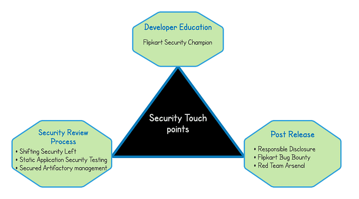
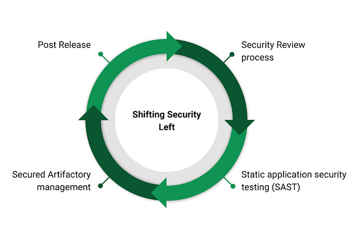
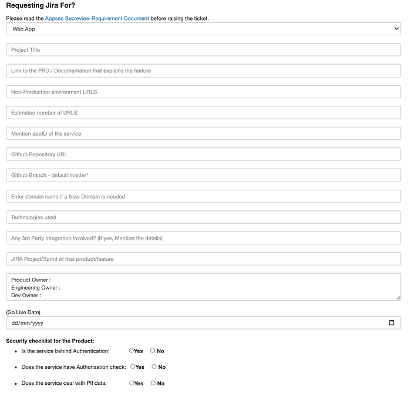
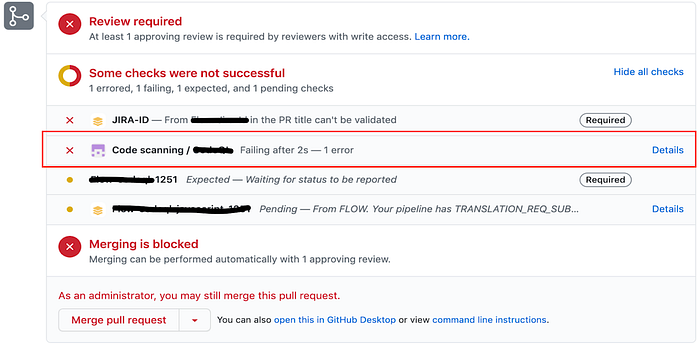

# Securing the Billion Dollar App

## Introduction

From its inception, Flipkart has always emphasised on Information Security. We believe security is an integral part of everything we do. Flipkart incubated a security team way back a decade where the team was primarily responsible for securing our online retail website.

As the organisation grew, it also added many new internet properties to its portfolio, followed by many acquisitions. This exponential growth also challenged the way we think of information security and also redefined how we scaled up Security.

This year 2021 marks the completion of one decade of the Flipkart Security team and here is a walkthrough of how we approach product security at Flipkart.

## Establishing the Security Touchpoints

At Flipkart, the high ratio of security engineers to developers makes the scaling of manual security processes difficult.

While building software in an agile development environment enables the right agility and flexibility to our development teams, we also wanted security to work in tandem with our current Software Development Life Cycle.

An important aspect of building a strong Product Security charter is to define the right security touchpoints baked into the process. Baking the right tooling and process mix in every touchpoint was one of our primary objectives to yield its maximum security benefit.

Over the last decade, each of the following touchpoints has had its own maturity curve optimised to cater to the ever-growing Flipkart technology landscape:

- Developer Education
- Shifting Security Left
- Post Release Process

## Developer Education

Developer education is an important security touch point where we educate the developers to write secure code by giving them the correct distinction between secure and insecure code.

We believe that fostering a security mindset requires a continuous investment in a conducive environment for engineers to learn security the right way. We identified the following challenges in classroom training sessions for our developers:

- Limited number of per-session learners
- Complex full-session student engagement

To solve this problem, we launched the Flipkart Security Champions program this year, which is an interactive and gamified platform for developers to learn security in a ‘fun and competitive’ way. The champions program provides a linear security learning curve for developers by introducing three layers of security certification (Easy -> Medium -> Pro). The investment in Developer Education has helped us create a ‘Security-First’ mindset within the developer community, reducing the number of recurring security issues in our online properties.

As a security team, we strongly believe that if we can build the right security citizens within Flipkart, a good majority of our security goals could be met more efficiently.

## Shifting Security Left

Every organisation has its own ways of implementing shift left security, as what works for one may not work for the other.

Our Shift left journey began a couple of years ago when we realized the need to provide the right security visibility to our developers way ahead in the development journey. This strategy has undergone multiple iterations, clubbed with intensive learning experiences.

## Security Review process

One of the early initiatives we undertook was to standardize the way we do security reviews. Our primary goal here was to have a single pane of glass for every offering that product security has for the engineering teams.

During our early days, our product security team received a review request primarily over emails with very little context on the feature release or the overall product itself.

For instance, in a review request where the requestor has sent us the Request/Response parameters with no context on feature or product specification a security engineer would require more data than just the Request/Response body to work on.

This context building used to be via iterative email threads or face-to-face dialogue with the engineering counterpart. Questions such as “when is the go live date for the project?”, “where can we review the Product requirement/architecture documentation?”, “what is the code change log?”, would be mere email conversations with no back-tracing ability. It used to be a productivity killer for both the teams. We resolved to make this our first goal in the attempt to standardize the product security approach in Flipkart.

We spun up a quick security request portal, which accounted for all these prerequisites as our own one-stop destination. It holds our complete offering of product security portfolio ranging from Threat modeling, Application reviews (Web, mobile), Data security requests, to Third party integrations.

Now, all the product security services get requested via this portal, where the requestor provides all the details right in the request itself. The Sec-review portal is integrated with our backend ticketing system, where all the requested data gets attached to the ticket, providing easy tracking and also enhanced accountability.

## Static application security testing (SAST)

In our experience, having the right SAST security strategy is as important as selecting the right code scanning tool. Many times, just integrating a SAST tool in the pipeline with no or minimal security governance may not yield its maximum benefits.

Our code scanning strategy provides maximum security visibility to our developers in the development phase of our SDLC. Every new line of code pushed to our critical repositories is scanned and all the pull requests are populated with the code scan results. The PR (Peer Review) reviewer can use this to remediate the code as required before merging with the master branch.

The above picture shows a code change initiated by a developer where the new code went through our security scanner and provided the results in the code-scanning section.

The developer/reviewer uses this data for code sanity related to security bugs. All the bug details are visible to the developer in the “Details” section of the code scanning block. Once the bug is fixed and the respective code changes are pushed, the reviewer merges the code with the master branch for deployment.

This visibility to our developers has reduced the security vulnerabilities in our production-facing applications.

## Secured Artifactory management

As with any other organization, we have a strong dependency on open source software and a stronghold of what we consume within our code repositories is important. We rely on our commercial partners to help us achieve a right security balance here. Our secured artifactory allows only certified artefacts and bug free dependencies in our development environment with regular feedback signals on zero day security issues.

## Post Release

As we continue to expand our technology footprint on the internet via various acquisitions and geographical expansions, human-driven security engineering cannot scale, hence, we need feedback-driven automated systems to keep pace.

We strongly believe in continuous security assessments once a service goes live on the internet. Be it our automation suite, our external bug bounty or our responsible disclosure program, we have always emphasised the importance of automated red team strategies.

Having a 24/7 post release monitoring strategy is today’s need of the hour to prevent a security apocalypse because of an inadvertent code change which might have got missed through all our existing controls.

## Responsible disclosure

We launched our vulnerability responsible disclosure program back in 2015 where we started acknowledging security researchers who reported valid security issues in our internet facing properties. We have our public disclosure page live at [https://www.flipkart.com/pages/security](https://www.flipkart.com/pages/security).

Our security team triages all the reported security issues, giving due diligence on the issue remediation and timely acknowledgement to the researcher.

## Flipkart Bug Bounty

Security landscape is extremely precarious, with new zero days getting reported every day. We believe having an extended security army to our existing security team is a boon. We have been running a successful bug bounty program for the last 4 years and have seen massive success with the quality of security issues which we have received.

Currently, we run a private bug bounty program with our security partner [HackerOne](https://www.hackerone.com/), where we selectively invite researchers to work with us. However, if any researcher wants to be part of our hacker pool, we do also send them invites via the platform.

## Red team Arsenal

Automating low hanging security issues provides a certain level of confidence to the security team about any inadvertent issues making their way to production. Although these issues are caught earlier in our development life cycle, a few might miss all our guardrails. We worked on an automation suite which monitors all our internet facing properties for any random port openings, sub domain takeovers, SPF record changes, clubbed with open source intelligence gathering for any Flipkart-specific data leaks on the internet.

Flipkart Security team has always contributed back to our security community by open sourcing home grown security tools for public consumption. We had also open sourced our red team arsenal back in 2018. If you would like to give it a try please check the project [here](https://github.com/flipkart-incubator/RTA)

We partner with security vendors to provide a complete Continuous Attack Surface Testing which gives us more security visibility on our online properties.

## Way Forward

This article is a glimpse of what we do in-house to keep the Secure flag high for all of Flipkart’s internet properties. The journey has been a carefully laid down path to where we stand today. With the growing internet landscape and newer online businesses, we can foresee new team members, applications, technologies, and challenges in the security world. This makes Flipkart security an important continuous improvement process for providing a secure app experience.

Bookmark this space for more detailed coverage on each of these sections about Flipkart

---
**Tags:** Security · Information Security · Infosec · Cybersecurity · Product Security
