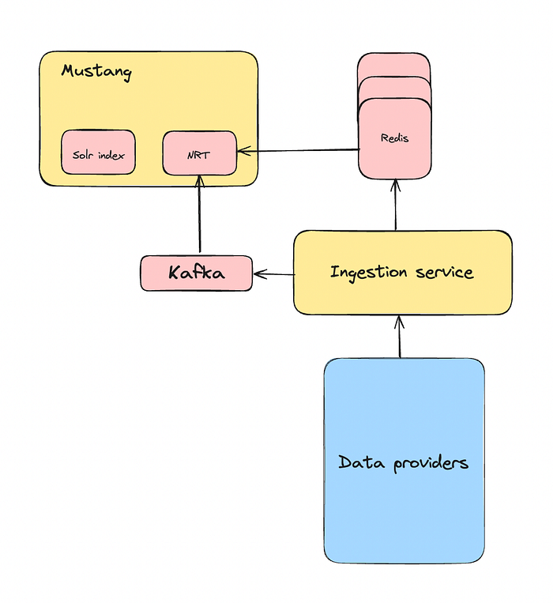
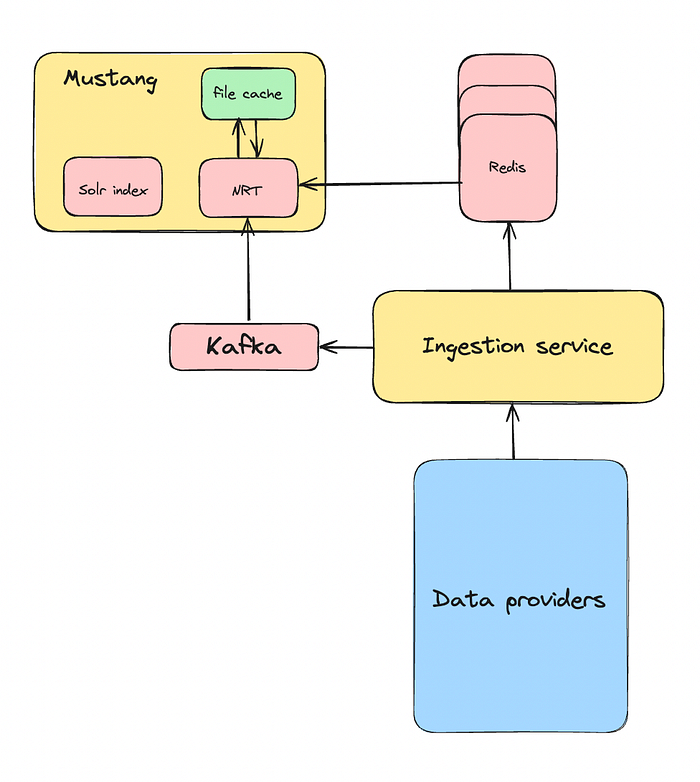
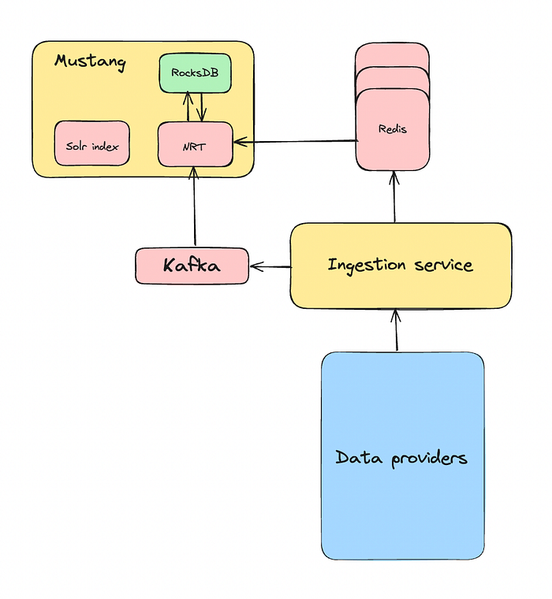
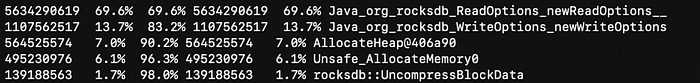

# Server bootstrap optimization using RocksDB

## Introduction

In Flipkart’s search infrastructure, the foundational service, Mustang manages the SOLR index. Currently, we operate on various shards catering to various business units such as Flipkart, Grocery, Hyperlocal, and Shopsy. Each shard hosts a varying number of replicas, determined by the volume of data and the volume of requests directed to that shard.

Each replica contains two primary data components: data stored on disk (product-related data, served by SOLR) and data stored in memory (seller-specific listings data) for fast-changing attributes, referred to as NRT ([Near Real-Time](https://blog.flipkart.tech/sherlock-near-real-time-search-indexing-95519783859d)) data. Upon the application startup, the in-memory data structures are constructed by fetching data from a centralized Redis cluster. These in-memory data structures are also updated by a Kafka pipeline so that they remain in sync with Redis.


*Mustang’s existing architecture*

On an average, each replica holds data for approximately 15 million listings. The process of building these in-memory data structures during startup takes around 30–40 minutes. The principal bottleneck in this process is Redis, which struggles to handle the influx of concurrent requests during deployment (because the size of this cluster is close to 400 VMs in each DC).

This entire procedure significantly slows down our deployment, extending it to at least 2 days. It not only affects the developer’s productivity but also poses challenges in deploying timely bug fixes.

In this blog, we discuss how we optimized Mustang’s bootstrap time using RocksDB.

## Problem analysis

Our Redis cluster choked up whenever the Mustang servers were restarted. Even a rollout factor of 10% resulted in around 40 Mustang servers hitting Redis with ‌more than 300K calls in parallel. The reasons for this huge number of concurrent requests were the number of poller threads and their batch size in each server.

Also, getting the data for a listing from Redis was not a straightforward Redis GET operation. We have written a library that abstracts out the logic of building the listing POJO from Redis but it internally fires multiple concurrent calls to Redis to get the data for various attributes and then merges them to create a single POJO.

For instance, offers associated with a listing were stored as a SET within Redis, while availability data for different serviceability zones was stored as a BITFIELD. Retrieving data for both required distinct queries to Redis, and parsing the responses differed accordingly.

Exploring the bottleneck in a bottom-up manner seemed like a good option. So, we started with Redis.

## Tuning Redis

We experimented with tuning the batch size and thread count of poller threads in each application server but didn’t see any improvement in the overall performance. Even though the latency for each batch was reduced a little, we ended up having more batches to be processed in total which nullified any gains.

We also found a handful of listing attributes that were unused but were still part of the listing POJO. Removing them from the POJO gave a small boost in performance, but it was still not enough.

We also explored an option of increasing the number of replicas in each shard of our Redis cluster to have a better load balancing but this was not practical for us because the cluster remains idle most of the time and is only used during Mustang’s deployment. We did not see value in adding more resources here.

As further optimization of Redis was difficult, we explored options on the application’s server side.

## Generating a file cache

The idea was to retrieve data from Redis just once to construct the in-memory data structures, and then cache it locally for future deployments.

To do a quick POC of the same, we wrote a shutdown hook that would serialize all the in-memory data structures in separate files on the local disk. On startup, the application would de-serialize the locally stored data and load the in-memory data structures.


*Mustang’s architecture with file cache*

The idea seemed promising in the beginning but various problems surfaced later. Some of them are mentioned below:

1. Our in-memory data structures are essentially different segments in the code (and in memory) but all of them are derived from the listing data. If something goes wrong while serializing just one segment, we can’t reload that segment without first reloading all the listing data. This means that even if just one file gets corrupted, we have to throw away all the serialized data and bootstrap the entire data from Redis again.
2. Listing data remains the same for each shard, but these in-memory data structures may vary between application servers, even within the same shard. This variation arises from the random nature of the ordinals we use for identification of listings within these data structures. These listing ordinals are generated during the asynchronous process of loading SOLR index files on a first-come-first-served basis, making them non-deterministic. Hence it is impossible to share the serialized files among the other replicas of the same shard.
3. The code seemed messy because we used Jackson for serialization and deserialization. Jackson requires specific getters and setters in our code to function properly. This caused complications, especially when dealing with inheritance or when we already had getters with custom logic instead of simply returning the attribute.

These limitations required a more robust and elegant solution. An embedded database approach seemed promising based on POCs and we ended up choosing [RocksDB](https://rocksdb.org/).

## RocksDB to the rescue

### Why RocksDB?

Let’s take a moment to understand why we chose RocksDB.

1. It is an embedded database. This means that you don’t have to run it on a centralized server. It can be directly used in your code as a library. Since we were trying to move away from a centralized solution, this was perfect for us.
2. It provides configuration options for tuning based on your needs.
3. We saw promising results when we tested it with various workloads, which gave us confidence in its performance.
4. It is quite a popular database and has wide industry usage (see how [X](https://blog.x.com/engineering/en_us/topics/infrastructure/2022/data-transfer-in-manhattan-using-rocksdb) uses it to solve a similar problem, how [Cloudflare](https://blog.cloudflare.com/moving-quicksilver-into-production) uses it, also check its integration with [MySQL](https://myrocks.io/) as a storage engine and many more)
5. It has very active [community](https://github.com/facebook/rocksdb) support (maintained by Facebook)

These data points were really helpful in narrowing down our search for a good embedded database to RocksDB.

### RocksDB’s storage schema

Once we had decided on the choice of the embedded database, we worked on integrating it into our code. The task was simple. We wanted to fetch data from Redis once and then store it in RocksDB so that any subsequent deployment could use the locally stored data.


*Mustang’s architecture with RocksDB*

To keep things simple, we designed a straightforward storage schema. Each row in RocksDB held the data for a single listing. The key for each row was the listing’s ID, while the value was the serialized listing POJO. It looked something like this:

```
“LISTING_1”: “{\”attribute_1\”: \”value_1\”, \”attribute_2\”: \”value_2\”}”
```

Apart from simplicity, another major reason to choose this kind of schema was the granularity of operations. With this schema, we could upsert or fetch a single listing or a group of listings as required by the application. If data for some listings was not present in RocksDB, then we can simply fetch those missing records from Redis in the next bootstrap phase and update RocksDB with the same. The system behaves in a self-healing manner.

This laid the foundation for our solution, but there were still a lot of things to be figured out. We will talk about some other challenges in the following sections.

### Solving stale data problem

Fetching data from Redis once and storing it locally was not enough because of the fast-changing nature of our business. Most business requirements at Flipkart need some changes in the listing attributes (and some similar schema changes for the in-memory data structures). So, when that happens, the data stored in RocksDB becomes incompatible with the application’s schema.

To handle this, we stored a hash of the in-memory data structure’s schema in RocksDB along with the listing data. This schema is compared with the latest schema (stored in the code) whenever a deployment happens. If there is a schema mismatch, we can simply discard RocksDB’s data and refresh it with the latest data from Redis.

This approach worked okay, but it turned out that 60% of our Mustang deployments involved changing the data structure. That meant we were still relying on Redis for most deployments, which wasn’t ideal.

So, we came up with a better plan. We knew that all the replicas within the same shard had the same listing data. So, why not create RocksDB data from a single random replica of each shard, store it on GCS, and then use it for other replicas in that shard?

The logic was easy to implement. We wrote a validation layer in our code that would compare the schema hashes at the time of Mustang startup. If they are the same, then the application loads the data from RocksDB but if they are different, then the application deletes the local RocksDB data and fetches the latest data from GCS, and then continues to load the data from RocksDB.

If there is no data present on GCS, then it falls back to Redis to bootstrap the data. Our deployment pipelines were changed to handle this type of deployment as well. Whenever there was a schema change, the CI pipeline would pick a random replica from each shard, deploy the latest code on it, let it bootstrap from Redis and then upload the local RocksDB data to GCS. The remaining replicas would then automatically pick up the data from GCS when their local data would invalidate.

### Dealing with Kafka updates

While dealing with updates from Kafka, we needed to make sure that our data in RocksDB stayed up-to-date with what was in Redis. We streamlined this process by developing a dedicated class to intercept Kafka updates and add them to RocksDB before reflecting changes in the in-memory data structures.

Given that we were storing the entire POJO in RocksDB, we had to do a read-modify-update operation to update the data. The primary technical hurdle revolved around managing potential update failures within RocksDB to ensure that upon Mustang’s next restart, it could retrieve the most up-to-date data from RocksDB.

To mitigate this, we implemented error handling within a try-catch block. If an update failed for any reason, we simply deleted the corresponding listing from RocksDB. In the rare event of a deletion failure (even after retries), we opted to clear the entire RocksDB dataset upon shutdown. Note that even if the RocksDB update failed, we still updated the in-memory data structure so that there is no data discrepancy for the user.

There was one more problem that we needed to address. If Mustang starts reading the Kafka events from the latest offset (which was the default nature in the existing system) after bootstrapping from RocksDB, then there could be some data loss. That’s because RocksDB doesn’t get the updates while Mustang is restarting. This was not a problem for us earlier because Mustang used to bootstrap from Redis which is the source of truth and hence it could safely start reading from the latest Kafka offset.

To solve this problem, we started storing the Kafka offsets of all the partitions in RocksDB while shutting down. Then, while starting up, Mustang would seek back to the stored offsets of the respective partitions. If, for any reason such as an application crash, the offsets are not found in RocksDB, we discard the local dump. Additionally, if the disparity between the current offsets and the stored ones is substantial, we also discard the local dump. This decision is based on the understanding that refilling such a significant data gap would take considerable time. The threshold for this disparity is determined by estimating how many updates Mustang can typically process within a five-minute timeframe.

### Tuning RocksDB for our use case

Till this point, we were able to successfully integrate RocksDB into our codebase. The time taken by Mustang to bootstrap the in-memory data structures had come close to 15 minutes from 30 minutes. We believed that we could get more out of RocksDB if we understood our access patterns better and dive into RocksDB’s internals.

Our workload was a mix of both writing and reading. While bootstrapping the data from Redis and inserting it into RocksDB, is entirely write-heavy, for subsequent deployments, it is always read-heavy. We could only optimize for one of these patterns and we decided to optimize the reads (for obvious reasons).

Given below are some optimizations that worked for our use case:

1. **Switched off cache:** LRU-based block cache is recommended to be used in any RocksDB use case but it suffers from a severe lock contention. Given that our use case was to read listings mostly during the bootstrap phase (which is a read-once pattern), we switched off the cache for data blocks.
2. **Used Leveled compaction**: The leveled compaction strategy gives a better read and space amplification compared to the size-tiered (AKA universal) compaction strategy.
3. **Reduced number of levels in the LSM tree:** The number of levels in the LSM tree is an important property of the LSM tree in RocksDB. It determines how many levels will be there in the LSM tree. Many levels are beneficial if at least a significant amount of data being fetched is hot, otherwise it affects the read latencies. This was not the case with us as our access pattern is random. We reduced the num_levels from 7 (default) to 3.
4. **Triggered periodic full compaction:** RocksDB works best if it’s in the best shape. What this means is th​​at the read performance of RocksDB will be best if the read amplification is the least. To reduce the read (and space) amplification because of the Kafka updates, triggering a full compaction manually gives us the best result. We wrote an async thread that triggers full compaction once a day during off-hours.
5. **Turned off the WAL:** By default, RocksDB stores all the writes in a WAL along with the memtable. We turned the WAL off given that our use case was self-healing in nature and no data could have been lost.
6. **Used multiGet() to read data:** RocksDB gives various ways to read data from the DB. You could either fire a _get()_ command or a _multiGet()_ command. [_multiGet()_](https://github.com/facebook/rocksdb/wiki/MultiGet-Performance) is more efficient than multiple _get()_ calls in a loop for several reasons such as lesser thread contention on filter/index cache, lesser number of internal method calls, and better parallelization on the IO for different data blocks.
7. **Sorted and batched the listings**: We sorted the total set of listings and then created smaller batches out of it before fetching the data from RocksDB. This reduced random disk IO because the sorted listings were co-located on the disk which increased the chances of them being in the same or closer pages on the disk.

These optimizations collectively slashed the bootstrap time from **15 minutes to around 6 minutes**, marking a significant milestone in our quest for efficiency.

You can read [this](https://github.com/facebook/rocksdb/wiki/RocksDB-Tuning-Guide) tuning guide for more details.

## Taking RocksDB to production

With everything set up, we were eager to bring RocksDB into production. However, introducing a new technology into our stack meant we needed to proceed cautiously to prevent any disruptions. We implemented relevant metrics to monitor how Mustang interacted with RocksDB and mitigate risks. We then initiated deployments on a limited number of replicas within each shard.

### A minor hiccup

Soon after deploying the latest code on a few Mustang servers, we started seeing a degradation in the response time. On digging deeper, we found out that the entire VM’s memory was being consumed slowly over a few days. This excessive memory usage hindered Solr’s ability to cache index-related files (ultimately causing excessive disk utilization during runtime), resulting in increased latencies. It was obvious that the Java application alone wouldn’t be able to cause this memory leak because it has a fixed chunk of memory allocated to it (in the form of heap memory) at the time of startup and it only uses a little extra native memory on top of that for JVM to function (use [this](https://docs.oracle.com/javase/8/docs/technotes/guides/troubleshoot/tooldescr007.html) guide to see how you can find out the native memory used by JVM).

Our suspicions turned toward RocksDB, as despite its classification as an embedded database, it is not just a Java library but also incorporates a C++ component that interacts with Java applications through JNI. Whatever RocksDB-related classes you interact with in Java, they internally call their C++ counterpart in RocksDB. Memory management in C++ is difficult because of the lack of an automatic garbage collection system. We initially thought that RocksDB probably had a bug..

This is when we started exploring options for debugging a native memory leak. Our journey of finding a native memory leak could be a blog in itself, but for the sake of simplicity, we are just going to talk about what helped us here.

In our quest to debug this type of memory leak, we came across a tool called [Jeprof](https://github.com/jemalloc/jemalloc/wiki/Use-Case%3A-Leak-Checking). This is used to trace native memory allocations caused by things like JNI invocations. So, we configured Jeprof to take memory dumps of our application’s native memory allocations every few minutes. We later compared 2 random dumps (that were generated hours apart) to see what objects were growing in size. A truncated output of the same is given below:



As you can see in the screenshot, we saw a heavy allocation of_ ReadOptions() _and _WriteOptions()_ objects provided by RocksDB.

On checking the code, we found only one place where new object allocations were happening for these two classes. To handle RocksDB-related configurations in our code, we created a new class that holds various objects like _ReadOptions()_ and _WriteOptions()_ and maps them to various column family names in a map. These objects are generally provided at the time of Mustang startup and are never created again.

However, to be on the safer side, we devised a solution to address scenarios where these objects were not already available when requested for a column family. We utilized the Map’s _getOrDefault() _method, which would retrieve either the pre-configured object or generate a new one at runtime for a specified column family. The Java code for this implementation resembled the following:

```
...
public ReadOptions getReadOptionsByColumnFamily(String columnFamilyName) {
  return this.readOptions.getOrDefault(columnFamilyName, new ReadOptions());
}

public WriteOptions getWriteOptionsByColumnFamily(String columnFamilyName) {
  return this.writeOptions.getOrDefault(columnFamilyName, new WriteOptions());
}
...
```

### But why would it create a memory leak?

On reading RocksDB’s [documentation](https://github.com/facebook/rocksdb/wiki/RocksJava-Basics#memory-management) regarding memory management, we found out that every class of RocksDB implements an _Autocloseable_ either directly or indirectly. You need to call the _close()_ on RocksDB’s java objects explicitly (or use try-with-resources) whenever you are done using them to release the actual memory held by RocksDB’s C++ objects. Failure to do so can lead to memory leaks.

Unfortunately, in implementing the logic mentioned in the code snippets above, we failed to recognize the fact that new objects were being instantiated (within Map’s_ getOrDefault()_) every time this method was called, regardless of whether a pre-configured object existed for the given column family or not. **These newly created objects were not closed and contributed to a memory leak.**

Once we understood the root cause of the memory leak, solving it was easy. We created default _ReadOptions_ and _WriteOptions _objects only once while instantiating this config class and used them instead of creating new objects in Map’s _getOrDefault()._

We quickly shipped this fix to the affected Mustang servers and monitored for a while to confirm memory stability.

### Deployment continues

Once we were confident that everything was running smoothly and there were no adverse effects of RocksDB, we proceeded to deploy the remaining Mustang servers while paying particular attention to system resources. This gradual approach allowed us to ensure a seamless transition and maintain the stability of our production environment.

## Conclusion

In conclusion, RocksDB yielded remarkable improvements in our deployment process for Mustang. We’ve significantly reduced the time required to bootstrap our in-memory data structures compared to our previous reliance on Redis by storing data locally.

Through extensive testing across various shards, we’ve observed a substantial reduction in bootstrap time, averaging just 6 minutes (earlier 30–40 minutes). Not only has the bootstrapping time decreased per server but the rollout factor at which we used to deploy can be increased now because the dependency on Redis is minimal and we can deploy more servers in parallel.

As a result, the entire deployment process for Mustang across all shards now takes less than 3 hours — a testament to the efficiency gains achieved through the adoption of RocksDB. This success underscores our commitment to continuous improvement and optimization within our infrastructure.

---
**Tags:** Solr · Java · Rocksdb · Programming
