# The Art of System Debugging — Decoding CPU Utilization

This blog post describes the case study of how we diagnosed, root caused and then mitigated a performance issue in one of our applications in Flipkart. As part of this journey, we describe the different tools (eBPF and traditional) that can debug performance issues. This post is the first part of a series of debugging case studies that helped us solve non-trivial functional and performance issues in production applications.

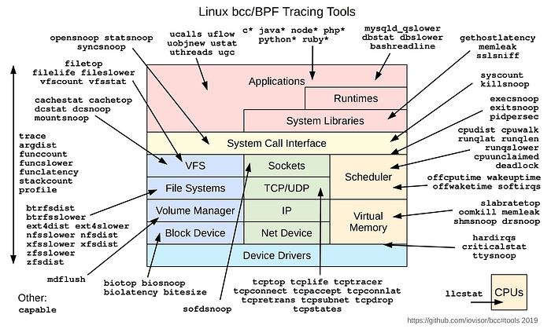

## Problem Statement

### Application Under Test

The application is a java application running on Java 8u202. It is the API Gateway for Flipkart which calls a myriad of microservices using the scatter gather pattern. It uses circuit breaking to avoid thundering herd issues on upstream dependencies. All frontend clients like the Desktop, Mobile Site, Android and iOS apps consume this API to render the interfaces. For the sake of this blog post, let’s call this application the APIGateway application. Each pod of the APIGateway was configured to run with [Guaranteed QoS](https://kubernetes.io/docs/concepts/workloads/pods/pod-qos/#guaranteed) of 15 cores. Since we have enabled static cpu manager policy, 15 whole cores get allocated to the main container of the APIGateway application pod.

### Issue faced by the team

During BAU traffic, the APIGateway performed normally, with per pod throughput ~85 and 99p latency around ~650 ms. In one of the load tests on production, we observed that the CPU utilization of the pods was skewed and per pod throughput also widely varied between 50 and 200 qps. This resulted in an overall sub-optimal performance of the APIGateway and a substantial degradation as compared to previous runs.

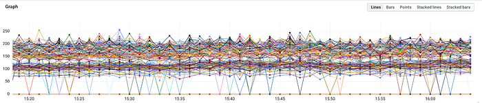
*API Gateway QPS Podwise*

### Suspected Change

The API Gateway runs on one of our on-prem k8s clusters. We had observed that network performance was much better when running k8s directly on Baremetal servers as compared to Virtual Machines. As part of a Flipkart-wide migration of workloads from Virtual Machine k8s nodes to Baremetal k8s nodes, we also moved the API Gateway.

## The Investigation

We plotted the CPU utilization of all the pods of the API Gateway in p8s and were looking for any patterns in the skew. Based on that we made the following observations:

- Similar to the pod throughput, the cpu utilization was also clustered in 2 bands. One hovering at ~11 cores and another at ~6 cores during BAU.
- As the load increased, the CPU utilization for both the bands merged and the pods saturated.

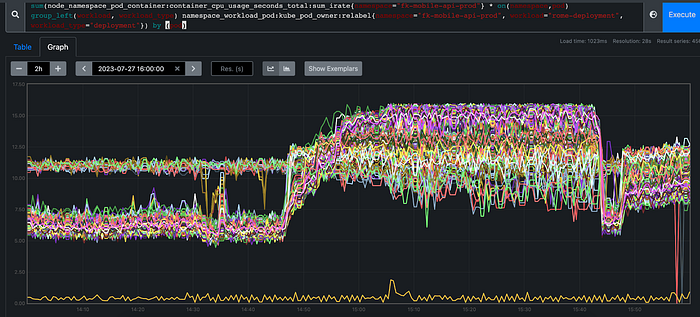
*API Gateway CPU Utilization Podwise*

We use LeastConnection as the load balancing strategy in the ELB for the APIGateway. The pods that have higher latencies result in more in-flight connections which will in-turn reduce the number of requests sent to the latent pod from the ELB. The pattern below was seen in our case. Hence, the pods that had lower CPU utilization and lower latency had higher throughput.

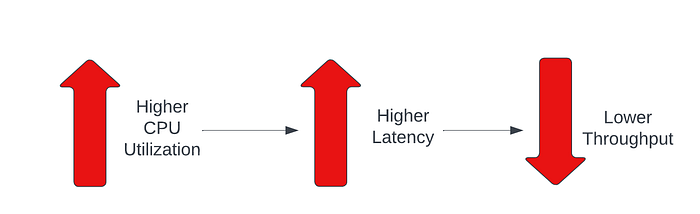

### Pod Density

Another correlation we established was that the pods seeing higher CPU utilization were scheduled on those nodes which hosted a higher number of pods belonging to this specific application. Based on the 99th percentile latency of the pods and the number of pods of this specific application on the node, we could divide the pods into 3 distinct bands:

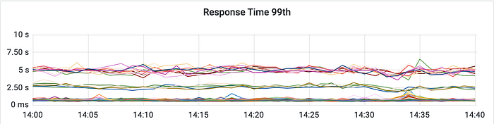
*API Gateway 99th Percentile Response Time Podwise*

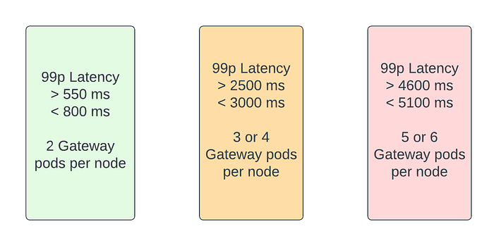
*Pods Grouped by Performance*

Some nodes which had less than 4 pods of APIGateway(the first 2 bands of latency) had pods belonging to other applications scheduled on the same node, increasing the density on the node. We also confirmed that the overall CPU utilization of a few nodes were higher than the CPU utilization of the nodes where the latent pods were seen. This establishes that the latency of APIGateway is not affected by the overall density of pods on a node, but only by the number of pods of APIGateway being scheduled on a node.

The next logical step was to investigate why the CPU utilization was higher even though the throughput was lower on some of these pods.

### Load Average

We filtered all the nodes where APIGateway was running and ranked them by order of overall CPU utilization. Then we plotted the 1 minute load average of the top 20 nodes.

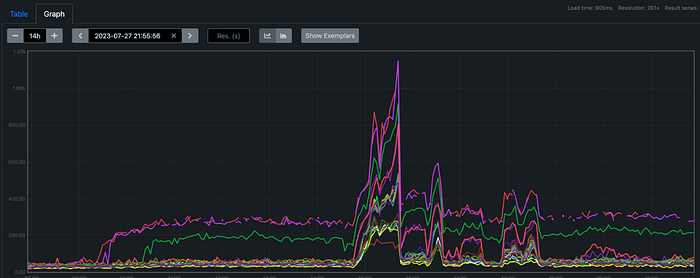
*Load Average*

There were 2 primary observations from this chart:

1. 3 nodes had high load average even during BAU, i.e., during times outside of the central load test. 2/3 nodes had 6 pods of this application each, while the other node had 5 pods of this application.
2. During the Load Test, the load average increased on those nodes where 3 or more pods of this application were scheduled. This shows that there is a correlation between the cumulative QPS of multiple APIGateway pods on a single node and the load average on the corresponding node.

Since Load average was high, we wanted to understand what caused it. One of the major sources of high load average is I/O. Hence, we **investigated** the I/O happening on the node.

### Investigating I/O

We use the tool [filetop](https://github.com/iovisor/bcc/blob/3469bf1d94a6b8f5deb34586e6c8e4ffec8dd0be/tools/filetop_example.txt) from the bcc suite of eBPF tools to do an initial analysis of the files that are being accessed by processes on the server. The bcc suite of eBPF tools are installed on Debian OS using the package [bpfcc-tools](https://packages.debian.org/bookworm/bpfcc-tools). The output showed excessive access of the CPU cgroup files belonging to the application running on this node.

```
/home/livingstone.se# filetop-bpfcc 10 1
04:22:17 loadavg: 4.79 5.25 5.37 3/15054 2346378

TID     COMM             READS  WRITES R_Kb    W_Kb    T FILE
1166    systemd-journal  16     0      32760   0       R cmdline
2335442 java             2789   0      11156   0       R cpu.cfs_period_us
2335442 java             2789   0      11156   0       R cpu.cfs_quota_us
2335442 java             2789   0      11156   0       R cpu.shares
2336301 java             2116   0      8464    0       R cpu.shares
2336301 java             2116   0      8464    0       R cpu.cfs_period_us
2336301 java             2110   0      8440    0       R cpu.cfs_quota_us
Detaching...
```

The output of [fileslower](https://github.com/iovisor/bcc/blob/3469bf1d94a6b8f5deb34586e6c8e4ffec8dd0be/tools/fileslower.py) also confirmed that some reads took more than 500ms under high load. Since these files were accessed from the cgroupfs, which is a pseudo filesystem, i.e. an in-memory filesystem not backed by disk, faulty/degraded disk was ruled out. Hence, we investigated lock contentions, as that can also cause high load average.

### Lock Contentions

[Klockstat](https://github.com/iovisor/bcc/blob/3469bf1d94a6b8f5deb34586e6c8e4ffec8dd0be/tools/klockstat.py) is an eBPF tool that we used to analyze lock contentions on the server. We ran the tool on one node where there were just 2 pods of this application and another node where there were 6 pods of this application. The output is truncated below to show only relevant entries:

**UnHealthy Pod**

```
/home/livingstone.se# klockstat-bpfcc -p 638619 -d 10
Tracing lock events... Hit Ctrl-C to end.

                                  Caller   Avg Spin  Count   Max spin Total spin
              b'kernfs_iop_getattr+0x28'     215106 272159  211719579 58543300976
           b'kernfs_dop_revalidate+0x33'     231779 544310  204893389 126159751736
           b'kernfs_iop_permission+0x29'     232220 816470  201408050 189600694774
           b'kernfs_dop_revalidate+0x33'     209721 272153  200899060 57076425212
           b'kernfs_iop_permission+0x29'     217192 272159  196226043 59110931944
                b'kernfs_fop_open+0x28e'        812 305488   28115577  248160087
              b'kernfs_fop_release+0x6c'        750 272164   15087092  204268709
                b'kernfs_seq_start+0x20'        415 271775   11813905  113029539
            b'kernfs_put_open_node+0x21'        888 272164   10735373  241795205
                   b'seq_read_iter+0x53'        462 272056    9781828  125738723
                     b'__fdget_pos+0x46'        323 272178    1757831   88022416
                      b'pipe_write+0x4e'        555   6987      95584    3878435
                   b'do_epoll_ctl+0x276'        369   4179      36482    1546009
 b'ep_scan_ready_list.constprop.0+0x1c1'        380  11223      15631    4269950
                    b'freezer_fork+0x29'        796     26       1671      20712
                     b'__fdget_pos+0x46'        635    448       1230     284732
                       b'pipe_read+0x4c'        317   2164        870     687504
                     b'__fdget_pos+0x46'        513      3        700       1540
                     b'__fdget_pos+0x46'        424     36        690      15290
          b'eventpoll_release_file+0x21'        508      8        640       4070
          b'eventpoll_release_file+0x41'        335      8        450       2680
                      b'ovl_llseek+0x98'        341      6        410       2050
                       b'seq_lseek+0x2b'        305      2        340        610
                   b'seq_read_iter+0x53'        270      2        280        540

                                  Caller   Avg Hold  Count   Max hold Total hold
                     b'__fdget_pos+0x46'       7965 271543   11823226 2163107459
                   b'seq_read_iter+0x53'       4847 271554   11819745 1316371241
                     b'__fdget_pos+0x46'     535827      3     859989    1607482
                     b'__fdget_pos+0x46'      15781    448     124287    7070098
           b'kernfs_iop_permission+0x29'        559 272159     113396  152163503
                b'kernfs_fop_open+0x28e'        688 305488     112906  210296085
            b'kernfs_put_open_node+0x21'        599 272164     112156  163228255
           b'kernfs_dop_revalidate+0x33'        511 544310     110176  278224973
                b'kernfs_seq_start+0x20'        959 271565      78485  260500965
           b'kernfs_iop_permission+0x29'        564 816470      66823  460847785
              b'kernfs_fop_release+0x6c'        724 272164      59823  197187949
              b'kernfs_iop_getattr+0x28'        542 272159      59654  147697546
           b'kernfs_dop_revalidate+0x33'        643 272153      48842  175098994
                      b'pipe_write+0x4e'        991   6987      43042    6925285
                   b'seq_read_iter+0x53'      10015      2      19331      20031
                       b'pipe_read+0x4c'        889   2164      14040    1924530
 b'ep_scan_ready_list.constprop.0+0x1c1'        833  11223      10651    9358422
                     b'__fdget_pos+0x46'       2347     36      10270      84504
                   b'do_epoll_ctl+0x276'       1434   4179       9591    5996366
          b'eventpoll_release_file+0x21'       6854      8       8841      54833
          b'eventpoll_release_file+0x41'       2472      8       3531      19782
                    b'freezer_fork+0x29'       1398     26       2940      36371
                      b'ovl_llseek+0x98'       1943      6       2320      11661
                       b'seq_lseek+0x2b'        690      2       1020       1380
```

**Healthy Pod**

```
/home/livingstone.se# klockstat-bpfcc -p 1945379 -d 10
Tracing lock events... Hit Ctrl-C to end.

                                  Caller   Avg Spin  Count   Max spin Total spin
           b'kernfs_iop_permission+0x29'      12707 1592787  103755584 20240677339
           b'kernfs_iop_permission+0x29'      11621 530927  100052265 6170429656
           b'kernfs_dop_revalidate+0x33'      12635 1061858   99944403 13416976076
           b'kernfs_dop_revalidate+0x33'      11960 530928   98990191 6350213810
              b'kernfs_iop_getattr+0x28'      10669 530927   92898302 5664910038
                     b'__fdget_pos+0x46'        464 530665   20197864  246631467
            b'kernfs_put_open_node+0x21'       1101 530923   15109267  585016467
                b'kernfs_fop_open+0x28e'        861 802971   14577630  691479234
                   b'seq_read_iter+0x53'        470 529201   11820954  249207865
                b'kernfs_seq_start+0x20'        466 526690   10351176  245648012
              b'kernfs_fop_release+0x6c'        907 530923    7523588  482075342
 b'ep_scan_ready_list.constprop.0+0x1c1'        451  13511     459976    6096424
                      b'pipe_write+0x4e'        622  11537     424916    7181933
                   b'do_epoll_ctl+0x276'        391   5415       5910    2119672
                       b'pipe_read+0x4c'        319   2761       3630     882830
                     b'__fdget_pos+0x46'        603    914       1470     552044
                    b'freezer_fork+0x29'        777     10       1230       7770
          b'eventpoll_release_file+0x21'        525      8       1110       4201
                     b'__fdget_pos+0x46'        398     36       1050      14340
           b'perf_event_init_task+0x100'        960      1        960        960
                     b'__fdget_pos+0x46'        372     10        900       3721
                b'ext4_orphan_add+0x12c'        480     13        840       6250
     b'ext4_mb_initialize_context+0x158'        562      4        690       2250
          b'eventpoll_release_file+0x41'        363      8        660       2910
                      b'ovl_llseek+0x98'        375      6        640       2250
                 b'ext4_orphan_del+0x99'        349     12        450       4190

                                  Caller   Avg Hold  Count   Max hold Total hold
                     b'__fdget_pos+0x46'       7727 524523   11836244 4053336528
                   b'seq_read_iter+0x53'       4690 525190   10358746 2463613832
                      b'pipe_write+0x4e'       1046  11537     201742   12077595
              b'kernfs_fop_release+0x6c'        701 530923     113512  372703153
                b'kernfs_seq_start+0x20'        951 525259     113412  499528740
                b'kernfs_fop_open+0x28e'        530 802971     113092  425955067
           b'kernfs_iop_permission+0x29'        508 1592787     113022  809554956
           b'kernfs_dop_revalidate+0x33'        488 1061858     112881  519050301
           b'kernfs_iop_permission+0x29'        531 530926     112751  282393891
           b'kernfs_dop_revalidate+0x33'        569 530928     112651  302521027
            b'kernfs_put_open_node+0x21'        644 530923     112501  342389090
                       b'pipe_read+0x4c'       1037   2761     109922    2864334
              b'kernfs_iop_getattr+0x28'        517 530927     108881  274547465
                     b'__fdget_pos+0x46'      12955    914      49110   11840986
                   b'do_epoll_ctl+0x276'       1935   5415      42681   10482227
                     b'__fdget_pos+0x46'       5082     10      16480      50820
     b'ext4_mb_initialize_context+0x158'       7387      4       9720      29551
                     b'__fdget_pos+0x46'       1978     36       9340      71211
          b'eventpoll_release_file+0x21'       6855      8       9280      54840
 b'ep_scan_ready_list.constprop.0+0x1c1'        995  13510       7790   13450855
          b'eventpoll_release_file+0x41'       2258      8       3120      18070
           b'perf_event_init_task+0x100'       2650      1       2650       2650
                      b'ovl_llseek+0x98'       2078      6       2540      12470
                b'ext4_orphan_add+0x12c'        866     13       2400      11270
                    b'freezer_fork+0x29'       1318     10       1930      13180
                 b'ext4_orphan_del+0x99'        846     12       1730      10160
```

**Inference**

The output of klockstat is split into two sections where the first section shows the statistics around the wait time for acquiring a lock, while the second section shows the statistics around time spent holding the lock. When we looked at the top functions (highlighted in the output) that were waiting for lock, it pointed to the kernfs implementation which is used while reading files from the cgroupfs. Since these were spin locks, the time spent in waiting for the lock was accounted for under actual CPU utilization, as the threads continued to spin on the CPUs until the lock was available. We expect this to manifest as excessive system CPU utilization.

### CPU Utilization

Although CPU Utilization is available in Prometheus, the data of which CPU cores are allocated to which containers is not available. Hence, we directly referred to the sar output on the server. Since we use static CPU policy and guaranteed QoS pods, we figured out the cores that were allocated to the APIGateway pod from /var/lib/kubelet/cpu_manager_state file. Then we measured the CPU utilization on those cores on both the healthy pod and the unhealthy pod.

**UnHealthy Pod**

```
[2023-07-28 09:14:46] 10.64.28.126 root@sparrow-prod-ch-3-node-fk-prod-04-20065985:/home/livingstone.se# sar -P 30-37,94-101 10 1
Linux 5.10.0-21-amd64 (******************************************)  07/28/2023  _x86_64_ (128 CPU)

06:53:02 PM     CPU     %user     %nice   %system   %iowait    %steal     %idle
06:53:12 PM      30     20.99      0.00     46.35      0.00      0.00     32.66
06:53:12 PM      31     20.30      0.00     46.80      0.00      0.00     32.89
06:53:12 PM      32     22.06      0.00     49.39      0.00      0.00     28.54
06:53:12 PM      33     22.04      0.00     50.76      0.00      0.00     27.20
06:53:12 PM      34     23.54      0.00     48.79      0.00      0.00     27.68
06:53:12 PM      35     21.98      0.00     50.61      0.00      0.00     27.40
06:53:12 PM      36     19.78      0.00     52.91      0.00      0.00     27.31
06:53:12 PM      37     20.26      0.00     51.61      0.00      0.00     28.12
06:53:12 PM      94     25.05      0.00     45.44      0.00      0.00     29.51
06:53:12 PM      95     18.95      0.00     48.02      0.00      0.00     33.03
06:53:12 PM      96     27.55      0.00     46.82      0.00      0.00     25.63
06:53:12 PM      97     21.04      0.00     48.68      0.00      0.00     30.28
06:53:12 PM      98     21.83      0.00     48.49      0.00      0.00     29.68
06:53:12 PM      99     23.02      0.00     47.77      0.00      0.00     29.21
06:53:12 PM     100     20.89      0.00     49.39      0.00      0.00     29.72
06:53:12 PM     101     21.01      0.00     50.00      0.00      0.00     28.99

Average:        CPU     %user     %nice   %system   %iowait    %steal     %idle
Average:         30     20.99      0.00     46.35      0.00      0.00     32.66
Average:         31     20.30      0.00     46.80      0.00      0.00     32.89
Average:         32     22.06      0.00     49.39      0.00      0.00     28.54
Average:         33     22.04      0.00     50.76      0.00      0.00     27.20
Average:         34     23.54      0.00     48.79      0.00      0.00     27.68
Average:         35     21.98      0.00     50.61      0.00      0.00     27.40
Average:         36     19.78      0.00     52.91      0.00      0.00     27.31
Average:         37     20.26      0.00     51.61      0.00      0.00     28.12
Average:         94     25.05      0.00     45.44      0.00      0.00     29.51
Average:         95     18.95      0.00     48.02      0.00      0.00     33.03
Average:         96     27.55      0.00     46.82      0.00      0.00     25.63
Average:         97     21.04      0.00     48.68      0.00      0.00     30.28
Average:         98     21.83      0.00     48.49      0.00      0.00     29.68
Average:         99     23.02      0.00     47.77      0.00      0.00     29.21
Average:        100     20.89      0.00     49.39      0.00      0.00     29.72
Average:        101     21.01      0.00     50.00      0.00      0.00     28.99
```

**Healthy Pod**

```
/home/livingstone.se# sar -P 25-26,29-30,32,35,37-38,89-90,93-94,96,99,101-102 10 1
Linux 5.10.0-21-amd64 (******************************************)  07/28/2023  _x86_64_ (128 CPU)

06:54:20 PM     CPU     %user     %nice   %system   %iowait    %steal     %idle
06:54:30 PM      25     27.00      0.00      5.97      0.00      0.00     67.04
06:54:30 PM      26     28.28      0.00      5.56      0.00      0.00     66.16
06:54:30 PM      29     28.54      0.00      5.53      0.00      0.00     65.93
06:54:30 PM      30     27.06      0.00      5.29      0.00      0.00     67.65
06:54:30 PM      32     29.52      0.00      5.67      0.00      0.00     64.81
06:54:30 PM      35     27.25      0.00      6.18      0.00      0.00     66.57
06:54:30 PM      37     30.95      0.00      6.35      0.00      0.00     62.70
06:54:30 PM      38     27.05      0.00      4.36      0.00      0.00     68.59
06:54:30 PM      89     28.98      0.00      6.12      0.00      0.00     64.90
06:54:30 PM      90     27.03      0.00      6.51      0.00      0.00     66.47
06:54:30 PM      93     27.07      0.00      6.59      0.00      0.00     66.33
06:54:30 PM      94     28.47      0.00      5.37      0.00      0.00     66.16
06:54:30 PM      96     29.22      0.00      5.76      0.00      0.00     65.02
06:54:30 PM      99     27.18      0.00      6.42      0.00      0.00     66.40
06:54:30 PM     101     31.27      0.00      5.99      0.00      0.00     62.74
06:54:30 PM     102     26.42      0.00      5.26      0.00      0.00     68.32

Average:        CPU     %user     %nice   %system   %iowait    %steal     %idle
Average:         25     27.00      0.00      5.97      0.00      0.00     67.04
Average:         26     28.28      0.00      5.56      0.00      0.00     66.16
Average:         29     28.54      0.00      5.53      0.00      0.00     65.93
Average:         30     27.06      0.00      5.29      0.00      0.00     67.65
Average:         32     29.52      0.00      5.67      0.00      0.00     64.81
Average:         35     27.25      0.00      6.18      0.00      0.00     66.57
Average:         37     30.95      0.00      6.35      0.00      0.00     62.70
Average:         38     27.05      0.00      4.36      0.00      0.00     68.59
Average:         89     28.98      0.00      6.12      0.00      0.00     64.90
Average:         90     27.03      0.00      6.51      0.00      0.00     66.47
Average:         93     27.07      0.00      6.59      0.00      0.00     66.33
Average:         94     28.47      0.00      5.37      0.00      0.00     66.16
Average:         96     29.22      0.00      5.76      0.00      0.00     65.02
Average:         99     27.18      0.00      6.42      0.00      0.00     66.40
Average:        101     31.27      0.00      5.99      0.00      0.00     62.74
Average:        102     26.42      0.00      5.26      0.00      0.00     68.32
```

**Inference**

On the unhealthy pod, similar to what we suspected, the system CPU utilization was almost 50% while the user CPU utilization was only ~25% on the cores assigned to the pod. The system cpu utilization was only ~5% on the healthy pod. This clearly indicated some sort of excessive spin lock utilization caused by excessive reading of the CPU cgroup files from the application pods.

### Flame Graphs

Now it was time to analyze where the application threads spent time in case of the unhealthy pods. We use the tool [async-profiler](https://github.com/async-profiler/async-profiler) to generate flame graphs for java applications.

**Unhealthy Pod**

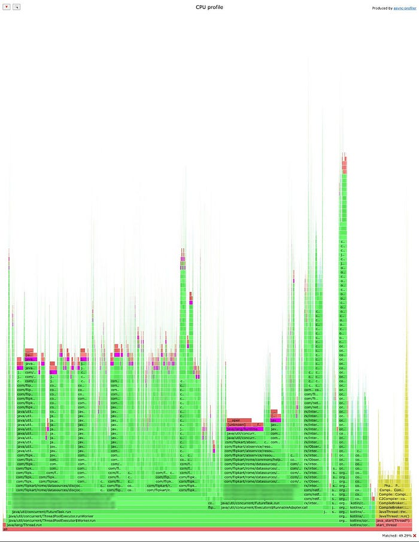

**Healthy Pod**

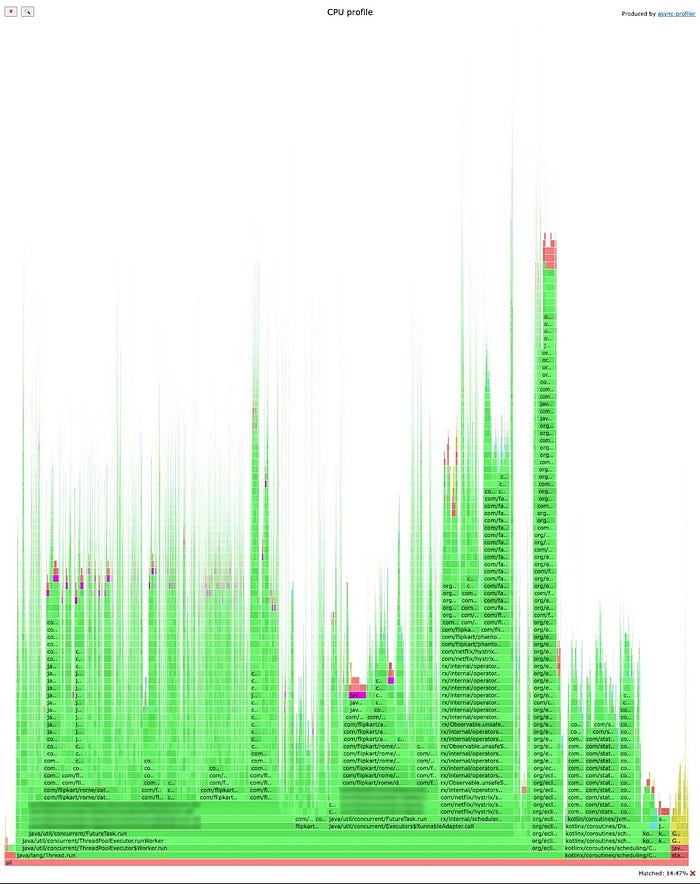

**Analysis**

Upon initial inspection, there were no red flags in the tree view. No single stack trace had consumed any discernible chunk of CPU time in the unhealthy pod when compared to the healthy pod.

In such cases, the next suspect would be to find out certain functions that get called from multiple stack traces and spend more CPU time. This was not readily available in the flame graph format generated by async-profiler. Hence, we regenerated the data in collapsed format and wrote a python script to parse the perf data in collapsed format to identify the top functions where the CPU was being spent irrespective of the stack trace. Many flame graph implementations provide a tabular view which allows to find the top functions where the time is being spent.

This pointed us to some functions like __open which are called by the open syscall. These functions were mostly getting called by another function java.runtime.AvailableProcessors. The below screenshots are taken after searching for the term “Runtime.availableProcessors” by clicking the search icon in the top left corner of the HTML page. The percentage of stacks where this is matched is displayed in the bottom right corner. The matched functions are colored pink in the image. Below, we have zoomed into one of the call paths that show these functions being called in the unhealthy pod flamegraph.

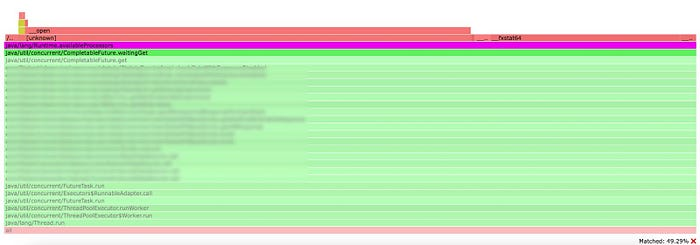

**Inference**

It is clear from the matched percentage that the function Runtime.availableProcessors has spent ~15% in the healthy pod while it spent ~50% on the unhealthy pod. This indicated excessive reading of the CPU cgroup files by the java function java.runtime.AvailableProcessors. Considering this is mostly static data, it didn’t seem right for this function to read continuously from the cgroup filesystem at such a high rate. Upon investigating the flame graph further, it was noticed that mostly the function java.runtime.AvailableProcessors was being called from a function [CompletableFuture.waitingGet](https://github.com/frohoff/jdk8u-jdk/blob/master/src/share/classes/java/util/concurrent/CompletableFuture.java#L1705-L1717). These are clear after zooming into one of the call paths where these functions are called, as shown in the previous section.

## Conclusion

### Bug Summary

Scrubbing through the openjdk issue trackers for issues relating to the hot functions seen in the flame graph helped us track down the root cause of this issue. The bug was primarily in the [Runtime.availableProcessors](https://docs.oracle.com/javase/8/docs/api/java/lang/Runtime.html#availableProcessors--) function which was being called excessively by CompletableFuture.waitingGet. The latest docs of java 8 [CompletableFuture](https://docs.oracle.com/javase/8/docs/api/java/util/concurrent/CompletableFuture.html) don’t seem to have the function waitingGet. There were 2 parts to the bug:

1. Degradation in performance of Runtime.availableProcessors by a factor of 100x — [https://bugs.openjdk.org/browse/JDK-8227006](https://bugs.openjdk.org/browse/JDK-8227006) — Fix backported to java 8u281 as part of [https://bugs.openjdk.org/browse/JDK-8254037](https://bugs.openjdk.org/browse/JDK-8254037)
2. Excessive calling of Runtime.availableProcessors by CompletableFuture.waitingGet — [https://bugs.openjdk.org/browse/JDK-8227018](https://bugs.openjdk.org/browse/JDK-8227018) — Fix backported to java 8u241 as part of [https://bugs.openjdk.org/browse/JDK-8228423](https://bugs.openjdk.org/browse/JDK-8228423)

Since the application heavily relied on the scatter gather pattern, the asynchronous code was modeled heavily using the CompletableFuture class.

### Mitigation

**Java Upgrade**

We wrote a small [java program](https://gist.github.com/lyveng/c864fa6aee7e733f4df59a4883bdd2fb) to call java.runtime.AvailableProcessors in multiple threads. Then we tested the max throughput possible on java 8u202 vs java 8u281 while measuring the system CPU utilization. Java 8u281 performed almost 230x better with very low CPU utilization.

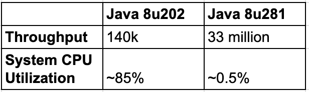

We re-ran the single node multi-pod test with both the versions of java and recorded the results. As expected, the application seemed to perform much better with java 8u281.

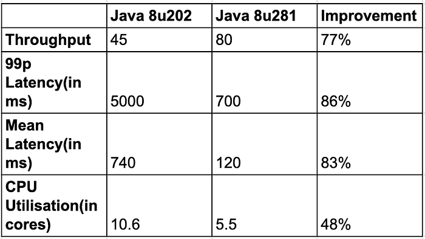

**JVM Flag**

Another workaround for this issue was to set the “-XX: ActiveProcessorCount” JVM argument to the number of cores that are allocated to the java container. We found this recommendation in a [comment](https://bugs.openjdk.org/browse/JDK-8227006?focusedId=14297479&page=com.atlassian.jira.plugin.system.issuetabpanels%3Acomment-tabpanel#comment-14297479) on the openjdk issue tracker. The application team validated this and the central Load Tests were run with this workaround. Post the load tests, the application team upgraded the java version to 17 where these issues were already resolved.

## References

1. [Systems Performance, 2nd edition by Brendan Gregg](https://www.brendangregg.com/systems-performance-2nd-edition-book.html)
2. [Blog posts by Brendan Gregg](https://www.brendangregg.com/blog/index.html)
3. [OpenJDK Issue Tracker](https://bugs.openjdk.org/browse/JDK-8329348?jql=project+%3D+JDK+AND+resolution+%3D+Unresolved+ORDER+BY+priority+DESC%2C+updated+DESC)

---
**Tags:** Kubernetes · Ebpf · Debugging · Java · Cpu Utilisation
