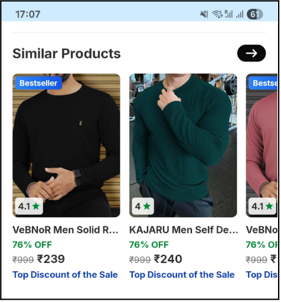
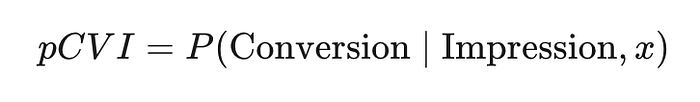
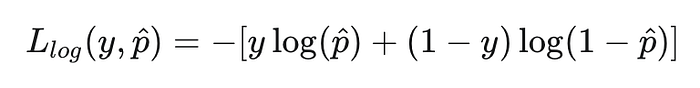
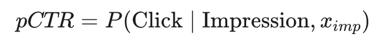
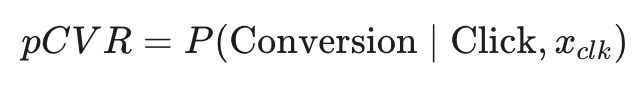
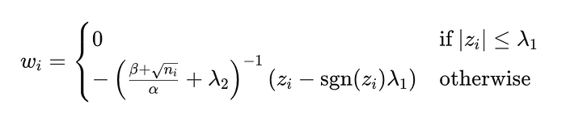
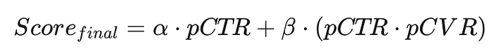
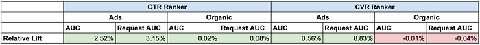
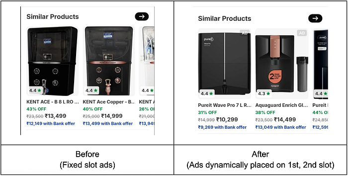

# The Science of Unified Ranking: Integrating Ads and Organic Recommendations

## Executive Summary

Placement of relevant advertisements along with organic content is a well-known problem. Fixed slots for ads is an easy but inefficient solution. We present a unified ranking system, where sponsored and organic items compete fairly for slots and optimize for a common goal. The main challenges for this system are fundamentally different data distributions between organic and sponsored data; a critical fallback risk that could flood the page with ads; and a feature parity gap between two diverse pipelines. Our two-step solution — one a single robust model that tackles Ads bias basis right feature engineering and two, a unified ranking function to compare Ads and organic on the same scale finally beat the old pinned-slot method, lifting organic orders by **1.36%** and Ad revenue by **3.4%** (both statistically significant). The solution is launched in production for the Flipkart “Similar Products” recommender system.

## Introduction

If you’ve ever shopped online, you would have seen product page recommendations. You’re looking at a new pair of headphones, and as you scroll down, a carousel of “Similar Products” or “You Might Also Like” appears. It’s prime real estate and a critical touchpoint for product discovery. But behind that seemingly simple widget lies a complex blend between organic relevance and sponsored content.

*Flipkart’s “Similar Products” widget*

At Flipkart, like many e-commerce platforms, we have long wrestled with the best way to present this blend. Sponsorship is a powerful tool for sellers to boost visibility and drive sales. In the long term, once their products receive enough impressions, it helps sellers enter the organic pipeline without sponsorship as well. For the platform, it’s a vital revenue stream. The classic approach is pinning ads in fixed positions. For our “Similar Products” widget, this meant sponsored products were always locked into the 2nd and 5th slots, with organic recommendations filling the rest.

This static approach is safe, predictable, but ultimately sub-optimal. What if for a newly launched smartphone, the five most relevant products for the customer are all sponsored? Conversely, what if for a niche item like pocket scissors, showing any ads at all detracts from the user experience? A rigid system can’t adapt. It leaves value on the table for our customers, our sellers, and the platform.

Our goal here was to build a unified system where sponsored and organic products compete on a level playing field, ranked by a single, intelligent model that optimizes for both product relevance and customer satisfaction. This is the story of how we broke free from fixed slots and built a dynamic, unified ranking system.

## System Architecture

Before diving into the solution, it’s important to understand the architecture of our Product Page recommendation system. For any given pivot/parent product, the process begins with a broad **Candidate Sourcing** phase. Here, an initial set of child products is sourced using various Collaborative and Content-Based Filtering techniques like historical co-purchases, co-browsing patterns, attribute similarity etc. These retrieved candidates then enter a multi-stage funnel-a common pattern in large-scale Machine Learning systems-designed to progressively refine and rank the selections:

- **Relevance based Filtering Stage:** This is the immediate step after candidate sourcing. Its job is to quickly scan millions of possible child products and shortlist a few hundred relevant candidates. It’s built for speed and recall. Under the hood, this is a large-scale [SGD (Stochastic Gradient Descent) Classifier](https://scikit-learn.org/stable/modules/generated/sklearn.linear_model.SGDClassifier.html) that runs via daily batch jobs. Its primary goal is to estimate the probability of conversion/order given an impression (pCVI). For a given feature vector x, the model estimates:

*Mathematical representation of pCVI*

The model is trained by minimizing the **Logarithmic Loss (Log Loss)**. For a single training example with a true label y and a predicted probability p​, the loss component is:

*Logarithmic Loss/Binary Cross-Entropy Loss*

The results of this batch model are then cached for quick online retrieval.

- **Personalized Ranking Stage: **This is where the real-time magic happens. This stage is powered by an online learning model using the [**FTRL (Follow The Regularized Leader)** algorithm](https://static.googleusercontent.com/media/research.google.com/en//pubs/archive/37013.pdf), which is designed to efficiently learn from a continuous stream of data. We employ a two-model approach to balance engagement and conversion. A **CTR model** predicts the probability of a click, given an impression and a **CVR model** predicts the probability of a conversion, given that a click has already occurred.

*Mathematical representation of pCTR*

*Mathematical representation of pCVR*

Both models are machine-learnt online rankers. At each step, the FTRL algorithm updates the model weights by minimizing an objective function that combines the instantaneous Logarithmic Loss with powerful regularization terms. The key to FTRL’s stability is that it doesn’t just react to the most recent gradient. The algorithm penalizes the model for moving its weights too far from their last known good state, preventing overreactions to noisy individual examples.

Simultaneously, the algorithm uses per-coordinate adaptive learning rates (learning faster for new features and slower for mature ones) and applies L1 regularization to push the weights of uninformative features to zero. This logic is elegantly captured in its per-coordinate weight update rule:

*FTRL’s weight update rule*

Here, zi​ accumulates past gradients for feature i, ni​ drives the adaptive learning rate, λ1​ enforces sparsity by creating a “dead zone” around zero, and λ2​ provides L2 regularization. This ensures that the new weights are a stable compromise between fitting new data and respecting all the information learned previously.

Once both the model predictions are obtained, the final score for ranking is then calculated by combining these two model outputs. By multiplying pCTR and pCVR, we get the overall probability of a conversion happening from a single impression. The objective function is a weighted sum of the probability of a click and the probability of a conversion:

*Objective function for organic products*

Here, α and β are tunable hyperparameters that allow us to balance the business value of an immediate click against the value of an ultimate conversion.

For Ads, there are additional cost components to weigh in the Ad bid value.

In our old world, this funnel was split. The Organic pipeline had its own set of retrieval and ranking models, and the Ads pipeline had its own. The two lists were generated independently and then crudely stitched together at the end, pinning the top two ads at positions 2 and 5.

This separation was the root of our challenges. To merge them, we had to solve some thorny data science and engineering problems.

## The Hurdles on the Path to Unification

Simply mashing the two pipelines together and training a single model on the combined data was a recipe for disaster. We identified four major challenges.

### 1. Calibration Mismatch

Sponsored and organic product data distributions are fundamentally different. Organic recommendations are often biased towards historically popular, well-established products. Sponsored products, on the other hand, are frequently new arrivals or “cold-start” items where sellers are actively buying visibility.

This means their natural click-through rates (CTR) and conversion rates (CVR) are worlds apart. Given organic product user feedback data is multi-fold compared to ads, a model trained on a naive mix of this data would almost always favor the popular organic items, effectively starving the sponsored content and defeating the purpose of the project. We couldn’t compare their predicted scores apples-to-apples; we needed a way to calibrate them.

### 2. Scaling and Fallback

At Flipkart’s scale, things can and do fail. We have fallback mechanisms to ensure the user experience doesn’t degrade. If the personalized ranker model fails to respond under heavy traffic, we gracefully degrade and serve the list sorted by the retrieval model’s scores (while defaulting to a neutral score of 0.5).

In the old pinned world, this was fine. Ads stayed at 2 and 5. But in a unified world, this posed a serious risk. Imagine a scenario: traffic spikes, our organic personalized ranker times out and its candidates get a default score of 0.5. But the ads personalized ranker, perhaps running on a different, more robust service, successfully returns scores that are naturally higher than 0.5. Suddenly, our “Similar Products” widget would be filled entirely with ads. This was a failure mode we had to design against.

### 3. Varied Distributions

The difference between these two content types runs deeper than just their labels. The very distribution of our most important features (e.g. historical “co-browse”, “co-impressions” rates) was drastically different.

Imagine a model learning a rule like “high historical co-browse means high relevance.” This works well for popular organic items but penalizes a brand new, sponsored product that has no history yet. Both sponsored and organic products have their own set of biases which leads to both different feature distributions and label distributions for them. Training a single model on these two distinct distributions could lead to erratic, unexplainable behavior.

### 4. Feature Parity

Over time, our organic and ads pipelines had evolved independently. The result? A significant feature parity gap. Few features present for our organic products were absent for sponsored ones and vice-versa. A unified model would need a unified feature set.

## Our Solution: A Unified Ranker

We tackled these challenges layer by layer, starting with the serving and ranking layer followed by the retrieval engine. The top-down choice was made owing to ease of interpretation and measurability on the higher layers.

**Serving Layer: Calibration & Scaling Challenges**

1. **Model Score Calibration: **A key component of our unified ranker is the score calibration logic that merges the outputs from our click (pCTR) and conversion (pCVR) models. Since the relative importance of clicks and conversions differs between content types, and ads have a commercial dimension, we maintain separate objective functions for organic and sponsored items. The organic score is a linear combination of the model outputs:

*Objective function for organic products*

**The score for sponsored content additionally incorporates cost components to weigh in the Ad bid value.**

To determine the optimal weights and hence the function, we framed the task as a multi-objective optimization problem. We ran a series of offline simulations, varying the parameters to analyze the trade-offs between user-centric metrics (MRR, NDCG) and business objectives like share of sponsored products and ad spend efficiency. This systematic approach allowed us to find a principled balance between relevance and revenue.

2. **Countering the Fallback Risk:** To solve the scaling challenge, we implemented a circuit breaker. If the system detects that the organic personalized ranker is failing at a high rate, it automatically reverts to the old, non-unified behavior of pinning ads at positions 2 and 5. This ensures a predictable and safe user experience during periods of high load or system instability.

### Personalized Ranker: The Power of isAds and Cross-Features

Our core strategy for the personalized CTR and CVR models was to build a single, unified training dataset but give the model the tools to understand the context of each impression.

1. **Unified Data + Calibration Feature:** We combined the historical impression logs from both organic and Ads pipelines. The first and most crucial feature we added was a simple binary flag: isAds. This feature acts as a base calibrator, allowing the model to learn the inherent difference in click and conversion probability between the two content types.
2. **Interaction Matters (Cross-Features):** A single isAds flag wasn’t enough. It tells the model that ads are different, but not _how_ their features behave differently. The real breakthrough came from creating cross-features. We identified 27 key features and 2-way crosses where the distribution varied significantly between organic and ads. We then created new 2-way and 3-way crosses with the isAds flag.  
For example, let’s say product_popularity is a feature. Instead of just that, the model now sees: product_popularity, isAds, product_popularity_X_isAds. This allows the model to learn a separate weight for product_popularity specifically for sponsored products. It can learn that popularity is a massive signal for organic items but a much weaker one for ads, all within a single model architecture.
3. **Rigorous Offline Evaluation:** We set up a grid of experiments, comparing a baseline with only organic product features, a model with just the isAds flag, and our final model with the full set of isAds crosses. We evaluated their performance (AUC, NDCG, MAP, etc.) separately on organic-only and ads-only test sets to ensure we were improving, or at least not regressing significantly, on both fronts compared to the old specialized models.

### Retrieval Engine

With the ranking strategy in place, we turned to the retrieval engine, which is responsible for generating the initial candidate set. While the core principles were the same, the implementation had its own quirks.

One of the most powerful sets of features in our retrieval engine is “pair stats”-metrics that define the relationship between two products (P1 and P2). Unlike collaborative filtering signals which are often symmetric (e.g., similarity(P1,P2) = similarity(P2,P1)), pair stats like “Impressions of P2 when P1 is viewed” are directional and powerful predictors. Historically, these were only computed on organic impressions. We engineered new pipelines to compute these pair stats for Ads impressions, giving us parallel Organic and Ads feature sets. We also recognized that a product’s relevance signal could be strong in one channel even if it was weak in the other. To capture this combined intuition, we created **TOTAL aggregate features** by summing the statistics from both domains (e.g., Total_Impressions = Organic_Impressions + Ads_Impressions). Consequently, the retrieval engine was supplied with understanding of organic, Ads and general popularity for each product pair.

## Impact

**Offline Testing**

Offline Evaluation indicated a lift in AUC and Request AUC relative to the client specific (Organic only/Ads only) models. Request AUC evaluates the ranking quality by checking the order of item pairs within each request. It calculates the proportion of pairs where the relevant item (the one clicked or converted) was correctly ranked above an irrelevant one. The performance lift was more significant for Ads with organic performance staying almost the same.

*Offline Model Lift*

**Online Testing**

We ran a high-mod AB test with cumulative exposures crossing 100M. We observed a **statistically significant (1.36%) increase in orders** for organic products and a** 3.4% increase in bottomline Ads revenue**. Consequent to the positive results, the change was scaled to 100% of Flipkart traffic.

Visually, the following is an example of the change we made.

## The Path Forward

The result of this work is a far more intelligent and flexible system. We moved from a world of rigid, hard-coded rules to a dynamic marketplace where all products, organic or sponsored, are ranked based on their true, contextual merit for the user at that moment.

Our evaluations showed significant gains in model metrics across the board. The models became better at predicting clicks and conversions for both content types, and analysis of the recommendations showed a healthier blend of popular and long-tail items.

It reminds us that sometimes the biggest wins come from challenging long-held assumptions (“ads must be pinned”) and diving deep into the data to build a system that is not only smarter but also more resilient and honest. The “Similar Products” widget may look the same to the casual observer, but behind the scenes, it’s now powered by a single, unified intelligence that serves everyone better.

This journey was a classic example of cross-functional collaboration between data science, engineering, and product. A huge shout-out to the core contributors who made this happen:

**Product**: Shashwat Chandra Jha, Hari Subramaniam Bhaskaran

**Engineering**: Tulluri Vinay Kumar, Ritu Kiran Murmu, Shaurya Bhalla, Harshita Moondra, Suyash Agarwal, Varun Dani

**Data Science**: Amar Kumar, Arnab Bhattacharya, Ayush Bhatnagar, Aditya Kumar Yadav, Uma Sawant

…and to the many others who supported and guided us throughout this journey!

**References:**

1. [The Whole-Page Optimization via Dynamic Ad Allocation](https://dl.acm.org/doi/pdf/10.1145/3184558.3191584)
2. [Whole Page Optimization with Global Constraints](https://assets.amazon.science/9f/38/a869f8ab40acbf22e9be6d76bbd3/whole-page-optimization-with-local-and-global-constraints.pdf)
3. [EGA-V1: Unifying Online Advertising with End-to-End Learning](https://arxiv.org/pdf/2505.19755)
4. [Ad Click Prediction: a View from the Trenches](https://static.googleusercontent.com/media/research.google.com/en//pubs/archive/41159.pdf)
5. [A Large Scale Content Ranking Platform as Applied to E-commerce Store Fronts](https://ieeexplore.ieee.org/document/9812691)
6. [Follow-the-Regularized-Leader and Mirror Descent: Equivalence Theorems and L1 Regularization](https://static.googleusercontent.com/media/research.google.com/en//pubs/archive/37013.pdf)
7. [Stochastic Gradient Descent Classifier](https://scikit-learn.org/stable/modules/generated/sklearn.linear_model.SGDClassifier.html)

---
**Tags:** Machine Learning · Data Science · Data Engineering · Recommendation System
