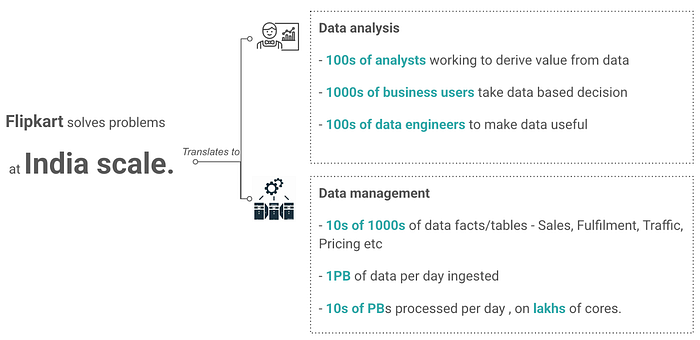
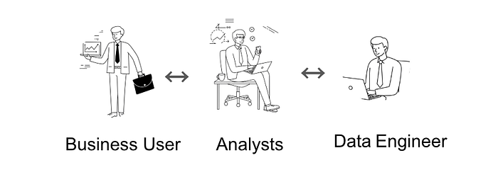
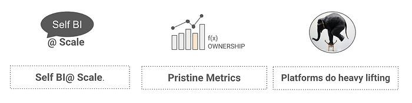
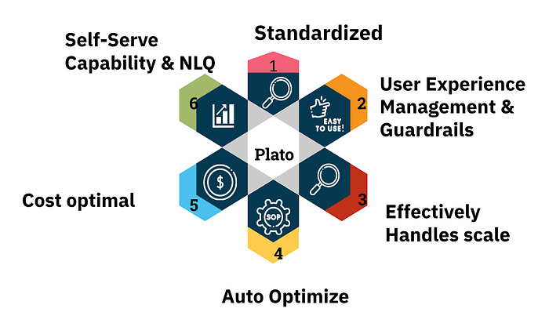
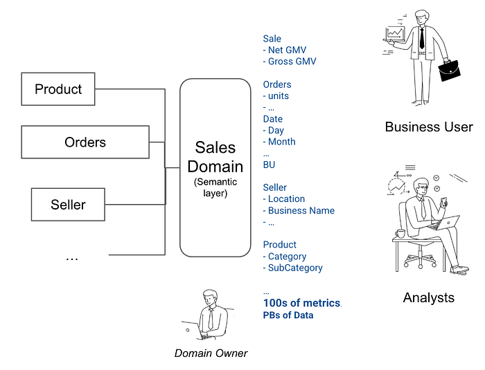
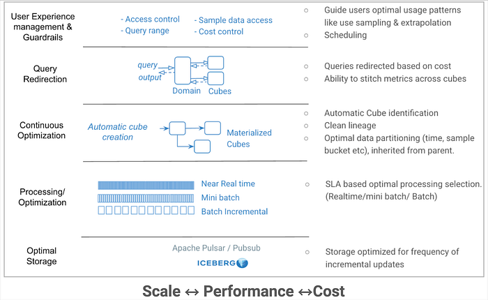
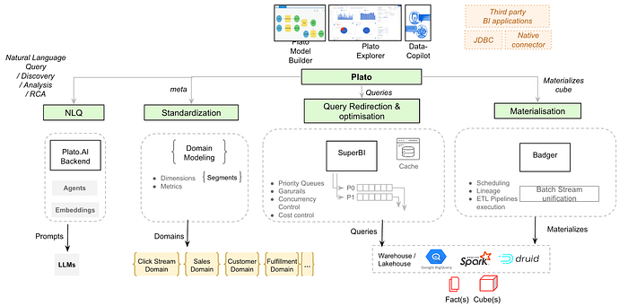

# Transforming Data Analytics at Flipkart: Self Serve Insights on Petabytes scale data

_Summary: This article explores the practical challenges Flipkart encountered while performing data analysis at a petabyte scale. It also outlines the thought process and architectural approach behind building an internal platform named Plato, designed to enable Self-BI at such scale. Furthermore, it highlights how this foundation has paved the way for leveraging GenAI to address advanced use cases — such as automated data analysis and root cause detection — that would have otherwise been difficult to implement effectively._

At Flipkart, solving for India’s scale isn’t just about handling millions of customers and transactions; it profoundly impacts how data is analyzed and used for decision-making. Imagine the sheer volume of information generated every single day — close to **one petabyte of data is ingested daily**, leading to **tens of petabytes being processed daily**. This colossal data universe translates into **10s of thousands of tables** covering areas like sales, fulfillment, traffic, pricing, selection, customer, pricing.

## The Data Deluge: Navigating Business and Technical Challenges

This massive scale presents a unique set of challenges for the hundreds of **data analysts**, thousands of **business users**, and hundreds of **data engineers** at Flipkart. While analysts work tirelessly to understand data patterns and provide insights, and business users rely on this data to make crucial decisions, the underlying complexity can hinder agility and increase costs.

**Business Challenges:**

Scale impacts⇒ Cost impacts⇒ Agility impacts⇒ MTTDecision.

- **Time to take decisions is impacted** due to a cumbersome operation model involving business users, analysts, and data engineers. The scale also slows down the decision process.
- **Agility is impacted** as getting each metric becomes costly at Flipkart scale. The overall agility of the company can be compromised as the scale increases.
- **Cost is directly impacted** because a huge amount of data needs to be churned for any single decision.
- Realizing **Self-BI at scale is a big challenge**. The scope becomes very challenging, leading to many pipelines, tables, and dependency graphs, ultimately slowing down decision-making.
- Onboarding **new businesses requires end-to-end engineering work**. New metrics for these businesses often require multiple changes, including creating or modifying tables, logic in jobs, backfilling data etc. For example, launching a new business like Flipkart Minutes involves a long path from data injection to creating warehouses for analysis.
- **Accuracy of data is critical** but challenging to maintain as logic is spread across various systems like batch, streaming, and reporting. Calculating a metric like GMV requires embedding the logic across these different systems, making accuracy non-trivial.

**Technical Challenges:**

- **Separate batch and streaming pipelines** are needed to match different SLAs and accuracy requirements. This results in different execution logic and pipelines.
- **Cost optimization is subjective and complex**. Optimizing queries and ETL pipelines across petabytes of data is difficult, requiring manual review and assurance. Ensuring best practices for querying across hundreds of data engineers, analysts, and business users is also non-trivial, leading to suboptimal performance and high costs.
- There is a **complex ownership model** with tens of thousands of tables. Determining who owns what data and ensuring data quality becomes problematic. A metric like GMV might exist in hundreds of tables with different caveats and SLAs. Fixing issues also becomes difficult due to the unclear ownership.
- Making **sample data work effectively for decision-making is not trivial**. Each use case has to identify and ensure proper extrapolation of sampled data, making it more complex than it sounds.
- **Data analysis using GenAI suffers in accuracy** at this scale. If humans struggle to understand the meaning and relationships within thousands of tables, GenAI will likely hallucinate and provide inaccurate insights.
- **Cost is proportional to performance**, and ensuring optimal queries and reuse requires subjective practices like reviews.

## The Vision: Self-Service BI at Petabyte Scale data

Faced with these challenges, Flipkart envisioned a transformed data analytics landscape. The goal was to achieve **Self-BI at Scale**, empowering users to access and analyze data independently, much like in a smaller company with limited data. This vision encompassed:

- Enabling analysts and business users to work with data as if it were a smaller, more manageable dataset, without being bogged down by the underlying scale and complexity.
- Establishing **pristine metrics** with clear definitions and ownership, ensuring data accuracy and consistency across the organization.
- Having the **platform do the heavy lifting**, abstracting away the complexities of scale and providing built-in optimizations and best practices.

## The Solution: Plato (internal name) — An Analytics Platform for Scale

To realize this vision, Flipkart developed **Plato **(Internal name), an analytics platform designed to bring **standardization and simplicity of Self-BI at Scale.**

Plato’s approach revolves around several key pillars:

- **Standardization:** At the heart of Plato lies a **semantic modeling layer**. Instead of directly interacting with thousands of underlying tables, users work with a few well-defined **domains** like Sales, Fulfillment, and Traffic. Each domain contains hundreds of **metrics and dimensions with clear definitions**, semantically mapped from various source tables. This abstraction provides a **single pane view** of relevant data, hiding the complexity of joins and underlying infrastructure. A **clear ownership model** is also established at the domain and metric level, with domain owners responsible for maintaining data quality and defining metrics.

*Sales domain Standardization*

- **User Experience Management & Guardrails:** Plato provides a user-friendly experience while implementing **guardrails** to ensure efficient and cost-effective data usage. This includes access control, query range limitations, guidance on using sample data where appropriate, and cost control mechanisms. The platform can even suggest using pre-created or aggregated content to optimize performance.
- **Effectively Handling Scale:** Plato’s architecture is designed to handle massive data scale transparently to the user. This involves:

*Logical layers of Plato architecture*

- **Query Redirection:** When a user queries a domain, the platform’s backend optimizes the query and **redirects it to pre-computed cubes** based on user behavior and cost considerations. This stitching of metrics across cubes and joint optimizations happen behind the scenes, making it seem like querying a single, large table.
- **Continuous Optimization:** An **automatic cubing engine** continuously monitors user behavior and creates necessary backend cubes to optimize query performance.
- **Processing/Optimization:** Plato intelligently manages data processing based on SLAs, choosing between **real-time (e.g., Flink), mini-batch, or batch (e.g., Spark) pipelines** to balance cost and performance.
- **Optimal Storage:** The platform leverages various storage solutions like Apache Pulsar/Pubsub and Iceberg, selecting the most appropriate option based on the need and SLA, optimizing for frequency of incremental updates.
- **Auto Optimize:** Plato automatically optimizes queries based on user requests, aiming for the best performance at the lowest cost.
- **Self-Serve Capability & NLQ:** Plato aims to empower users through self-service capabilities and Natural Language Querying (NLQ).

## Plato Architecture

The Plato architecture can be broadly divided into front-end and back-end components.

**Front-end Components:**

- **Plato Explorer**: This is a user interface, similar to tools like Power BI or Tableau, where users can interact with domain-level metrics and dimensions through drag-and-drop functionalities.
- **Plato Model Builder**: This component is intended to help in creating domains and contributing metrics back to the system.
- **Data Copilot (Plato AI)**: This is a GenAI-powered copilot that works alongside the Data Explorer. It allows users to query data using natural language.
- **Third-party BI Applications**: Tools like Power BI and Tableau can connect to the Plato system.

**Back-end Components:**

The back-end handles standardization, query processing, optimization, materialization, and data storage.

- **Standardization Layer**: This layer is crucial and includes Domain Modeling. Domains like Clickstream, Sales, Customer, and Fulfillment are modeled with Dimensions, Metrics, and Measures. This layer semantically joins hundreds of underlying tables to provide a single pane view of the data to users.
- **Query Redirection and Optimization**: When a query hits Plato, this layer splits, optimizes, and redirects it to the optimal cube that can serve the query.
- **SuperBI**: This layer prioritizes queries, applies guardrails (like priority queues, concurrency control, and cost control), and manages the execution of queries on the underlying data stores.
- **SuperBI Cache**: This cache balances the need for up-to-date reports with underlying data updates and Service Level Agreements (SLAs) for report freshness.
- **Query Execution Layer**: This is where queries are executed. It includes query execution engines like BigQuery, Spark, and Druid, which can execute query on actual tables or pre-computed, aggregated cubes and return results.
- **Materialization Layer (Badger)**: This layer intelligently monitors previous queries, understands the optimal way to divide cubes, schedules their creation in the back end, and utilizes a Batch stream unification layer to manage the creation of ETL pipelines using Spark or Flink. The materialized cubes will then be read using the Query Execution Layer.

In essence, Plato’s architecture is designed to abstract away the complexity of the underlying data infrastructure through standardization and a semantic layer. The platform then optimizes query execution and data materialization to provide a seamless and cost-effective self-service BI experience at Flipkart’s scale.

## Plato AI: Conversing with Data

Building on the standardized data foundation provided by Plato, **Plato AI** leverages GenAI to further simplify data access and analysis. **The Data Analysis Agent** or **Data Copilot** allows users to ask questions in natural language, which are then translated into appropriate queries against the Plato domains.

The semantic layer of Plato is crucial for the accuracy of Natural Language Querying(NLQ). By providing a **curated and well-defined set of domains, metrics, and dimensions**, Plato minimizes the ambiguity that plagues GenAI when faced with thousands of disparate tables. This results in significantly higher accuracy rates compared to directly querying the raw data.

Furthermore, Plato AI is being extended with **Analyst Agents** to perform deeper data analysis and **Auto RCA (Root Cause Analysis)** capabilities. Imagine asking “Why did sales go down last week?” and the system automatically analyzes data across traffic, pricing, and fulfillment domains, identifying potential root causes with supporting evidence.

**Data Copilot Architecture:**

- It uses multiple agents (GenAI agents) and embeddings to understand user queries in natural language.
- It leverages domain embeddings, metric and dimension metadata embeddings, dimension data embeddings and information about the definitions of these elements along with taxonomy of terms used in E-Commerce and Flipkart.
- It uses examples and feedback loops to continuously improve its understanding and accuracy.
- It translates natural language queries into executable queries against the Plato domains and uses the execution layer to retrieve results.

## The Journey Continues

The development and implementation of Plato represent a significant transformation in how data analytics is done at Flipkart. By addressing the challenges posed by India’s scale through standardization, automation, and intelligent use of AI, teams are being empowered to derive insights faster, make more informed decisions, and ultimately serve its customers better. The journey is ongoing, with continuous improvements and new capabilities like Domain builder, auto cube creation, advanced join optimizations, AI augmentation being added to this platform along with more domains being on-boarded.

Plato is emerging as a core strategic layer at Flipkart, serving as the foundation for next-generation innovations and value-added capabilities powered by GenAI — redefining how data analysis can be performed going forward through intelligent agents like the Data Analysis Agent.

References:

- [Slash N presentation — Transforming Data analytics at Flipkart](https://www.youtube.com/watch?v=VldGPB0O6w0&list=PLLc3f0wUmrakV6vvTTRYg9BtlV0iqecAI&index=6&t=691s)
