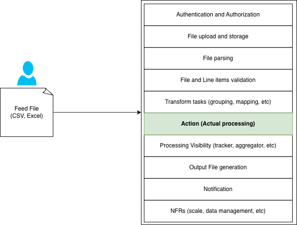
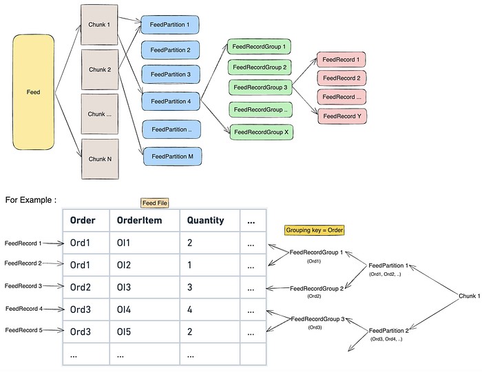
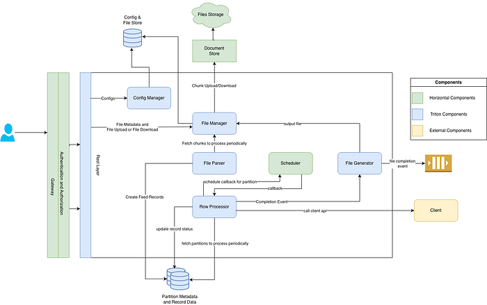
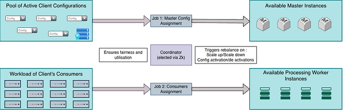
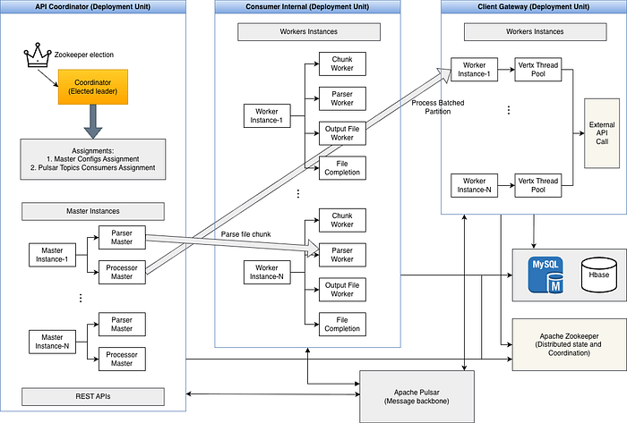
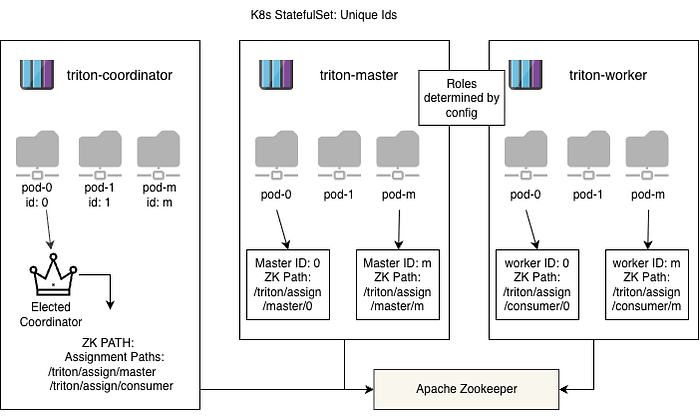
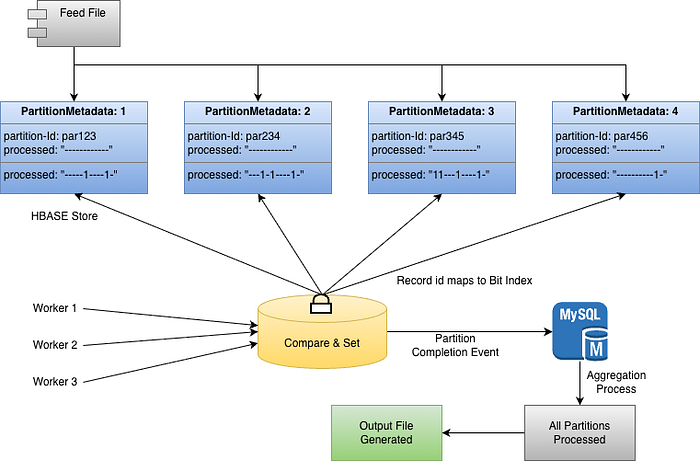
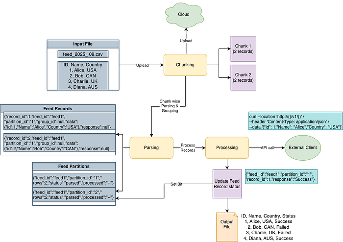

# Triton: Scaling Bulk Operations with a Feed Processing Platform

## Context and Motivation: The Prevalence of Bulk Actions

Feed file processing is a core capability required in a company like Flipkart, enabling the application of thousands, or even millions, of entity changes through a single file upload.

It’s about handling massive **bulk data processing**, the ability to apply changes to thousands, or even millions, of entities through a single file upload.

Bulk actions are crucial and ubiquitous across virtually every domain at Flipkart, driven by users like **Sellers, Vendors, and internal Operations teams**. They rely on feeds for high-volume tasks such as:

- **Listings Management:** Sellers updating hundreds of thousands of product listings and inventory records in one go.
- **Inventory Allocation Rules:** Vendors defining complex logistics and warehouse capacities via file ingestion.
- **Catalog Enrichment:** Updates are provided for product descriptions, images, or compliance attributes across a massive catalog.

For the end user, whether that’s a seller managing their business or an internal operator, the expectation is simple but demanding: the system must process hundreds of thousands of records from a single file, execute complex, domain-specific logic for each, and provide a comprehensive status report for every single record, doing all of this **reliably and quickly**.

### The Motivation for a Centralized Platform

Historically, as our marketplace grew and diversified, individual domain teams built their own localized solutions for feed processing. While this approach provided immediate, targeted functionality, it quickly led to a fragmented landscape:

- **Duplication of Effort:** Nearly every team was solving the same horizontal problems: file parsing, durability (storage), user authentication, input validation, result generation and scaling and scaling.
- **Inconsistency and Overhead:** This fragmented infrastructure resulted in divergent processes, inconsistent SLAs, and a high maintenance overhead across the board.

Recognizing this common pattern of repetitive _horizontal_ needs coupled with diverse _vertical_ business logic we launched Triton. Our motivation was clear: **build a unified platform that handles the common, complex NFRs of feed processing**, thereby allowing domain teams to focus purely on their core business logic and API actions.

**_Figure 1: High Level Feed Processing Pipeline_**

## Problem Statement: The Required Capabilities

- **Multi-Tenancy:** Serve all clients and handle various file formats (CSV, Excel, etc) via a single, standardized pipeline.
- **Data Integrity:** Apply schema validation upfront and logically **group related records** to maintain atomicity during processing.
- **Decoupling business logic:** Handle complex sync/async API invocation logic, callbacks, retries, and error handling for the client’s single business ‘Action.’
- **End-to-End Governance:** Enforce **platform guardrails**, such as verifying schema compliance and preventing abuse.

### Engineering Mandate (The “How” and “How Well”)

- **Scale and Availability:** **Should be horizontally scalable and** sustain **10K QPS** at the record group level (~ 30K R/W per second) with **High Availability**.
- **Fairness and Isolation:** Mandate **quota-based rate limiting** and **Client Segregation** to prevent the “noisy neighbor” problem.
- **Guaranteed Reliability:** Enforce **at-least-once processing semantics** and be completely **Fault Tolerant** to ensure zero data loss from system crashes.
- **Dynamic Control:** Support **priority lines** and **dynamic load distribution** to manage business urgency,** allowing run-time control (pause/throttle) **over active feeds.
- **Observability:** Provide logging, metrics, file progress visibility and auditing for **full end-to-end traceability**.

## The Architecture

### Decoupling Workload for Elasticity: Decomposition Strategy

- **Chunking & Partitioning:** Incoming files are immediately broken down into fixed-size **Chunks** (e.g., 100K rows), which are then further split into smaller **Partitions** (e.g., 1,000 feed record groups). This initial fragmentation minimizes latency impact, reduces I/O bandwidth usage, and forms the fundamental unit of work for distributed processing.
- **Grouping:** If a client requires related rows to be processed together (e.g., all line items for a single order ID), the parser applies **grouping keys** to ensure these records land in the same group, guaranteeing atomic processing at the domain layer.

**_Figure 2: Data Decomposition_**

The foundation of Triton’s platform lies in four key principles:

1. **Coordinator-Master-Worker Orchestration: **a hierarchical design where a central Coordinator assigns client configurations to a pool of exclusive Master instances, which are solely responsible for quota-based scheduling and work generation. Stateless Workers then execute the heavy processing tasks.
2. **Hybrid Data Strategy:** **Relational Store(Mysql)** handles critical, transactional metadata (configs, file status), while a **NoSQL Store (HBase)** manages the massive, high-QPS storage of the actual feed records.
3. **Messaging as the Backbone:** Apache Pulsar serves as the core messaging layer, decoupling the I/O heavy (Parsing) and compute heavy (Processing) phases. This allows for massive horizontal scaling, retries, and the active management of priority queues necessary for dynamic load distribution.
4. **Non-Blocking Client Stack:** All communication with downstream client APIs is managed via a high-performance, **non-blocking HTTP client library (Vert.x)**.

**_Figure 3: High Level Architecture_**

## How Triton Manages Hundreds of Configurations at Scale

To manage hundreds of client configurations, Triton employs a layered, hierarchical architecture composed of three dedicated deployment units, all orchestrated via **ZooKeeper**.

### Deployment Units

Triton’s infrastructure is logically divided into three distinct, scalable deployments:

1. **API Coordinator:** Hosts all APIs, the central **Coordinator** component, and all **Master** instances. This layer handles ingestion, routing, scheduling decisions, and the control plane.
2. **Internal Workers:** Hosts stateless worker components dedicated to heavy I/O tasks like file parsing, chunking, validation, and internal data transfer operations.
3. **Client Gateway:** Hosts the **Processing Workers**, which are dedicated execution units running non-blocking threads (via the Vert.x library) to call external client APIs.

### The Hierarchical Roles

### The Coordinator (The Central Assignment Engine)

The Coordinator component is responsible for two distinct assignment jobs, Only a single **Coordinator** is elected via ZooKeeper:

- **Job 1: Master Config Assignment:** It assigns the entire pool of **M** client configurations to **N** available Master instances. This process ensures an exclusive and even distribution, minimizing the movement of configurations using a **greedy algorithm** (low movement strategy).
- **Job 2: Consumer Assignment:** It is responsible for distributing the workload of **M** configurations (which may require **X** total consumers) across **Y** available Processing Worker instances, ensuring optimal utilization and fairness.

**_Figure 4: Coordinator’s Two Assignment Jobs_**

The Coordinator maintains a view of the cluster state by monitoring ZK paths. It triggers a rebalance automatically upon any shift in resources whether due to **Master instance resize** (scale-up/scale-down), or changes to the workload such as **client configuration activation or deactivation**.

### The Smart Masters (Assigned Orchestrators)

- **Parsing Master:** A flavor of the Master responsible for generating the granular work for the Parsing phase (file chunking, initial validation).
- **Processing Master:** A flavor of the Master responsible for generating the granular work for the Processing phase (pulling partitions, generating client-bound batches of records/record groups).
- **Shared Design:** Both types of Masters are functionally stateless (reading status from dedicated storage/ZK paths), constantly listening to ZK for configuration or assignment changes and incorporating them in real-time.

### The Workers (Stateless Executors)

Workers are the true execution units, designed for massive horizontal scalability:

- **Function:** They are entirely stateless, pulling messages from queues (Pulsar) or reading data from specific paths based on the Master’s instructions.
- These workers are particularly critical, reading from paths exclusive to their assigned batches (or worker IDs) to ensure proper load distribution and failure accountability.

**_Figure 5: Detailed Component Map and Workload Flow_**

## How do we ensure a stable identity for each member of the control plane?

In a dynamically scaled K8s environment, generating reliable stable IDs is challenging. We leveraged **Kubernetes StatefulSets** to provide the necessary stability. Each Pod in the StatefulSet is assigned a unique, stable, and predictable **ordinal index** (e.g., pod-0, pod-1).

Each running application instance reads this ordinal index from its environment and uses it as its unique ID to **define its role:** The application’s role (Coordinator, Master, or Worker) is defined through configurations.

**_Figure 6: Kubernetes Stateful Sets for Stateful IDs_**

## How do we know the feed file is completely processed, given the high concurrency?

Tracking the completion of a file composed of millions of independently processed records poses a massive concurrency challenge. We solve this using a two-tiered aggregation model that relies on bit-setting and strong consistency primitives:

- **Partition State Tracking (The Bitset):** Each large file is broken down into small, manageable **Partitions**. The metadata for each Partition is stored in **HBase**. The processing status of every record group within a partition is tracked using a concise **bitset**. When a record group is processed successfully, the corresponding bit in the Partition’s bitset is flipped.
- **Record Indexing:** During the initial parsing phase, every record or record group is assigned an **ordinal ID** based on its line number in the original file. This ordinal ID (e.g., record #50 in the partition) directly determines the **bit index** to be set in the Partition’s bitset.
- **Concurrency Control (Compare and Set):** Because multiple workers can try to update the partition’s bitset simultaneously, we use the **Compare and Set (CAS)** primitive. This atomic operation ensures that only one worker can update the bitset version at a time, preventing lost updates and guaranteeing eventual consistency for the Partition state.
- **Aggregation and Finalization:** When the bitset shows all records in a Partition are complete (all bits set), the Partition is marked as finished. This triggers an event.
- **File Completion:** A separate file aggregation process monitors the status of all Partitions associated with a Feed File (metadata stored in the **Relational Store**). Once all partitions for a file are marked complete, the entire file status is updated to ‘Processed’ in the Relational Store, and the final output file generation is triggered.

**_Figure 7: Feed Completion Tracking_**

## Walkthrough: The End-to-End File Journey

**_Figure 8: Walkthrough: File Journey_**

## Conclusion

Triton successfully unified a critical, large-scale problem. By implementing a unified architecture and leveraging key distributed primitives, we ensured the platform delivers high throughput and reliable completion guarantees for all feed processing needs.

---
**Tags:** Feed Processing Machinery · Bulk Actions · Distributed Systems · NoSQL · Microservices
