# Tuning Apache Pulsar Cluster

Guide to tuning Apache Pulsar Cluster

Apache Pulsar is an open-source, distributed messaging and event-streaming platform designed for high performance, scalability, and reliability. It is an alternative to the data streaming stack Apache Kafka but with lots of inbuilt significant features such as support for multi-tenancy, horizontal scalability, and geo-replication.

In Flipkart, many microservices use the Pulsar cluster for various streaming and batching use cases. All the user events, order events (clicking on a product, adding something to the cart, placing an order, etc), recommendations, ads promotions, payments reconciliation, etc. generate a lot of data. We must optimize the pulsar cluster which is handling all of those use cases for performance to operate without non-functional blockers on the requirements (such as sub-millisecond message handling support, durability, and availability). [Here](./failure-resiliency-and-high-availability-in-flipkart-messaging-platform-ba99302e799d.md) is an article that explains how we manage Failure Resiliency and High Availability.

In this blog post, we’ll explore some of the critical considerations and efficient ways to tune a Pulsar cluster, optimize performance, and ensure high availability.

## What do we want from Pulsar?

Pulsar fits perfectly in the pub-sub models, event-driven architectures, real-time data processing, or as a microservices communication channel. It is important to tune the cluster configs to give better support to those requirements with better resource utilization. Some of the improvements that can be made relative to out-of-the-box configs are:

- Better throughput/Ops
- Lower latencies for real-time processing
- Scalability and Maintainability
- Fault tolerance and resilience

Below are some of the results we were able to achieve after optimizing the Pulsar cluster.

- 3+ Gbps throughput
- Produce latencies (p999) < 50ms
- High fanout support (>1000 subscriptions on a single topic)
- Support for 50K active topics

And all that is handled in a single Pulsar cluster. Exciting right?

## Pulsar Architecture — A Glance

Here is a reference to the basic pulsar architecture: [https://pulsar.apache.org/docs/3.0.x/concepts-architecture-overview/](https://pulsar.apache.org/docs/3.0.x/concepts-architecture-overview/)

We can divide the architectural components into the following sections:

### Pulsar cluster

- Broker: Processing layer that manages and serves topics. It also handles messages, routing, and connections with Pulsar clients.
- Bookkeeper: Storage layer that supports durable message storage, data persistence, and replication of data across multiple storage nodes. This keeps the cluster resilient.
- Zookeeper — Coordination layer that also manages metadata and the configured policies in the Pulsar Cluster.

### Pulsar Client

- Producer — Publishes messages to the Pulsar’s topic (stream)
- Consumer — Receiver that subscribes to the Pulsar’s topic

Let’s look at optimizing individual components based on a method that has worked for Flipkart.

## Methodology for tuning the Apache cluster

We do several types of load tests on the cluster such as redline tests, soak tests, etc. to verify that the system performs well on scaling, speed, and overall stability under production load.

We follow the following process for tuning:

1. **Baseline:** Set up a baseline with the current setup and configs. This is the reference point to evaluate the impact of tuning changes.
2. **Capture Metrics:** Record the metrics for reference. The tool [https://github.com/lawrenceching/metricdump](https://github.com/lawrenceching/metricdump) can provide the metrics used to compare later on and document it. Some of the important metrics to capture are:  
a. JVM metrics (​​jvm_*) to observe resource usage, GC pauses, etc.  
b. Broker managedLedgerCache metrics (pulsar_ml_cache_*) and bookkeeper read/write cache metrics (bookie_write_cache_*, bookie_read_cache_*)  
c. Broker Loadbalancer metrics (pulsar_lb_*)  
d. Latencies:  
 • Observed by clients.  
 • Broker Publish Latencies (pulsar_broker_publish_latency)  
 • Write Latency observed by brokers (pulsar_storage_ledger_write_latency_*, pulsar_storage_write_latency_*)  
 • Latencies Observed by bookkeeper (journal, ledger read/write latencies)  
 • Persistent Volume metrics and Actual disk latencies  
e. Workload (throughput in/out, rate in/out, number of topics/subscriptions, backlog generated, etc). For more details on other metrics refer to: [https://pulsar.apache.org/docs/next/reference-metrics/](https://pulsar.apache.org/docs/next/reference-metrics/).
3. **Identity Bottlenecks:** Monitor the broker/bookie/zookeeper dashboards to identify the bottlenecks (in terms of CPU/MEM resource utilization, N/W bandwidth, application config, storage I/O, metadata store performance, authentication/authorization overhead, etc). Along with the metrics recorded above, see also the topic stats/stats internal for more details [https://pulsar.apache.org/docs/next/administration-stats/](https://pulsar.apache.org/docs/next/administration-stats/).
4. **Monitor Hypothetical Changes:** Create a hypothesis on why the bottleneck was there, and check out the pulsar codebase in case of any confusion. Try to resolve those by config/setup changes.
5. **Test Workloads:** Test the same workload again to have a fair comparison to calculate the impact of changes.
6. **Compare Results:** Compare the results with the baseline created before. If results are favorable then accept it.
7. Repeat :)

## Tuning levers by Component

Now let us jump into what are the tuning levers per component and how they affect the behavior of the stack.

---

## Broker

To tune the Pulsar brokers, many configs need tuning. Let’s go through a few of the major ones.

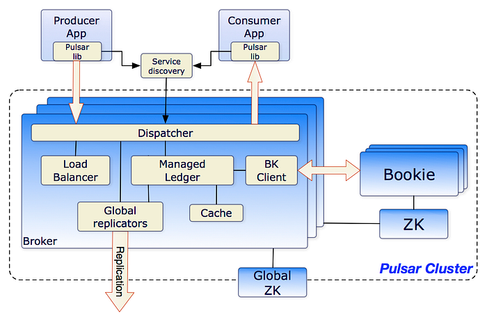
*(Source: https://pulsar.apache.org/docs/3.0.x/concepts-architecture-overview/)*

Major optimizations we focussed on in Broker are:

- Managed Ledger Policy and Cache
- Load Balancing and Bundle configurations
- Throttling
- JVM GC Tuning

## Managed Ledger

Managed ledgers are the underlying data structure to store messages for topics.

### Managed Ledger Policy (EnsembleSize, WriteQuorum, AckQuorum)

According to the use case, it is important to decide what kind of durability (Volatile/in-memory, soft/async disk write or hard/sync disk write) requirements. There is a tradeoff between durability and latency. The stronger the durability, the higher the latency impact. In Pulsar, the combination of many configs (including bookkeeper configs that control durability, how journal/ledger accepts requests, lazy writes, etc.). One such config that we configure in the broker is the triplet of (EnsembleSize, WriteQuorum, and AckQuorum).

What is this Triplet (EnsembleSize, WriteQuorum, and AckQuorum)?

This triplet controls how the broker should use the bookkeeper cluster. It tells the bookkeeper client about the number of replicas of data, and when to consider successful durable writes in the bookkeeper cluster.

**EnsembleSize **defines the number of bookies to consider for storing messages in a ledger. We can change this size using the **managedLedgerDefaultEnsembleSize **config which is 2 by default.

**WriteQuorum **defines the replication factor for storing messages in a ledger. We can change this value using **managedLedgerDefaultWriteQuorum **config which is 2 by default.

**AckQuorum **defines the minimum number of acknowledgments required from bookies to acknowledge a message as ‘persisted’.

Controlling the number of guaranteed copies: We can control the number of acknowledgments required by **managedLedgerDefaultAckQuorum **config which is again 2 by default.

Here are a few helpful scenario illustrations that help you understand the tuning requirements better:

- Strong Durability: For high durability and fault tolerance, a common combination is to set AckQuorum and WriteQuorum to be the same, with ‘EnsembleSize’ being greater than or equal to the ‘WriteQuorum’. This ensures that every write operation is acknowledged by a minimum number of bookies and replicated across a sufficient number of nodes.

- Lower Latency: To achieve lower latency at the expense of some durability, we can set ‘AckQuorum’ and ‘WriteQuorum’ to lower values as compared to the ‘Ensemble size’. A lower ‘AckQuorum’ allows for faster acknowledgment, while ‘EnsembleSize’ can be adjusted according to fault tolerance needs.

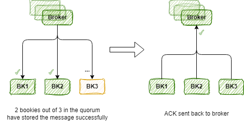

- Customized Durability and Performance: Depending on specific use cases, we can customize the AckQuorum, WriteQuorum, and EnsembleSize to strike a balance between durability, performance, and resource utilization. This requires careful consideration of factors such as message importance, expected workload, desired fault tolerance, and available resources.

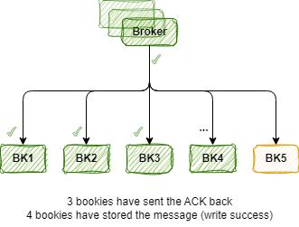

### Managed Ledger Cache

The broker manages a cache layer between Pulsar clients and the Storage layer (bookkeeper cluster). If the requirements are for real-time consumption of the messages, it’s important to tune the cache properties in the broker to reduce the reads going to the bookkeeper disks.

The cache is responsible for storing tailing messages across topics stored in ledgers managed by brokers is called the managed Ledger cache. In the current implementation of broker (till v2.11), this takes the JVM direct memory allocated to the brokers.

If the workload is predetermined, after factoring in the overall memory consumption of the cluster, extra memory can be allocated for the cache to support the real-time use cases.

We can use the `pulsar_ml_cache_*` metrics to observe the cache hit ratio. If the cache hit ratio is low, increasing the memory can help improve it.

The following illustration shows an example of Bad cache tuning for real-time consumers, where the cache-hit ratio goes as low as 0.6 which increases the read requests on the bookkeeper:

The following illustration shows an example of good cache tuning where the cache-hit ratio is maintained at > 0.95 for real-time usage:

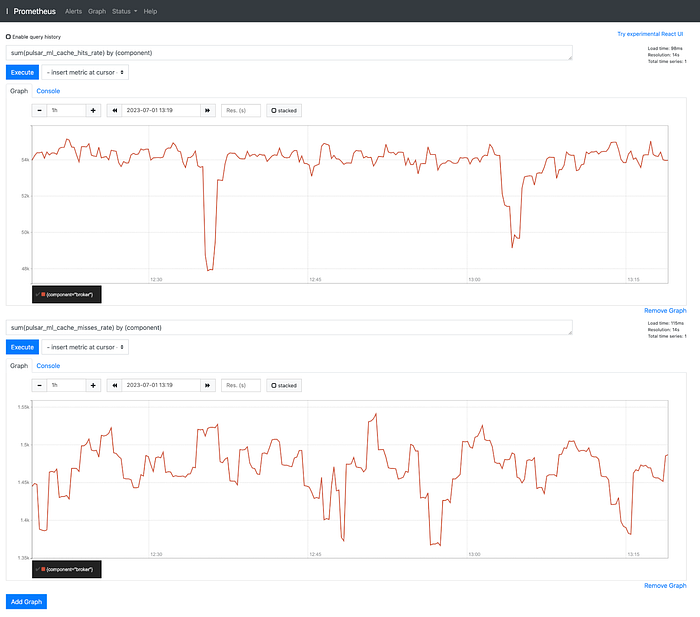

Following are the broker properties for tuning the managedLedgerCache:

- **managedLedgerCacheSizeMB=  
**Configures the size of the cache used for caching ledger metadata and index entries. Increasing the cache size can improve read performance by reducing disk I/O. By default, it takes 1/5th of the available direct memory.
- **managedLedgerCacheCopyEntries=false  
**Specify whether to make a copy of the entry payloads when inserting them into the cache.
- **managedLedgerCacheEvictionWatermark=0.9  
**Bring down the cache level to this threshold when eviction is triggered. Its float value [0–1]. 0.9 means evicting 10% of the cache.
- **managedLedgerCacheEvictionIntervalMs=10  
**Tunes the managed ledger cache eviction frequency
- **managedLedgerCacheEvictionTimeThresholdMillis=1000  
**Specifies the length of time that entries can stay in the cache before they are evicted.
- **managedLedgerMaxEntriesPerLedger=50000  
**Specifies the maximum number of entries (messages) to be stored in a single ledger before a new ledger is created. This property affects the size of each ledger file and is hardware-dependent.

## Load balancing and bundle configurations

In Pulsar, topics are logically grouped under the namespace. These topics are physically grouped and called bundles. So a namespace can have multiple bundles and a bundle can have multiple topics. Broker acquires the ownership of a bundle instead of each topic. This aids in load balancing.

When a bundle becomes too large or receives a high volume of incoming messages, it is split into multiple smaller bundles or sub-bundles. Bundle split and load balancing are closely related because the process of bundle splitting contributes to load balancing. The sub-bundles can then be distributed across brokers in a load-balanced manner. All these happen dynamically based on the load and available resources for the broker.

When a bundle is split, to make informed decisions on how to balance the workload, the load balancer considers the following factors:

- The current load on each broker and the distribution of bundles
- Number of active producers and consumers
- Message throughput
- Resource utilization

The load balancer may reassign bundles to brokers with lower loads, ensuring the overall even distribution of the load.

When we tune bundle splitting and load balancing correctly, the resource utilization will be optimal under load. It also helps to prevent any hotspots in the cluster and allows for scalable and efficient message processing in a distributed environment.

Here is one such example where one broker has a hotspot and bottleneck.

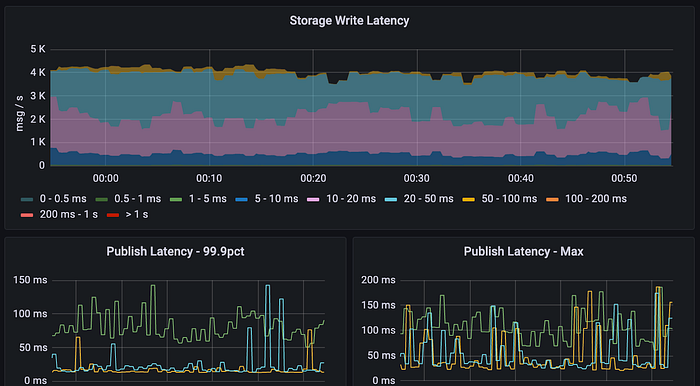

_Above image shows latencies before making any changes to LB and bundle configuration._

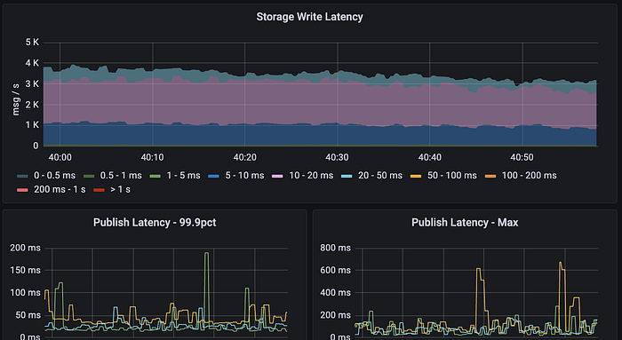

_After moving to UniformLoadShedder LB algorithm from ThresholdShedder LB algorithm as it supports our use case better._

With the new configuration, every broker was seen handling approximately the same amount of bundles which was not the case earlier, as one broker was handling ~3x of another broker’s bundle, displaying higher latency due to the bottleneck.

For more about bundle and load balancing properties, Pulsar docs have done a great job: [https://pulsar.apache.org/docs/3.0.x/administration-load-balance/](https://pulsar.apache.org/docs/3.0.x/administration-load-balance/)

## Throttling

Throttling allows you to regulate the flow of messages, preventing overload situations and maintaining system stability. It’s important to throttle the clients both on the produce side and the dispatch side because one client behaving badly (producing or consuming at very high QPS/throughput) can result in the degradation of the whole cluster.

A few such scenarios are:

- **System Stability:** Without throttling, a burst of high-volume traffic from producers or consumers can overwhelm the Pulsar cluster crossing the expected resource usage (CPU, mem, disks IOPS, N/W bandwidth, high GC, etc), causing congestion and potential service disruptions.
- **Preventing Back Pressure:** Throttling acts as a mechanism to apply back pressure to the message flow. When a particular component, such as a consumer, cannot keep up with the incoming message rate, it can request to slow down the message consumption rate. This prevents message buildup and potential data loss, ensuring that the system operates within its capacity limits.

Throttling can be applied at different levels using either cluster configurations or resource policies.

- **Broker level  
**In broker configuration, the `dispatchThrottlingRate*` configs can be used to limit the throughput going to consumers and proactively prevent any sudden spike of messages causing instability in the system.
- **Topic level**  
The namespace policy can be set using the Pulsar admin command to apply rate limiting for all the topics inside that namespace.  
Ref: [https://pulsar.apache.org/docs/next/admin-api-namespaces/#configure-dispatch-throttling-for-topics](https://pulsar.apache.org/docs/next/admin-api-namespaces/#configure-dispatch-throttling-for-topics)
- Subscription level  
Similarly, all the subscriptions of a topic under a namespace can be throttled using a namespace policy. Using the Pulsar admin command, the same can be applied.   
Ref: [https://pulsar.apache.org/docs/next/admin-api-namespaces/#configure-dispatch-throttling-for-subscription](https://pulsar.apache.org/docs/next/admin-api-namespaces/#configure-dispatch-throttling-for-subscription)

**Before Throttling clients**

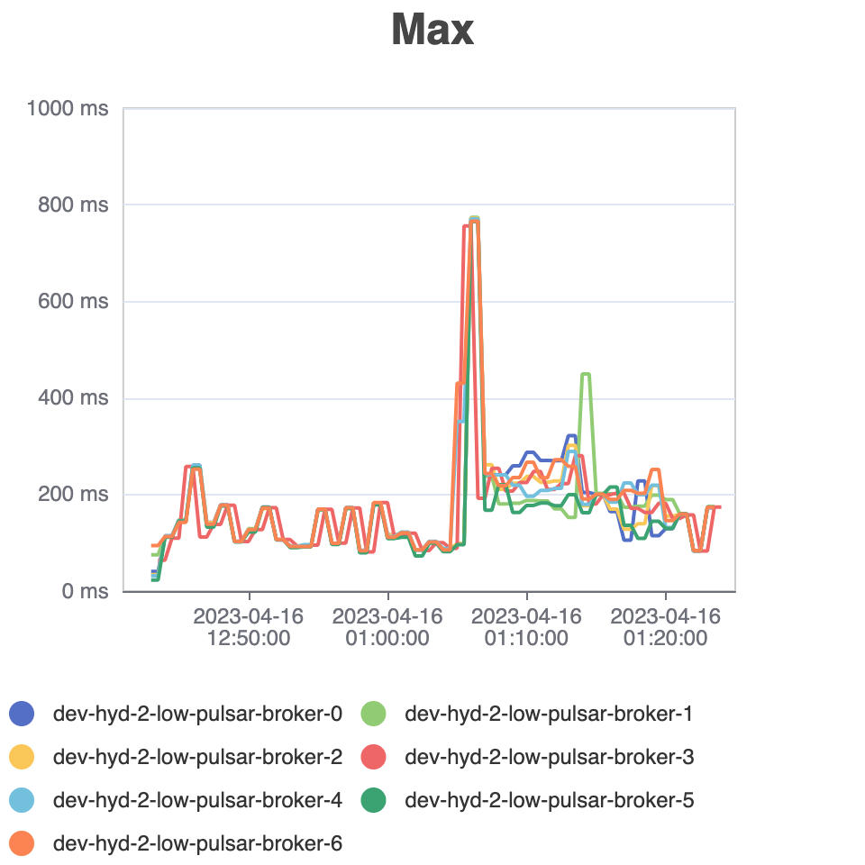

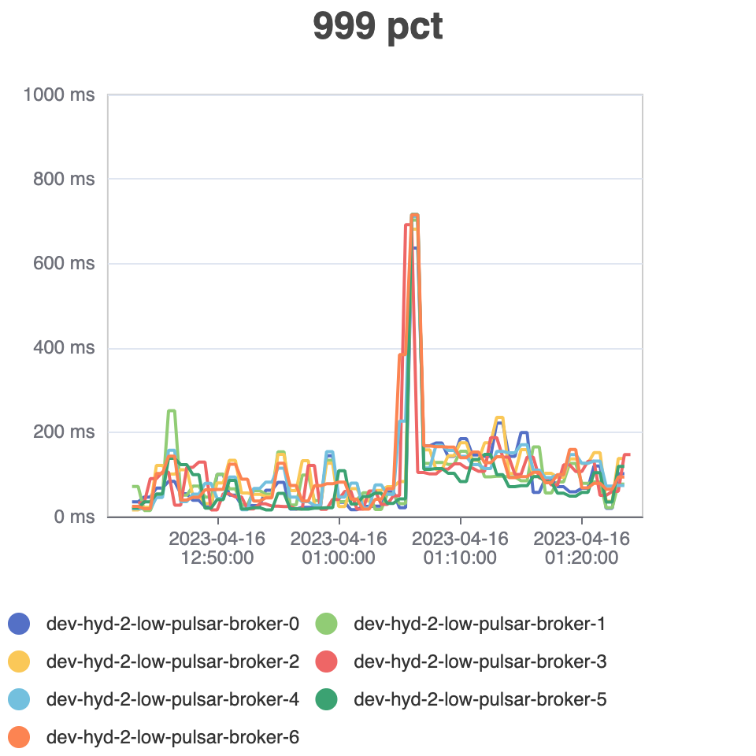

**After throttling clients**

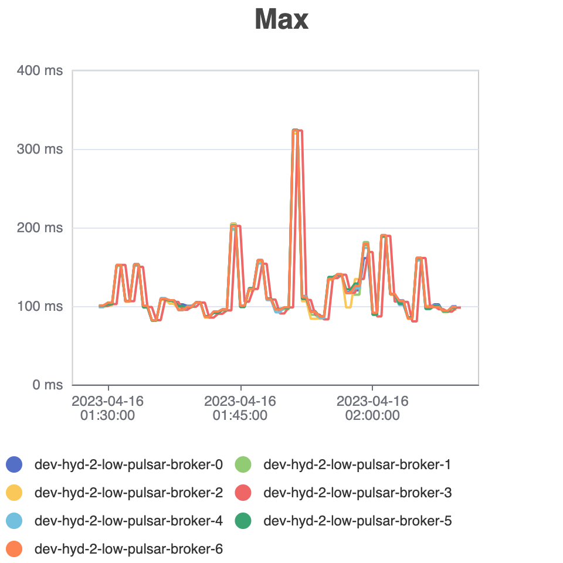

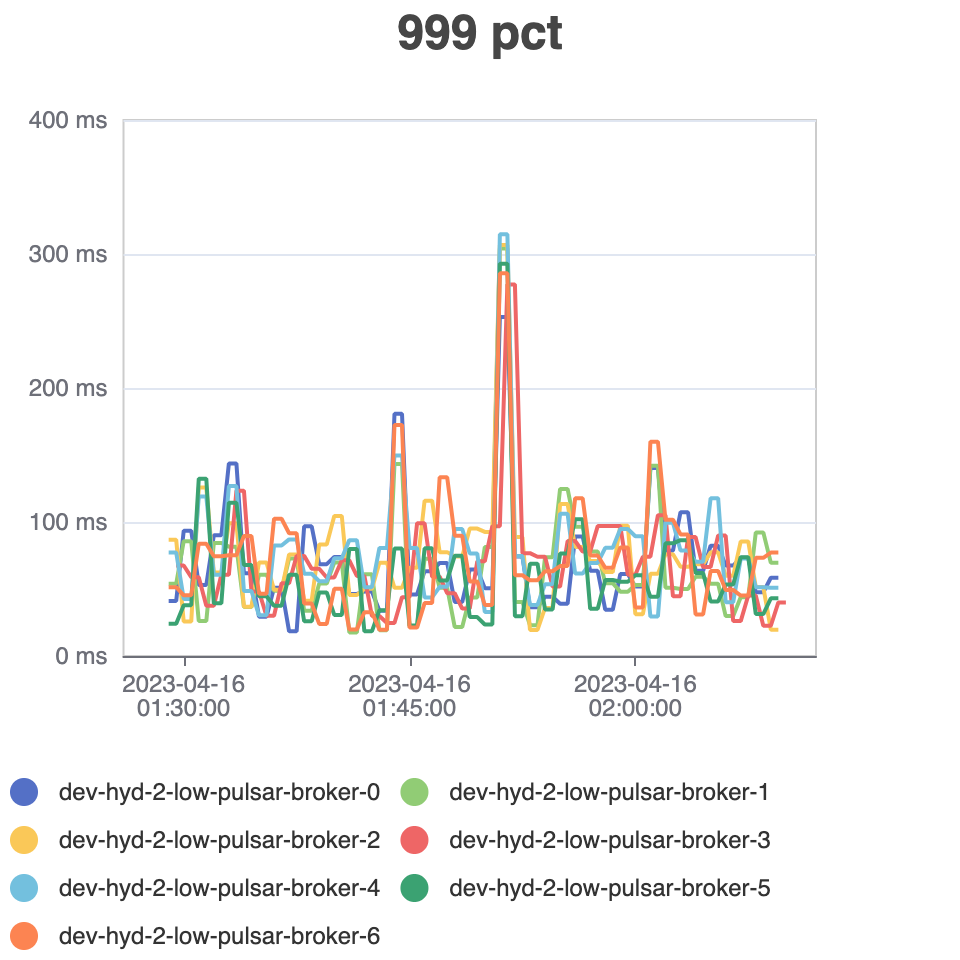

In the above runs, more than 100+ Open Messaging Benchmark clients ran to remove any possible bottlenecks from the client side. These many clients were capable of easily degrading the cluster by making too many requests.

The spikes in the publish latency above indicate that consumers pull messages to clear the backlog faster than the permissible limit, causing latency degradation. After applying the dispatch rate limiter, the latency spike was reduced.

Pulsar offers two types of rate limiters out of the box — polling-based and precise rate limiter. After applying strict throttling rules in the cluster, it’s possible to limit the above latencies to never cross the 200ms mark when using the precise rate limiter. To turn it on, set the **preciseTopicPublishRateLimiterEnable** flag to True.

## Other optimizations

### JVM GC tuning

- **GC Algorithm**: The default algorithm is G1GC in Pulsar which performs well for most of the use cases. However, we recommend testing out with different GC algorithms. For example, for low latency GC, ZGC is a good algorithm, but it uses more CPU cycles as compared to G1GC.
- **Heap Size**: Too small a heap size results in a very high frequency of GC pauses, while too large a heap size results in a huge GC pause time that will contribute to the latency spikes. To compute the perfect heap size, guess the initial memory usage and try to tune from there to observe the least affecting heap size.
- **Profiling**: To fine-tune the GC, better profile the application to understand the memory usage pattern, and observe the GC behavior using GC logs. Memory profiling under load gives a clear picture of memory usage patterns.

GC tuning is a topic in itself and that a discussion for another time but I’ll share one useful point, set `xmx` and `xms` as the same value in production where there is a dedicated memory for the broker/bookie/zookeeper process.   
Ref: [https://developer.jboss.org/thread/149559](https://developer.jboss.org/thread/149559)

---

## Bookkeeper

The bookkeeper stores messages as entries inside ledgers. These ledgers are mapped to certain topics called managedLedgers. Some of the factors regarding increasing the performance of the bookkeeper cluster or supporting certain types of workload are as follows:

## Journal Disks

Before storing the messages in a ledger, the messages are appended in a journal and when the journal file size is reached / rollover period is complete, messages will be moved to the ledger. Disks of both journal and ledger play an important role in deciding the cluster performance.

We recommend keeping the journals on a faster disk to give the best possible performance in the cluster because all the messages reach the journal first. After the storage is successful, it sends an acknowledgment to the broker.

Bookkeeper config `journalSyncData` dictates whether to send an acknowledgment when data is f-synced to the journal disk or when stored in memory. Keeping it as ‘false’ means chances for data loss as journal entries are written in the OS page cache but not flushed to disk. In case of power failure, the affected bookie might lose the unflushed data.

Moving both journals and ledgers to better disks (SSDs/NVMEs) helps in achieving lower latencies and better performance of the bookkeeper cluster but at a higher cost.

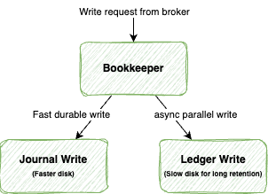

To decide on the bookie (bookkeeper) configuration, you’ll need answers to a few basic queries:

### Do I need a journal?

Journal gives the benefit of having lower publish latencies without compromising the durability. The bookkeeper sends an acknowledgment to bookkeeper clients (which are brokers) only when a writing operation is successful in a journal. Having separate journals and ledgers also helps in improving the scalability of the bookie node. We can enable journaling with the `journalWriteData` flag in the bookkeeper config (enabled by default).

Ledgers can do lazy writes while Journal can store messages keeping atomicity and consistency of operations. We recommend having Journal disks on high-speed disks as compared to Ledger’s disks. Smaller Journal disk size can be used as the journal disk frees up those entries when messages are stored in ledgers.

### How many ledgers per bookkeeper node are needed?

The bookkeeper stores the messages as entries in a ledger file. In Pulsar, we can configure the number of ledger directories using the `ledgerDirectories` bookkeeper config. These ledger directories can be on different disks to reduce the latency spikes caused by random IO happening in one device. Ledger disks are cheaper HDDs, so IOPS is very limited. Having multiple disks reduces the bottlenecks.

Are you wondering if ledgers are not directly involved in produce flow, why are they so important? The reason is very simple. They can create back pressure on the journal if already loaded. However, in loaded ledgers, increasing the IOPS limits on ledgers or moving to better disks helps in mitigating that bottleneck.

## Journal configurations

Tuning the journal is easy. It requires only the following important configs to look out for:

### journalBufferedWritesThreshold

Determines the number of buffered writes that trigger a flush to disk. The default value is 64, meaning that when 64 buffered writes accumulate, they are flushed and written to the journal on disk. Flushing writes ensures message persistence and durability in case of system failures.

### journalMaxGroupWaitMSec

Determines the maximum time buffered writes can wait before being flushed to disk. It specifies the duration for which writes remain in memory before being written to the journal. The default value is 1 millisecond, ensuring timely persistence of writes. This parameter balances performance and durability, as flushing writes as a group optimizes disk I/O operations. The optimal value depends on many factors, including how much durability the system requires, resource utilization, etc.

### journalWriteBufferSizeKB

Determines the size of the buffer used for writing messages to the journal. By default, it is set to 4 MB. This buffer temporarily holds messages in memory before they are written to the journal on disk. The purpose of the buffer is to optimize disk I/O operations and improve write efficiency. Increasing the buffer size can enhance write throughput but also increase memory usage. The appropriate value depends on message load, desired performance, memory resources, and disk capabilities, and we can adjust it to achieve the desired balance between performance and resource utilization.

Ref: [Bookkeeper config](https://github.com/apache/pulsar/blob/master/conf/bookkeeper.conf)

**Note: **Adjusting the **journalBufferedWritesThreshold **and **journalMaxGroupWaitMSec **affects write latency and durability, with lower values increasing the durability but potentially affecting performance, and higher values improving throughput but potentially delaying the disk persistence.

---

## Zookeeper

Set up the zookeeper quorum size to scale for Reads. It’s always best to limit the operations of zookeepers as increasing ops to zookeepers can cause bottlenecks in the cluster.

A few such scenarios causing bottlenecks are:

- Increasing metadata (Large metadata or high topic churn): It’s better to reuse topics rather than frequent topic creations and deletions.
- Increasing the subscriptions
- Increasing the QPS (causing high reads/writes)

We have found that increasing the zookeeper nodes helps mitigate the bottlenecks to a certain extent.

## Batching metadata calls

Upgrading to Zookeeper 3.6.0+ helps in optimizing the queries as batch commits are available. [https://issues.apache.org/jira/browse/ZOOKEEPER-3359](https://issues.apache.org/jira/browse/ZOOKEEPER-3359). Pulsar 2.10 comes with this feature as it is bundled with Zookeeper 3.6.3.

The broker can batch calls to the zookeeper if the metadataStoreBatchingEnabled flag is enabled in the config. This is very useful when brokers make multiple zk requests (updating cursor information on acks, updating topics properties, reading ops on starting up the large application with multiple topics or subscriptions in use, etc.). This property helped to reduce the latency spikes at the startup of batch jobs.

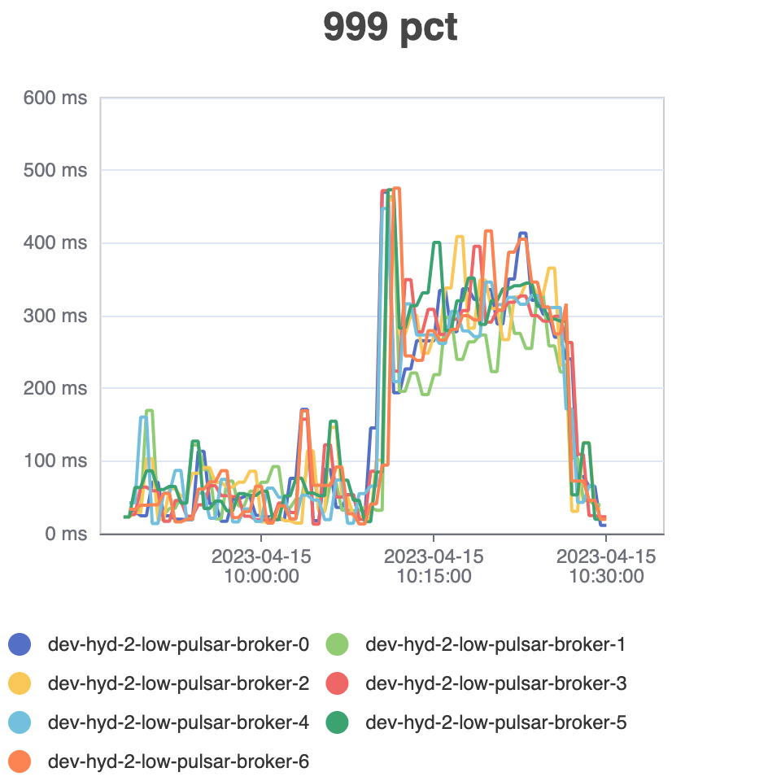

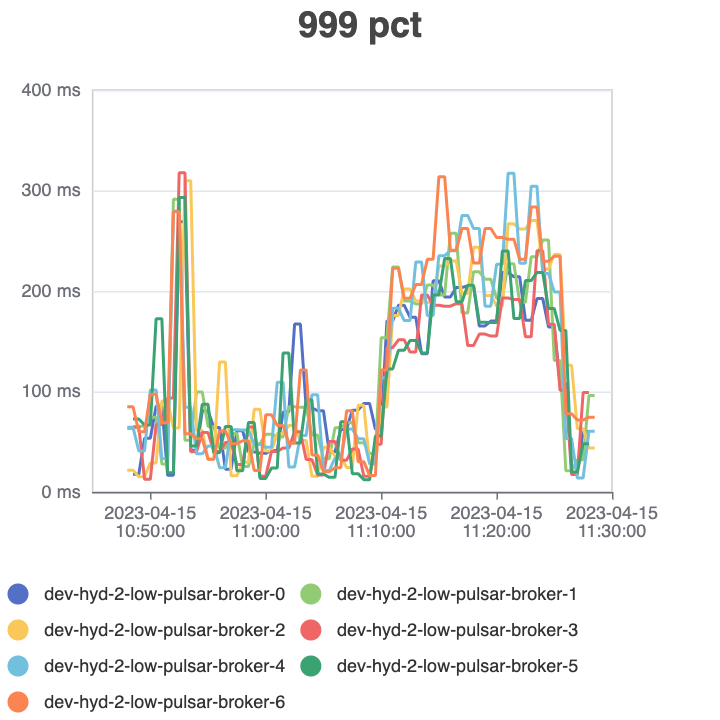

Left: With metadata operations batching disabled  
Right: With metadata operations batching enabled

## Compression

If metadata is huge, the zookeeper easily becomes a bottleneck as it takes snapshots at configured intervals. Huge data size means the zookeeper is unavailable until the snapshot is stored in the disk successfully.

We can mitigate the issue by reducing the disk IO which is to enable the compression in Zookeeper at the cost of more CPU utilization. Zookeeper supports Gzip and Snappy compression algorithms.

In one of our use cases, we had more than 100K topics generating more than 2GB worth of metadata. Snapshot writes made the cluster unresponsive, either causing backlog buildup at the produce side or cluster to be unavailable for most of the time. Chaos tests can generate the issue where a random zookeeper pod restarts triggering a snapshot and sync.

We chose Snappy because of its low impact on CPU utilization and its real-time. After enabling compression, metadata size was reduced to ~200MB, and this has helped in faster syncs as writing 200MB was much faster.

Note: Compression also needs an upgrade to Zookeeper 3.6.0+ which comes bundled with Pulsar 2.10+.

**Ref**: [https://issues.apache.org/jira/browse/ZOOKEEPER-3179](https://issues.apache.org/jira/browse/ZOOKEEPER-3179)

---

## Pulsar client

After tuning the pulsar cluster, clients must use services from the cluster in an optimized way. Some of the key configurations to consider from the Pulsar client perspective for improved performance are:

- **Message batching**: By batching multiple messages together into a single send, you can reduce the overhead of individual message sends and improve overall throughput. To configure message batching in the Pulsar client, you can set the `batchingEnabled` flag to `true` and set the `batchingMaxMessages` and `batchingMaxPublishDelay` parameters to control the batch size and maximum delay between sends.
- **Compression**: Pulsar supports message compression, which can reduce the amount of data that needs to be transmitted and improve both network efficiency and overall throughput. To enable compression. Pulsar provides lz4, zlib, zstd, and snappy `compressionType` out-of-the-box.  
Sometimes it feels counterintuitive to think that batching with compression results in more latency, but we have seen that it’s the other way around. Less payload size means reduced IO latency and combined with batching which will reduce the RTT (Round Trip time) giving overall better results compared to scenarios with no batching and compression.
- **Acknowledgment type**: Pulsar provides different acknowledgment modes. To optimize the number of acknowledgment requests going to the pulsar cluster, use cumulative acknowledgment. This can limit the number of ops going to zookeepers helping in better utilization, but there is a caveat. We cannot use cumulative acknowledgment with a shared subscription type (limitation of pulsar architecture).
- **Receiver Queue**: On the consumer side, messages to process are pre-fetched in an in-memory queue and its size is controlled by receiverQueueSize. A higher value means the client can pull more messages in one go, reducing the overall network round trips at the cost of more memory usage.

## Conclusion

Optimizing the Apache Pulsar cluster involves:

- Fine-tuning various components, such as the Broker, Bookkeeper, ZooKeeper, and Pulsar clients
- Choosing the right hardware
- Implementing journal and ledger configurations according to disk specifications
- Leveraging message batching and compression in Pulsar clients

As configurations/features are being added to newer versions of Apache pulsar, further fine-tuning may be required for better performance in Kernel Parameters, File System Tuning, IO optimization, and N/W configuration. You may want to consider managing durability and latency settings, load balancing, throttling to maintain stability, tuning the JVM garbage collection, and optimizing ZooKeeper operations.

With all these efforts in Apache Pulsar, it is possible to continually achieve optimal performance and low latency in real-time data processing applications.

---
**Tags:** Message Queue · Apache Pulsar · Scalability · Backend · Distributed Systems
