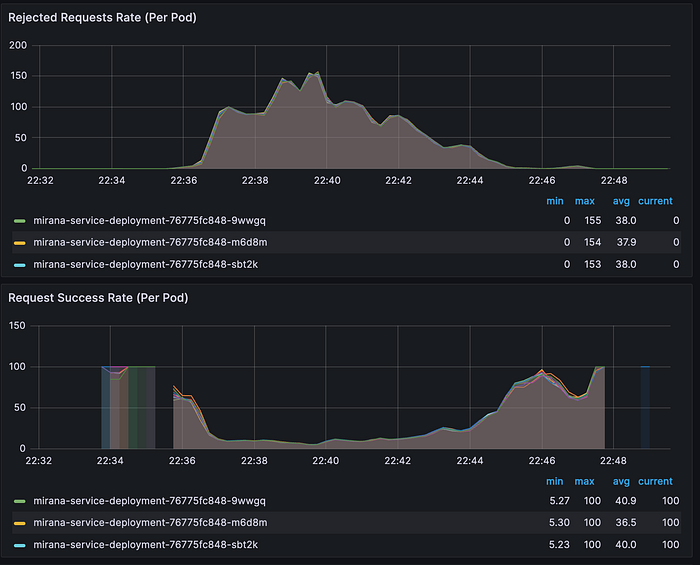

# When Good Locks Go Bad: Diagnosing a System Meltdown Under Load

## Introduction: The Backbone of BBD Readiness

At Flipkart, preparing for our annual Big Billion Days (BBD) sale is an epic undertaking. It’s a period where we anticipate traffic at a scale that dwarfs a normal day. To ensure our infrastructure is battle-hardened, a dedicated Scale-Test team runs a barrage of load tests, simulating real user behaviour to find our breaking points before our customers do.

At the heart of this massive testing effort is a service we call **Mirana**. Mirana’s mission is to create a high-fidelity mock environment for our testers. It’s the critical data source that fuels our load generation machines with the realistic user sessions needed for the scale test. It’s more than just a data repository; it’s a dynamic testing environment. Mirana provides a vast catalog of mock data, from product listings on Flipkart’s main marketplace and for Flipkart Minutes. It manages a dynamic mock inventory system, allowing mock users to simulate everything from browsing to placing an order.

Crucially, it ensures that the mock user accounts provided to the Scale-Test service behave just like real production accounts — complete with different membership statuses like _Gold_ or _Silver_, and even virtual wallets containing ‘_SuperCoins_’ — allowing our tests to mimic the complete user journey at BBD scale. In short, Mirana is the flight simulator for our e-commerce platform, and its reliability is paramount.

### The Meltdown

It began without warning during a peak load test. The first sign of trouble was a cascade of alerts: Mirana was throwing 5xx server errors. A frantic check on our Kubernetes dashboard painted a grim picture: pod after pod was failing its health checks, getting stuck in a _CrashLoopBackOff_ state with a status of _1/2_ running containers.

The service was effectively dead. The application within the pods had become so unresponsive that it couldn’t even reply to a simple health check, causing Kubernetes to relentlessly kill and restart them, only for the new pods to meet the same fate.

As a desperate measure to restore “Business As Usual” (BAU), we took the only option left: we scaled the entire service deployment down to zero pods. After a few moments, we carefully scaled it back up. The service came back to life, and the alerts subsided.

But this was no victory. The brute-force restart brought Mirana back online, but it left us with a chilling uncertainty. We had a ticking time bomb in our infrastructure, and with BBD approaching, the clock was ticking louder than ever. Our initial hypothesis was simple — the service was overwhelmed by the continuous calls from the load generation machines. But _why_? What specific component in our sophisticated simulation engine had buckled so completely under pressure?

This question kicked off a deep-dive investigation that would lead us to a surprising culprit, hiding in a component we had long taken for granted.

## The Investigation: Following the Trail of Clues

With Mirana stabilized, our post-mortem began. The initial hypothesis was straightforward: the service, which was designed to handle high throughput, must have finally hit a scaling limit and been overwhelmed by the sheer volume of requests.

### The First False Lead

Our first instinct was to blame the service’s own resources. We pulled up our Grafana dashboards, expecting to see CPU or memory usage for the Mirana pods pegged at 100%. But we were met with a surprise.

The graphs showed that during the incident, pod CPU usage never breached 40%. Memory was stable. This was a critical clue. It told us the bottleneck wasn’t computational power _within_ the service; the pods weren’t being overworked, they were being _blocked_. They were stuck, waiting for something that was never arriving. This realization shifted our investigation from the service itself to its external dependencies.

### A New Suspect Emerges

It was time to go back to the source code. We started tracing the lifecycle of the main GET call the load test service used to fetch user sessions. Deep within the logic, we found our prime suspect: a distributed lock.

The logic was as follows:

1. **Acquire a Lock:** Before any processing, the service used a Redisson client to get a distributed write lock.
2. **MySQL Computation:** With the lock secured, it would perform some complex computations, querying a MySQL database to calculate the correct range of unique user sessions to return.
3. **Update and Release:** Finally, it would write the result of that computation back to MySQL and release the Redis lock, allowing the next request to proceed.

This lock was essential to prevent a race condition where two concurrent requests might try to process and assign the same batch of user sessions. It was a standard pattern, but could it be our culprit?

### The Smoking Gun

With a new suspect in mind, we turned our attention from Mirana’s dashboards to Redis’s. We pulled up the metrics for our Redis cluster (a 1 master + 3 sentinel setup) and what we saw was the “_aha_!” moment.

The graph was unmistakable. During the exact timeframe of our outage, the CPU usage on our Redis **master** node was slammed at 100%. Its idle time was zero.

Suddenly, everything clicked into place. We had our full hypothesis:

1. The load generators created a massive influx of traffic by making millions of concurrent requests to Mirana for user sessions.
2. Each request thread immediately tried to acquire a write lock from Redisson.
3. The Redis master, being single-threaded for command execution, was completely overwhelmed by the sheer volume of these lock requests. It became the bottleneck for the entire system.
4. With the master CPU at 100%, it couldn’t grant new locks or even process release commands in a timely manner.
5. Back in the Mirana service, our application threads began piling up, all stuck in an indefinite wait loop, waiting for a lock from an unresponsive Redis master.
6. The final nail in the coffin was this piece of code:

```
RReadWriteLock lock = redissonClient.getReadWriteLock("lock");
Map<String, Object> resultMap = new ConcurrentHashMap<>();
try {
    // This loop actively checks if the lock is held, creating more chatter
    while (lock.writeLock().isLocked()) {
        log.info("Waiting for unlock Redis.........................");
        CommonService.SLEEP(SessionCacheService.PESSIMISTIC_LOCKING_EXCEPTION_HANDLING_RETRY_AFTER_MS);
    }
    // This is the line where threads would wait forever
    lock.writeLock().lock();
```

This code confirmed that our service wasn’t just waiting passively; it was designed to wait indefinitely for a lock that, under these conditions, would never be granted. With all available application threads consumed by this wait state, the service became completely unresponsive, failed its Kubernetes health checks, and entered the CrashLoopBackOff death spiral.

We had found our bottleneck. It wasn’t our service; it was the locking strategy we had built around it.

## The First Attempt: The Queueing Fallacy

Having identified lock contention as the root cause, we gathered around the virtual whiteboard. The problem, as we saw it, was a classic “too many people, one door” scenario. An uncontrolled flood of requests was hammering our single Redis lock.

The solution seemed equally classic: if you have a crowd, form a line.

### The Theory: Taming the Herd with a Queue

Our first proposed solution was to implement a queue. Instead of allowing every incoming request to immediately compete for the Redis lock, we would place them into an in-memory queue within the service. A separate worker thread would then pull from this queue at a controlled, predictable rate.

This approach seemed elegant. We would be in complete control of the concurrency. We could tune the worker to process, say, only 10 requests at a time, ensuring that our Redis master never got overwhelmed again.

We acknowledged the trade-off: this would introduce latency. The Scale-Test team’s requests would no longer be processed immediately. They would have to wait their turn in the queue, and under heavy load, some might even time out. But we reasoned that a slightly slower, stable service was infinitely better than a fast service that falls over.

We implemented the solution, and our initial tests were a resounding success. We threw a massive load at Mirana, and just as we’d hoped, the Redis master’s CPU purred along at a comfortable level. The system was stable. We were ready to declare victory.

### The Unseen Flaw : Are We Failing Fast or Failing Slow?

Just before we moved forward, we ran the design by our Architect. He listened patiently and then pointed out a fatal flaw — one that would have led to the exact same catastrophe, just in a slower, more insidious way.

He introduced us to a critical system design principle: **Fail Fast**. Systems should be designed to fail immediately and visibly when they encounter a condition they cannot handle.

Our queuing solution did the opposite. It was a “fail slow” design. Here’s the failure scenario he outlined:

1. **Sustained Overload:** As the Scale-Test team ramps up the load, requests arrive faster than our single worker can process them.
2. **The Unbounded Queue:** Our in-memory queue begins to grow… and grow… and grow.
3. **Client Timeouts:** Requests sitting at the back of the line would inevitably hit the client-side timeout threshold.
4. **The Retry Storm:** What does a well-behaved client do when a request times out? It retries. These retried requests would be added as _new_ items to our already-bloated queue, creating a vicious feedback loop.
5. **The Inevitable Crash:** The queue, consuming more and more pod memory, would eventually cause the JVM to run out of heap space. The pod would crash. Kubernetes would restart it, and the cycle would begin anew.

We had inadvertently designed a memory leak waiting to happen. Our solution didn’t solve the bottleneck; it just shifted it from the Redis master’s CPU to Mirana’s pod memory. We were back to square one, but armed with a much deeper understanding of the problem. We didn’t just need to manage the lock; we needed a fundamentally different approach.

## Solution Two: Embracing the “Fail Fast” Principle

The failure of our queuing model taught us a valuable lesson: we shouldn’t try to absorb infinite load; we should gracefully reject it. Armed with the “_Fail Fast_” principle, we went back to the drawing board.

We realized our initial analysis was slightly off. The Redis lock itself wasn’t the enemy; it was a necessary tool to prevent race conditions and dirty writes in our MySQL database. The true villain was the **uncontrolled contention** for that lock. Our goal, therefore, was not to remove the lock, but to build a gatekeeper in front of it.

We needed to solve a classic critical section problem. The section wasn’t just the database computation; it included the act of _acquiring the Redis lock_. We needed to limit the number of threads simultaneously trying to talk to Redis.

### The Gatekeeper: Semaphores to the Rescue

Our first thought was to use a Semaphore. In concurrency programming, a semaphore is the perfect tool for this job. It’s a bouncer that maintains a set of N permits. A thread must acquire a permit just to get in line for the Redis lock.

The new, more resilient plan was:

1. Initialize a Semaphore with N permits at the start of the application.
2. When a request comes in, it first tries to acquire a permit from the semaphore.
3. **If a permit is not available:** We don’t wait. We immediately throw an exception, which translates to an HTTP 429 Too Many Requests response, advising the client to retry after a short backoff period.
4. **If a permit is acquired:** _Only then_ is the thread allowed to proceed and attempt to acquire the Redisson write lock. It performs its MySQL operations and then, **crucially, releases both the Redis lock and the semaphore permit** in a finally block to prevent leaks.

This design was fundamentally more robust. The semaphore acted as a coarse-grained, in-memory lock that protected our fine-grained, distributed Redis lock. It protected both Mirana and Redis from being overwhelmed.

### The Refinement: Simplicity with AtomicInteger

As we began implementing the Semaphore, we realized that for our specific use case — a simple counter to limit concurrency — we could achieve the same result with an even simpler primitive: an _AtomicInteger_.

The logic would be identical, but the implementation was more direct:

1. Initialize an AtomicInteger to zero.
2. On request, atomically increment the integer and check if its new value is less than or equal to N.
3. If it is, the thread proceeds to the Redis lock. If not, we decrement the integer back and return the 429 error.
4. In the finally block, after releasing the Redis lock, we would always atomically decrement the integer.

We quickly pivoted to this simpler implementation. The solution was in place. We were now failing fast, protecting our resources, and ready for production. But one crucial thread was still left hanging…

### The Final Puzzle: What is the Magic Number ‘N’?

The entire solution hinged on choosing the right value for N, the maximum number of concurrent threads allowed to even _attempt_ to get a Redis lock. How do you pick a number that is both safe and efficient?

Our thought process was driven by our original bottleneck: the Redis master. We needed to ensure we never exceeded its connection limit.

1. We checked our Redis configuration and found the maxclients setting was **1160**. This was our hard ceiling.
2. Our Mirana service was running with **9 pods**.
3. The math seemed simple: 1160 total connections / 9 pods ≈ 128 connections per pod.
4. So, we set N to **128**.

Our calculation appeared sound. With N=128, the total concurrent threads attempting to get a lock from all pods would be 128 * 9 = 1,152. This was comfortably under our 1,160 limit. We were utilizing our Redis resource to its maximum potential without exceeding its capacity. It seemed like the perfect balance.

We deployed the change, feeling confident. The system was now robust, resilient, and efficiently tuned.

But, as we would soon discover, there was a hidden flaw in our seemingly perfect logic.

## The Final Twist: When the Math Is Right, but the Logic Is Wrong

We deployed the change, our AtomicInteger gatekeeper now configured with N=128. The logic seemed unassailable. The math was checked. We were using our Redis resources to their fullest without exceeding the hard limit. We were confident we had cracked it.

Then, we ran the Scale-Test load test.

The results were not just bad; they were disastrous. The service fell over just as hard as it had before. Instead of a resilient service gracefully handling load, we had created a wall of 429 Too Many Requests errors. The service became incredibly latent, and almost every new request was immediately rejected by our new semaphore.

Our expected behavior was a gentle wave: as load increased, we’d see a rise in 429s, but the service would remain stable, and as the load subsided, the 2xx success responses would return. The reality was a flood. The service became so slow under the “allowed” concurrency that it could never catch up, creating a state of perpetual overload. We hadn’t solved the problem at all.

### The Real “Aha!” Moment: Optimizing for the Wrong Metric

We had made a classic engineering mistake. We had meticulously calculated capacity based on a _downstream dependency’s resource limit_ (Redis’s maxclients) instead of the _performance characteristics of our own critical section_.

The number of available Redis connections was irrelevant if our API call itself was slow. Allowing 128 concurrent threads into a slow process was the problem. These threads would acquire a semaphore permit, get the Redis lock, and then spend hundreds of milliseconds doing MySQL work. While they were busy, 127 other threads were doing the same, creating massive contention and system-wide slowness. The bottleneck wasn’t Redis anymore; we had pulled the bottleneck right back into our own service.

Our focus had to shift from “How many connections can Redis handle?” to “**How many requests can our service handle _well_?**”

### The Right Math: Thinking in Latency and Throughput

We sat down one last time and did the math from a completely different angle.

1. **Measure the Critical Section:** We analyzed the average time our GET API call spent inside the critical section (from acquiring the semaphore to releasing it). It was consistently between **200–300ms**.
2. **Be Conservative:** To build in a safety margin, we budgeted a generous **500ms** per request.
3. **Calculate Throughput Per Thread:** If one request takes 500ms, then a single thread can process **two requests per second** (1000ms / 500ms).
4. **Extrapolate Total Throughput:** With this new understanding, we could model our total Queries Per Second (QPS).

> If N=1, our service (with 9 pods) could handle 1 thread/pod * 2 QPS/thread * 9 pods = **18 QPS**.If we set N=5, we could handle 5 threads/pod * 2 QPS/thread * 9 pods = **90 QPS**.

The numbers were suddenly illuminated. Our previous value of N=128 was astronomical. We weren’t designing a system for 90 QPS; we were designing one that would allow over 2,000 theoretical QPS (128 * 2 * 9), a load it could never possibly handle.

We had our new number. Best of all, our design allowed us to change it on the fly. We adjusted the concurrency limit down to a conservative N=5 and kicked off the Scale-Test test, holding our breath.

> It worked. It worked beautifully.


*Dashboard of Redis Deployments*

The picture of stability we had theorized finally began to emerge. As the load test ramped up, we saw 2xx responses. Then, as our 90 QPS limit was approached, 429 responses began to appear, mingling with the successes. The service itself never broke a sweat, and the Redis master CPU remained stable.

Now, in the real world, the graph wasn’t the **perfectly flat line** you see in textbooks. But the core principle was proven: the service was stable. This is where the power of a tunable N comes in. The ability to adjust this limit on the fly is a powerful lever for the future, allowing us to further refine our handling of concurrent requests and **optimize for maximum stable throughput.**

We had finally solved it.

## Conclusion: The Lessons We Learned

This journey from a catastrophic failure to a resilient solution taught us several invaluable lessons:

1. **Your Bottleneck Defines Your Limit:** The true capacity of a system is defined by its slowest component. Our initial math based on Redis connection counts was useless because the actual bottleneck was the time spent in our own database logic.
2. **Fail Fast is a Feature:** Building a system that gracefully rejects excess traffic with _429_ errors is far better than building one that tries to absorb it and collapses. This strategy, known as **concurrent rate limiting**, protects your service and provides clear feedback to clients.
3. **Start Small and Measure:** It is always safer to start with a conservative concurrency limit _(N=5)_ and scientifically prove you need more, rather than starting with a high theoretical limit _(N=128)_ and watching your system burn.
4. **Locks Aren’t Bad, Contention Is:** We didn’t need to remove our Redis lock; we needed to protect it. By placing an application-level semaphore in front of the distributed lock, we created a layered defense that solved the root cause of the contention.
5. **Scale Changes Everything:** The original design was not flawed; it was effective for its intended load. A system engineered to handle X requests will naturally have a breaking point at 10X. This failure wasn’t a sign of a bad design, but a powerful reminder that architecture is always relative to scale.

In the end, the solution wasn’t a complex architectural overhaul. It was a small, simple _AtomicInteger_ governed by a number derived not from abstract limits, but from the measured, real-world performance of our own code.

## Acknowledgements

This deep dive and its successful outcome were a team effort. I’d like to extend my sincere thanks to a few key individuals for their invaluable contributions:

- **R Ajith Athithyan** for his constant support throughout the research, brainstorming, and implementation phases.
- **Sourabh Jain & Naga Krishna Sagar G** for their leadership and for entrusting us with the autonomy to tackle this problem head-on.
- **Ram Anvesh Reddy Kasam **for his valuable insights and for being a crucial sounding board during the problem-solving process.

---
**Tags:** Distributed Locks · Redis · Distributed Systems · System Design Concepts · Load Testing
