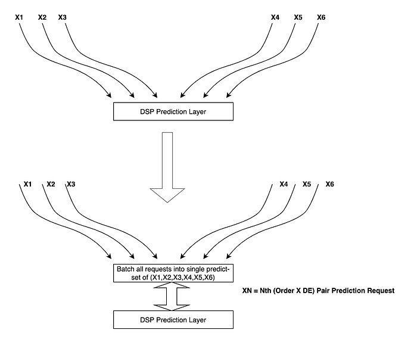
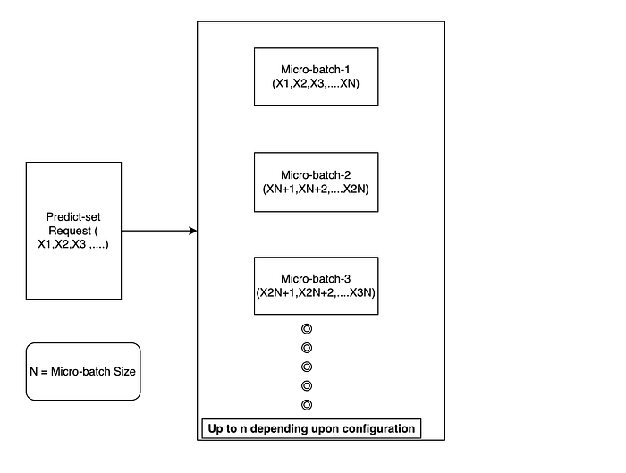
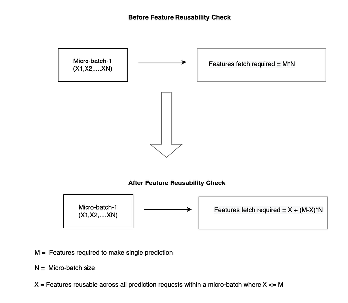
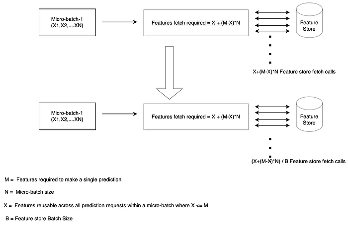
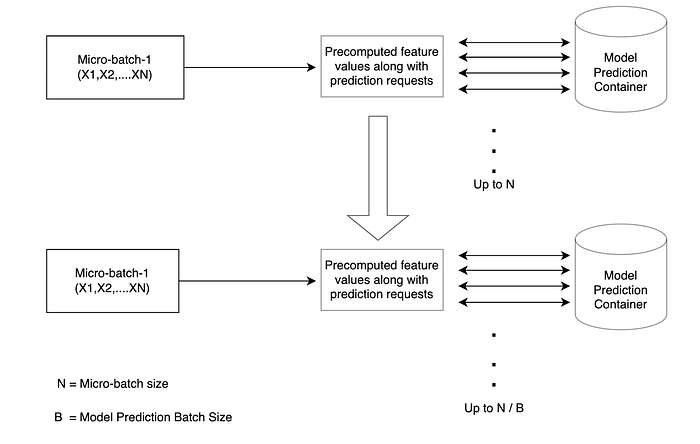
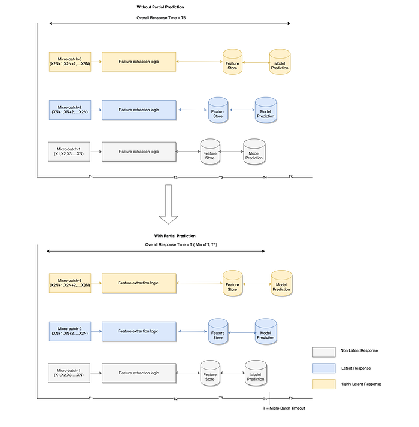
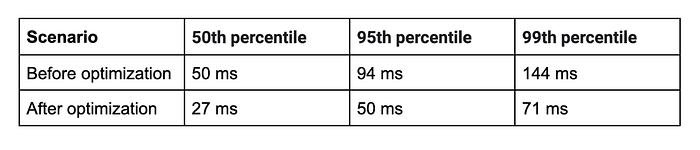
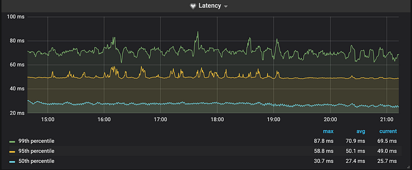
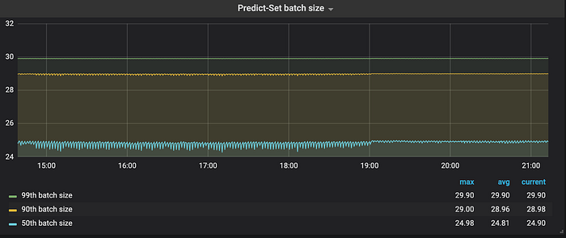

# 2x Improvement in Latency in Swiggy Data Science Platform

Machine learning models play a critical role in providing a world-class customer experience and taking business decisions at Swiggy. [DSP (Data Science Platform)](https://bytes.swiggy.com/enabling-data-science-at-scale-at-swiggy-the-dsp-story-208c2d85faf9) powers ML and AI in production at Swiggy. For example, this platform provides personalized recommendations, curated search results, helps assign delivery executives (DE) to orders, recognizes fraud, etc. It is important for the DSP to implement services that can serve machine learning at scale with bounded latency SLAs. This post focuses on optimizations that the DSP team has done to improve latency at scale.

## The Tech stack behind the DSP

DSP system is built on top of [Akka](https://akka.io/) to support the Reactive principles mentioned in [Reactive Architecture](https://www.reactivemanifesto.org/). All tasks within the DSP system happen via actors. There are multiple actors ( e.g. ModelManager, ModelDiscovery, ModelPredictor, FeatureExtractor, etc.) are involved during the entire serving of the prediction request. All these actors communicate using message-driven architecture along with ensuring elasticity, resiliency, and responsiveness. All internal codebases are well written using [Scala](https://www.scala-lang.org/) as a primary language due to its known benefits. DSP system internally uses Redis as a primarily supported feature store (i.e., centralized repositories for all precomputed features) along with feature sharing and discovery capabilities across the organization.

## Problem

Many use cases require multiple predictions in a single API call. This fanout (a single API call creating multiple prediction calls) results in increased throughput on DSP services. The primary challenge then becomes bounding the latency of the API call at high throughputs. The throughput itself is a function of business growth for many top of the funnel business support ML models. For example, one such use case is **_Order-Assignment_ **flow at Swiggy. To decide “which” order should be assigned to “which” delivery executive in a near-optimal way. This process involves multiple machine learning models.

Generally, **_Order-Assignment_** is fulfilled by city-level batch jobs which trigger at a configured amount of time interval and make predictions for each edge (Order X DE) level. This is then used as input to an algorithm that arrives at the most optimal assignment.

This requires predictions for a large number of combinations of possible Order X DE pairs at once within a strict latency bound. Other use cases such as discounting, ads, etc require batch predictions at scale due to the high fanout factor.

## How DSP solved fanout latency challenge

Above challenges boil down to exposing a batch prediction API to clients to make bulk predictions (i.e., combine multiple requests into one). From a client’s point of view, this will reduce the total network round trip time (RTT) in calling multiple individual requests for each prediction. DSP exposes a **_predict-set_ **API significantly reducing the number of calls needed from the clients.

While this addresses engineering problems to some extent, it creates a different set of challenges. For example, clients need lower latency profiles for some business-critical use cases (e.g., The entire _Order-Assignment flow_ has the expectation to complete all its tasks for a given city within 1 minute.)

To achieve latency improvement at this scale, we analyzed expensive operations involved in the prediction flow and how we can optimize them. We performed five types of optimizations:

1. **Micro-Batch Construct:** Predicting entire batches in a single call has higher latency. Hence, micro-batching for individual ML models was used as a strategy. The entire predict-set request was divided into multiple micro-batches based on a model-specific micro-batch size. All micro-batch predictions happened in parallel thereby speeding up execution.

**2. Feature Reusability: **Another expensive operation observed in the flow was the retrieval of precomputed feature values from the feature store. In batch prediction, such I/O calls negatively impact latency. As an optimization, feature deduplication at the micro-batch level was used.

1. **On the Client-side:** To gain the benefits of this feature fully, prediction requests were grouped at the client side itself based on pivot keys ( e.g., DE_ID in case of **_Order-Assignment_ **flow). This ensured the client is calling model predict-set API for a given unique DE to increase the possibility of minimizing the number of feature store calls for the same DE Id.
2. **At Server-side:** Necessary check at the server to group all precomputed features by pivots and make a single feature store call for a given feature.

**3. Batching at Feature Store Level:** Instead of fetching multiple feature values iteratively from the feature store, we used the batch fetch API (e.g., [MGET](https://redis.io/commands/mget)/ [PIPELINE](https://redis.io/topics/pipelining) in the case of Redis) provided by the feature store. This reduces I/O operations significantly. Less I/O operation has reduced latency associated with total network round trip time along with faster command execution at feature store end.

**4. Batching at Model Prediction Level:** Made model predictions in batches with a complete set of features data instead of making predictions for each individual request in a loop. Native batching provided by frameworks such as [MLeap](https://github.com/combust/mleap), [TensorFlow](https://www.tensorflow.org/) were helpful.

**5. Partial Prediction: **Even after all the optimizations, we could not meet 100% of SLA requirements for all use cases. System loads are dynamic and non-deterministic. In order to mitigate this, we used micro-batch level timeouts. This gives the flexibility to return the response for predictions with a bounded SLA (timeout for the model.) We return partial prediction exception in response to the client instead of failing the entire predict-set request.

**Predict-Set request workflow within the DSP ecosystem**

## Roll Out in Production

We tested batch predictions using a high throughput use case — **_Order-Assignment_**. Every order on Swiggy is scored against available delivery agents within a given geographic boundary. With this optimization in place, DSP was able to handle over 5K peak predictions per second for a single model, with a P99 latency of 71 ms for a batch size of 30. Earlier P99 latency was 144 ms (almost 2x gain).

Latencies before and after the change

**Latency distribution graph for a model (order-assignment flow)**

**Batch size distribution graph for a model (involved in order-assignment flow)**

This rollout demonstrated DSP’s readiness to handle much higher throughputs for several use cases such as discounting, ads, listing, etc. Although DSP’s role as the predictor for Swiggy has just begun, it has already been an exciting and active one!

**Trade Offs**

- The optimal micro-batch size for each predict-set request for a given model can help utilize the system in its most optimal possible way. Interestingly, smaller micro-batch sizes, such as a micro-batch size of 5 and 10, actually made latency worse. Therefore, there is always a nice middle ground on which the service is performed in the most optimal way. The hypothesis is that if batch sizes are too small, then the number of requests increases substantially, resulting in request queuing and higher latencies. On the other hand, if the micro-batch size is too large, we are not utilizing parallelism fully. Hence it is important to tune micro-batch size based on workloads.
- The same is true for batch sizes used for feature store and model prediction levels as well. These parameters were also required tuning, based on the workload.

## Acknowledgements

Thanks to Siddhant Srivastava, Abhay Kumar Chaturvedi, and Pranay Mathur for your involvement in the development of this feature.

---
**Tags:** Machine Learning · Mlops · Redis · Swiggy Engineering · Data Science Platform
