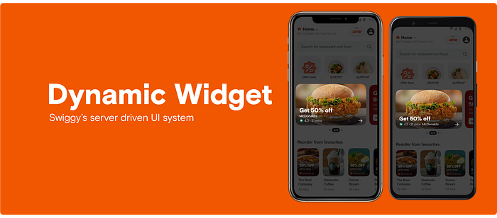
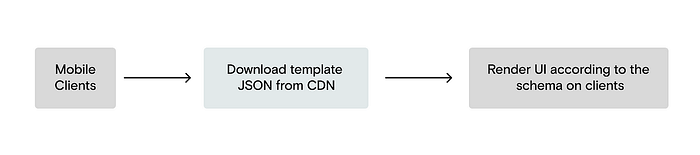
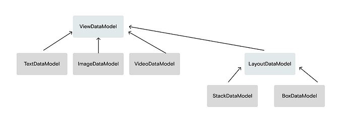
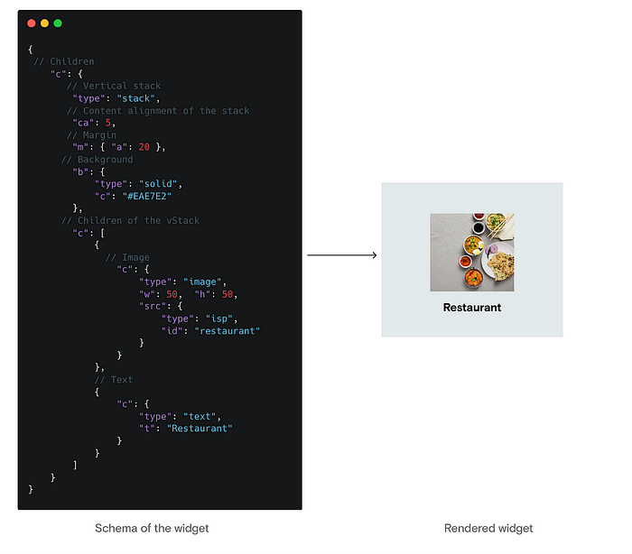
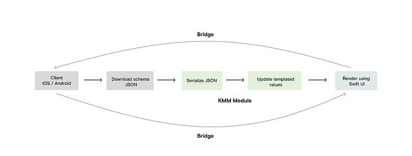
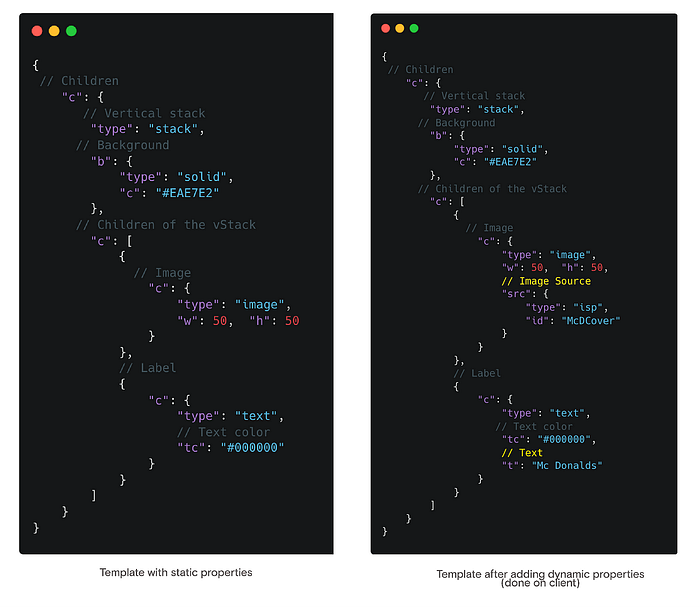
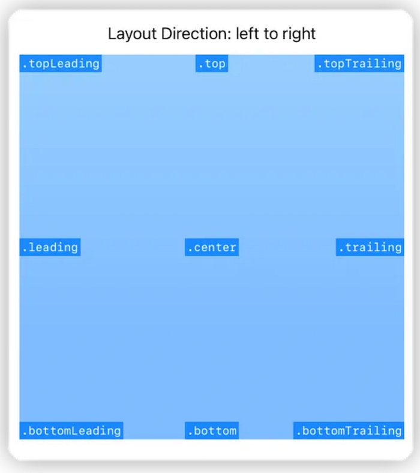
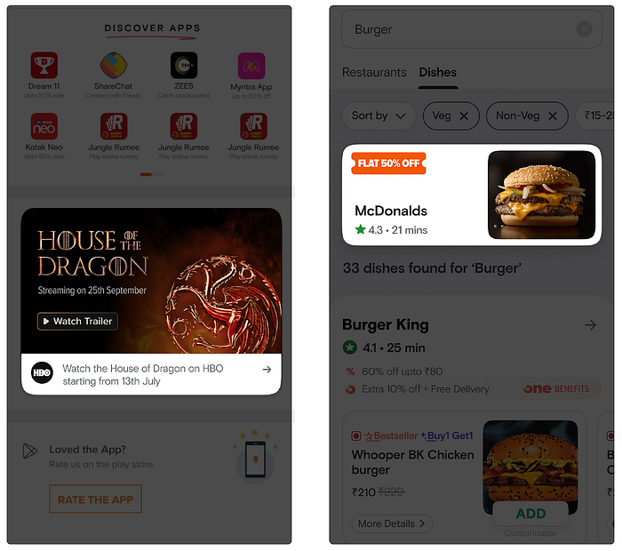
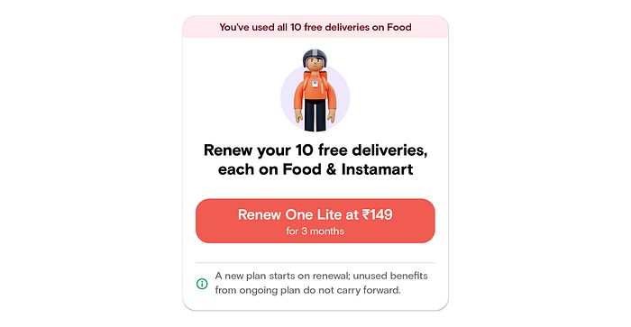
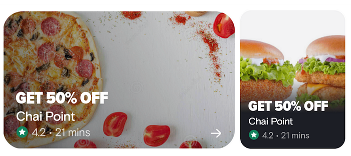

# A Deep Dive into Dynamic Widget — Swiggy’s Server Driven UI System



## Background

Before delving into Dynamic Widget, Swiggy’s take on SDUI (Server Driven UI), let’s understand the fundamental concept of a server-driven UI and the advantages it offers compared to a traditional client-driven UI.

Typically, in most systems, data is driven by the backend and the UI is driven by the clients (web, iOS, and Android). Clients request data from the backend, and upon receiving the data, clients use it to render the UI.

This system however has a few disadvantages, namely

- **Time taken to deploy UI changes**: This is especially a problem in mobile apps, wherein an app release must be done for every UI-related change. Such releases undergo platform reviews, often taking several days for approval. Even after approval, users must update to the newest app version to get the app changes.
- **Consistency across different clients: **Ensuring consistent design and app behavior is crucial for our application. Due to the complex rendering logic across different clients and platform-specific complexities, divergence among clients is frequent, resulting in an inconsistent user experience.

## Case for SDUI

Dynamic widget is Swiggy’s very own SDUI (Server-driven UI) rendering engine that can deliver UI changes within Swiggy’s mobile apps without requiring a new app release. Being able to update critical parts of the app while ensuring platform consistency and performance across platforms is a must for an app like Swiggy, which caters to a wide range of use cases in its pursuit of providing user convenience. We have already built a system that allows us to order different widgets in a page (_known as MxN, here at Swiggy_) in real-time [[More here](./swiss-knife-that-powers-the-swiggy-app-dff9dc49a580.md)], but with DW (_short form for dynamic widget)_, we have gone one step ahead and added the ability to dynamically decide the content present in those widgets.



Fig: Bird-eye view of the overall architecture of dynamic widget

At its core, dynamic widget is a language (defined in JSON) similar to other lay-outing principles that can help build different widgets using various constructs from the language.

While developing DW, we kept a few things in mind, the core schema of the widget should be super generic and should not contain any business logic as such. It should contain building blocks that enable us to create different widgets, and not cater to any specific use case. For eg: The core components of DW include texts, images, videos, etc, and not components coupled with business logic like a Restaurant, Rating component, etc.

## Schema: Backbone of Dynamic Widget

The schema of the dynamic widget contains the data required to render a layout. It is written using KMM (Kotlin Multiplatform ) which allows us to ensure schema-level consistency on both iOS and Android.



**ViewDataModel** — Base data model for all views in the DW ecosystem. It contains all properties common to any view like height, width, etc. All elements and layouts inherit from this construct in the DW space.

**TextDataModel** — The data model responsible for representing text labels. It inherits from the ViewDataModel and contains properties like font, textColor, textSize, etc.

**ImageDataModel** — The data model responsible for representing images. It inherits from the ViewDataModel and contains properties specific to images like imageSource, scaleType, etc.

**VideoDataModel** — The data model responsible for representing videos. It inherits from the ViewDataModel and contains properties specific to videos like videoSource, repeatMode, etc.

**LayoutDataModel** — Base data model for representing view groups or layouts, also inherits from the base data model and contains property to hold nested child views (objects inheriting from the **ViewDataModel **construct)

**StackDataModel** — Data model for representing stack-based layouts i.e. a layout in which children are either arranged horizontally or vertically. It contains the orientation property dictating how the children are to be aligned in the layout.

**BoxDataModel:** Data model for representing box layouts i.e. a layout in which each view is given the ability to custom align itself in its parent view space (eg topLeading, bottomTrailing, etc)

The above constructs are used to construct different layouts. For eg, in the example below we have used a vertical stack that contains an image(_ImageDataModel_) and a text label (_TextDataModel_) represented in JSON. It might be a little hard to read because of the short form notation used, but it is a conscious design choice we made to ensure that the schema JSON sizes were as small as possible.



## Renderer

The renderer component on the client apps is responsible for fetching the schema, processing it, and then displaying it. Below are the steps performed for rendering a widget backed by a DW schema on the client apps. We’d be focusing on the iOS rendering of the dynamic widget in this article, the Android way of rendering is very similar.



## Downloading and processing the template JSON

Our backend provides us with the template to be downloaded for a particular widget. The template JSON only contains static properties like certain presentational and positional properties, properties that are expected to be the same across all usages of the template. The dynamic properties of the template such as the URL of an image, or text in a textField are updated separately on the client.



We have added the capability to mark any field as dynamic, which is very useful when running UI-based experiments.

## Rendering

After preparing the template JSON by performing the above process, we serialize the JSON into a DynamicWidget data object using our KMM module and then pass it to our Swift UI rendering module for rendering it.

Our module iterates through all the children, nested and direct present in the template and renders it through Swift UI

```
// Protocol to be extended by every ViewGroup created.
protocol DWLayoutView: ElementsView {}
extension DWLayoutView {
  /**
 Method used to convert KMM schema object into Swift UI compatible view
*/
  @ViewBuilder
  func getChildView(model: ViewDataModel, size: CGSize) -> some View {
    if let textDataModel = model as? TextDataModel {
      DWTextViewWidget(
        widget: textDataModel,
        size: size,
        bridge: bridge
      )
    } else if let imageDataModel = model as? ImageDataModel {
      DWImageView(
        widget: imageDataModel,
        size: size,
        bridge: bridge
      )
    } else if let boxDataModel = model as? BoxDataModel {
      DWBoxView(
        widget: boxDataModel,
        size: size,
        bridge: bridge
      )
    } else if let stackDataModel = model as? StackDataModel {
      DWStackView(
        widget: stackDataModel,
        size: size,
        bridge: bridge
      )
    } else if let videoDataModel = model as? VideoDataModel {
      DWVideoView(
        widget: videoDataModel,
        size: size,
        bridge: bridge
      )
    }
  }
}
```

## Views

Rendering individual view is pretty straightforward, we simply map a data model to its Swift UI view counterpart using the data present in the template. Below is an example of how the text view component is rendered, it’s similar to how any other individual view is rendered in the DW renderer module.

```
struct DWTextViewWidget: ElementsView {
  typealias WidgetModel = TextDataModel
  var widget: TextDataModel
  var size: CGSize
  var bridge: DWBridge
  init(widget: TextDataModel, size: CGSize, bridge: DWBridge) {
    self.widget = widget
    self.size = size
    self.bridge = bridge
  }

  var body: some View {
    textView
      .addTapGesture(widget: widget, bridge: bridge) {}
  }

  @ViewBuilder
  var textView: some View {
    Text(widget.displayText)
      .foregroundColor(Color(hex: widget.textColor))
      .underline(widget.isUnderlined)
      .strikethrough(
        widget.isStrikeThrough,
        color: Color(hex: widget.textColor)
      )
      .kerning(widget.textStyle.letterSpacing ?? 0)
      .lineSpacing(widget.lineSpacing)
      .font(Font(widget.textStyle.font))
      .lineLimit(widget.maxLines?.intValue ?? 0)
      .multilineTextAlignment(widget.multilineAlignment)
  }
}
```

## Layouts

In DW we also support the rendering of view groups or layouts. These are components that can have nested child views of their own. We currently support two kinds of layouts, Stack and Box.

**Stack**

A stack is a layout wherein the alignment of the children is fixed i.e. horizontal or vertical. In addition to simply laying out views in a stack, we can also proportionally distribute the space in a stack amongst its children.

This capability is natively provided in the Android SDK, to support it in iOS, we used the GeometryReader API provided by Swift UI. A common disadvantage of using the GeometryReader API is that it’s known to alter the frame of the UI by occupying the remaining space present in a view space, it’s not a disadvantage, but rather how the API works. However, it was important for us to use the API, as it provided us with the geometric information needed to support weighted stacks. We worked around this limitation, by setting the GeometryReader on the background of a view to get the necessary data.

In addition to supporting stacks with fixed weights like 1:2, 1:2:1, etc. We also added support for stacks with variable dimensions like having children with dynamic dimensions (intrinsic sizes). We used the frame modifiers in Swift UI to support this capability.


Fig: Illustrating a stack with fixed weights (1:1:1)


Fig 1: Illustrating a stack with variable weights (2:0:1). The B element has a width equal to its content and the rest of the space is distributed in a 2:1 fashion

**Box**

In a box layout, the child views can custom align themselves in their parent view space. In a box layout, a child of the layout can be positioned in any of the 9 alignment values (illustrated below). We achieved this by using the frame modifier on the children and setting their maxWidth / maxHeight to infinity depending upon the axis we wanted to position them on.



Fig 2: Illustrating the various alignment modes supported in a DW Box layout

## Handling events

Since we follow a multi-modular architecture in our codebase, the UI renderer module is separate from the other modules in the app which contain different business logic. However, these modules need to communicate with each other to initiate different actions and respond to different events like redirecting to another page, etc. This is handled through a bridge, which is nothing but a protocol-based delegate that the consumer module subscribes to perform actions whenever certain events like a tap gesture or a video load, etc take place. These events originate from the UI renderer and are received on the consumer module, allowing it to handle the event however it wants.

```
/// A class enabling widgets in DW ecosystem to communicate with the client apps (Consumer codebases) and vice versa
public class DWBridge {
// MARK: Video Widget Plugin
  public weak var videoPlugin: DWVideoWidgetDelegate?
  // MARK: Generic Use Cases Plugin
  public weak var genericPlugin: DWGenericWidgetDelegate?
  // MARK: Media Widget Plugin
  public weak var mediaPlugin: DWMediaWidgetDelegate?
  public init() {}
  // MARK: - Publishers for widgets to subscribe to. These are for the app to communicate with the widgets
  /// A publisher for informing widgets about the change in the overall visibility of the parent widget. The logic for deciding whether the parent widget is visible or not
  /// resides on the client end which would be responsible for updating this publisher
  @Published public var isParentWidgetVisible: Bool?
}
```

## Where do we stand with Dynamic Widget today?

The primary goal of dynamic widgets was to reduce the time required to deploy new UI widgets for different campaigns and banners with minimal engineering involvement. Today, DW is run behind an experiment and is used to power a few widgets on the Track and the Search page. Traditionally these banners were image-based creatives that took a lot of time to get deployed (given the QC and design checks involved), changing their design was also a tedious process. With DW’s ability to reuse and dynamically update widgets, we aim to speed up the process drastically.



## Some other examples of layouts possible with dynamic widget


*Widget created using DW*


*Restaurant banners created using DW*

## What’s next for Dynamic Widget?

Dynamic widget has only been around for a few months now and we are constantly working to improve it and add more capabilities to the framework. In the coming days, we plan to add more components to the DW ecosystem such as lottie animations, text-based spannables, relative layouts (for relative positioning of views in a parent space), etc. We also plan to build an editor that can interactively allow us to create these widget templates and ship them in a _no-code_ way.

> _I am _[_Sarthak Mishra_](https://www.linkedin.com/in/sarthak-mishra-80b351142)_ from the Consumer Apps iOS team at Swiggy. This blog wouldn’t have been possible without the help and contribution of my team. I would like to thank _[_Anik Raj_](https://www.linkedin.com/in/anikrajc/)_, _[_Madan Kapoor_](https://www.linkedin.com/in/madankapoor10/)_, _[_Amar Kumar_](https://www.linkedin.com/in/amar-kumar-2504/)_ and _[_Lovish Bandwal_](https://www.linkedin.com/in/lovish10/)_ for developing dynamic widget and helping me in the process. I would like to express by sincere gratitude to _[_Agam Mahajan_](https://www.linkedin.com/in/agam-mahajan-8296a7a5/)_, _[_Nihar Ranjan_](https://www.linkedin.com/in/nihar-ranjan-50736a98/)_ and _[_Garima Bothra_](https://www.linkedin.com/in/garima-bothra/)_ for reviewing the article and improving it._
