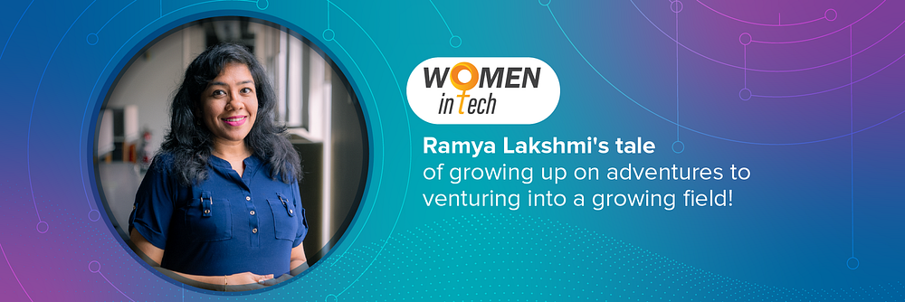
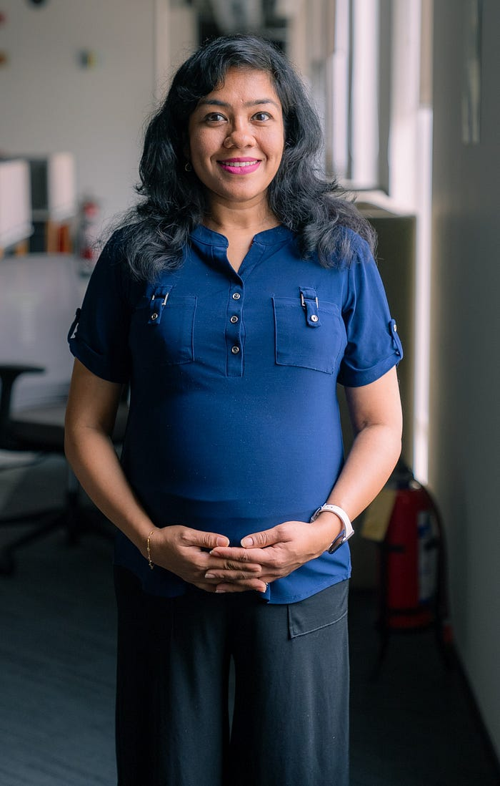

# A Product of Adventure & Self Reliance — The Ramya Lakshmi Story

**Swiggy brings you the story of Ramya Lakshmi, a principal product manager, and how her love for all things product management has helped the company grow**

Many children in India have grown up listening to their parents talk about the long, winding route through forests and rivers that they would take to get to school. Ramya Lakshmi, Swiggy’s Principal Product Manager has a similar tale for her child.

Not only did she walk kilometres to get to school, but she believes this and many more childhood adventures have helped her become the independent woman she is today.

This is the story of Ramya, someone who is so passionate about product that the moment she got a taste of the field, she knew this was what she was always meant to be doing.

**Rivers and Roads.**

“I sound a lot like our parents when I say this, but my childhood was amazing. My dad was the principal of a government school for girls from low-income families, where education was free. These schools were usually in remote districts or villages and so we got to live in a small village called Mayanur in Kerala. Because my school was in the town, getting there was an adventure! Sometimes we would walk to the river bank to take a boat to get across, or go to the bus stop. Our life was straight out of Malgudi Days,” says Ramya.

“So from a young age we learnt how to be responsible. Those years eventually became the foundation of my life, enabling me to become self-reliant,” she says.

When it was time to pick a subject for her undergraduate degree, Ramya chose to do engineering. “I wasn’t a big fan of engineering, but as is with many South Indian families, my family wanted me to study it. Post that I went on to do an MBA,” she adds.

So how did her journey in product begin? “It all happened by mistake,” Ramya says while laughing.

“The interest in product management happened accidentally. I stumbled upon product management during my stint in the IT services industry, where I fought to create a team that would build products proactively for our clients based on the pain points we learnt of. Back then I didn’t know this was product management, but I loved what I was doing,” she says.

“You must understand, it’s not just building great products that gives me joy, it’s seeing them being used by the end consumer, learning from it, and then improvising. So after that experience, I wanted to go to a place where I could build for the end customer, and that’s how I ended up at Big Basket and then Swiggy,” Ramya adds.

At Swiggy, Ramya is part of the Instamart business line and her team’s role is to enhance a consumer’s experience on the app. It was this love for ‘consumer first’ behaviour that drove her interest in Swiggy. “I have two factors that will help me choose a company. One is obviously that the company has to be a fantastic place to work at. But the primary criteria is that I myself am a happy customer of that company. And I loved ordering food on Swiggy and Instamart. For me the experience was brilliant, and the seamless journey always stood out. The second reason is that I always felt Swiggy was an employee-friendly organisation. Even as an external person, and after joining as well, the attention to detail, the focus of the founders, the ability to spot green-field opportunities over and over again, as well as the way the company sticks to its values — these are brilliant examples of why I find Swiggy a fantastic place to work with.

What I was also blown away by was the interview process, the way the team treats the candidate, the number of stages you go through and how seamless it was. The experience and the attention that they give you, a lot can be said just witnessing that. So, I was very impressed.”

**Making some noise in the tech field**

What advice would she give women who are trying to make it in this field? “Product Management is a tricky field because there isn’t a lot of literature or structured content out there that can tell you how to become a good product manager. So most of the learning is done on the field. My advice to women in this field would be that they shouldn’t become complacent. They need to keep learning, find more sources of learning and get better at the job. For those trying to enter the field, find mentors who can guide you well,” she says.

While she does have specific advice for women looking to join her field, Ramya says that one thing most women don’t do is talk about their achievements. “That’s one place where all of us do a very bad job and it’s probably self-sabotage to a great extent. So I would say, talk about your accomplishments because, especially in product, you are not just the voice for yourself, you are the voice of the entire team. And that’s one thing I am also struggling with.”

**Swiggy enabling a better work culture**

When you meet Ramya, you realise she has this zest for learning new things, so her[ favourite Swiggy values](https://blog.swiggy.com/2022/12/21/here-are-swiggys-values/) don’t come as a surprise. “I have two favourite values. One is Always be Curious, Always be Learning. It’s especially relevant to Swiggy because it’s not just a value here. They make sure employees adopt this and are investing in their continuous learning. The Learning Wallet and the Mentorship Programme are two ways in which Swiggy is pushing this forward. The second value I like is the one on Founder Mentality. This means that anybody’s voice will be heard, so you don’t have to be of a particular level, you can just walk up to your leaders and present an idea and if it really aligns with the goals and works for the company it will happen. It has happened multiple times for me and my colleagues.”

As for her personal life, Ramya lives with her husband, a Persian cat and a dog. So how has [Swiggy’s remote work mandate](https://blog.swiggy.com/2022/03/25/what-work-looks-like-at-swiggy/) worked for her? “Being a fairly social person, initially working from home was hard but then I did find a lot of benefits. For instance, I don’t have to spend three hours on the road which means I am getting those three hours back and I am able to do a lot more than I could before. One amazing thing for me was adopting all these digital tools which helped me be way more productive than I used to be. What I did miss in remote work was the camaraderie at the office. But that’s where the Swiggy[ Jamboree, the company’s quarterly meet-up program](https://www.youtube.com/watch?v=ArmHS5RLZ_I), helps. I end up meeting a lot of my colleagues, finally there are faces to the voices that you hear and you are able to build that network and the camaraderie is back again. So I think it’s kind of a good balance of both worlds,” she says.

---
**Tags:** Women In Tech · Swiggy Life · Product Management · Careers · Indian Startups
