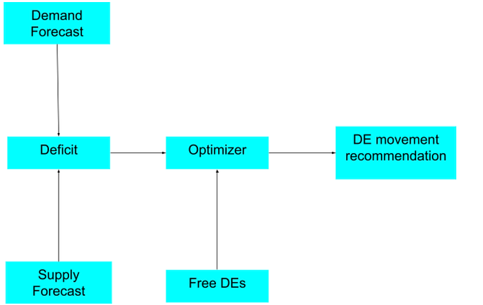
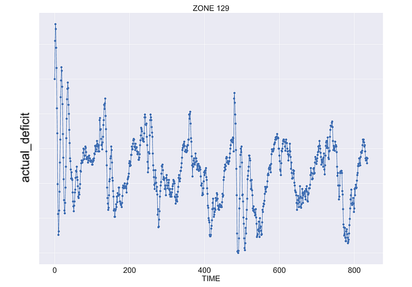
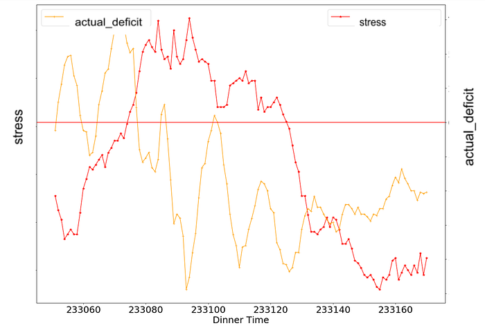
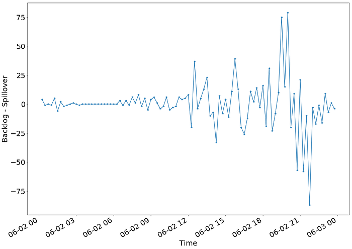
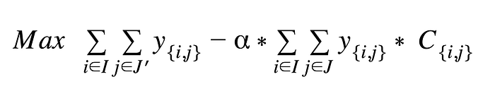
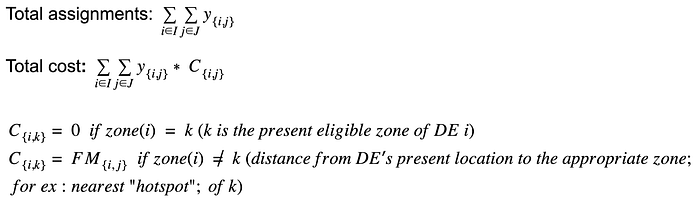
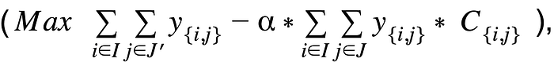

# A real-time supply-shaping system to meet demand under constraints

Co-authored with [Rajesh Kumar Singh](https://www.linkedin.com/in/rajesh-singh-2b65b94/), [Sanskriti Sinha](https://www.linkedin.com/in/sanskriti-sinha-980128138/), [Jairaj Sathyanarayana](https://www.linkedin.com/in/jairajs/)

### 1. Problem formulation

Maintaining optimal supply-demand distribution across zones in a city in real-time is an important aspect of the hyperlocal food delivery business. Here zones are smaller geographical locations inside the city and considered as Operations clusters. Delivery Executives (DE) are associated with a zone and all actions related to managing the gap between demand (orders being received) and the available supply of DEs are taken at the zone level. Gaps between supply and demand can occur due to a variety of reasons — everything from a sudden spike in demand to a shortfall in DE logins due to rains, competition, etc.

Another important factor in the supply-demand gap is what we call cross-zone orders. Even though zone boundaries are drawn such that a majority of restaurant and customer locations are in the same zone, cross-zone orders cannot be avoided. In some cross-zone orders, the DEs move out of their allocated (‘home’) zones and do not get another order to return to their home zone because of supply-demand imbalance created by cross-zone orders. This imbalance leads to the accumulation of DEs in some zones and a shortage in others which results in reduced DE utilization in low-demand zones as well as order loss due to the unavailability of DEs in high-demand zones.

Therefore a way to do real-time DE movement recommendations across zones is required to control zone level demand-supply imbalance. These recommendations should be predictive/ proactive (typically 15 minutes ahead), barring which the Stress system will end up gradually reducing taking new orders to prevent delays and cancellations which, in turn, leads to unfulfilled demand resulting in bad CX for our customers.

### 2. Approach

Our solution contains four parts (schematic below).

- Creation of superzones
- Crisp definitions of demand and supply that are aligned with the stress in the system
- ML models for real-time predictions of demand and supply for the next 15-min horizon
- An optimization engine to match supply surplus and shortage zones and generate movement recommendations for DEs

*Fig 1: An overview of our approach where we calculate the deficit from supply and demand forecast, which is passed to Optimizer along with Free DEs which generates the final DE movement recommendation*

**2.1 Creation of superzones**

A Superzone increases the delivery area of a DE by combining nearby zones. DE’s movement which was initially restricted to individual zones is now expanded to the superzone. This construct has two benefits. Firstly, it simplifies solving the DE movement optimization problem to each superzone independently. Without a superzone, DEs’ efficiency is potentially hampered by them having to travel to arbitrary, potentially unfamiliar zones to serve cross-zone orders. With superzones, DEs only need to familiarize themselves with the zones that are a part of their ‘home’ superzone. One important aspect of the superzone construct is that even though optimization is done at the superzone level, all the demand and supply forecasting is still being done for the individual zones. The superzone construct is used only in the Optimizer part of the solution as the actual DE is still hired for a particular zone and all the business operations are done on a zone level. Thus, there are no on the ground changes needed to implement the real-time DE movement.

**2.2 Demand and supply definitions**

To optimize for DE movement, we need a consistent and exhaustive definition of demand and supply that captures the on-ground stress well. Two important terms to understand before proceeding to demand definition are batched orders and backlog orders. Orders that are placed from nearby restaurants and have nearby delivery locations could be assigned to the same DE to improve efficiency, counted as batched orders. The backlog of unassigned batches represents orders placed in the previous time window and waiting to be assigned.

The following were candidate definitions for zone demand :

1. Demand: total number of batched orders
2. Demand: total number of batched orders + backlog of unassigned batches
3. Demand: total number of batched orders + backlog of the unassigned batches — the count of batched orders not yet ready for assignment

We have defined supply as the count of DEs who are free (not yet assigned to any order) or will become free in the next 15 minutes.

We compute _actual_deficit_ as the difference between demand and supply in the zone. Higher _actual_deficit_ represents more demand than DEs available on the ground, this situation represents stress in the system and can lead to order loss.

We started with the first definition of demand to figure out when the demand peaked. As per _actual_deficit_ calculation (Fig 2), we could not see any stress which indicates it was a DE-surplus zone most of the time.

*Fig 2: actual_deficit is plotted on the y-axis for one week of data (axis values removed for the confidentiality reason)*

This was in contrast to the observation from the Product/Ops teams which showed a high deficit during dinner hours for the same zone using _stress_. The _stress _is computed instantaneously for every zone and defined as follows

_stress = Total Active orders / Total Logged-in DEs_

*Fig 3: stress and actual_deficit showing no correlation. Moreover, actual_deficit is not able to capture the high demand as shown by the stress*

As shown in Fig 3, between timestamps 233080 to 233140, there is high _stress_ but _actual_deficit_ is always below 0. One of the things that we had ignored in definition 1 was the effect of assignment delay. Assignment delay consists of 2 factors — Backlog and Spillover. Let’s say the current time is 9 PM and the window size is 15 minutes, spillover and backlog are defined as follows:

**Spillover**: Orders placed in the current window and assigned in the next window 9.15 to 9.30 PM

**Backlog**: Orders placed before 9 PM but assigned in the current window. The backlog for this window will be the spillover for the previous window.

The assumption in definition 1 was that the backlogs for subsequent windows are equal, which means, the backlog for the 7 PM window will be approximately the same for 7.15 PM.

*Fig 4: Difference between Backlog and Spillover at every 15 minute*

From Fig 4, we observed increasing Backlog values, especially around peak hours. This is the component that we were missing in definition 1 of demand. This additional Backlog correction, considered in definition 2, is 30% of the demand at the peak time.

After correcting for this in definition 2, we observed major improvements, especially in Dinner and Lunch slots. Now, we are closer to the on-ground picture where we see a deficit during the dinner peak. Also, the correlation between _actual_demand_ and _stress_ is now 6X higher vs. definition 1.

Therefore we concluded that definition 2 is a better representation of demand. Definition 3 came out hard to compute due to complexity involved in computing assignment delay in future based orders and hence parked for now.

The calculation of supply involves determining the to-be-free DE count in a time window. There are three parameters that we considered here.

1. **Assigned DE**: The number of DEs who are assigned to deliver a batched order in the 15-min window
2. **No-activity DE**: The number of DEs who delivered an order in the preceding 15-min window and got assigned to a new batched order in the subsequent 15-min window
3. **Busy DE**: The DEs who deliver orders in the zone (customer location) and are also mapped to that zone

We add these three parameters to get the final supply definition.

**2.3 Model development**

We built a predictive model each to forecast demand and supply at a zone level over a 15-min horizon. Since DEs need to be effectively mobilized across superzones based on the real-time demand-supply gap, the models refresh their predictions (currently) every 2 mins.

We consider real-time, near real-time, and historical features which give information about the pattern of the demand-supply gap in the past and in the preceding 15 min window in real-time.

We have real-time features which are common for both demand and supply models like- the id of the zone, time of the day, day of the week, city id, etc. These real-time features are sent in the inference API calls. We fetch historical features about the number of batches placed and the number of free DE counts in the 15-min window in the previous day/week.

In terms of modeling, we tried GBT and XGBoost algorithms. The comparative analysis of metrics for both approaches showed XGBoost performing slightly better across all slots. The results from XGBoost are then fed into the Optimizer which calculates the deficit and emits the list of DEs which needs to be mobilized from the negative-deficit zone (source) to the positive-deficit zone (sink).

**2.4 Optimizer**

Ideally, all free DEs should be assigned to deficit zones but there is also a cost associated with moving the DEs. Using the Optimizer, we need to decide on the DE movement within a superzone based on the demand and supply of the constituent zones. We use a constrained optimization (CO) approach once we forecast the demand and supply for each of the zones.

**Combined Multi-Objective Function:**

y{i,j} is the decision variable representing assignment of ith DE to jth zone

The above cost function needs to be optimized using the following constraints.

Constraint #1: Equality constraints to control DEs’ current location

- A DE should be assigned to only one zone among all applicable zones

Constraint #2: Inequality constraints w.r.t demand and supply at sink and source zones

- Zone with a deficiency in DEs should procure DEs such that it can reduce its deficit
- Zone with a surplus in DEs should ensure that it has met internal demand (before supplying DEs to deficit zones)

Constraint #3: All ‘busy’ DEs should be restricted to the parent/present zone

We used Gurobi to solve this CO problem. This system is currently in shadow/ experimentation mode.

### 3. Evaluation metrics

We use wMAPE to measure the goodness of demand and supply forecasts. Our current set of models have wMAPEs in the range of 10–15%.

Once we have demand and supply predictions, we calculate the deficit and evaluate the accuracy of the deficit’s directionality. We calculate precision and recall of source and sink zones which implies whether the suggested movement is done in the correct direction or not. For instance, if a DE is wrongly directed to move towards a source zone, it leads to oversupply in that zone and eventually increases the assignment wait time of the DE. On the other hand, a DE incorrectly mobilized from a sink zone further increases the demand-supply gap in that zone. Currently our sink & source precision metrics are trending 90%+.

Finally, we measure recommendation accuracy which gives us the percentage of cases where the Optimizer correctly recommends DE to move from one zone to another.

### Some additional learnings

Sometimes it is difficult to fully understand a business problem just by the problem statement and assumptions given. A thorough data-driven validation is needed to uncover nuances and bring clarity. Discovery of demand definition 2 is an example of this. Switching to this definition not only clarified the problem statement but also resulted in a 3X improvement in source/sink precision. On the Optimizer front, in the current objective,

it is possible that during stress times DEs are distributed at faraway distances, as high as 4–6 kms. Then, there is going to be a tradeoff in moving a 4km-away-DE vs. meeting the objective of moving DEs itself.

This hyperparameter needs to be tuned in the experiment phase to find the right balance between the cost and the gains from DE movement.

---
**Tags:** Optimization · Demand Forecasting · Machine Learning · Swiggy Data Science · Operations Research
