# A Symphony of Widgets

How we enable relevant dynamic widgets based on user interactions

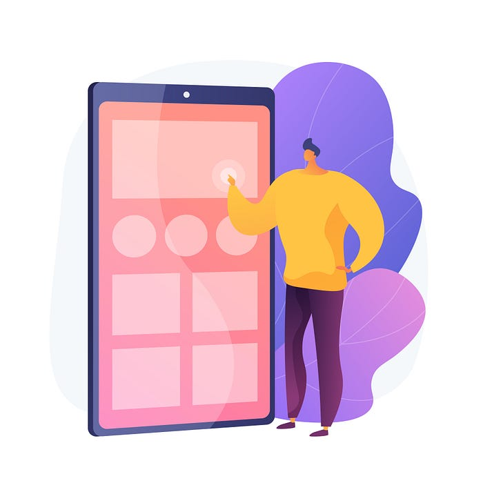
*Image Credit: Freepik*

At Swiggy, we are always pushing the envelope to give a highly relevant experience to our users. Trotting along with this pursuit we realized multiple features if built around specific user interactions will supercharge the ways how users discover a relevant selection or complementary products that go well with what they have already selected. We call these synergy widgets.

Following are some of the features that have been built using this philosophy.

## Similar Restaurants

In this experience, users visit a restaurant and don’t like what they see in that menu and exit it. The probability that users will likely visit a restaurant that is similar to the one selected becomes a lot higher. For these users, we display a relevant selection when they navigate back from the menu.

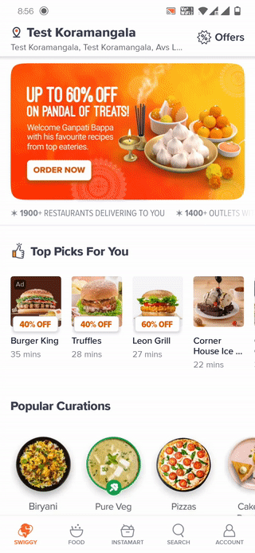
*A similar restaurants synergy widget*

## Cross-Sell

In this experience, users select a dish from an item collection. Here we suggest to the user what will go well with their current selection.

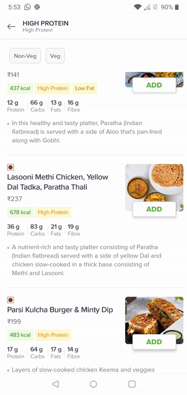
*A cross-sell menu item synergy widget*

Having piqued your interest, I’ll be walking you through the journey of finding patterns between different product features and building this framework on complex mobile clients which have more than one framework for laying out the widgets.

---

## A Scalable Frontend Framework

The features described above were being developed in parallel in two separate pods with different backends and obviously different data science models. However, for the mobile client, there is one unmistakable pattern between these two features.

**_Both these interactions add a new dynamic widget just after the widget that the user has interacted with._**

Our philosophy of approaching the frontend implementation has been very pragmatic striving to make the implementation very atomic and highly flexible as can be seen in our previous [blogs](./swiss-knife-that-powers-the-swiggy-app-dff9dc49a580.md).

---

## Elephant(s) In The Room

All widgets and even widgets of the same type might not make sense every time. For example, a similar restaurants flow might work well in a cuisine filtered widget like ‘Best Biryanis Near You’ but not in a discovery widget like ‘Try Something New’. This logic of which widget it should apply to can’t reside on the client and needs to come from the backend.

We have multiple libraries that render different pages within the app. We use Facebook’s [litho](https://bytes.swiggy.com/optimising-scrolling-performance-with-litho-59db9819c583) for our home page to support a jank-free scrolling experience for a large variety of widgets in a single list. We use RecyclerView on all the other pages within the app because of the limited set of widgets present in them. We need this framework to work with both implementations.

The rendering implementations can have a variable number of user interactions. For example, the cross-sell interaction is just a click of the Add button whereas the similar restaurant widget is a user going to the menu but not selecting anything on that menu and coming back.

There are vertical widgets contained in these pages and we need to place these new dynamic widgets at a particular position within those widgets

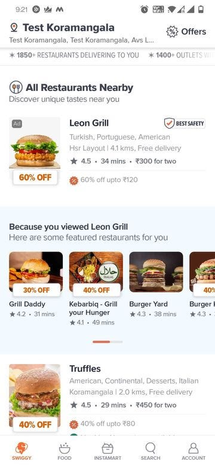
*A similar restaurant widget within a vertical widget*

---

## The Contract

We wanted this framework to be very extensible in a way that any widget can trigger any kind of flow. We have defined a relevance blob at a widget level which specifies whether a relevance flow applies to that widget. The implementation of the flow however is defined entirely on the client today based on an enum.

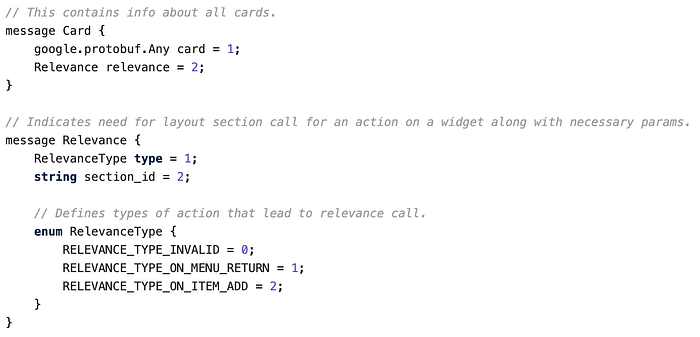
*The protobuf contract for relevance*

The API that gives the relevance widget is called the layout section API. The response has a structure similar to the home page. This means we have the extensibility of using the exact same widgets on the home page as well as the relevant widgets. We pass this section_id in the layout section API to identify the right kind of data for the flow.

---

## Breaking Down The Frontend Problem

### Renderers

The renderer component abstracts out the implementation details of the page/widget from the implementation and is injected at a page/widget level as an interface.

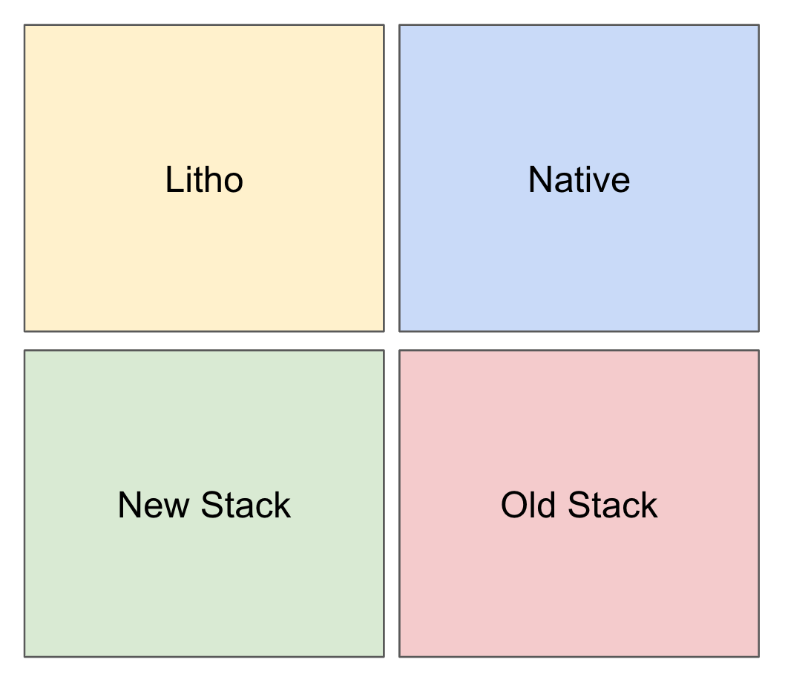

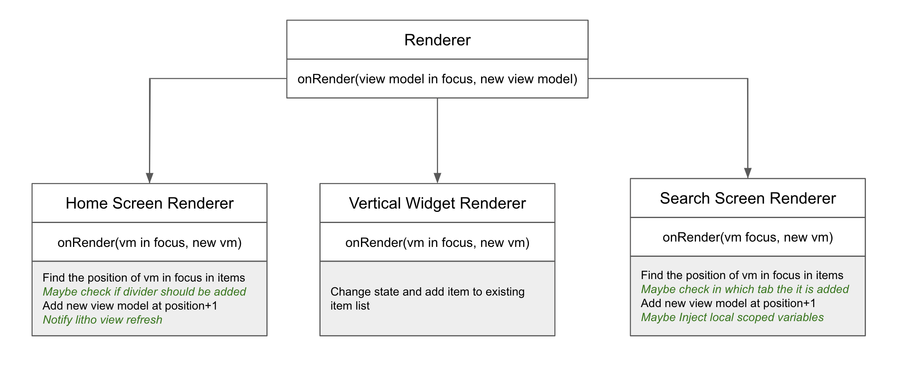
*An illustration of different renderers that need to be created*

The following is the implementation for our home page which is built using litho. This also has an assumption that there would be renderers that would work internally to the widgets which this is working on. Hence we have a callback mechanism that allows us to maintain the state between all of these renderers.

The following is the implementation of the vertical collection renderer. A reference of the home renderer is injected into this to signal to refresh UI for that particular widget after we have added the new widget at the vertical collection level.

### Interactors

Interaction implementations are created as global streams that are created on-demand if there is a registered listener of the subjects. These streams are injected into the view models that trigger these events.

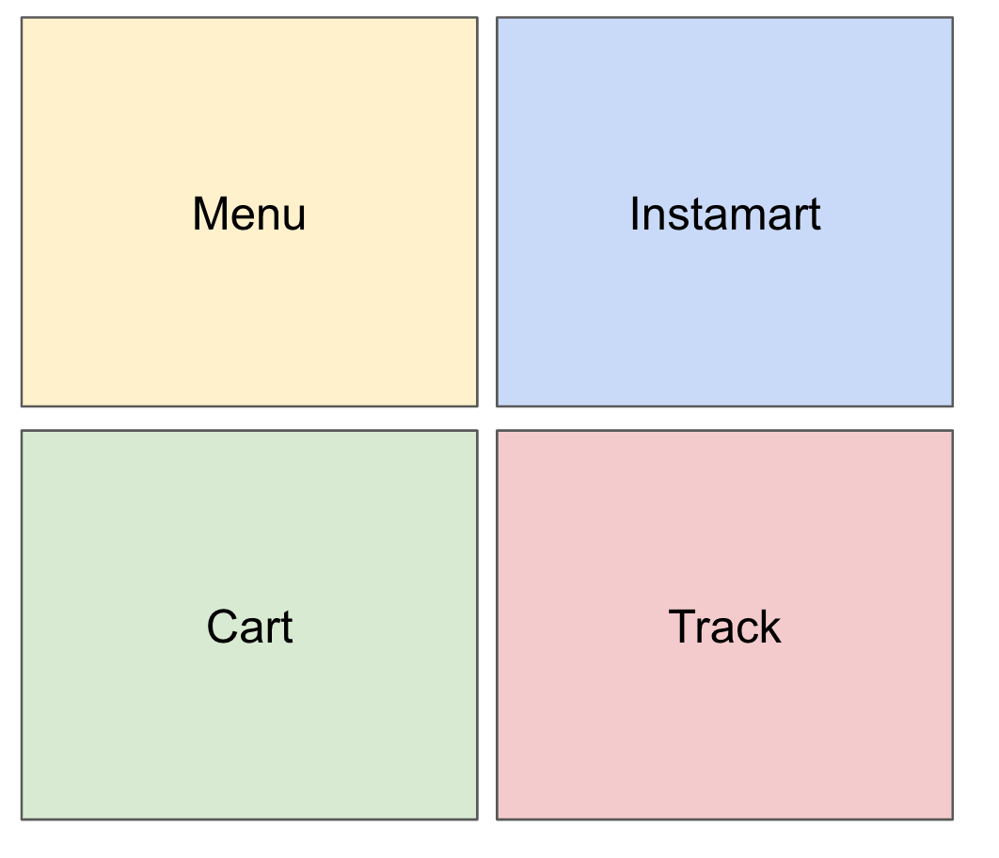

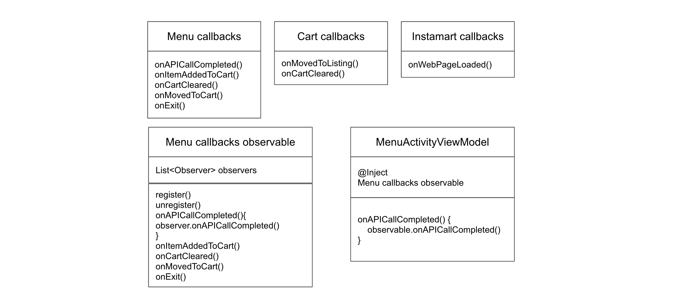
*An illustration showing different interactors on the menu and cart page*

The following captures all the states of interest possible on the menu page

The following captures the observable. This is a straightforward observable but it can have additional handling based on the kind of user interactions being targeted.

### Drivers

Drivers isolate the business logic that needs to be applied for those specific use cases. For example, a similar restaurant widget needs to be shown a maximum of three times within a session whereas there is no limitation for the cross-sell widget. These drivers can be global or can be scoped to a screen depending on the use case.

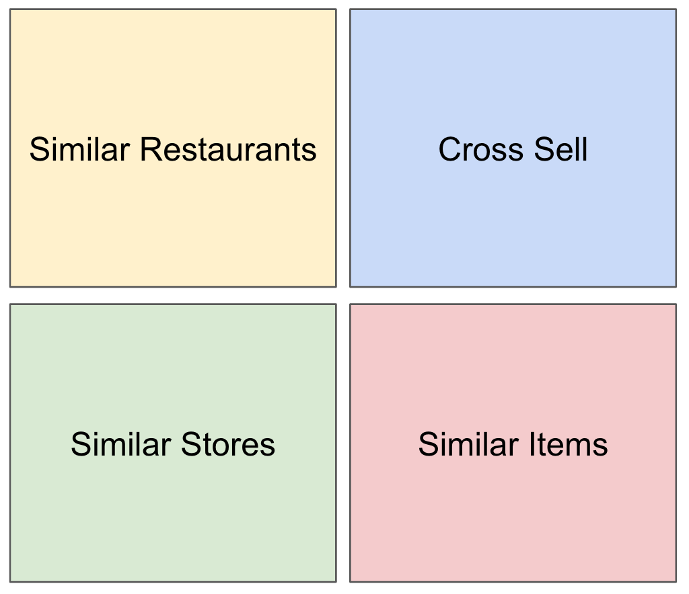

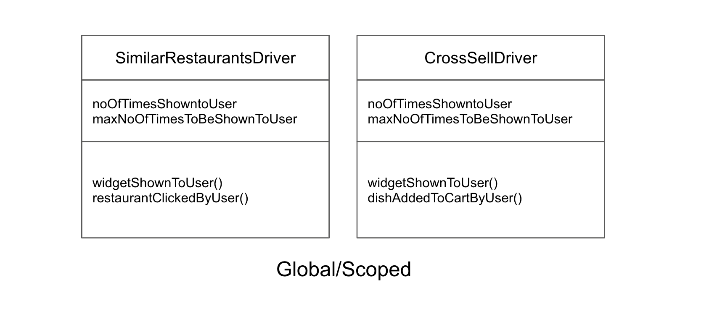

The following shows the implementation of a similar restaurants driver. It captures the business logic of not showing this widget more than 3 times if the user doesn't interact with the widget.

### Orchestrators

As the name suggests, orchestrators tie up all the above components and dictate the interactions between them. These orchestrators are injected into the ViewModel classes and are activated after the user interacts with the widget.

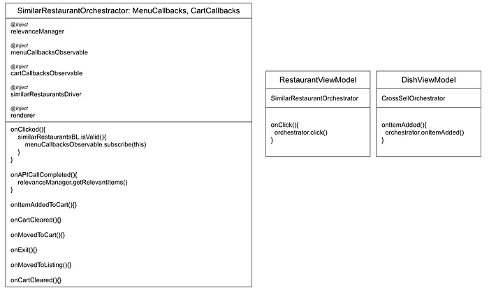

The following shows the implementation of a similar restaurants orchestrator. It takes up the responsibility of calling the layout section API whenever the menu has completed loading (We want the user to have a seamless experience when they exit the menu, hence making the layout section API call on menu call completed and not on menu exit). This gets activated once the user clicks on a restaurant and is waiting for the appropriate callbacks to take action.

---

## Summary

New age apps demand the front-end implementation be flexible with a high degree of reusability. This blog demonstrates how we go about solving client-heavy, mobile-first problems at Swiggy.

---

> _I am Farhan from the Android Mobile team at Swiggy. If you are interested in working on interesting mobile engineering challenges as the one in this blog, please check out our _[_careers section_](https://careers.swiggy.com/#/)_._

---
**Tags:** Android · App Development · Recommendations · Mobile App Development · Swiggy Engineering
