# Adaptive Metric Alignment for Demand Forecasting in Swiggy Instamart

Co-authored with [Shubha Shedthikere](https://www.linkedin.com/in/shubha-shedthikere-233a3814/)

## Introduction

Be it time-pressed customers looking for instant grocery delivery, or a sleep deprived new mother running out of diapers late at night or ardent cricket fans needing more chips and coke in between a nail-biting IPL match or people looking for big discounts on big purchases, Instamart has got you all covered. Instamart, the quick commerce grocery delivery service of Swiggy gives unparalleled convenience of being able to order, from a huge assortment, across fresh fruits & vegetables/ dairy/FMCG products and accessories for party or festivities, pretty much at any time of the day and also through late night (from 6am to 3pm) and get the delivery in ~10–15 min.

While there is a lot of buzz across social media on about quick commerce services battling to get the delivery times under 10 mins, there is a lot going on behind the scenes to make such a vast and high quality assortment of products, consisting of over hundreds of thousands of products, available for ordering to millions of consumers Pan India, in the first place. The unsung hero, modestly sitting under the hood, is the mammoth supply chain management system, the core of which is demand planning. Demand planning ensures that we are able to procure the right quantity of products and on the appropriate day so that high quality products are available to the customers in order to provide a great customer experience. At the same time, it ensures that there is minimal wastage of the products due to expiry as a result of excessive procurement. In other words, the objective of the demand planning is to maximize ‘availability’ while reducing the ‘wastage’.

In this multi-part series we open up the hood and discuss the nuts and bolts of demand planning. In particular, we deep dive into Demand Forecasting, which is at the heart of demand planning. We discuss how we leveraged machine learning techniques to improve the efficiency of demand forecasting.

> **_“If you can’t measure it, you can’t improve it” — Peter Drucker_**

Peter Drucker, often described as the founder of modern management, rightly said that, if we can’t measure something, we can’t improve it. Possible amendment would be ‘If you can’t measure it ‘correctly’, we can’t improve it. Pardon our audacity to append this quote, but that is exactly the situation we were in when we set out to improve the demand forecasting using usual machine learning algorithms. After a lot of deliberation, we realized that the traditional metrics, which are used to measure the performance of a forecasting model, does not really suffice to ensure that the overall objectives of the demand planning is met. That is when we came up with a new framework to evaluate the performance of the model in an offline setting, which is the topic of discussion of this part of the series.

We first give a brief overview of the demand planning process, discuss some of the drawbacks of the traditional model evaluation metrics and then deep dive into the proposed evaluation framework. Having established the metrics to be used in this blog, we will take you through the ML based forecasting pipeline and how we used this framework to improve the demand forecasting in the upcoming parts of the blog series.

### Overview of Demand Planning Process

Instamart follows a dark store model where micro-fulfilment centers are established to fulfill the grocery orders of a certain geographical area of a few kilometers of radius. Therefore, when a customer logs into the app, the customer is assigned to the nearest dark store, also referred to as a pod, based on his/her location. Items, which are ‘in-stock’ or available in the pod, are recommended to the customer to help in discovery of the products. Demand planning ensures that the sufficient units of each of the products are available in the pod for customers to order throughout the day. Figure 1 shows the steps involved in the demand planning process. Below we give a brief overview of it:

**_Demand forecasting: _**Demand planning starts with demand forecasting, which estimates the demand or in other words, the number of units of an item that will get sold in a given pod on a given day. Based on the factors such as shelf life of an item and turn around time of a particular vendor, the demand needs to be forecasted ‘k’ days in advance, where ‘k’ could be anywhere from 1–7 days. ML based forecasting models are used to make these predictions using various signals such as historic sales of the item from the pod, city/zone of the pod, trend and seasonality of historical demand of the item etc.

**_Purchase Order(PO) Generation: _**Demand forecasting module provides the estimate of the number of units that will be sold on a given day, which essentially means that it is the number of units that needs to be available in the pod. Based on the number of units which are already available in the pod from previous days, and within their expiry period, the purchase order is generated to procure the required number of units from the vendors. If the vendor is able to deliver the total number of units for which the request was raised, then the **_fill-rate_** is said to be 100%. Typically, the fill-rate is less than 100%. Also, forecasted demand itself will have some inherent errors. Therefore, the PO generation module , which includes a ML based model, estimates the additional units that need to be procured to account for demand prediction errors, fill rate and other issues, so as to ensure high availability.

**_Delivery to Warehouse:_** Typically in each city 6–7 pods form a cluster and are serviced via warehouse. The demand predictions from different pods are aggregated and the items procured from the vendors are delivered to the warehouse. In the case of fruits and vegetables, it is also cleaned and packaged in the warehouse before delivering to the pods.

**_Distribution to the pods: _**Based on the predicted demand for each of the pods, the procured items are distributed to the pods. There are also some items such as milk or dairy products which are typically delivered directly to the pod.

**_Inventory Management System (IMS) update: _**The units that delivered from the warehouse are **_inwarded_** into the pods after a quality check and the IMS are updated to indicate the number of units that are available in the pod. With each unit sold, the IMS gets updated to reflect the current stock.

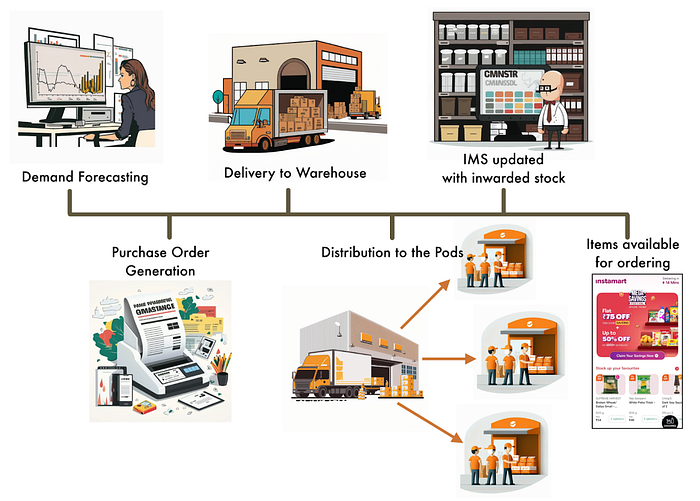
*Figure 1: Overview of the demand planning process (Credits : Generated using MidJourney )*

### Availability Versus Wastage

The core objective of demand planning is to ensure that the products are available to the customers for ordering throughout the store open time period, while minimizing the wastage. To understand this further, let us consider the diagram below which shows the hourly sales and availability of a particular SKU (stock keeping unit, which represents an item at a particular pod). The number in the box represents the number of units sold in that particular hour. The tick in the green box represents that the SKU was available for ordering in that particular hour. Cross in the red box represents that the SKU was **_out-of-stock (OOS)_** in that hour. The demand forecasting model predicts the demand for a given SKU for a given day, which in case(A) is 146 units. For the sake of simplicity, let us also assume that the number of units that are available at the pod for any given day is equal to the forecasted demand. This might not be true in practice due to fill rate issues, damage in transit etc. Let us also assume that this item has a shelf life of 1 day, which essentially means that the units that are inwarded into the pod on a given day and that do not get sold by the end of the day cannot be sold the following day and hence amount to wastage. Similar arguments can be extended to items with higher shelf life.

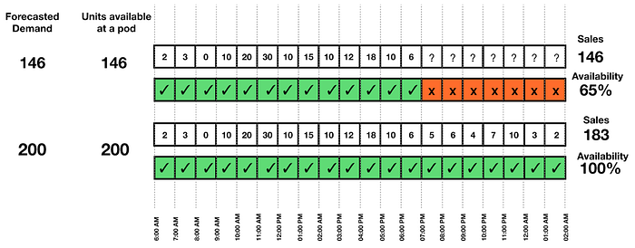
*Figure 2: Illustration of hourly sales and availability for a SKU*

As can be seen, 146 units are sold within 7PM, resulting in the SKU being out-of-stock after that. **_We define availability for a SKU as the percentage of store open hours during which the SKU was in-stock._** In this example, the SKU’s availability for the given day is 65%. Lower availability not only affects the customer experience but also represents opportunity loss. On the other hand, if the predicted demand was higher, say 200, and if the total sales during the day was about 183, then the rest of 17 units amounts to wastage.**_ Wastage is typically measured in terms of the GMV of the number of units that were marked for wastage based on the expiry of the product._** As illustrated above, improving availability by stocking up higher inventory leads to higher wastage and vice versa. In a practical business setting, it is challenging to simultaneously improve both these metrics. Also the impact of non-availability on certain categories of products, on the customer experience, is much higher than others and can result in drop in ordering rate or customer churn from the platform in the worst case. Realizing this, the business team defines different availability and wastage targets for different categories.

### Challenges in mapping model metric to business metric

In application of ML based solutions to business use cases, the selection of appropriate model metrics for offline model evaluation (on historic/backtesting data) and model selection is extremely crucial to move the business metric in the right direction and create incremental value for the customers. For example, in ranking applications for an Ads recommendation system NDCG (Normalized Discounted Cumulative Gain) is a prevalent offline metric. A model with a higher NDCG is expected to drive better Click-Through-Rates (CTR) of Ads on the platform due to improved relevance of the impressions. Similarly, in typical forecasting applications, MAPE (mean absolute percentage error) or wMAPE (weighted mean absolute percentage error) with respect to the target is used to measure the prediction accuracy of the model on backtesting data. But in use cases like ours, we only have sales data, which represents ‘true’ demand when availability=1, but represents truncated demand when availability<1, and we need to predict the demand to improve availability of the SKU and reduce wastage. In such cases, using wMAPE w.r.t sales as target poses serious drawbacks as an offline model metric for model evaluation and model selection. We elaborate this below.

Let the observed data for the _i_-th SKU be denoted as _{(Sᵢ(t), Aᵢ (t)) : t ϵ {T₁,… , Tₘ}}_ with _Sᵢ(t)_ being the quantities sold on day _t_ and _Aᵢ(t)_ is the observed availability of the concerned item in that particular pod on day _t_. Let us consider the data with a look back period of ‘_m_’ days. This data is appropriately split and is used to train and validate the demand prediction model to be put in production for daily demand planning. Let us consider the predictions obtained from a set of models ( models obtained via different modeling methodologies or with different hyperparameters for a given methodology) that are developed using the above training data. We denote the set of predictions on the test data as _{Pᵢʲ(t): t ϵ {T₁,… , Tₗ }}, j = 1,2,.., k_ for _k_-many models and _i = 1, … ,n_ for _n_-many SKUs, which is considered for back-testing. Now, the wMAPE of the _j_-th model from is given as follows, where the sum is taken over all the time points and SKUs in the (back-)test data:

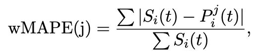

- **_wMAPE w.r.t sales data leads to under-prediction:_** wMAPE gives lower average error when the model gives demand prediction closer to the corresponding sales. This would serve as a good metric to evaluate the model performance in case of high availability but would lead to selection of models which under-predict in case of low availability. This would lead to further reduction in availability of the SKU when used for demand planning.
- **_wMAPE on truncated (high-availability) data does not suffice:_** Given that measuring the model performance on sales data with low availability would lead to choosing model which underpredicts, we could eliminate such low availability data points in the test set and compute wMAPE on partial data. Let us define the wMAPE of the _j_-th model on the partial test data as follows:

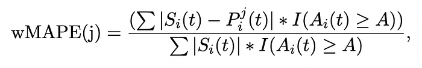

where _A_ is some high availability cut-off value such as 75% or 80%, and the is summation over all the time points and SKUs in the back-testing data. But this metric only evaluates the model predictions on the partial data and in many cases a large proportion of the data points would have observed availability _Aᵢ(t) < A_. Moreover, usually in real data there are long-tail SKUs with very few days with observed availability higher than _A_, e.g., for newly introduced SKUs (cold start problem), where accurate demand forecasting is more challenging. But, the above mentioned wMAPE metric does not even test the accuracy of the models for these cases, which often leads to most of the considered models having similar performance in terms of wMAPE.

- **_wMAPE is a non-directional metric: _**Another drawback of using wMAPE is that_ _there is no way for us to know through back-testing which one of these considered models would help to move the needle in terms of business metrics, i.e., improving availability and reducing wastage, and to what extent.

## Adaptive Metric Alignment: Estimated Availability and Wastage

The business metrics of availability and wastage can be measured only once the predictions are used for daily demand planning and cannot be measured even in shadow mode experiment, which essentially means that we cannot track these metrics for any new modeling experiments in an offline manner. On the other hand the usual back-testing metrics such as wMAPE is not an optimal choice for our problem as discussed above. In order to bridge the mismatch between the business and backtesting metrics, we introduce an approach of estimating the business metric in an offline setting and thus, adaptively align our back-testing model evaluation and selection to improve the target business metrics for demand planning.

To elaborate in more details, recall that an observation in the back-testing data is _(Sᵢ(t), Aᵢ(t))_ for _i_-th SKU and day t and the prediction for the same date and SKU is _Pᵢʲ(t)_. Our simple question to define the Estimated Availability and Wastage metrics is: “What would have been the availability and wastage if _Pᵢʲ(t)_ was used in demand planning for _i_-th SKU and day _t_?” As _Pᵢʲ(t)_ is coming from a new experimental model for the back-testing data, the actual answer to the above question is unknown. Hence, we propose to estimate the answer with the data in hand and with certain simple assumptions. For example, one of the most simplistic approaches would be if we assume that availability increases uniformly w.r.t, sales. That is, if the observed sales _Sᵢ(t)_ has an observed availability of _Aᵢ(t)_, then if the prediction _Pᵢʲ(t)_ would have been used to stock up for the day _t_, ****estimated availability****** **(referred as EA)** **can be calculated as,

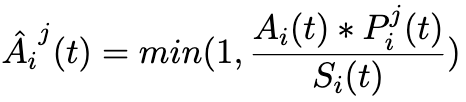

Note that, the above definition of estimated availability has a strong assumption that the sales and availability increases proportionately, which is often not the case for many SKUs. For example, for milk products often the sales are higher in the morning hours and evening hours. But without the knowledge of hourly sales patterns, the above definition is a reasonable proxy for the answer to the above-mentioned question, as this definition ensures the monotonicity across predictions. By that we mean, if there are two predictions _Pᵢ¹(t)_ and _Pᵢ²(t)_ coming from two independently built models, then,

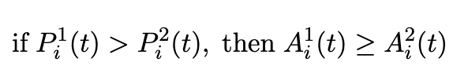

This ensures that this method will directionally rank the models in the correct order in terms of their impact on improving the availability.

Now, for Instamart, we have the hourly sales data (denoted as _Sᵢ(h; t)_ for _hᵗʰ_ hour) available for many SKUs and hence, while estimating the ‘would have been’ (estimated) availability we propose another definition of EA which can be more precise. We define it as,

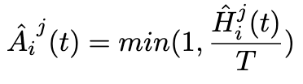

where _Hᵢʲ_ is the estimated number of hours, starting from opening of the store, the predicted quantity ‘would have been’ available (referred as, estimated available hours) and _T_ is the total number of hours the store was open. To estimate the available hours we divide the scenario into two cases as shown in the equation below:

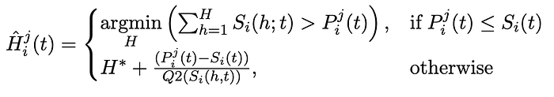

where _H* _is the hour till which the SKU was available on day _t_, _Q2(Sᵢ(h; t))_ is the median hourly sales for the day. Note that, in the first case, the estimated availability is very accurate as it exactly estimates the hour by which the predicted units would have been sold out. In the later case, we use that day’s hourly median sales to extrapolate the number of hours till which the predicted unit would have been available. This estimation can be done in many other ways as well. For example, the hourly sales pattern can be modeled as a spline and then extrapolated to estimate the hours of availability.

Similarly, the **estimated wastage** (referred as EW) can be defined as,

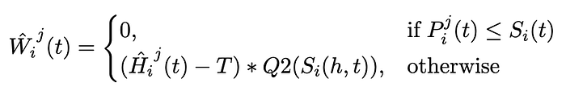

## Online Validation of Proposed Metric

Note that the above metrics (EA and EW) proposed are back-testing metrics, i.e., these metrics can be used to evaluate multiple experimental models or approaches to find the best one and then put that in the production setting. But how do we validate that the back-testing evaluation conducted using the above-mentioned two metrics is going to be replicated in production / online as well?

To answer this question we have used two experimental settings as follows. As the first approach of validation, we have chosen a time period in which two models, say models M1 and M2 were running in production for two randomly selected sets of pods, say, set A and set B. This means that model M1’s predictions are being used for demand planning in the pods in set A and the same for model M2 in set B. Now, though the predictions of model M1 are getting used only in set A stores and model M2 in set B, in the backend we have stored predictions of models M1 and M2 across all pods for all days in the experiment time period. In order to assess the impact of the proposed framework, we compute EA and EW of model M1 using the predictions generated for set B and the same for model M2 using the predictions for set A, i.e., the estimated availability and wastage metrics of models M1 and M2 are computed from the stores where their predictions are not being used for planning. This ensures no data leakage as the estimated availability and wastage numbers of models M1 and M2 are no way affected by which model is being used for planning. Now, we also have observed availability and wastage for models M1 and M2 based on set A and set B stores respectively — which are the true values of availability and wastage of models M1 and M2. In Fig. 3 below, we have plotted the daily trend of EA (from cross-set predictions) and actual availability (from actual-set predictions) for both models M1 and M2. As we can see, based on EA, model M1 would have better availability as compared to model M2 and the same has happened in the actual availability trends! This proves that the estimated availability and wastage metrics can rank the models correctly even without considering the online experimentation data. Moreover, observe that the trend of estimated availability for both models M1 and M2 has good coherence with the actual availability trend. More specifically, the estimated availability of model M2 (blue dashed line) is able to predict the sudden dip in availability (blue solid line) at the right end of the trend curve.

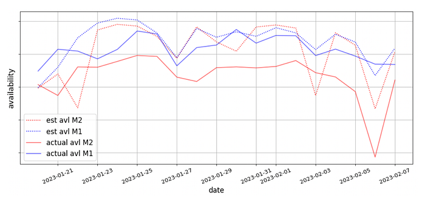
*Figure 3: Comparison of estimated availability and actual availability*

**_Can we predict the future?_**

In the above validation setup we have showcased how the proposed estimated metrics can correctly capture the change in online availability and wastage in an A/B experiment. Since we plan to use these metrics for selecting the best model based on backtesting data, we also need to validate whether the inference we are drawing based on the estimated metrics in backtesting data will be replicated in online metrics when we start using the model in production for demand planning. To test this, we use backtesting data till a time point _T1_ and compute the estimated availability (in %) and wastage (daily average number of units) numbers for two of the experimental models M1 and M2. As can be seen in the table below (‘Estimated’ column), with respect to the model M1, the model M2 has a relative 2.4% better estimated availability with relative 2% reduced estimated wastage.

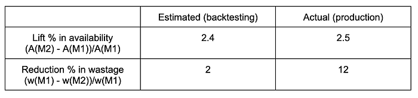

Next, we randomly divide the Instamart stores into 50–50 buckets and use M1 and M2 as forecasting models in production for demand planning respectively. We run this experiment for a certain time duration and then compute the actual business metrics i.e., availability and wastage. In the ‘Actual’ column of the above table, we present the lift in availability and reduction in wastage for the model M2 as compared to model M1. Clearly, using the proposed backtesting framework, the lift in availability is very well estimated. The online wastage metric is impacted by several other factors such as late marking, fill rate issue, non-expired wastage, in-transit wastage etc., and hence, the reduction is wastage through online and estimated computation is not directly comparable. But, note that, directionally the estimated wastage pointed out using backtesting data that model M2 will have less wastage as compared to M1 — which has also been observed in production.

## Conclusion

In this first part of the blog series related to demand forecasting for Instamart, we have discussed the challenges that we faced in using the traditional wMAPE as an offline model evaluation metric and the need for a new evaluation framework. We have introduced an evaluation framework based on _estimated availability _and _wastage_ which tries to replicate the business metrics on the back-testing data to provide better directional validation of the ML model experiments. Finally, we have provided validation of this framework through real-data and in-production results. This evaluation framework has enabled us to compare multiple modeling experiments in back-testing fashion and deploy the best one in production. This saves a lot of time and effort as compared to deploying each of the experimental models in an A/B fashion in production and having to wait till the experiments have enough data points to be conclusive.

In the next parts, we will focus on variants of ML modeling techniques we use to overcome the truncated sales data problem for out-of-stock scenarios, and, how in conjunction with the evaluation framework introduced here, we solve the Instamart forecasting problem end-to-end.

## References

1. wMAPE: [https://en.wikipedia.org/wiki/Mean_absolute_percentage_error](https://en.wikipedia.org/wiki/Mean_absolute_percentage_error)
2. Huang, C., Zhai, S., Talbott, W., Martin, M.B., Sun, S., Guestrin, C., Susskind, J. (2019). Addressing the Loss-Metric Mismatch with Adaptive Loss Alignment. Proceedings of the 36th International Conference on Machine Learning, in Proceedings of Machine Learning Research 97:2891–2900 Available from [https://proceedings.mlr.press/v97/huang19f.html.](https://proceedings.mlr.press/v97/huang19f.html.)

---
**Tags:** Machine Learning · Time Series Analysis · Forecasting · Model Evaluation · Swiggy Data Science
