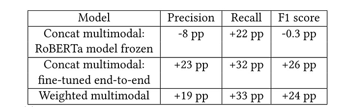
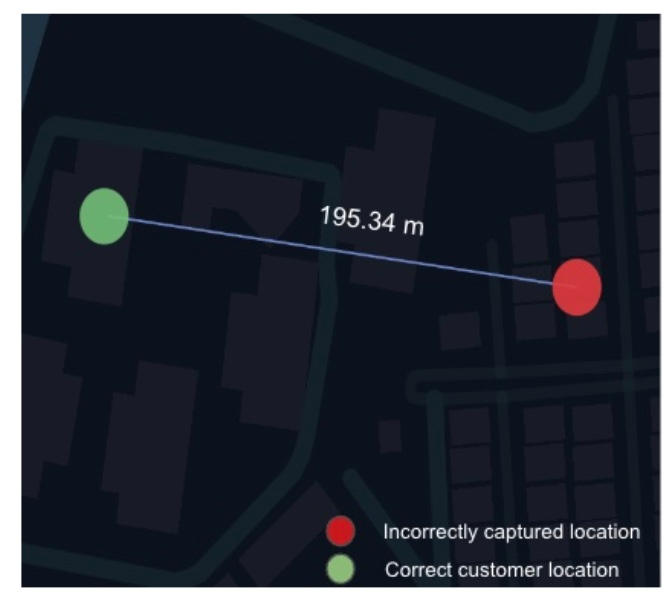

# Address Correction for Q-Commerce Part 1: Location Inaccuracy Classifier

Co-authored with [Yaswanth Reddy. B](https://www.linkedin.com/in/yaswanth-reddy-bytasandram-86801a181/), [Jose Mathew](https://www.linkedin.com/in/jose-mathew-550aa525/), [Tanya Khanna](https://www.linkedin.com/in/tanya-k-372683160/), [Sagar Jounkani](https://www.linkedin.com/in/sagar-jounkani/)

## Introduction

The domain of q-commerce primarily encompasses food and grocery deliveries, where the need for timely deliveries necessitates maintaining proximity between the inventory and the customer’s location. As a result, q-commerce platforms commonly gather customer locations alongside their textual addresses. Notably, certain q-commerce companies in India go a step further by utilizing reverse geocodes to automatically populate parts of the addresses, alleviating the burden on customers to input their complete addresses manually. The customer locations themselves are typically obtained through GPS coordinates acquired via smartphones. However, it is widely acknowledged that GPS receivers can provide inaccurate estimates of locations. This is attributable to the scattering of electromagnetic signals from GPS satellites due to various obstructions such as trees, buildings, and metallic reflectors. The presence of inaccurate location data within q-commerce settings has a profound impact on both the customer (Cr) experience and the experience of the delivery partner (DP). Specifically, delivery times promised to customers may be compromised due to the inability of the DP to locate the customer. Inaccurate customer locations also lead to heightened anxiety for the DPs as their time between orders is extended. In case of extreme delays, the orders may even be cancelled, resulting in a potential loss of revenue.

As a first step towards correcting the addresses, in our earlier work [1], we identified if the customer-captured location is dissonant with the address text. Location inaccuracy detection for an address text was formulated as a binary classification task. The following datasets were synthesized for training the RoBERTa-based classifier in a self-supervised manner.

(1) The perturbation dataset. The negative samples (indicating that the captured customer locations are accurate) were generated through cross-validation of the median of historical delivery locations, as marked by the DPs, against the captured location. The positive samples are generated by perturbing the captured location in the negative samples using Gaussian noise. The positive samples generated this way are guaranteed to have inaccurate locations since the captured locations in the negative samples are validated to be accurate.

(2) The address-swapped dataset. The negative samples were prepared in the same way as in the perturbation dataset. The positive samples were generated by swapping distant addresses in the negative samples dataset.

The RoBERTa language model was trained using the L8 geohash of the captured location and the address text as inputs. The model trained using the perturbation dataset and the address-swapped dataset were referred to as the perturbation model and the address-swapped model respectively. The ensemble model that takes the Boolean OR of the classification outputs from the two models was referred to as the union model. The union model had the best F1-score.

In this work, we introduce a self-supervised multimodal model that uses text address and numeric inputs for classifying if the captured location is inaccurate. The numeric inputs are curated from historical DP interactions with their care agents and customers. The best-performing model version achieves an AUC-ROC of 0.89. This model improved precision and recall by 23 pp and 32 pp respectively over the baseline model [1]. The classifier prefilters the address for location correction by the geocoder, which will be published in the next part of this blog.

The proposed architecture for address correction is presented below. The first two modules involved are described below.

*Figure 1: Architecture of the proposed location corrector for q-commerce.*

## The Location Inaccuracy Pre-filter

The pre-filter module filters out addresses with accurately captured locations. An address is not corrected if the median delivery location falls within a specified distance of the captured location. Since the delivery location and the captured location originate from different sources, this approach validates the accuracy of the captured location

## The Location Inaccuracy Classifier

The captured locations are corrected by the geocoder only for those addresses for which the location inaccuracy classifier module detects the captured location and the address text to be dissonant. This implies that the captured location is inaccurate and it is indicated by the inaccuracy flag. The inaccuracy flag is also useful standalone in nudging the customer to correct the address. The inputs to this module are the captured location, the address text, and the metadata obtained from the DPs and the DP-care agents (who attend to the DPs’ calls) on the history of orders placed at the address.

The address text input in our system is a combination of the customer-entered address line and the reverse geocode. We prefill the address onboarding form with reverse geocode obtained from a third-party maps service provider based on the captured location. It should be noted that if the captured location is inaccurate, this implies that the reverse geocode obtained will also be inaccurate. This poses an added challenge for the model in learning dissonant patterns of location and address text pairs. Addresses in India are known to be unstructured with wide variations in the way addresses are written even within the same locality and the linguistic diversity also poses challenges in terms of spell variations when written in Latin script. The intuition behind inaccuracy classification is that, given the sufficient density of addresses with “known geocodes”, the ML model should be able to learn patterns of consonant and dissonant (location, address text) pairs. To overcome the aforementioned challenges, we develop multimodal models that use signals gathered from DPs on the field to enhance the model performance relative to our prior work.

When the DPs are unable to find the customer's address during the order delivery, they either call their support team indicating on their application that the address is potentially incorrect (ICA — Incorrect Address) or call the customer to clarify the address (DP2Cr). These happen sometimes due to inaccurate locations and at other times due to incomplete address text or DPs not finding the address signboards in densely populated streets. Further, they raise a ticket to their support team for payout correction if they travel a longer distance than initially promised by automated distance prediction systems. The automated distance prediction systems take customer locations as inputs. Therefore, inaccurate customer location is one of the factors contributing to longer travel distances. The aforementioned signals, combined with data from completed and cancelled orders, are used to generate numeric inputs for finetuning the location inaccuracy classifier model. The signals are summarised below.

1. Fraction of orders from an address where ICA is indicated by the DP.
2. Fraction of orders that had a DP2Cr.
3. Average call duration of DP2Cr for orders from the address. When the location is inaccurate, the call durations are typically longer.
4. Fraction of orders where DPs raise tickets for travelling longer distances (TLD).
5. Fraction of orders where the customers cancel their orders attributing the reason to an incorrectly selected address (ISA). Some of these happen due to inaccurate locations.
6. Number of successfully delivered and cancelled orders

The architectures for the multimodal models that take the geohash of the captured location, the address text, and the numeric feature inputs are shown in Fig. 2. These multimodal architectures are adopted from [2]. The architectures depicted in Fig. 2a (Concat model) and Fig. 2b (Weighted model) exhibit differences in the process of combining the address embedding and the numeric features before undergoing feature transformation through fully connected (FC) layer(s). In the Concat model, the address embedding from the CLS layer of RoBERTa is concatenated with the numeric features. In the Weighted model, the CLS embedding is linearly combined with the numeric features.

*Figure 2: Left (a): The location and the address text embedding from the CLS head of RoBERTa is concatenated with the numeric features followed by feature extraction using the subsequent two FC layers. Right (b): The numeric and the text features are combined using a weighted sum followed by feature extraction using the subsequent fully connected layer.*

The multimodal architectures are trained in three phases.

1. The standard Masked Language Model (MLM) training of the RoBERTa module.
2. Fine-tuning the RoBERTa binary classifier on the perturbation dataset.
3. Fine-tuning the multimodal architecture on the “DBSCAN dataset” with the numeric features incorporated. The fine-tuning using the numeric features requires order data associated with both the negative and the positive samples. Note that the perturbation dataset is not associated with the numeric features since the positive samples do not correspond to actual orders placed. Therefore, we use the DBSCAN dataset for fine-tuning in this phase. This dataset is obtained through density-based clustering on delivery locations for addresses that have a dense history of successful deliveries. The centroid of the largest cluster is taken to be the ground truth location of the customer. An address whose captured location is within a certain distance of the ground truth location is taken to be a negative sample and is considered a positive sample otherwise. The choice of the distance threshold is based on feedback from DPs on the order deliverability if the locations shown to them are incorrect. The size of this dataset is conditioned on the order density distribution, smaller than the perturbation dataset by a factor of approximately 100, and consequently, the second training phase is necessary.

We experiment with two variants of the Concat model that differ in the third phase of model training.

1. **RoBERTa model frozen:** fine-tuning only the FC layers in the third phase with the weights of the RoBERTa model frozen after the second training phase.
2. **Fine-tuned end-to-end:** the FC layers and the RoBERTa model are fine-tuned end-to-end in the third phase.

An address location is flagged as inaccurate by the winning model, which turns out to be the Concat model fine-tuned end-to-end if the softmax output confidence is more than 0.5.

## Experiments

Since the order data is heavily skewed towards negative samples, we evaluate the model on a held-out imbalanced dataset with the number of negative samples being substantially larger than the positive samples. The imbalance factor, of the order of a few tens, is estimated through manual validation of a few thousand orders checked for location inaccuracy. The negative samples are obtained using the same method as for generating the perturbation dataset and the positive samples are obtained from the DBSCAN dataset.

*Table 1: Multimodal models compared against the perturbation model on an imbalanced dataset.*

As seen from Table 1, the best performing model (in terms of F1 score) is the Concat model, fine-tuned end-to-end. The perturbation model is the baseline over which the incremental metrics are reported. Table 1 establishes substantial improvement in precision and the recall when numeric signals gathered from the field augment the address input. The ROC-AUC curve is reported below.

*Figure 3: The TPR-FPR ROC-AUC comparison of unimodal models versus the Concat multimodal model fine-tuned end-to-end. The perturbation, address-swapped, and union models are the unimodal models that take only the captured L8 geohash and the address text as inputs*

The Concat model fine-tuned end-to-end has a substantially higher AUC compared to all the inaccuracy classifier models evaluated in [1]. We now present examples where the multimodal model can flag location inaccuracies aided by numeric signals while also exploiting the address input when the numeric signals are weak.

**Example 1**. The customer-captured location is 117.71 m away from the correct location of the customer (as identifiable using the customer-entered address line). The address recorded during the address onboarding process is given in the figure below. The reverse geocode incorrectly points to a different road since the captured location is incorrect. Therefore, the perturbation model is unable to classify the captured location as inaccurate. The multimodal model however can classify that the captured location is inaccurate, i.e., the captured location and the customer-entered address line are dissonant, with the aid of numeric features. One-third of the orders at the address had a DP2Cr and the average call duration was 60.4 s.

*Map representation for Example 1. The customer entered address is XX, Shriram Shristi, SSA Road. The flat number, floor number, block number or pincode identifiers in the address are anonymised as XX. The reverse geocode is Sumangali Sevashrama Main Rd, Chola Nagar, Anandnagar, Hebbal, Bengaluru, Karnataka XX, India.*

The numeric signals are however not always as strong as in the earlier example though the captured location is inaccurate. The following example demonstrates the same.

**Example 2**. The customer-captured location is 195 m away from the correct location of the customer (as identifiable using the customer-entered address line). The address recorded during the address onboarding process is given in Fig. 8. The reverse geocode points to the correct locality though the captured location is incorrect. The four orders successfully delivered to the address did not have a DP2Cr or ICA. This is because the DPs were familiar with the landmark and did not navigate using the captured location. However, it is still important to fix such locations for a DP who is unfamiliar with the address. The multimodal model can classify that the captured location is inaccurate despite weak numeric signals.

*Map representation for Example 2. The customer entered address is XX, Mahindra Ashvitha Apartments. The reverse geocode is Fortune Fields Kukatpally Housing Board Colony Kukatpally Hyderabad Telangana XX.*

## Conclusion

To summarise, we discussed the location inaccuracy classifier trained in a self-supervised manner, eliminating the need for manual labelling. The models were trained using signals collected from the delivery personnel during or after order deliveries. The multimodal location inaccuracy classifier demonstrates significant improvements in precision and recall by incorporating location, address text, and numeric signal inputs compared to previous work that used only location and address text inputs. The classifier pre-filters inaccurate addresses for correction by the geocoder. In the next part of the blog, we shall discuss and address the challenges of geocoder design for q-commerce.

## References

1. Yaswanth Reddy, Sumanth Sadu, Abhinav Ganesan, and Jose Mathew. 2023. Address Location Correction System for Q-Commerce. In Proceedings of the Second International Conference on AI-ML Systems (AIML Systems ’22), New York, NY, USA, Article 23.
2. Ken Gu and Akshay Budhkar. 2021. A Package for Learning on Tabular and Text Data with Transformers. In Proceedings of the Third Workshop on Multimodal Artificial Intelligence. Association for Computational Linguistics, 69–73.

---
**Tags:** Address Correction · Geospatial · Machine Learning · Deep Learning · Swiggy Data Science
