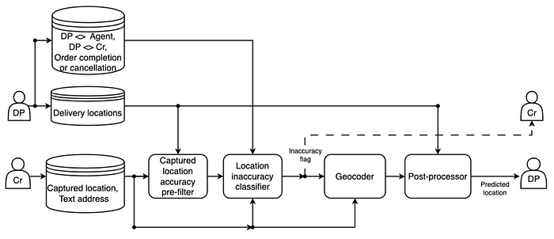
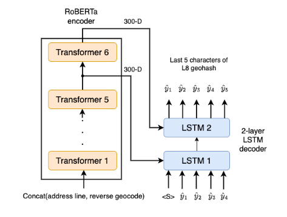
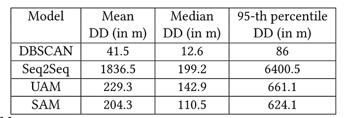
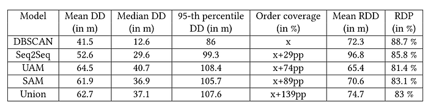

# Address Correction for Q-Commerce Part 2: Geocoder

Co-authored with [Yaswanth Reddy. B](https://www.linkedin.com/in/yaswanth-reddy-bytasandram-86801a181/), [Jose Mathew](https://www.linkedin.com/in/jose-mathew-550aa525/), [Tanya Khanna](https://www.linkedin.com/in/tanya-k-372683160/), [Sagar Jounkani](https://www.linkedin.com/in/sagar-jounkani/)

Q-commerce mostly interfaces with the customers through smartphone applications and it is usually mandatory for the customers to capture the GPS locations of their addresses (called “captured locations”) for timely deliveries. GPS locations are known to be error-prone due to multipath attenuation of signals received from GPS satellites. Prior works in the literature on geocoding are generally applicable to e-commerce or map-search settings. These are also useful for correcting locations in q-commerce settings but cannot fit in as standalone models as we shall demonstrate in this blog. In an e-commerce geocoding or map-search setting, the customer or the client location is not available. Hence, it is a necessity to geocode every address query. Since the customers input their locations in q-commerce settings, we do not want to correct them unless warranted.

Hence, in the [first part](https://medium.com/@abhinav_ganesan/address-correction-for-q-commerce-part-1-location-inaccuracy-classifier-e72b88a33d2f) of the blog series, we introduced a new location correction architecture for q-commerce. We reproduce the architecture below for the convenience of the readers.

*Figure 1: Architecture of the proposed location corrector for q-commerce.*

The inaccuracy flag output by the location inaccuracy classifier pre-filters addresses for correction by the geocoder. The post-processing step ensures that the accuracy of the correction is within acceptable limits.

Our address correction architecture operates under the following constraints, some exclusive to the q-commerce setting.

1. The customer-captured location must be corrected only if it is inaccurate.
2. The location predicted by the geocoder should be highly accurate.
3. We correct only those addresses with at least one successfully delivered order to the address since this constitutes the predominant chunk of our business problem.
4. No manually labelled data for model training is used. All the models are trained in a self-supervised manner. Any data used for model training must be derived using signals from the delivery partner (DP) or the customer (Cr). The accuracy of these signals is not guaranteed.
5. We make no assumptions on the availability of hierarchical maps data such as geo-polygons for localities, sub-localities for model training or inference.

## The Geocoder

In this blog, we experiment with three geocoder architectures, viz. the Seq2Seq model [1], address-matching architecture using fuzzy address match scores, and the Siamese network proposed in [2]. For all the  
models, the address entered by the customer is concatenated  
with the reverse geocode, referred to as the address text. The address-matching architectures require a database of addresses with known  
geocodes and the “negative samples” constitute this database. The  
negative samples of addresses are generated in the same way as described in [Part 1](https://medium.com/@abhinav.ganesan/3f0a8482f352) of this series. Unlike in e-commerce or map-search, the customer-captured location is available in q-commerce. This location, though inaccurate, gives coarse information about the customer's location and can be exploited to improve the accuracy of the geocoder. Though the captured location is available, the problem is not simplified since the accuracy requirements in our case are far more stringent.

We show that the raw geocodes from any of these architectures do not meet the stringent accuracy targets required for q-commerce. We propose a methodology to certify geocoder models as production-ready for q-commerce.

1. **Seq2Seq**: The work in [1] used a sequence-to-sequence (Seq2Seq) model powered by a RoBERTa encoder and LSTM decoder to  
predict the GeoSOT grid code. We use the same architecture  
to predict L8 geohash of the inaccurate address. The model uses the address text to predict the last five characters of an L8 geohash as shown in the figure below. The first three characters are copied over from the customer-captured location. Since an L3 geohash is of area approximately 156km × 156km, it is improbable that the GPS-captured location is so egregiously off. We use teacher forcing to train the model and greedy decoding at inference time. The labels for training are taken to be the last five characters of geohashes of the captured locations of the negative samples.

*Figure 2: The Seq2Seq model. The penultimate and the last layers of the RoBERTa encoder initialise the hidden state of the two LSTM layers.*

2. **Unsupervised Address Matching (UAM)**: The geocoding happens hierarchically in two stages, viz. coarse localisation on H3 cell2 at resolution 8 (referred to as H8 cell) followed by finer localisation at resolution 11 (H11 cell) [3]. The coarse retrieval is done on the H8 cell which contains the captured location. The fine retrieval retrieves the best H11 cell within the H8 cell. This is achieved by aggregating address similarity metrics of the query address on negative samples contained within the H11 cells. The similarity score used between a pair of addresses is a summation of the Jaro-Winkler, the token set ratio, and the token sort ratio scores from the fuzzy-wuzzy library [4]. Each H11 cell is scored using the median of the similarity scores of the addresses within the cell. The centroid of the H11 cell with the highest score is taken to be the geocode of the query address. A representation of the fine retrieval step is presented in the figure below.

![Figure 3: Coarse and fine retrieval in UAM. The green cell represents the H8 cell containing the inaccurately captured location. The saffron-coloured H11 cells contain the negative samples, i.e., addresses with accurately captured locations. The rest of the H11 cells within the H8 cell do not contain negative samples due to data sparsity. The query address with the inaccurate location lies inside the blue-coloured H11 cell. The red-coloured cell represents the H11 cell with the highest similarity score among the saffron cells with respect to the query address. The centroid of the red-coloured cell is vended out as the geocode.](../images/28b19da37c800cd5.png)
*Figure 3: Coarse and fine retrieval in UAM. The green cell represents the H8 cell containing the inaccurately captured location. The saffron-coloured H11 cells contain the negative samples, i.e., addresses with accurately captured locations. The rest of the H11 cells within the H8 cell do not contain negative samples due to data sparsity. The query address with the inaccurate location lies inside the blue-coloured H11 cell. The red-coloured cell represents the H11 cell with the highest similarity score among the saffron cells with respect to the query address. The centroid of the red-coloured cell is vended out as the geocode.*

3. **Self-Supervised Address Matching (SAM):** We use the RoBERTa-Triplet-3 model in [2] for retrieving the best-matched addresses in the fine-retrieval step against the database of negative samples within the H8 cell of the captured location. This model was trained on the triplet loss function by using our internal dataset of similar and dissimilar addresses at varying levels of H3 cell resolution as proposed in [3]. The inference flow of SAM is presented in the figure below.

*Figure 4: Inference flow for SAM. The query address text associated with an inaccurate location and the accurate addresses (with “known” geocodes) are transformed into the embedding space using the RoBERTa encoder. The geocode of the nearest neighbour in the embedding space is retrieved from the H8 cell of the captured (query) location.*

## Evaluation of Raw Geocodes

We track metrics on successfully delivered orders for certifying a geocoder model to be production-grade in the q-commerce context. We also propose metrics to evaluate the goodness of the geocoder-predicted locations relative to the captured locations.

_Delivery deviation (DD in m)_. This measures the Haversine distance of the predicted location 𝑝 from the delivery location 𝑑 for a given successfully delivered order and is denoted by dist(𝑝, 𝑑).

Note that a single delivery location marked by a DP can be erroneous. The order is marked as delivered far from the customer’s actual location in cases where delivery personnel (DPs) face restrictions entering apartment complexes, take a break before proceeding to the next order, or are unable to mark the correct delivery location due to network problems.

Benchmarking a geocoder solely based on descriptive statistics (mean, median, or 𝑡-th-percentile DD) can be misleading in deciding if the model is production-grade for q-commerce. This is because it is impossible to claim if (say) the 95th percentile DD is 100m, then the geocoder is usable. Such an absolute threshold may not be uniformly good for various locations such as small and large apartment complexes, technology parks, and independent houses. Although small values of the 95th-percentile DD can make the decision on usability of a model for q-commerce easier, meeting the stringent targets on DD without post-processing is rare for geocoders of reasonable complexity as demonstrated here. In q-commerce, the accuracy requirements typically fall within tens of meters from our experience. However, the unavailability of large-scale ground truth location data for inaccurate addresses makes benchmarking of geocoders difficult.

Therefore, we turn to a comparative approach by comparison against the performance of the DBSCAN model, which has internally proven effective in assisting delivery personnel (DPs) in reaching the accurate customer location. The input to the DBSCAN algorithm for an address is the set of historical delivery locations over a few months. Its inherent reliability stems from the fact that the corrected location is derived from the delivery locations that are densely clustered within the distance threshold. Since DBSCAN is an unsupervised algorithm, the hyperparameters are chosen heuristically as 𝑚𝑖𝑛_𝑝𝑜𝑖𝑛𝑡𝑠 = 4 and 𝜖 = 20𝑚. The median of the largest cluster centroid is taken to be the geocode. The drawback of the model is the fact that it does not leverage the address text data to predict the geocode.

The comparison of descriptive statistics of the predicted outputs from the three model architectures relative to the DBSCAN model is given below. The DD statistics for the three geocoders are evaluated over the same set of addresses flagged as inaccurate and having at least one successfully delivered order. The DBSCAN model is however evaluated over addresses for which the predicted location is a certain distance away from the captured location. Though the base set of addresses is different, the descriptive statistics show how much worse off the geocoder models are and whether they are usable in q-commerce for routing the DPs to the correct location. The best-performing geocoder is the SAM architecture. However, the model is not production-grade for q-commerce since the 95th percentile DD is very high and an order of magnitude higher than that for the DBSCAN model.

*Table 1: DD for the raw model outputs of the geocoders concerning the DBSCAN model. The 95th percentile DD is substantially higher for the raw geocoder model outputs compared to the DBSCAN model.*

## Post-Processor

Since all these geocoders have a DD of the order of a few hundred metres which is unsuitable for q-commerce, a post-processing step is necessary. We post-process the geocoder outputs using historical delivery locations. Since the delivery locations come from a source different from the model outputs, when they lie in the neighbourhood of the geocodes, the geocodes are likely to be accurate. If the geocode is within a certain distance of all the historical orders delivered to the address, we tag the geocode as _usable_.

## Evaluation of Usable Geocodes

The statistics of the DD metric for the usable geocodes are on a comparable scale with that of DBSCAN as shown below.

*Table 2: Comparison of the geocoders with respect to the DBSCAN model after ensembling with the historical delivery locations of the addresses.*

While DBSCAN is a tough baseline to beat, the median number of successful deliveries required to produce a prediction is 1.25, 2.5, and 2.5 times larger than that required for the Seq2Seq, UAM, and SAM architectures respectively.

We also define the metrics to evaluate the goodness of the correction in terms of what fraction and how far the addresses are corrected favourably.

_Relative delivery deviation (RDD in m, measures the ‘how far’)_. This measures the relative closeness of the predicted location 𝑝 to the delivery location 𝑑 for a successfully delivered order to an address compared to the captured location 𝑐. This is given by dist(𝑐, 𝑑) − dist(𝑝, 𝑑), where dist(𝑐, 𝑑) represents the Haversine distance between the captured location and the delivery location.

_Relative delivery precision (RDP, measures the ‘what fraction’)_. This measures the fraction of addresses for which dist(𝑐, 𝑑) − dist(𝑝, 𝑑) > 0. It lies in the range [0%, 100%].

The larger the mean value of RDD, the larger the magnitude of error in the captured location compared to the predicted location. In other words, a larger mean RDD indicates that the predicted location corrects the captured location over a longer distance. The higher the value of RDP, the larger the fraction of addresses for which the predicted location is more accurate than the captured location. To summarise, the desirable geocoder behaviour is low mean DD, high mean RDD, and high RDP. We note that the UAM and SAM models are restricted to correction within the H8 cell of the captured location while the space of correction for the Seq2Seq model is much larger. The fraction of addresses requiring more than 531 m correction (edge length of H8 cell) is low from anecdotal experience, and it is also a practical choice to restrict the search complexity for the UAM and SAM models. The maximum correction distance (i.e., the distance between the predicted and the captured locations) for the Seq2Seq, UAM, and SAM models are 8.8 km, 942 m and 956 m respectively. Therefore, as seen in Table 2, the mean RDD is higher for the Seq2Seq model compared to the UAM and SAM models.

The Seq2Seq model while correcting the inaccurate addresses over larger distances also has the lowest mean and median DD at the expense of lower order coverage relative to the UAM and SAM models. The order coverage here refers to the fraction of orders on addresses that have usable predictions from the geocoders. It is noteworthy that although the Seq2Seq model had significantly worse off metrics as shown in Table 1 compared to the other two models, the usable predictions from the model have lesser mean and median DD. While the SAM has a significantly higher order coverage, the usable predictions from the other models are still useful as indicated by the Union model in Table 2. The Union model is evaluated as the union of usable predictions for inaccurate addresses prioritised in decreasing order of mean DD, i.e., the inaccurate address will take the geocode of Seq2Seq if usable, followed by SAM and UAM. This Union model achieves a 139 pp improvement in order coverage over the DBSCAN model. This is a substantial improvement over the coverage of the best-performing SAM model without degradation in any of the other model metrics.

All the experiment results reported in this paper are done on 3 large Indian cities in South India, where diverse languages are spoken, using a single model for each of the architectures. We scaled the Seq2Seq model pan-India with four models deployed one each for South, Central, North, and East India. The models were deployed on the field to route the DP to the predicted locations when the captured locations were flagged to be inaccurate. The DD decreased by an average distance of 143 𝑚 on the corrected addresses post the location correction, thus validating the scalability of the approach pan-India.

## Conclusion

A comprehensive system for correcting customer locations in q-commerce was discussed in this two-part series (read part 1 [here](https://medium.com/@abhinav_ganesan/e72b88a33d2f)). The system consists of a classifier for identifying inaccurate addresses and a geocoder for their correction. The unique aspects of q-commerce, particularly the stringent accuracy requirements, were discussed. The challenge of defining absolute accuracy targets is addressed by benchmarking the geocoder models against a simpler DBSCAN model that relies solely on historical delivery locations and does not consider address text. This benchmarking approach enables the certification of geocoder models as production-ready in a q- commerce setting. The geocoders were trained in a self-supervised manner, eliminating the need for manual labelling. The models were trained using signals collected from the delivery personnel during or after order deliveries. By post-processing the geocoder outputs using historical delivery locations, substantial coverage improvements over the DBSCAN model were achieved. This allows the correction of addresses not covered by DBSCAN predictions. In contrast to the e-commerce domain where a single best-performing model is often preferred, the q-commerce setting benefits from a union of models.

## References

1. Chunyao Qian, Chao Yi, Chengqi Cheng, Guoliang Pu, and Jiashu Liu. 2020. A Coarse-to-Fine Model for Geolocating Chinese Addresses. ISPRS International Journal of Geo-Information 9, 12 (2020), 698
2. Govind . and Saurabh Sohoney. 2022. Learning Geolocations for Cold-Start and Hard-to-Resolve Addresses via Deep Metric Learning. In Proceedings of the 2022 Conference on Empirical Methods in Natural Language Processing: Industry Track. Association for Computational Linguistics, 322–331.
3. Uber: Tables of Cell Statistics Across Resolutions. Retrieved May 17, 2024 from [https://h3geo.org/docs/core-library/restable](https://h3geo.org/docs/core-library/restable)
4. SeatGeek Inc. 2014. fuzzywuzzy: Fuzzy String Matching in Python. (2014). [https://github.com/seatgeek/fuzzywuzzy](https://github.com/seatgeek/fuzzywuzzy)

---
**Tags:** Maps · Location Intelligence · Geocoding · Q Commerce · Swiggy Data Science
