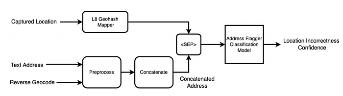
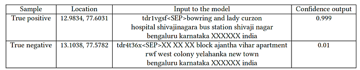
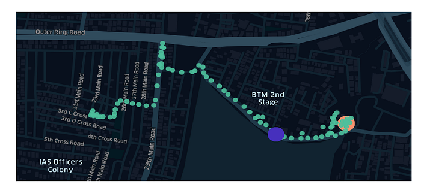
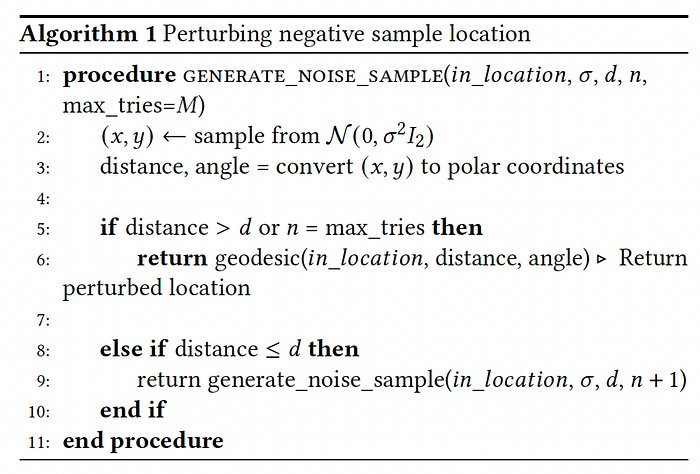
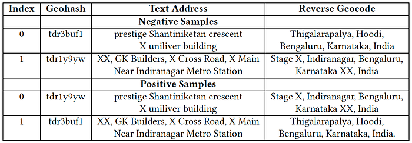
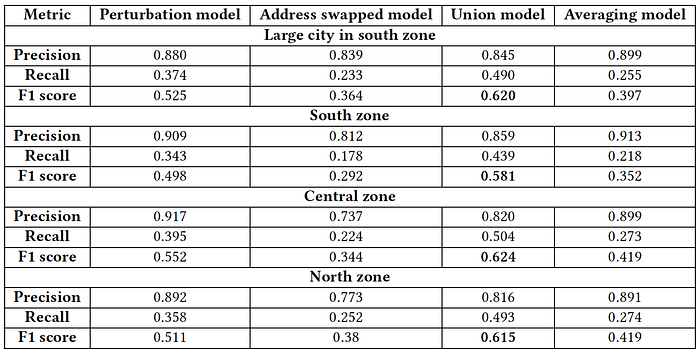

# Address Location Correction System for Q-commerce

Co-authored with [Sumanth Sadu](http://linkedin.com/in/sumanthsadu), [Abhinav Ganesan](https://www.linkedin.com/in/abhinav-ganesan/), [Jose Mathew](https://www.linkedin.com/in/jose-mathew-550aa525/)

The following is an extension of our previous [work](./using-deep-learning-to-detect-dissonance-between-address-text-and-location-4b228bc2c3fb.md) and is a blog version of our paper ‘Address Location Correction System for Q-commerce’ which has been accepted in the industry track at 2nd International Conference on AI-ML Systems (AIMLSystems’22).

## INTRODUCTION

Conventional e-commerce platforms generally schedule their deliveries to their customers a few days in advance. Quick (q)-commerce is an evolution of e-commerce where the delivery time targets are anywhere between 10–40 minutes. The use-cases served by such instant delivery platforms include food and grocery deliveries. Such aggressive delivery times lend themselves to lesser scope of errors in customer addresses since violations of delivery time promises erode customer trust. To minimize hassles for the delivery partners (DPs) in reaching the customer doorstep, in addition to the text addresses, customers also input the GPS location of their addresses in q-commerce platforms. The address location especially helps when the DP is unfamiliar with the area and the DP uses the location to navigate with the aid of popular map applications on the mobile phone.

The customer address onboarding journey on Swiggy, a q-commerce smartphone application, is shown in Fig. 1. The captured GPS location (latitude (lat), longitude (lng)) on the customer phone is used to obtained the reverse geocode using a third party maps service provider API. The text address is pre-filled with the reverse geocode for the convenience of the customer so that they need not type the complete address. The customers fill in their text addresses which may or may not have an overlap with the reverse geocode.

![Figure 1: Address onboarding snapshots from Swiggy’s customer android application. The snapshot in (a) represents the first step in the address onboarding journey where the GPS location captured by the application is indicated by the red circle. The green circle represents the actual customer location. Customers can adjust the location marker if they want the delivery at an alternate location. The text including and below “Rudrampeta” represents the reverse geocode obtained by passing the red colored location to the reverse geocode API of a third party maps service provider. If the captured customer location is incorrect, the reverse geocode could be incorrect. The snapshot in (b) represents the second step where the customer manually inputs the text address. Here, the customer may nor may not include the entities of the text address (such as the locality name) that are present in the reverse geocode.](../images/4fc75fe9c19f2146.png)
*Figure 1: Address onboarding snapshots from Swiggy’s customer android application. The snapshot in (a) represents the first step in the address onboarding journey where the GPS location captured by the application is indicated by the red circle. The green circle represents the actual customer location. Customers can adjust the location marker if they want the delivery at an alternate location. The text including and below “Rudrampeta” represents the reverse geocode obtained by passing the red colored location to the reverse geocode API of a third party maps service provider. If the captured customer location is incorrect, the reverse geocode could be incorrect. The snapshot in (b) represents the second step where the customer manually inputs the text address. Here, the customer may nor may not include the entities of the text address (such as the locality name) that are present in the reverse geocode.*

## Motivation

The captured GPS location can be incorrect due to multi-path errors resulting from scattering of electromagnetic waves from the GPS satellites by tall buildings and trees. Note that an error in the captured location propagates to an error in the reverse geocode as well. Incorrect customer location impacts most downstream delivery systems and adversely affects the customer experience (CX) and the DP’s delivery experience (DX).

In the worst case, the DP cannot reach the correct customer location because the captured customer location shown to the DP is far away from the correct location. Therefore, the customer ends up canceling the order. Such order cancellations are recorded in our database using an appropriate disposition.

Incorrect captured location impacts the CX and the DX even if the DP manages to deliver the order successfully. When the DP reaches the incorrect location, the DP informs the customer that (s)he is unable to find the address. The customer then directs the DP over the phone to the correct location. Hassles of finding the right delivery location frustrate the DP and the hungry customer waiting for the order. In addition, this leads to a breach of promise of the expected time of delivery (ETA) of the order.

DPs are assigned to the orders using the captured locations, and hence, incorrect captured locations lead to suboptimal DP assignments. The adverse impact on CX is amplified during batched orders, where one of the orders is associated with an address-location mismatch, which impacts the delivery times of the other orders.

## Terminology

**Geohash**: Geohash encodes a geographic location into a string of letters and digits. It quantizes and partitions the geographical locations into grids. The partitions can be configured at different resolutions from L1 to L12. The cell width of an L8 geohash is at most 38.2 m, and the cell height of an L8 geohash is at most 19.1 m respectively.

**Text address**: This is the text address that the customer manually inputs during the address onboarding as shown in Fig.1.

**Captured location**: This is the customer’s GPS location captured by the Swiggy application during the address onboarding as shown by the red dot in Fig. 1

**Last mile:** Last mile** **is the journey the DP undertakes from the restaurant to the customer to deliver an order.

## THE ADDRESS FLAGGER MODEL

We assume that customers enter valid and correct text addresses since it is in the customer’s interest to get the order delivered to the correct address. We design a classifier that classifies if the captured location accurately represents the address text. We achieve this by using aggregates of (address location, address text) tuples. We train a classifier on a dataset of negative samples which comprises consonant (address location, address text) tuples, and a dataset of positive samples which comprises dissonant (address location, address text) tuples. The primary challenge we address in this section is the synthesis of these negative and positive samples. The negative samples dataset is constructed from the ‘delivered’ signals captured from the DP’s application for successfully delivered orders. The positive samples dataset is synthesized by perturbing the locations in the negative samples dataset, called perturbation approach, and by swapping the text address of pairs of negative samples, called address swapped approach. The details are presented in the subsequent sub-sections.

*Figure 2: Inference flow of the address flagger model.*

### Features

The captured location and the text address concatenated with the reverse geocode constitute the input features to the model. The text address and the reverse geocode are preprocessed using the vocabulary-preprocessing steps as described in [this blog](./mining-pois-via-address-embeddings-an-unsupervised-approach-c86edb397742.md). Since location is a numeric feature, we convert the same into a string feature using the geohash encoding. This overcomes having to deal with input data with different scales. Thus, the features into the model are given by the L8 geohash of the captured location and the concatenated address text separated by a separator token <SEP>. The output of the model is a binary classification using a threshold of 0.5 with the positive (negative) class indicating that the captured customer location is inaccurate (accurate). The inference flow of the model is shown in Fig. 2. Examples of true positive and true negative samples are given in Table 1.

*Table 1: Examples of true positive and true negative classification by the address flagger model. If the confidence score exceeds 0.5, the sample is classified as positive class (i.e., the location is inaccurate) and negative class otherwise.*

### Label Generation

The DPs mark orders as delivered on their application when they hand over the order to the customer and this signal is annotated with the GPS location.We use these ‘delivered’ locations to identify if the captured locations are accurate. However, the DPs may not mark the order as delivered exactly at the customer’s doorstep. Further, the delivered location itself might be noisy. An instance of the DP marking the order as delivered far away from the correct customer location is shown in Fig. 3.

*Figure 3: DP marks the order as delivered (location indicated by the purple point) far away from the correct customer location (indicated by the saffron point). The green points represent the DP’s last mile trajectory.*

### Negative label synthesis

We first synthesize the location of a customer address from the delivered location of all orders that are successfully delivered to the address. This location, referred to as the synthetic location, is generated as follows. We augment the delivered locations with the GPS traces of the last mile trajectory that are within 20 m from the delivered location.We shall call these as the augmented delivered (ADEL) locations. Now, we aggregate the ADEL locations across all orders for each address by computing the median of the latitudes and the longitudes as the synthetic location. For each address, we compute the haversine distance between the captured and the synthetic location. If this distance is at most 40 m, then we label that address as negative label indicating that the captured location is correct.

The intuition behind augmenting the delivered location for each order using the GPS traces from the LM trajectory is that a single GPS location is highly likely to be noisy and aggregation of neighbourhood locations in the trajectory de-noises singular location estimates. We use the ADEL locations for orders only if there are at least two augmenting locations for each delivered location. Therefore, not every customer address that has an accurate captured location and has a successfully delivered order can be labelled as a negative label. If the median of the ADEL locations is close enough to the captured location of the address, it is unlikely to be a coincidence, and therefore, taken to be validation of the correctness of the captured location. On manual validation of a few hundred negative label samples, we found that the accuracy of negative labels is approximately 90%.

### Positive label synthesis through perturbation of negative label locations.

A vanilla approach to generate the positive labels is a natural extension of the negative label synthesis using the complementary criterion, i.e., the distance between the synthesized location and the captured location is taken to be more than a threshold. However, on manual validation of such positive labels dataset, we found that the labels were only 31.8 % accurate which is unreliable to train the classifier on. Some causes of the low accuracy are as follows.

1. The DP marks the order as delivered far away from the customer’s location.
2. The address belongs to a gated community or apartment where the DPs are sometimes not allowed to enter into the private compound.
3. Users edit an address if they move to a different location or a different city.
4. DEs are unable to mark delivered at the correct location due to network issues.

We tried to solve the first problem by modifying the delivered location to the location in the LM trajectory that is nearest to the captured location.We then recalculated the synthetic location based on this newly defined delivered location. If the distance between the new synthetic location and captured location is at least 𝑦 meters we considered these addresses as positive labels. However, this approach would miss classifying address locations that are incorrect as positive labels because DPs would actually travel to the incorrect location and call the customer if the DP is unable to locate the address. The second problem could be solved by increasing the threshold of 𝑦 meters on the distance between the captured and the synthetic location to classify the address as a positive label. However, this results in discarding genuine positive labels. The third problem is not easily solvable because the locations are accurately captured when the customers edit the address after moving to a different location and the delivered locations are naturally spread out across time resulting in false positive labels. The aforementioned solutions therefore did not increase the accuracy of positive labels significantly without significantly impacting the coverage.

Since the negative labels dataset is of high accuracy, we synthesize the positive labels dataset from the negative labels dataset by perturbing the captured location, and as a corollary, the positive labels dataset is also of high accuracy. In other words, we are guaranteed that the perturbed captured location does not correspond to the text address. The pseudocode for perturbing the negative sample location is given in Algorithm 1. In practical settings, the captured location is Gaussian distributed around the ground truth customer location. However, it is hard to estimate the variance of the Gaussian distribution in the WGS-84 coordinate system, and hence, we resort to approximations. We use a Gaussian distribution in the Cartesian coordinate system which gives us greater control over the minimum distance to which the in_location must be perturbed. This distance is specified using the parameter 𝑑 taken to be 100 m. The variance 𝜎2 is fit to the variance of incorrectly captured locations that we sampled and manually validated in the vanilla approach. The geodesic function in line 6 of the algorithm that returns the perturbed location uses an ellipsoidal earth model to obtain the location in theWGS-84 coordinate system with a specific distance and angle from the 𝑖𝑛_𝑙𝑜𝑐𝑎𝑡𝑖𝑜𝑛.We use an off-the-shelf implementation available in [GeoPy](https://geopy.readthedocs.%20io/en/stable/). The positive sample location is thus obtained by passing a negative sample location to the 𝑖𝑛_𝑙𝑜𝑐𝑎𝑡𝑖𝑜𝑛 argument in Algorithm 1. The text address and the reverse geocode for the positive samples dataset is taken to be the same as that in the negative samples dataset. This ensures that the location and the text address in the positive samples dataset are dissonant. The drawback of this approach is that the location and the reverse geocode do not correspond to each other and it incurs cost to obtain the correct reverse geocode for the positive sample location. The approach described below addresses this drawback.

*Algorithm 1: Perturbing negative sample location*

### Positive label synthesis through swapping negative label addresses.

This approach also generates positive labels from the negative labels, but by ensuring that the geohash of the positive label corresponds to the reverse geocode. This is easily obtained by swapping the geohash and the reverse geocode between pairs of addresses in the negative sample dataset. An example illustrates this idea in Table 2. The quantiles of distances over which the addresses are swapped are fit to approximately match the quantiles of perturbation in the perturbed dataset described above.

*Table 2: An illustration of synthesis of positive samples from a pair of negative sample addresses by swapping the geohash and the reverse geocode.*

## EVALUATION

Two [RoBERTa](https://arxiv.org/pdf/1907.11692.pdf)-based classification models are trained on class balanced datasets, one on positive labels generated using the perturbation approach and another on positive labels generated using the address swapped approach as described in above sections. The former model is referred to as the perturbation model and the latter model as the address swapped model. A threshold of 0.5 is used on the address incorrectness confidence score to obtain a binary classification output. We evaluate an ensemble of outputs of these two models as follows.

1. Union model: The output of this model is a Boolean OR of the binary classification outputs from the two models.
2. Averaging model: This model averages the location incorrectness confidence scores from the two models and applies a classification threshold of 0.5 to obtain a binary output.

We first train the model on a large Indian city and then expand to three zones, viz. south, central and north zones covering 9 large Indian cities on a few million data samples for each zone. From among the epochs where validation loss saturated, we used the model checkpoint that resulted in best F1-score on a manually validated balanced dataset of few thousand samples for each of the zones. We prepared the test set as follows.

We cluster the delivered locations marked by our DPs on their application using the density-based clustering algorithm, namely DBSCAN. The DBSCAN algorithm does a breadth-wise search across delivered locations for each address by adding to a cluster at least 4 neighbouring points within a distance of 20 m and the points that do not have such dense neighbours are taken to be noisy points. We take the largest cluster centroid to be the “ground truth” location of the customer if the cluster contains at least 80% of delivered locations to the address. A manual validation of few hundred random samples using popular maps websites and realestate websites revealed a qualitative accuracy of approximately 90% for these “ground truth” locations. We do not use the positive labels derived from these ground truth locations for training the model because the number of positive labels obtained is only 2% of the number of samples we synthesize using the perturbation or the address swapped approaches. These locations however serve as test samples to evaluate the classification model as well as monitor the performance of the model on a regular basis. The captured locations that are within 40 m of these ground truth locations as measured by the haversine distance are taken to be negative samples and the ones that are away by more than 100 m are taken to be positive samples. The choices of these thresholds are heuristics based on interviews with DPs on ease of deliveries if the locations are inaccurate as well as difficulty in manually pin-pointing an address with the aid of satellite imagery, maps websites, and real-estate websites.

The performance of the perturbation model, the address swapped model, and the ensemble models on the test set are given in Table 3. The best performing model in terms of F1-score is the union model. The address swapped model performs worse on both precision and recall as compared to the perturbation model. However, the outputs of the address swapped model usefully augments the outputs of the perturbation model leading to improvement in recall of the union model while marginally degrading the precision from a relatively high base. This phenomenon is observed across the city-wise model as well as the models trained on all the zones. In other words, when the perturbation model is not able to flag an inaccurate location, the address swapped model is able to flag the same and vice-versa. The averaging model has a higher precision than the other models but worse recall compared to the perturbation model.

*Table 3: Performance comparison for perturbation model, address swapped model, and ensemble models. The union model performs the best on F1-score across the zones as well as in the city-wise model.*

The recall of both the perturbation model and the address swapped model are low because the train dataset does not accurately represent the distribution of the test dataset. This hypothesis is verified by evaluating the recall of the train dataset and the test dataset for the address swapped model on the same L8 geohashs of the captured location which come out to be 0.985 and 0.22 respectively. As shown in Table 4, a positive sample address in the train dataset for the same geohash looks quite different from the positive sample address in the test dataset. This suggests requirement of oversampling positive samples appropriately to improve the recall. There are too many combinations of positive samples that can occur in practice which is similar to number of combinations of words that do not occur in context of each other like in Word2Vec.

The addresses that have order cancellations due to inaccurate addresses are flagged by the union model. The locations of these flagged addresses are manually corrected using publicly available information on popular maps websites and real estate websites. From the manual validation on a few thousand flagged addresses, we observed that the precision of these flagged addresses is close.

*Table 4: The reverse geocode (the last few words in the address) look the same between the train and the test set. However, there is still a nontrivial difference in the two addresses with the test set address indicating an apartment complex and the train set address indicating an independent address referred to by the plot number and the street number (anonymised as XX).*

## CONCLUSION

We designed an address location validation system to flag incorrect locations by encoding locations as geohashes and using address text data. Two classifier models were trained on two different positive sample datasets derived from the negative samples dataset whose locations are validated to be correct using delivery locations. Ensembles of the models, namely the union model and the averaging model were evaluated. A test dataset was prepared using density based clustering of delivery locations and a manual validation of flagged addresses closely matched the precision evaluated on the test dataset. The union model secured the best F1-score for models trained on 9 large Indian cities across south, central, and north zones. The dissonance in recall between the train and the test set pointed to requirement of more sophisticated positive sample generation or oversampling of positive samples since the range of positive samples could be infinite combinations of locations and address texts. A detailed study of this is relegated to future work.

---
**Tags:** Maps · Location Intelligence · Geospatial · Swiggy Data Science · Deep Learning
