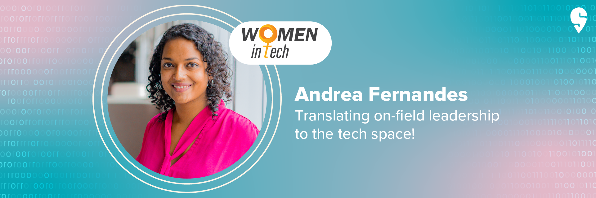
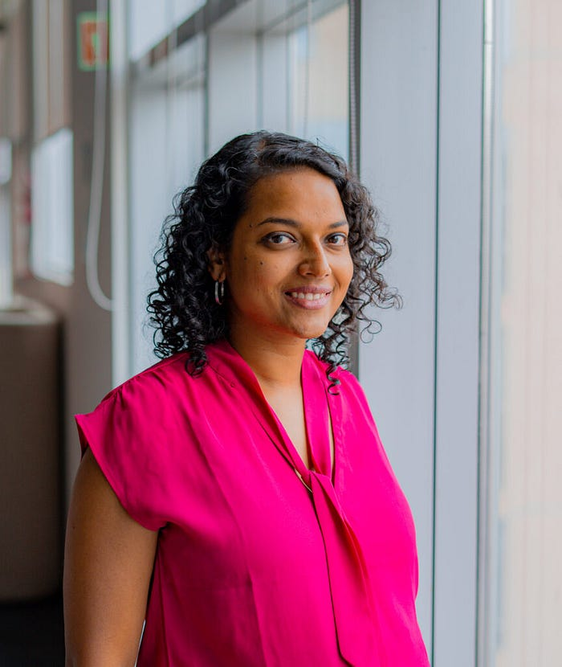

# All about the goals: Meet Andrea Fernandes, Swiggy’s Product head for checkout and payment

**_In this Women in Tech story, we have someone who is all about leveling the playing field_**_._

Some people make a good fit at their workplace, then there are those who embody a company’s very philosophy. Andrea Fernandes, the Head of Product for Checkout & Payment at [Swiggy](https://www.swiggy.com/app) undoubtedly falls in the latter category.

Personifying Swiggy’s “Sports team with a heart” philosophy, Andrea, an avid sports woman (she played Hockey at the national level) knows what it is to be a team player with, well, a heart.

Her career path that led to Swiggy, has been filled with tackles, hits, misses and obviously, brilliant goals. This is Andrea Fernandes’ story and here’s how she’s making a dent in the tech space.

[Women in Tech: Meet Swiggy’s Product head for checkout & payment](https://www.youtube.com/watch?v=XpSq5giTLBs)

**Unplanned victories**

Anyone can be a good sportsperson, but it takes someone who is grounded to lead a team to victory. Luckily for Swiggy, they’ve got Andrea on their side.

With her family roots in Goa, Andrea and her brother grew up between Mumbai & Pune.

Speaking about her childhood, she says,“Studies were not that important growing up, which was lucky for me. I played a lot of sports while I was in school and I think that shaped a lot of my life, my values and beliefs. My father was away from home quite often and my parents brought us up to be independent, always encouraging us to try our hand at new things. That’s also how I landed in product management. Product management was in its early stages when I started working, but I have loved it since day one. I’ve been doing it throughout. It’s still exciting, there’s still new stuff to learn, and it keeps me on my toes every day.

**Happy accidents.**

Sometimes, the best things in life are unplanned and Andrea’s career took off because of one such thing. “Product management happened by accident for me, but I believe most of the best things in life happen unplanned,” she says.

After finishing her education in a B-school, Andrea’s first job was at Airtel. “I was supposed to be working on finance; but Airtel was getting into mobile payments and looking out for folks, so I ended up in that team. And it was really cool because mobile payments was at a very nascent stage back then. I got to work closely with the RBI and with the industry to figure out what the shape of mobile payments should be, how we should look at different things.,” Andrea says.

That role set the ball rolling for Andrea’s professional journey. “As someone who’s seen digital payments right from the start — it feels really great to look back on the journey and realise that I have been part of something big,” Andrea says.

After her stint at Airtel, Andrea moved to Amazon, where she learnt the true meaning of “customer obsession”. “I really liked that concept — there I learnt how to be super-focussed on customers and what they need. That’s what I liked about Swiggy as well and that made me want to join Swiggy. I felt I could create a lot of impact here,” she says.

**Payback time.**

So how does Andrea’s role help Swiggy? “Simply put, my job is to bring in the money,” she says cheekily.

“My team owns the checkout & payment experience at Swiggy.. if you look at the customer’s journey of purchase, whether online or offline, the act of checkout and payment is the least liked; Because that’s where you are actually letting go of money. What we want to do is make it very simple and delightful. We strive to make the process seamless and in a way that makes it as much of a high as your entire shopping experience — from start to finish,” she adds.

So how does it feel like making a space in a fairly new area, one where you don’t get to see many women. She recounts, “It never struck me at the time, but when I look back now, I realise that I was often the only woman in the room. But I was fortunate enough to work with companies and teams that had an open culture and it didn’t matter who, what or where you came from.”

Andrea agrees that it is not always the case with other women. “It’s a known fact that women are less likely to speak up or raise their hands, so when leaders are conscious to nudge women (and men!) to step up, it makes a huge difference.”

What advice would you give to working women?

” I think women hold themselves to much higher expectations or standards. I think it’s important to realise that you don’t need to be perfect and you don’t need to know everything. It’s more important to show up. Just have more belief in yourself. Have more conviction in the fact that you will get better. And, just go for it!”

Andrea has been with Swiggy for a year and a half and she has been enjoying the experience. “It’s been interesting and I get to learn a lot here. What also really works for me is the [remote-friendly way of working](https://blog.swiggy.com/2022/03/25/what-work-looks-like-at-swiggy/). I am based in Mumbai and Swiggy is in Bangalore. I wouldn’t have had the chance to do this if this wasn’t the way of working. I think it works well for me and my team. Whenever we come to Bangalore, there is a lot of action, a lot of team bonding, outings and getting time to jam with people. It’s a great mix so far. While we are figuring it out, I think it’s going in the right direction. I am really excited to see how this evolves,” she says.

Speaking about life lessons she learnt from sports and how it carries into her work at Swiggy, Andrea says. “Sports teaches you so much about life. If you are playing a team sport (hockey for instance), you know the more you pass the ball the better your team’s chances of winning. So winning is a team effort and not something that only one person can do. The second, very important thing is actually failing. You lose a lot, you also win, but you become much more accepting of the failures. So, you don’t take them to heart as much. That’s something I think is great about sports.”

Andrea has always been someone who has loved finding solutions to problems, so It doesn’t come as a surprise that Andrea’s favourite [Swiggy Value is “do more with less”](https://blog.swiggy.com/2022/12/21/here-are-swiggys-values/). “Quite often we think that you need to have something very complex and very big to make an impact. But there is so much value in simplicity and I think that is overlooked. So, doing more with less means that you might figure out a tiny change and you will be surprised at the impact it can have on your business or your customer. ” she says.

Andrea has come a long way in her career, but one thing remains constant — she is a team player who has been setting a great example for women in the field.

---
**Tags:** Swiggy Life · Employee Stories · Women In Tech · Payments Technology · Product Management
