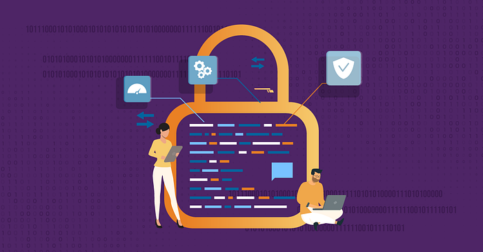
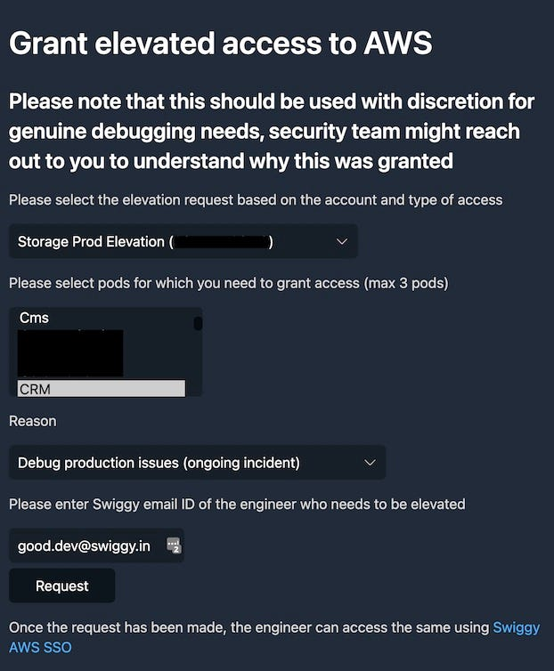

# All doors shall not lead to Production

One of the common problems with any startup is that early engineers have broad production access and over time the same is carried forward to new engineers, sometimes in the original unrestricted form and sometimes reduced but still wide enough to cause catastrophic changes in production. For an exponential growth startup like Swiggy, the problem had been more acute as multiple individuals inherited this wide access as we scaled our engineering team rapidly. We have now invested in building Shuttle — our continuous delivery platform and Logman — our centralized logging platform; gradually reducing the need for engineers to access production compute instances for deployment and debugging.

To address our production access needs, we implemented [AWS SSO](https://aws.amazon.com/single-sign-on/) backed by our corporate identity (Azure AD) and an in-house serverless application called Elevator for temporary privilege escalation. As a security best practice, we are integrating all our internal tools (SAAS or developed in-house) with SSO. We share some of the key learnings from deploying and migrating our entire AWS workload to the new solution.

## 1. Identify and harden a single source of truth

The most important tenet we agreed upon is to keep our corporate IDP as the source of truth for authentication and authorization. It is tempting to keep some privileged roles outside of SSO to have more control but this amounts to creating backdoors for access. Barring AWS root users, all the roles across all the accounts (production/non-production) including DBA & Network Administrator roles were migrated to the active directory. Regular access audits and a hardened SOP followed by the IT team along with guardrails based on team and designation from HRMS protect the access to privileged roles.

## 2. Consolidate & simplify roles

We decided to create no more than 20 roles across all the production and non-production accounts. For production accounts, a single role (ProductEngineering) which gives ViewOnly, SupportUser [managed job function](https://docs.aws.amazon.com/IAM/latest/UserGuide/access_policies_job-functions.html) and some additional permissions for observability and cost optimizations is auto-assigned to the bulk of engineers. Similarly, on non-production accounts a PowerUser role with a deny on IAM & Networking permissions is assigned to the engineers. Having a small set of roles allows us to keep the access uniform and enforce security guardrails like limiting permissions to devices connected to corporate networks etc on all the roles easily. More privileged roles like DBA, NetworkAdmin & SystemAdmin were also created for specific job functions. We try to use AWS-managed policies for job functions as much as possible with a Deny on some permissions to keep it more auditable. Notice that the [ReadOnlyAccess job function](https://docs.aws.amazon.com/IAM/latest/UserGuide/access_policies_job-functions.html#awsmp_readonlyaccess) is essentially a ReadAll and not safe for production as it gives read to all data, including customer PII data that might be held in an S3 or DDB, or Athena tables. All these roles are managed in a single terraform repository with the restrictions as modules that are applied to each permission set. An example below

## 3. Plan for temporary privilege escalation

Many teams have processes that require engineers to have elevated permissions for operations ranging from manual auto-scaling to reading DynamoDB tables. Over time, we would completely stop these processes and replace them with automation and improved observability. To ensure a smooth transition, we developed Elevator, a privilege escalation tool. The tool is basically a serverless application that allows managers to elevate the privilege of any developer to allow these operations. We organized the elevations into storage elevation (read data from S3, DDB) and compute elevation (change auto-scaling policy, execute lambdas, terminate instances) to keep it simple. Additionally, the elevated roles are scoped by a “pod” tag to keep the blast radius small. Finally, elevations are temporary and after a wait of 3 hours, they auto-expire. All elevations are tracked and audited to reduce the permission set and help us develop simpler automation for oft-repeated tasks.

## 4. Use ABAC to fine-tune the access

Limiting the number of roles has an unintended effect of increasing the blast radius of a role. For example, a single ProductEngineering role could allow access to all the EC2 instances. To limit the scope, we use [ABAC](https://docs.aws.amazon.com/singlesignon/latest/userguide/abac.html) based on [tags](https://docs.aws.amazon.com/general/latest/gr/aws_tagging.html) on every resource. Since our engineering team is organized into orgs (e.g. storefront, systems engineering, finance) and pods, which are typically 4–6 member teams working on a focussed set of microservices (e.g. security-engineering, crm), we decided to use “org” and “pod” tags to do the access control. Using these tags had an interesting side effect — Post ABAC rollout, we have seen many requests to tag the applications with correct org and pod (including typo corrections). This has helped with better cost attributions and cost control. Engineers now have an incentive to tag all their applications correctly if they need to access them for debugging purposes. Integrating AWS SSO and Azure was not without challenges, our engineers sometimes work in multiple teams (pods) which is not possible to express in the existing integration. We had to build a custom integration to work around some of these limitations. We will have a follow-up blog with a deep dive into the implementation.

---

Migrating to SSO was an important milestone for us, we were able to remove hundreds of IAM users from AWS. Since SSO enforces temporary credentials for CLI/SDK access, we have been able to eliminate the risk of infrastructure compromise due to leaked developer credentials or developers hardcoding their keys in scripts. We can now use our corporate identity to log in to AWS — one less password in the password manager (hopefully you don’t rely on remembering your passwords or worse still reusing an existing one). Hope this will help others to take this step toward operating a more secure production infrastructure.

---
**Tags:** Security · Infrastructure As Code · Infra Security · Swiggy Engineering · Access Control
