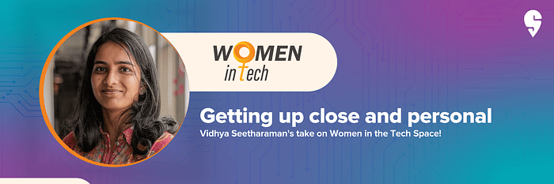
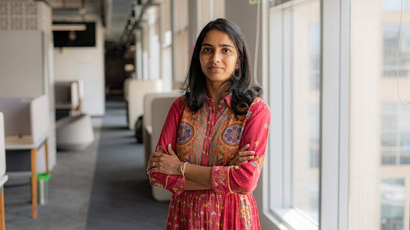

# All things tech with Swiggy’s Vidhya Seetharaman

The first thing that strikes you about Vidhya Seetharaman is that there is hardly anyone that she doesn’t know on the tech teams at[ Swiggy](https://www.swiggy.com/app). And if she doesn’t, she’ll find out about them within a matter of time — Resourceful and helpful, Vidhya is a friend and ally everyone should have.

At first, she comes across as soft-spoken, but the energy Vidhya brings to work and her projects remains unmatched.

This is the story of Vidhya Seetharaman, Chief of Staff to the CTO at Swiggy, mother to a toddler and two cats (one of who was recently adopted) and a leader who is making space for more women in the tech industry.

**One decision that changed everything**

A little more than 10 years ago, Vidhya was at a crossroad in life. Having done her masters at the Indiana University, Kelley School of Business and worked in the United States for a while, she had to decide if she wanted to come back home, or continue working there.

“I really wanted to be sure of my US journey before I embarked on it. And I wanted to give India a chance. My family is based out of Tamil Nadu and my parents are here, so I just had to make up my mind. In 2011, things were very different. It was a scary time deciding to go back to India,” she says.

Despite what a lot of people had to say, the move back to India proved to be the best thing that happened. Not only did Vidhya go on to work in some “really good companies including Swiggy”, she got married, had a son and then adopted two cats.

She says, “Moving back was a tough decision. You have to rely on your network to get a job. I wasn’t looking for anything in engineering, I wanted to do some consulting work. Since none of my friends were from this field, it was hard. I looked for jobs across Chennai, but nothing worked out.” As luck would have it, Vidhya met one of her mentors from her Masters programme and he put her in touch with someone. A few interviews later, Vidhya landed her first job in Bangalore at Infosys Consulting.

How did the interest in business come about? “I come from a family of people who owned their own businesses, so the interest in the subject was a no brainer,” she says.

“My father was a share broker, my sister and I grew up with a lot of stock market talk. Now everybody talks about IPOs and share markets, but that has been my childhood. We would get annual reports of companies and back then they would come in these physical copies. We would sit and read all of that. Business came naturally, and as I grew older I started liking tech too. So I ended up doing a mix of both,” she adds.

Post her stint with Infosys Consulting, Vidhya went on to work with a startup called Gudville. “We struggled to just find the right product market fit. But it was an interesting experience working there, I got to don many hats,” she says.

After a few years of working there, it was then that Vidhya applied for a role at Swiggy. “I came into the office for a full day of interviews. What blew me away was the kind of energy at the office. All of the interviewers I met were smart people who were also humble. To be able to work with those kinds of people I think, was very interesting for me and I didn’t want to let that chance go by,” she reminisces.

**A humble path to success**

Vidhya holds a leadership position at Swiggy, but she started at a different level and slowly grew in her career at Swiggy. “It all started with a random LinkedIn message to Anuj Rathi, who is currently the Senior Vice President — Product. He liked my profile and called me for an interview. I got the job, worked under him and that’s how it all started,” she says.

It was Anuj who had told Vidhya that with her skillsets she would be great at programme management.

As Chief of Staff to the Chief Technology Officer Dale Vaz, Vidhya’s role keeps her on her toes. “There’s rarely a dull moment at work. My focus is on supporting our talent. This could be external focused initiatives around our tech branding where we solve problems at scale by talking about the work we do, the learnings we have, so that talent everywhere can learn from it. Or even internal initiatives, where we focus on upskilling our talent on the latest topics whether it’s in respect to design principles or coding best practices. So I think working with our talent, making sure they are able to bring their best self to work, that’s a key charter that I work on and I think that supports Swiggy in its long journey as well,” Vidhya says.

**Women leading tech**

Addressing the wide gender gap in the tech space, Vidhya says, “These days you see a lot of women studying tech in their undergrad or at the Master’s level. But once they graduate, the gap seems to suddenly widen. Sometimes it’s because of marriage, sometimes children. I’ve also noticed that if women do start working, a drop off happens when they are going from a junior to a mid-level position. When the drop off happens at these levels, how can one focus on building more female leaders? That becomes another issue, you just don’t get to see many female leaders. What that means for the others is that, you can’t be what you don’t see and that’s a vicious circle.

“These are the touchpoints that companies need to focus on to reduce the gender gap in the tech space,” she adds.

Vidhya credits [Swiggy’s Future of Work Mandates](https://www.youtube.com/watch?v=5gnRbRT9cTE&list=PLsNXXrsot1tN03jSc4vAXbaUnB-l8aSJ9) that have helped her spend quality time with her family. “I fall under the second mandate, which means I work from home. It’s been very critical for my career to have this opportunity and to have a flexible workplace. As a mother of a toddler, it gives me a lot of comfort to be at home and around my son, while also fulfilling my work commitments. It’s been absolutely life changing for me. That’s something that will help keep more women in the workforce, especially those who want to be around their children,” she says.

How were things for her when she was making the transition to a leadership position? “I think what has worked for me, personally, was to just concentrate on doing good work. When that gives you happiness, you’re able to prioritise enough. Have the necessary conversations to make it easy for you to balance work as well as other responsibilities. So my only advice to women would be to just find the work that you really love and enjoy, and all the other things will kind of fall in place.”

Vidhya has her priorities set. While family plays a huge role in her life, work keeps her going and with her resourcefulness, it’s no surprise that her favourite [Swiggy Value is, “Do more with less”](https://blog.swiggy.com/2022/12/21/here-are-swiggys-values/).

What’s a day in the life of Vidhya like? She says, “I start my day with chai, news and any top of mind activities. Breakfast with family, quickly freshen up and get to my work desk. Sift through emails, slack chats and plan my day’s tasks. Afternoons are my most productive as the house is quiet (a.k.a child is asleep). I try to wrap by 6:30–7 pm and then spend time with family right through dinner.”

From consulting to product management and then the Chief of Staff, Vidhya’s career graph has only kept going higher. While her professional and personal life are flying high, if there’s one thing that keeps her grounded, she says while laughing, “It is definitely my cats!”

_Story by Priyanka Praveen_

---
**Tags:** Women In Tech · Swiggy Tech · Chief Of Staff · Career Paths · Women Leaders
