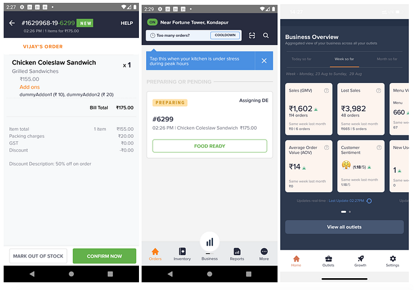
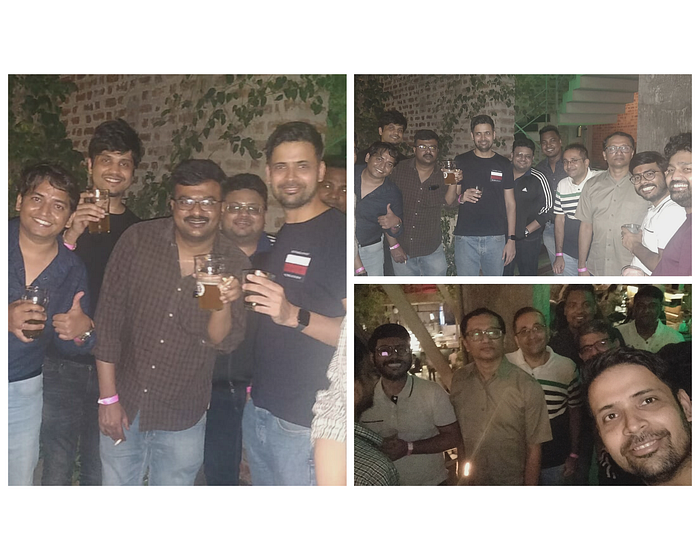

# All you need to know about All Things Supply (ATS)

**_By Ashish Arora, VP of ATS Tech Team at Swiggy_**

We do a lot of things at ATS. That’s why we’re literally called All Things Supply, because the nature of our entire function is multi-pronged. There’s a lot we do, but let’s break it down for you. Our work is essentially categorised into and carried out by four core teams.

Our first is the **Vendor Team.** From onboarding of restaurants and real-time fulfilment of orders, to building different apps for the restaurant partners (RPs) based on their varied personas and providing APIs for integration with POS Terminals used by Restaurants — they handle everything to do with the restaurant partner experience.

Something that seems simple, such as getting orders to and accepted by restaurants, can actually be a complex problem to solve. Simply because the apps could be in the background or just not be running. I believe that this is one of our key driving forces — exciting problem statements that require us to think big and on our feet. For instance, we need to keep reassessing and enhancing the flows to ensure robustness and reliability, making it a domain that is constantly revised and upgraded. We also need to deal with Service Recovery when Restaurants are closed unexpectedly or are Out of Stock for some items.

Not just that, we help Restaurant Owners get insights into their business and enable them to run Discounting and Ad campaigns using the Restaurant Owner App.

*Few screens from our Owner app*

Next up is the **Finance Team** that is responsible for all the money movement and reconciliation across Swiggy. Whether it’s vendor and DE pay-outs or the process of building ledgers across Delivery Partners and Restaurant Partners, or finally building the Accounting System for Swiggy, they do it all.

It’s not an easy job by any means, simply because it involves the need for 100% accuracy. The biggest challenge in this area is to keep track of every single penny across Swiggy and reconcile the sum of every transaction with what reflects in the bank accounts. For example, whenever an order comes in, the team would have to assess a range of parameters like commissions and discount share, carry out all the computations, collate the data, make due deductions where required and finally reach the pay-out stage. This can’t be a 99.9% or even a 99.99% game. The team is always accountable for nothing less than a 100% reconciliation.

This team also builds multi-tenant platforms for capabilities like Invoicing, Flexible Commissions and Ledgers.

*Created from undraw.co*

Our third team is the **Trust & Safety or Fraud Team**, a function that is built firmly on seamless machine learning processes. Let me break it down. The Swiggy system is essentially complex in terms of fraud management and risk mitigation. This is largely because in a three-way ecosystem (restaurant-delivery partner-consumer) there are infinite permutations and combinations that get added to the mix. Fraud could be committed by one of these touchpoints or could even result from a collusion between two of them. Another determining factor here is that we deal with the real-time delivery of perishable items. This means that there is zero scope for reverse logistics.

So, we work with the data science team to build models and track patterns that help identify the propensity for fraud for every single transaction. Our ultimate aim is to prevent fraudsters from taking advantage of the system and abusing policies (Read more on our efforts to curb Cash loss [here](./curbing-cod-loss-with-technology-ecf554c759a3.md)[).](./curbing-cod-loss-with-technology-ecf554c759a3.md).) Again, because it’s a three-way network, this can be quite a task. Because every time a fraud is committed, it needs to be attributed to someone. And of course, there are genuine cases, where consumers can get bad orders sometimes, therefore demanding a refund. So, not only do we need to ensure that genuine customer painpoints are addressed, we also need to practice empathy towards DPs who may get wrongfully caught on the receiving end of a fraudster’s modus operandi. That’s where machine learning is absolutely indispensable, allowing us to deep-dive into historical data, finding patterns and then determining whether a particular claim is fraudulent or genuine, and so much more.

Before I come to the fourth team, I’d like to devote a few lines to exactly why all of these details are important. The reason is, quite simply, that at Swiggy I have realised how aware people are of why they’re doing what they’re doing. We all know the larger goal and the bigger purpose; we know where we fit into the big picture. And to pursue that shared vision, we’re constantly on the look-out for better solutions, which is why we work with cutting-edge tech on a daily basis, to build the best answers to some of the business’ most pressing problems. And that’s precisely why, the ATS team’s responsibilities can’t just be summed up by covering a basic daily task-sheet. It requires a thorough and deep understanding of why we’re doing what we’re doing at every juncture.

What you have read is just the tip of the iceberg when it comes to the amazing work we have been doing at ATS. But that’s not it, there is a lot more digging that we are doing in the space of enabling restaurant experiences. What’s more exciting, and something you should be looking forward to, is the upcoming Swiggy Dev centre at Gurgaon where we are building a distinctive talent base to help solve problem statements for partner experiences. [**Check out the opportunities here**](https://careers.swiggy.com/#/careers?career_page_category=Technology&search=bu:supply).

Now that brings me to the fourth team. We’re still building this team as we explore new business opportunities and revenue lines. The more we understand our consumers’ needs for unparalleled convenience, the more certain we become about our next steps.

That’s where you come in.

We want you onboard — for a whole host of fascinating roles. For now, we have three key roles to start off with. We’re looking for people with an unquenchable thirst for knowledge, experimentation, innovation and opportunities to fill the roles of Senior Engineering Manager, Software Development Engineer III (Frontend), and Software Development Engineer III (Backend).

If the story of the ATS mission intrigued you, and you successfully read through till the end, then check out our [Careers Page](https://careers.swiggy.com/#/careers?career_page_category=Technology&search=bu:supply) for a role that will fit you best. It’s time to become a Swiggster. Are you ready to begin?

*Photo by Danielle MacInnes on Unsplash*

And did we mention, this team knows how to have fun? Check out a few pics from our recent team outing!

[Catch Part 2 for this series here](./all-you-need-to-know-about-all-things-supply-part-2-2e04b0df95f2.md)

---
**Tags:** Swiggy Engineering · Careers · Hiring · Restaurantsoftware · Technology
