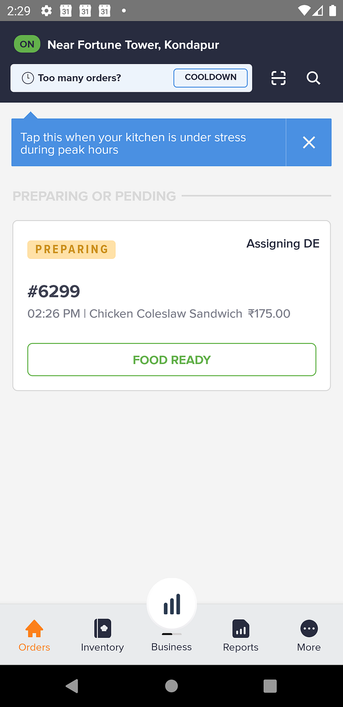
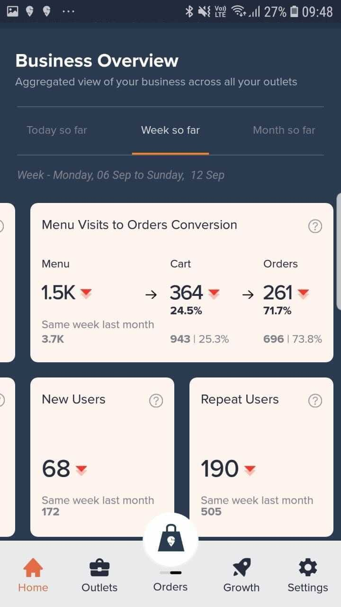
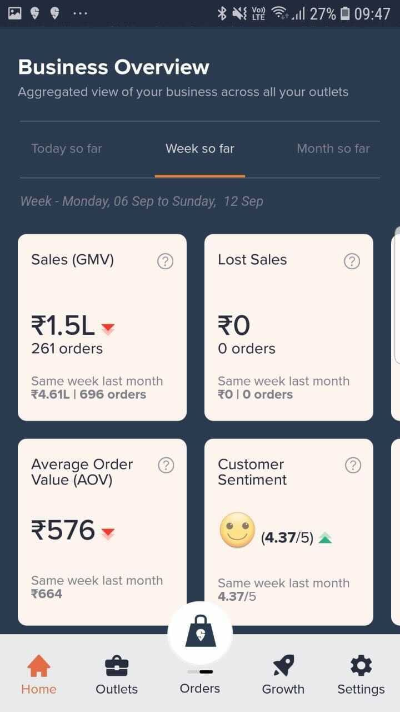

# All you need to know about All Things Supply — Part 2

**By Bagirath Krishnamachari, Director of Engineering @ Swiggy**

If you ask me what the All Things Supply (hereafter referred to as the extremely catchy ‘ATS’) Team does, then I’d have to take you through the entire lifecycle of a restaurant partner at Swiggy. From workflow definition in the onboarding stage, to building scalable platforms to manage orders and all the way upto building apps for the restaurant staff and owners managing their business on Swiggy — that’s the ATS charter. ([Read Part 1 of the overview here](./all-you-need-to-know-about-all-things-supply-ats-88d2a776bf3e.md))

Does it stop there? No, not really. There’s a constant revisitation of processes, personas, and app interfaces to continually make the Restaurant Experience (RX) seamless and convenient.

**So, all of this for that one Swiggy app?**

Well, no — Let’s break it down. Just like Delivery Partners have their own app designed specifically for them, we’ve also built an app especially for restaurants. As part of their day-to-day operations, restaurant staff need to manage every part of an order’s lifecycle from confirming an order to indicating that the food is ready for pick up. Additionally, they need to manage other aspects of their business like availability of items, their operational hours, reaching out to consumers if needed etc. This is a single app for them to be able to do all of this and more. The restaurant app comes in both mobile and desktop flavors. This makes sure we have all our bases covered, especially in case the restaurant doesn’t have a desktop computer.

**But why even build a desktop version? Everyone’s gone mobile anyway!**

So, while the mobile version provides us with a low barrier to entry simply because mobile phones are ubiquitous, desktops possess the advantage of higher screen real estate which could, depending on the number of daily orders they receive, be beneficial for some restaurants.

**Do all restaurant partners need to use an app for order management?**

No, we do have multiple partners who use 3rd party POS terminals and they are integrated with our platform via APIs. These APIs allow us to provide the same capabilities available on our app to our POS integrated partners as well.

---

So, that sums up the app flavors. Now, the next stop in the ATS journey — personas. The first important thing to understand is why we even need to build different personas for the restaurant side of things. It’s just a matter of logging in and looking at the orders you’ve received, right?

Or is it?

So, here’s the rationale behind it all. The restaurant personas we build are essentially formulated to mirror real life. Imagine this: You call up a restaurant. Someone sitting near the phone picks up and asks you for your order. You give it to them. They take down your details, hang up and convey the order to another person. That person goes into the kitchen and relays your order to the people who are actually responsible for making the food you’re waiting for at home. So, there’s clearly a chain of communication, which means there’s a bunch of different roles involved in your order finally being executed and made ready for delivery.

**That’s what personas do — they help us create app interfaces that cater to different roles, providing a specific role with the specific information only THAT role needs.**

*Partner App interface*

For instance, the supervisor/manager is one persona, and the person who receives the order in the kitchen and proceeds to fulfill it is a separate persona altogether. Of course, there are many cases in which just one person assumes all the roles and responsibilities. The smaller restaurants, the bakeries, the one-person businesses — they don’t need separate personas, but when there are dedicated roles, it’s absolutely imperative to have this persona bifurcation for smoother functioning.

And that brings us to the third key persona — that of the restaurant owner. With the owner, there’s a lot more to consider, because something as simple as the physical separation between owner and restaurant is an important gap to bridge, especially when one owner controls multiple kitchens across locations.

Now, the first important thing to remember here is that the priorities of an owner are completely different from that of a supervisor or of someone in the kitchen. A minute-by-minute view of their daily operations alone may not give them the holistic picture they need. Not just that; a lot of information provided to owners is of no use to the other personas, so there’s no point loading one app with so much information, thereby unnecessarily complicating the UX. Because once the UX gets messy, it’s a domino effect and everything from login to authentication becomes complicated as a result.

**And that’s why we built a separate app for owners!**

*Business overview and analytics page for Owners*

We hold restaurants accountable for their performance based on multiple metrics from quality and efficiency to the number of bad orders (essentially when a customer is unhappy with an order due to quality issues or delays and other such reasons). So it’s the responsibility of the owner to keep track of what’s happening and what needs to be improved upon. A dedicated app that not lays out all the metrics across kitchens for restaurant owners to access and evaluate at one go but also enables them to engage with growth levers like promotions and ad campaigns makes it that much easier for restaurants to manage and grow their business on our platform.

After all, that is the ultimate objective — making processes simpler for everyone involved. And a large part of this simplification is to create more and more personas based on who needs what information, and who should have access to what details.

A lot of internal research and analysis is also underway to identify and zero in on the important personas for the future. Why? Because the more personalized we can make the RX, the better the CX will get.

And that’s how Team ATS is forever working towards making All Things Seamless!

If the story of the ATS mission intrigued you, then check out our [Careers Page](https://careers.swiggy.com/#/careers?career_page_category=Technology&search=bu:supply) for a role that will fit you best!

---
**Tags:** Swiggy Engineering · Restaurant Pos Software · Dashboard · Hiring
