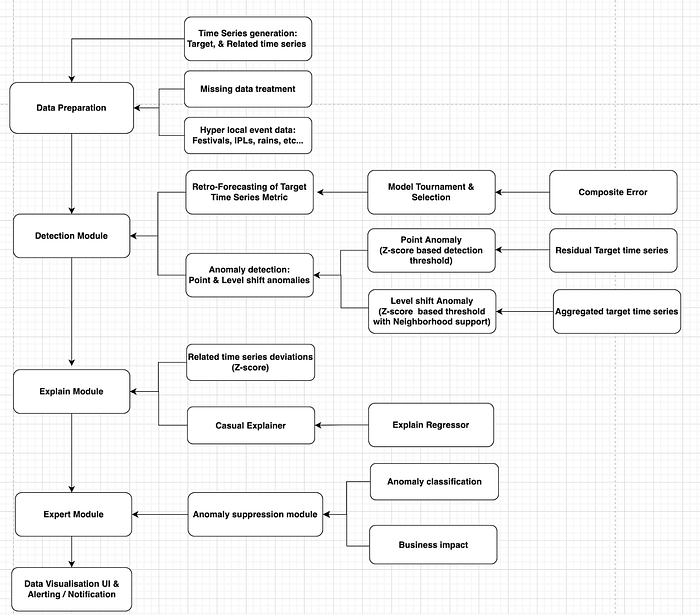
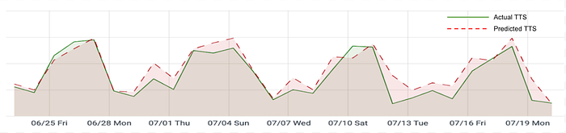
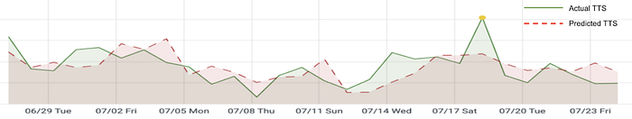
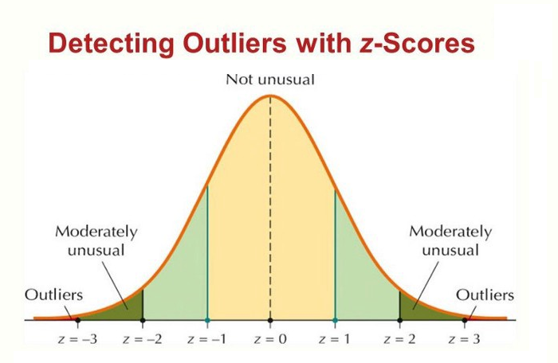
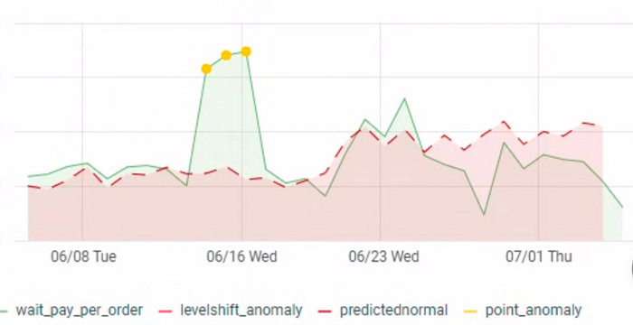

# An end to end system to detect and explain anomalies in operational metrics

**Co-authored with **[**Rajesh Singh**](https://www.linkedin.com/in/rajesh-singh-2b65b94/)

1. **Introduction**

Food delivery is a complex hyperlocal business, spread over thousands of geographical zones across India. Here zones represent smaller geographical areas. Every day, our business team is tracking and reacting to metrics that monitor the health of the business. These metrics are first level (L1) metrics like Cost Per Delivery (CPD) by zone at different time granularities and multiple L2 and L3 metrics like Daily Incentives, Minimum Guarantees, etc. which influence L1 metrics. Anomalous changes in these metrics need to be detected and corrective action needs to be taken to prevent potential business loss.

However, RCAs of anomalies typically take a nontrivial amount of time and effort. Also, defining generic one-size-fits-all thresholds to detect anomalies is not possible as there exist influences from multiple other external and lower level metrics.

In this blog, we will cover a novel approach to detecting spatiotemporal anomalies in a time-series metric using a forecasting approach. The forecasting models are chosen using a ‘tournament’ method where multiple models compete to provide forecasts (and hence help detect anomalies) for different spatiotemporal units.

This blog is divided into the following sections- Data Preparation module, Anomaly Detection module, Anomaly Explanation module, Expert System module.

For the sake of brevity we are going to use the following abbreviations in this article:

- SB (Smart Business): An end-to-end anomaly detection & explain system
- TTS (Target Time Series): The metric on which we are detecting an anomaly
- RTS (Related Time Series): The set of metrics that can influence the TTS
- [MAPE](https://en.wikipedia.org/wiki/Mean_absolute_percentage_error): Mean absolute precision error
- [WMAPE](https://en.wikipedia.org/wiki/WMAPE#:~:text=WMAPE%20(sometimes%20spelled%20wMAPE)%20stands,are%20weighted%20by%20sales%20volume).): Weighted mean absolute precision error
- [SMAPE](https://en.wikipedia.org/wiki/Symmetric_mean_absolute_percentage_error): Symmetric mean absolute precision error

*Figure 1: An end to end system to detect and explain anomalies in operational metrics*

2. **Data Preparation module**

In this module, SB does data validations like data-type checks and preprocessing steps like removing [zone x time] granularities for which more than a certain percentage of observations are missing, removing [zone x time] granularities whose contribution to the platform is less than a threshold. These steps help in handling the sparsity in the data and for robust downstream predictions.

3. **Anomaly Detection module**

As is the case with most operational metrics in marketplaces, our TTS metrics have strong time-series properties like level, trend, seasonality, and cyclic components (Figure 2). Most TTS is also influenced by external factors like rains, festivals, events, and RTS like demand volumes, delivery personnel availability, etc.

*Figure 2: A TTS with no anomaly*

Therefore we employed multivariate forecasting algorithms which can tackle the spatial (RTS, external variables) and temporal nature of the signal and be able to predict the TTS. We are interested in inferring whether the last time-interval TTS point is anomalous or not. We currently support time intervals ranging from minutes to weeks.

To detect an anomaly, we start with the residual, i.e, the difference between the actual and the predicted. We empirically observed that the residuals for most of our metrics follow a normal distribution with zero mean and a variable standard deviation. Therefore, we use [z-score](https://en.wikipedia.org/wiki/Standard_score) (refer to this link for more info) statistics to flag anomalies, as you can see in Figures 3 & 4.

*Figure 3: A TTS with anomaly*

*Figure 4: Detecting outliers with z-scores. Image source: https://laptrinhx.com/*

**3.1 Multivariate time series forecasting of a TTS**

**3.1.1. Input Vs. Explain RTS  
**As is the case with most time series forecasting, the changes in TTS can be explained by the past behavior of TTS itself as well as by RTS. We further divide RTS into two types — what we call input and explain metrics. Input metrics are the ones that are, typically/ largely, not influenced/ controlled by our business configurations (for example, organic demand, rains, festivals, sporting events, etc.). Explain metrics are (reasonably) directly influenced by our business configurations and systems, any unintentional changes in these could have a detrimental impact on the TTS (for example, how delivery partners are incentivized to login). Abnormal changes in TTS due to changes in input metrics can be considered data anomalies. On the other hand, if they are due to explain metrics, then they are more likely to be business anomalies. First-cut RCA for business anomalies can hence be powered by explain metrics.

Since most input metrics are outside the control of a business, any change in TTS due to input metric change is not considered an anomaly. Therefore, we suppress these data anomalies by modeling the TTS as a function of input metrics, thereby any expected variability in the TTS is modeled out/already explained by the input metrics. But in case the residual of the model is very high (z-score beyond a threshold), then SB hypothesizes that this is due to a business anomaly.

**3.1.2 Model Tournament  
**As described in the previous section, SB uses the residuals of the model to detect a business anomaly in the TTS. So, in order to have an effective anomaly detection step, it is necessary to have an accurate predictive model.

With our data, we observed heterogeneous behavior among different zones. For example, in some zones, recency is more important for predictions, while for some other zones long term and short-term trends are more important and for some zones, external events influence the predictions. So modeling different aspects with a single model was found to be inadequate in terms of accuracy.

To improve the overall TTS prediction accuracy as measured in terms of WMAPE, we devised a novel method which we are referring to as a model tournament. Here, a suite of models competes to provide a prediction for a given zone and time interval. Model tournament picks a model M, which is found to be consistently performing better than the other models in the time period T-14 to T-1 in that zone. Our experiments found that adopting model tournaments as a way to select the best model for a given zone led to 20% lower WMAPE vs. using a single best model across all the zones.

The model tournament constitutes a suite of k models competing against each other at a zone level. The model suite consists of different types of algorithms, some are univariate forecasting models like ETS, ARIMA and some are multivariate forecasting models like AWS DeepAR, FB Prophet and each of the model variants looks back at various training lengths. Let’s say there are 4 different types of algorithms and 3 different training data lengths, in total we can enumerate 12 different models which compete against each other in a model tournament for a _given_ zone. However, since we have to do this for hundreds of zones, a way to cut down the number of models participating in the tournament was necessary. This is where the next section comes in.

**3.1.3 Model subset selection  
**In a tournament with say _M_ different algorithms and _N_ different training lengths and _K_ zones, we need to train and test _M _x_ N _x_ K_ models, which is impractical. Instead, we select a random subset of 3 models to compete in the tournament and choose the best (WMAPE) performing one at the zone level. Empirically we found that the models selected by this method were little-to-no worse than the best model selected by the exhaustive search. We use this method to select new/updated models every two weeks. An interesting observation from this approach was that the best performing tournament of size _k_ need not be the top _k_ best performing models, but it is the top _k_ best complementing models. In the complementing model subset, each model outperforms others on pockets of zones.

**3.2 Level Shift anomaly detection**

Level shift aka change-point in a time series is the point from where a slow or sudden change in the trend is observed and after that point, the time series values start to operate on a different level altogether. In statistical terms, mean values of time series change after that point. The last point until which change in the mean is observed can define the length of level shift.

Similar to point anomalies, we detect level shift anomalies also in the residual space. Positive or negative residuals represent over-prediction or under-prediction for TTS and a sequence of continuous over-prediction or under-prediction indicates a level shift. However, we need to make this definition robust against random variations in the residuals. We do this by defining a random-variation band or what we call a baseband around the residuals. We ignore any over/under predictions in this band. So a level shift is a sequence of over/under predictions outside this baseband (an example in Figure 5).

*Figure 5: Level shift anomaly*

**4. Explanation module**

As described previously, RCAs for the business anomalies are powered by explain metrics. The Explain module considers the following factors in rank-ordering the explain metrics: 1) deviation b) importance with respect to the TTS c) percentage contribution to the explainability of TTS.

**SB **computes the expected value of explain metrics with univariate forecasting and their respective residuals and z-scores. We devised the following approaches to explain an anomaly: the first one is based on the z-score of explain metrics, which we are referring to as z-explainer; the second one models the TTS residuals against the explain metric residuals which we refer to as an explain regressor.

The z-explainer rank orders the explain metrics by their absolute z-scores. The main advantage of this approach is that it captures the deviation in explain metrics and is easy to understand. But it does not guarantee the anomaly in the TTS is due to deviation in explain metrics.

The explain regressor regresses the TTS z-score against the explain metrics’ z-scores. The magnitude of the regression coefficients gives the relative importance of RTS in explaining a business anomaly.

Explain regressor, computes the relative importance of each explain metric by weighting explain metric’s z-score with its regression coefficient to explain an anomalous observation. Normalized versions of these values can be considered as percentage explanations by explain metrics.

**5. Expert System module**

We understand that no anomaly detection system can be 100% accurate, there are bound to be false positives or non-actionable anomalies. For example, when it rains in a zone, a surge might be offered to incentivize delivery partners to log in. Because it is not always possible to reliably get this additional (rain) signal, the SB might flag this as an anomaly but for the Ops team, this was an intentional change and not really an anomaly. To handle such false positives, SB maintains a list of suppression rules for a given (or all) metric(s).

**6. Conclusion**

The system described in this blog has been in production for over a year across a suite of TTS and has flagged a number of actionable anomalies. These anomalies are validated and acted by the Ops team which in turn helps us with precision calculation. We continue to work on various aspects of this system — reducing the dependency on proprietary models, adding more spatiotemporal granularities, developing the forecasting engine as its own standalone product, etc.

**Acknowledgments**: SB wouldn’t be possible without the persistent efforts of Rakshit Agarwal, Varun Jampala, Chaitanya Basava, Devdath Narayan, Deepak Jindal and many others.

---
**Tags:** Anomaly Detection · Statistics · Z Score · Forecasting · Swiggy Data Science
