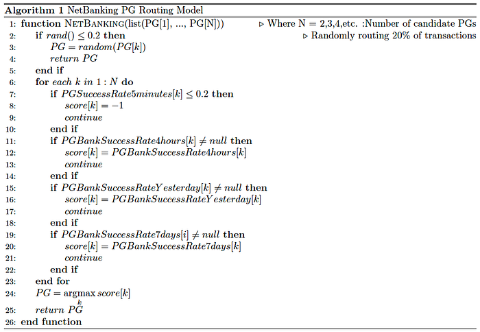
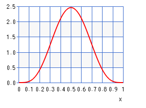
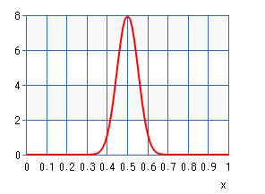
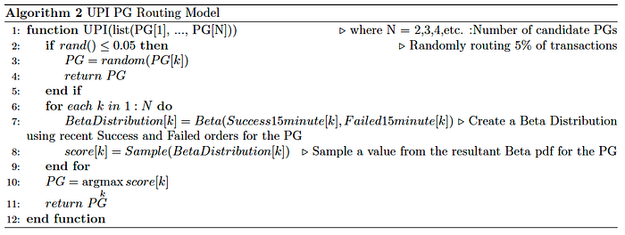
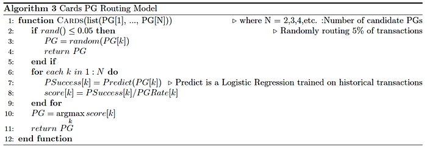
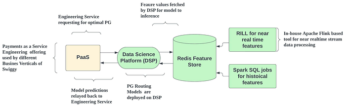

# An ML approach for routing payment transactions

Co-authored with [Ashay Tamhane](https://www.linkedin.com/in/ashaytamhane/).

Behind every online payment transaction at Swiggy, an ML model routes the transaction to one among the available payment gateways (PGs) to meet specific objectives. A payment gateway (PG) is a payment service provider (PSP) that facilitates payment by transferring information between a portal (in this case, the Swiggy app/website) and the front-end processor or acquiring bank.

Swiggy accepts a variety of payment methods, viz. Card — debit/credit, UPI, net banking, wallets, etc. Most of these payment methods have a set of PGs responsible for fulfilling the transaction. A failed payment experience is an undesirable outcome as it can lead to poor customer experience and even result in customers dropping off from Swiggy. Hence, a data science problem arises for the optimal routing of a transaction to a PG to improve the Payment Success Rate (PSR) and meet other specific objectives.

The optimal routing problem is relevant for the following three payment methods.

1. Netbanking
2. UPI
3. Card

We have developed three different ML models (one model for one payment method) for PG routing use cases. This design choice was made because of two reasons: (1) The same PG can potentially have differential performances across different payment methods, and (2) the eligible PGs for each of these payment methods are different. This blog will discuss these three PG routing models in detail.

## The Netbanking PG Routing Model

The net banking PG routing model aims to route each transaction to the best PG to maximise the PSR of net banking transactions. To meet this objective, we explored the key ingredients to help us predict the best PG for each transaction. We identified that the success rate trend of the bank with each PG would be a key factor for deciding the optimal routing. For example, suppose a customer with a Bank-A account wants to make a transaction. In that case, the success rate trend of Bank-A with PG1, PG2, etc., in the previous x hours can give a reasonable estimate of each PG’s potential to complete a Bank-A transaction successfully. An additional concern arises about net banking transactions being available for each bank and PG combination in the previous x hours. Hence we have converged to an explore-exploit (epsilon-greedy) capability for routing.

The exploit part is a rule-based model which uses PG, Bank level success rates in the previous 4 hours, one day, and seven days and PG-level success rates in the previous five minutes. The rule-based model returns a score for each PG based on the most recent available success rate value. The transaction is then routed to the PG with the highest score. The exploration logic allocates each transaction to one of the available PGs uniformly at random and helps in providing a reasonable estimate of the success rate of all the PGs at all times. The value of epsilon is determined based on an analysis of minute-level transaction trends. We found that 20% exploration would help estimate the top banks’ PG-level success rate. The explore model also helps collect unbiased data that can be used for model improvements and evaluation, whereas the exploit model identifies the best PG to optimise the overall PSR of net banking transactions.

*Algorithm 1: Netbanking PG Routing*

## The UPI PG Routing Model

UPI transactions were routed using no particular logic, essentially randomly, before data-backed approaches were introduced. Upon evaluating the success rate trends of the available UPI PGs, it was found that there is a significant difference between the various PGs’ success rates. This observation motivated the usage of a lightweight ML model which can power UPI PG routing.

Our routing approach uses the technique of sampling from a Beta Distribution to score PGs. The most common use of Beta distribution is to model the uncertainty about the probability of success of a random experiment. In this case, the random experiment is routing a transaction to a PG, and the outcome is the success or failed signal resulting from this routing. We have used the number of success and failed orders for each PG in the recent 15 minutes as alpha and beta parameters of the Beta Distribution for that PG. A value is sampled from the resulting Beta Distribution to estimate the PG’s success probability. We then route the transaction to the PG with the highest sampled value.

For example, consider a case where for PG1, we observed SuccessOrders = 5 and FailedOrders = 5 in the previous 15 minutes.

The resulting beta distribution (the Probability Density Function (PDF) for the Beta Distribution) would be as shown below, where we have the probability of success on the X-axis. On the Y-axis, we have the density. A value will be sampled from this distribution which will be used as the score for PG1.

*Figure 1: Distribution 1 = Beta(5,5)*

Now, for PG2, we observed that in the previous 15 minutes SuccessOrders = 50, FailedOrders = 50, the resulting Beta Distribution would be as below.

*Figure 2: Distribution 2= Beta(50,50)*

It can be observed that the mean of both distributions is 0.5, but when sampling values, the variance of the sampled values would be lesser in the case of the second distribution compared to the first distribution. This inherent nature results in high exploration when fewer transactions are routed via a PG (PG1 in this case) and more exploitation when more transactions are routed via that PG (PG2 in this case). Such behaviour is suited for PG routing use case as it helps intelligently modulate transactions across different PGs. We also randomly route 5% of total transactions to collect unbiased data for model improvements and evaluation.

*Algorithm 2: UPI PG Routing*

In an A/B experiment, we observed that the UPI PG Routing model resulted in a 1.5 percentage improvement in the PSR and a 0.25 percentage improvement in a metric related to conversions.

## The Cards PG routing Model

This is a multi-objective model responsible for routing each card transaction to one of the available PGs. The initial version of the Cards PG routing model was a rule-based logic similar to the net banking PG routing model. The next version was a Machine Learning (ML) model. The ML algorithm is a GBT model trained on historical data and uses near real-time and historical success rate trends for each card attribute and PG combination to predict the probability of success given the features and PG. The model predicts four scores for each transaction; each score corresponds to the likelihood of success for each PG. The transaction is then routed to the PG with the highest probability of success.

Later we adopted a post-processing step to account for PG Rate in the routing approach. This step penalises PGs with high cost by dividing the PG’s probability of success by the PG rate, thus optimising for both PSR and the PG rate. We observed in an A/B experiment that the ML model with cost optimisation results in a ~7% reduction in PG cost while maintaining the same Payment Success Rate compared to a rule-based model.

We observed that the success rates of various card and PG combinations are not stationary. For example, the success rate of a Bank-A Visa Debit card C1 with PG1 can improve or deteriorate based on external factors like upgrades to software technology made by the PG, Bank-A, Visa, etc. The existing greedy routing results in certain cards getting routed to only one PG and eliminates a feedback loop for the remaining PGs, as no transactions are routed via them. For example, let C1 have the best success rate with PG1 as of June 2022; this would result in the model routing 100% of transactions of C1 via PG1. Now, if, by September 2022, PG2 has improved the success rate with C1 via better integrations and upgrading their technology stack. As no C1 transactions are routed via PG2, the recent success rate improvement of C1 with PG2 is not fed back to the model, and the model continues to route 100% of C1 transactions to PG1.

An epsilon greedy explore-exploit framework is a widely-adopted technique to tackle the problems of greedy approaches. We found from analysing the data that 5% exploration would help estimate the PG-level success rate of the top cards, contributing to 80% of transactions.

Further, the exploration data can also be used for new model development and evaluation. The exploit model is used on 95% of cards’ transactions and optimises both PSR and PG cost.

We are currently using a Logistic Regression model as the exploit model. We consistently faced issues where we had to explain why our model was making PG choices, and we found GBT to be lacking in this regard. We switched to a Logistic Regression model and achieved similar PSR and PG Cost metrics in an online A/B experiment.

*Algorithm 3: Cards PG Routing*

## Flow Chart for PG Routing System

*Figure 3: High-Level view of Systems involved in PG Routing*

---
**Tags:** Machine Learning · Data Science · Payments · Payment Gateway · Swiggy Data Science
