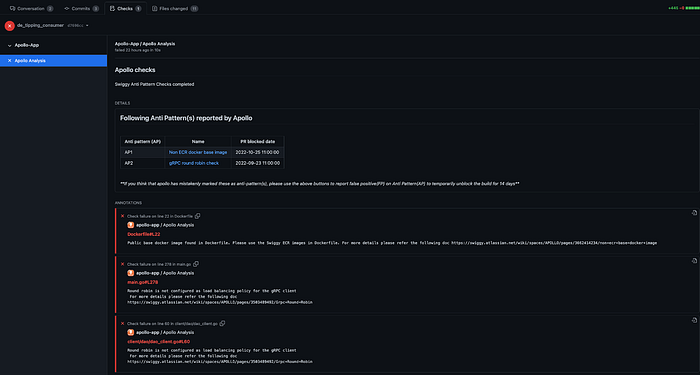
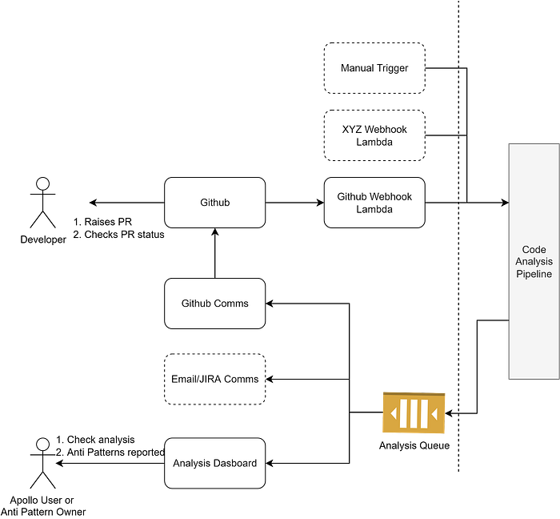
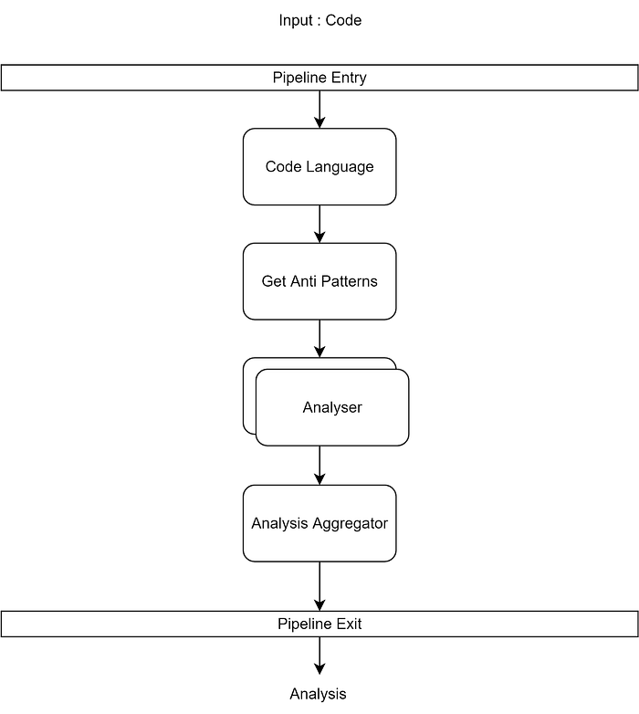
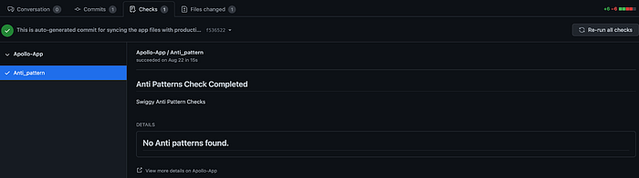
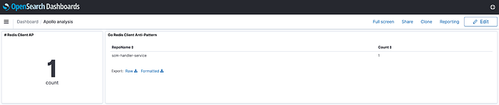
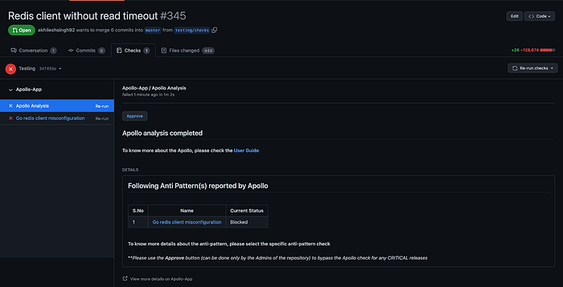

# Apollo: Swiggy’s Code Analysis Platform


When managing a large codebase, it is important to identify and resolve common “gotchas” early on that could prove to be costly if it goes to production. Rather than rely on manual identification during reviews, a tool that can help do this automatically makes it more accurate and scalable.

For us at Swiggy, we realised the need for an in-house code analysis tool and hence, we created Apollo.


*Apollo checks on a PR in GitHub*

Apollo is a code analysis platform that allows us to plug any static code analysis tool to find anti-patterns(anomalous coding patterns) and inform developers during the PR(Pull Request) stage itself.

It enables architects/leads to phase out any coding anti-pattern from Github repos gradually. For example, a database client without a timeout, using a deprecated or non-recommended version of the library, using a version known to have bugs or using a non-recommended infra, etc.

## Why did we build this?

Before Apollo for non-critical or non-urgent anti-patterns, the guidelines used to be just a recommendation, and its enforcement was human dependent. The manual process via PR reviews are prone to errors and quality varies.

For critical ones, it used to be an org-wide activity where each team had to confirm by manually checking if their system had the anti-pattern and then using a sheet to track if all the identified services were fixed. Even if they were fixed, there was no way to prevent them from creeping back in with the new code.

_To err is human_

Apollo filled these gaps by automating the entire process of

- Anti-pattern identification
- Its path to deprecation
- Preventing its recurrence

It made developers aware of anti-patterns on every commit/PR, while also providing developers an incentive to remove the flagged anti-pattern from their code.

Instead of being limited to capabilities of a single analyser, Apollo platform can onboard any code analysis tool as an analyzer (as long as the tool can execute within the AWS lambda run time and run within 5 mins). It also allows composition of analysers to identify the anti-pattern we need to catch.

## Salient Features of Apollo

- Github Integration : Provides quick feedback to the developer during the development stage
- Identify anti-pattern in not only new code added but complete repo as well
- Composition of same or different code analysis tools
- Ease of creating anti patterns and planning deprecation

## System architecture


*Apollo Platform*

Apollo is built using serverless components of AWS. For a given repo, the Code Analysis Pipeline provides the anti-pattern analysis, which is then communicated to the developer and is also available in the dashboard.

We designed Apollo specifically to ensure

- Extensibility in platform integration : Allow integration with Github and extensible to other repository hosting services.
- Extensibility in code analysis tools support

### Triggers to Apollo

Webhook Lambda (Github Webhook Lambda)

- Lambda would handle webhook calls from the repository host service. Example: GitHub, Bitbucket, etc.
- Lambda would transform the webhook payload to the payload accepted by the code analysis pipeline and then it triggers the pipeline.
- Webhook would be triggered for every new commit/PR.

Others

- Anyone with a repository or hosted code can trigger the pipeline manually and get the result. Possible use case :
- Run analysis for a specific repository which is not in active development and doesn’t get new commits.
- Run analysis for all repositories on demand in case a critical anti-pattern is identified which needs immediate resolution.

### Communication

Code analysis is available in the queue, which multiple consumers can leverage to communicate with the developer.

Hosted Repository

- Use the hosted repositories UI to show the analysis status and result. For example , in GitHub you can add Apollo analysis in the commits check suite. (Github Comms in [diagram](https://docs.google.com/document/d/1Yc7Pyn8xT8DRWBR9Peb2HPRXvOTi5SGrP6_sJFrmMTk/edit#heading=h.i00x4m88v4vk))
- It would also allow a merge block in case a critical anti-pattern is found.

Email/JIRA/Slack

- Trigger communication to the developer and the team using any of the preferred configured channels.

### Analysis Dashboard

- Code Analysis is available in the queue, which can be stored and rendered in the UI of choice.
- We have used elastic search for storing analysis and rendered using kibana for Apollo User or Anti-Pattern Owner to analyze.

### Code Analysis Pipeline



The pipeline is designed such that it allows getting triggered from various sources, be it a hosted repository (For example, Github) or manual trigger.

**Code Language**

This step evaluates the language of the code, as the anti-pattern would differ based on the language.

**Get Anti Patterns**

- It gets the anti-patterns which have been configured. It could be in shadow or live.
- Shadow mode allows the anti-pattern owner to validate and fix any false positives before making it live for developers.

**Analyser**

- Given a code and anti pattern, the analyser uses the defined code analysis tool and returns the analysis to the next step (aggregation).
- Each anti-pattern is executed in parallel by analyser, so the number of anti-patterns doesn’t impact the overall pipeline’s run time.

**Analysis Aggregator**

Aggregates the analysis from the analysers and publishes the analysis into the queue.

### Code Analysis Tool

- Apollo platform can onboard any code analysis tool as an analyzer, which gives the anti-pattern creator an arsenal of tools to tackle any anti-pattern. As long as the tool can execute within the AWS lambda run time and run within 5 mins.
- We have added support for semgrep as a code analysis tool. We selected semgrep as it’s able to find complex patterns in code on top of standard grep. (Refer to the official [documentation](https://semgrep.dev/learn) for more details)

## How it works

Anyone can create anti-patterns in shadow in production. This allows the anti-pattern owner to find the violators without informing developers or blocking their PR. The anti-Pattern can be onboarded as a warning, giving developers time to fix against a deadline, or as critical which blocks the PR from merging.

### Use case : Write timeout not configured for redis client

In the below example, a Write Timeout is not configured.

```
client := redis.NewClient(&redis.Options{
 Addr: getConnectionAddress(config.Host, config.Port),
 DB: config.Db,
 ReadTimeout: time.Duration(redisConfig.ReadTimeout) * time.Millisecond,,
 })
```

Code Review should catch such misses but it won’t cover the misses which are already in the repository. The impact of missing such checks is very high, and no reliable way to prevent them from creeping back into the code.

With Apollo, we can configure the anti-pattern using any supported code analysis tools to identify misconfigured Redis clients. This ensures keeping anti-patterns out of our code and gives quick feedback to the developer.

An anti-pattern can be defined using a combination of code analysis tools where the combination can be of the same or of different tools. For this situation, one rule can be to find if go-redis library is imported and another can find if redis constructor doesn’t have WriteTimeout Field defined. We can then create an anti-pattern which only flags when the combination of the two rules are applicable.

We can validate if it’s devoid of false positives (erroneous flagging of repo) which in shadow mode doesn’t actually impact developers while we analyze the flagged repo in background.


*Empty Apollo Checks in Shadow*


*Anti Pattern Found*

Anti-pattern can be made live post validation, which would then start reflecting to users in GitHub. The anti-pattern can be configured as a warning or critical. In case of critical anti-pattern the merge is blocked.


*Anti Pattern is now visible to developers and PR is blocked*

## Conclusion

Apollo platform is built using the AWS serverless components which allows scaling on demand and are elastic in nature. It can run 100s of anti-pattern for each repo in parallel, thereby ensuring no impact on runtime. The platform execution for a repo is restricted to be completed within 5 mins. Anti-Pattern execution runs in parallel to application tests, thereby reducing the chance of developers getting blocked on Apollo execution. It has been in production for 6 months and has onboarded many coding anti-pattern. Teams like DevOps are finding it easier to enforce the recommendation across the Swiggy codebase.

Our future roadmap for Apollo includes enhancements such as

- Allow developers to flag false positives.
- **Support for third party analysis**
- Analysis done outside of the Apollo ecosystem. For example, vulnerabilities identified by the security team can be showcased using Apollo.
- Automate report to anti-pattern owner.

---
**Tags:** Software Development · Static Code Analysis · Ci Cd Pipeline · Security · Swiggy Engineering
