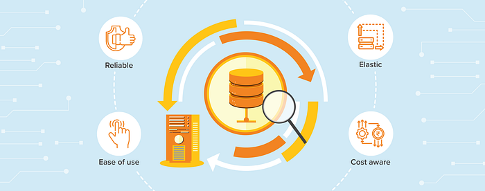
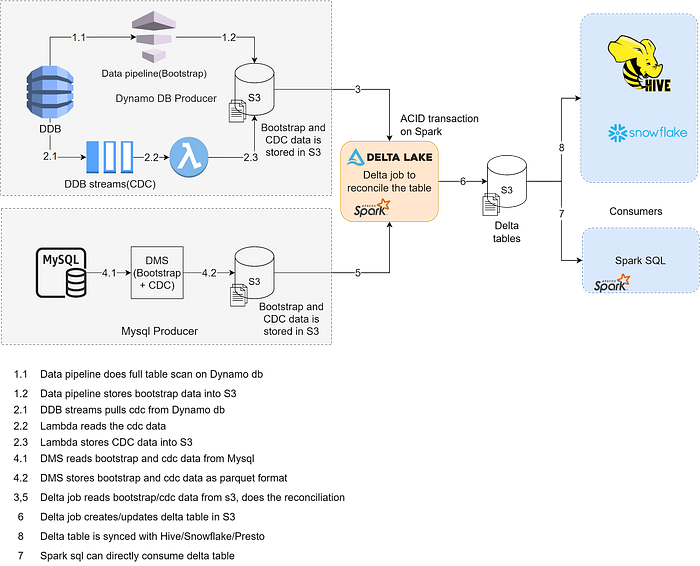
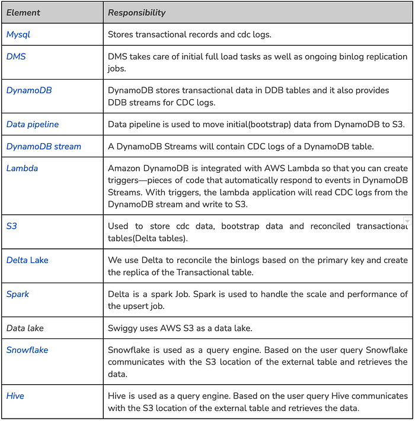
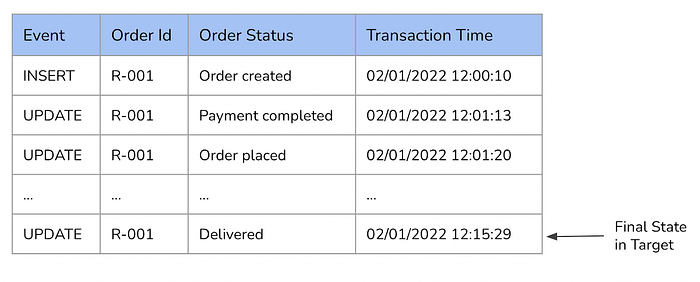
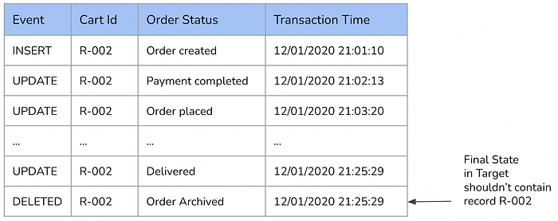

# Architecture of CDC System



In our [last blog](./introduction-to-cdc-system-an-efficient-way-to-replicate-transactional-data-into-data-lake-c10f99c7a3fd.md), we introduced the CDC system. We have majorly covered the motivation behind building the system, CDC based approach, and the pros and cons of the system.

In this blog, we will discuss the architecture, the challenges we faced while building the system and how we solved those challenges.

## Revisiting CDC

CDC (Change Data Capture) is a design pattern that captures all the changes happening on the data instead of dealing with the entire dataset.

Instead of copying the entire database, using CDC, only the data that has changed in the database is captured and those changes are applied (in the same order) to the analytical database to keep both databases in sync.

## Tenets of a CDC system

### Ease of use

The system should be self-serve and fully automated. Onboarding a new use case into the system can be easily done by mentioning the required details in the configuration file. All the complexity of provisioning resources and services will be abstracted from the user.

### Elastic

The system is scalable to support varying loads of different tables and use cases. It can be easily extended to support different source systems and target systems. Each phase(CDC, storage, reconciliation) of the pipeline can scale independently based on the load without impacting the other part.

### Cost aware

Complete cost visibility and awareness are provided for the onboarding use cases. Based on the input details the system will be able to suggest the approximate cost of onboarding the use case and users will be able to make latency vs cost decisions.

### Reliable

As we are dealing with the data, reliability guarantee plays a significant role in the System. Each stage of the pipeline should provide reliability, high availability, and fault tolerance which ensures data completeness and correctness.

## High-level system design





## Source

In the software world every application, be it a microservice or a monolith requires a database to persist application state. Based on the use case and non-functional requirements either an RDBMS or NoSQL database is selected for persistent storage. A popular choice of RDBMS is MySQL and DynamoDB for NoSQL. These two are considered source databases for the discussion in this blog because they are the primary transactional databases used in Swiggy as of today.

## Understanding MySQL

MySQL is a database management system — stores structured collections of data in separate tables. It allows the users to perform Insert / Update / Delete operations on the data and apply DDL(Data definition language) operations (modification of the table structure). Read more about [Mysql](https://dev.mysql.com/doc/refman/8.0/en/what-is-mysql.html).

### Working with Binary Logs

The [binary log](https://dev.mysql.com/doc/refman/8.0/en/binary-log.html) is a collection of sequential log files generated by MySQL. These log files contain information about the modifications (Create, Update, Delete) made to the data present in the MySQL server.

These binary logs contain the details of the statements/commands which have updated the data or potentially could have updated (for example, an UPDATE that matched no rows). It also captures the execution duration of the SQL statement/command. Apart from these details it also contains metadata related to the state of the server, error code, etc.

Purpose of Binary Logs

- Binary log is used to replicate the master server into the slave server (MySQL) or any other target.
- Certain data recovery processes use this data in the binlog file to re-execute the transactions to restore the state.

Types of binary logging

- Statement-based — contains events that caused data modification
- Row-based — contains events that describe changes made on individual rows.

_Example of Row-based binary logs_

```
# at 295
#150112 21:40:14 server id 1 end_log_pos 367 CRC32 0x19ab4f0f Query thread_id=108 exec_time=0 error_code=0
SET TIMESTAMP=1421079014/*!*/;
BEGIN
/*!*/;
# at 367
#150112 21:40:14 server id 1 end_log_pos 415 CRC32 0x6b1f2240 Table_map: `test`.`t` mapped to number 251
# at 415
#150112 21:40:14 server id 1 end_log_pos 461 CRC32 0x7725d174 Write_rows: table id 251 flags: STMT_END_F
### INSERT INTO `test`.`t`
### SET
### @1=1 /* INT meta=0 nullable=0 is_null=0 */
### @2=’apple’ /* VARSTRING(20) meta=20 nullable=0 is_null=0 */
### @3=’2022–06–01' /* VARSTRING(20) meta=0 nullable=1 is_null=1 */
# at 461
#150112 21:40:14 server id 1 end_log_pos 509 CRC32 0x7e44d741 Table_map: `test`.`t` mapped to number 251
# at 509
```

CDC tools read the binary logs and capture the operation with the data. For the above example, the CDC tools output is

```
[
  {
    "Op": "Insert",
    "id": 1,
    "name": "apple",
    "date": "2022-06-01",
    "position": "mysql-bin-changelog.000001:461"
  }
]
```

the position contains the binlog file name and location of the transaction in that log file.

The details of the position depend on the CDC tool. In the above example, only the file name and location are captured. However, it can also capture the start and end location of the transaction, transaction id, etc.

Apart from this, it can also capture — Database, Table, Timestamp, Commit, Old and New data (in case of update), Transaction id, Server id, Thread id, Primary key, Primary key columns, etc.

There are several tools that are capable of using the binlog format in CDC mode. For example [Maxwell](https://maxwells-daemon.io/), [AWS DMS](https://aws.amazon.com/dms/), [Debezium](https://debezium.io/), [SpinalTap](https://github.com/airbnb/SpinalTap), [Mysql_streamer](https://github.com/Yelp/mysql_streamer)

## Understanding DynamoDB

[DynamoDB](https://aws.amazon.com/dynamodb/) is a key-value NoSQL database. It is serverless and fully managed by AWS.

### DynamoDB Streams

AWS provides an out-of-the-box solution ([DynamoDB streams](https://docs.aws.amazon.com/amazondynamodb/latest/developerguide/Streams.html)) to capture change data for Dynamodb. DynamoDB stream captures the item-level modifications on any Dynamodb table. These modifications are captured as a time-ordered sequence. It ensures the ordering of the modifications on the stream.

Consumers can access these change logs and extract the required information. Each stream event contains the event name (INSERT/MODIFY/REMOVE), new image (inserted/updated value), old image (older value form Modify/Remove event), etc. More details on the [events](https://docs.aws.amazon.com/amazondynamodb/latest/APIReference/API_streams_Record.htm).

DynamoDB streams ensure the following

- Exactly once appearance of the event in the stream.
- Events appear in the same order as the actual modifications to them.
- Near-real-time availability of the events.

### Change Logs

Example of the change log

```
{
  "Records": [
    {
      "eventID": "dd8bdd8843uh7e1b24b10814913b8f39",
      "eventName": "INSERT",
      "eventVersion": "1.1",
      "eventSource": "aws:dynamodb",
      "awsRegion": "us-east-1",
      "dynamodb": {
        "ApproximateCreationDateTime": 1592475692,
        "Keys": {
          "s_id": {
            "S": "xyz"
          },
          "p_id": {
            "S": "abcde"
          }
        },
        "NewImage": {
          "s_id": {
            "S": "xyz"
          },
          "p_id": {
            "S": "abcde"
          }
        },
        "SequenceNumber": "5027800000000001107762416",
        "SizeBytes": 32,
        "StreamViewType": "NEW_AND_OLD_IMAGES"
      },
      "eventSourceARN": "arn:aws:dynamodb:us-east-1:123456789876:table/test_table/stream/2020-06-18T10:17:37.027"
    }
  ]
}
```

## Reconciliation

We have already discussed that to create a near real-time replica of the transactional DB in analytical storage the CDC logs need to be reconciled properly. This is a complex and important stage of the pipeline. The consistency and correctness of the data depend on the logic and approach of the reconciliation phase. One out-of-order data or corrupted data can impact the correctness of the destination table.

The key challenges are:

- Ensuring the correct schema of the target table.
- Ensuring the correctness of the data. There shouldn’t be any data loss. The number of records should match the source and the rows also should match.
- Handling duplicate events in the binlog. Duplicate events can be observed during the failure recovery of the CDC tool, and restart of the CDC application from the last saved checkpoint. We are also considering that due to a bug CDC tool may generate duplicate events. The system should be able to handle these adverse scenarios.
- Handling out-of-order events. If the source is partitioned(by files/directories/Kafka topic partitions/Stream shards) it’s very difficult to ensure order during reading. Events for a record can be distributed across multiple partitions. It’s necessary to handle out-of-order events to ensure data consistency on the target table.

### Upsert and Delete

**Upsert **is an operation on the database which updates the data that already exists. If the data doesn’t already exist it will be inserted.  
**Delete **is an operation that removes the data from the database.

We are leveraging the power of upsert and delete to apply CDC logs on the destination database.

### Optimized upsert and delete

As we have already discussed, CDC captures the events on the database and they contain all the mutations of the data. Let us consider the source database contains a record with the identifier R-001 and 15 _Update_ operations happened on this record. The CDC will contain 16 events — one _Insert_ and 15 _Update._ If we receive all these events in a single batch we don’t have to apply all the events sequentially one by one. We can optimize the upsert process by discarding older events for R-001 and considering only the latest version. The last updated version of the record represents the correct state and therefore will be used to upsert the last updated version on our target table. If the record doesn’t exist on the target, upsert will insert the record.



Another example, consider there is a record identifier by R-002. 15 _Update operations_ are performed on the record. Finally, the record R-002 is deleted from the source database. In CDC we will receive 17 events — one _Insert_, followed by 15 _Updates,_ and finally one _Delete_. If all these events are received in a single batch, as the last operation is Delete and the record R-002 should not be present in the final target table. All the events can be safely discarded for R-002 and corresponding computations can be saved.



### Schema creation

The target table will be usable if it follows the correct schema and structures. Ensuring the correct schema is not an easy task. In the real world, the table starts with a base schema and it evolves over time.

### Extracting the base schema

During the initial onboarding of the table, the schema generally remains fixed. When the source is an RDBMS table it’s very easy to extract the schema as the table schema in RDBMS is predefined and fixed until changed explicitly. The schema extracted from the RDBMS can be passed to the reconciliation stage to write the data on the target table.

This approach doesn’t work well for NoSQL databases. To support DynamoDB as a source we have built an in-house solution to infer the DynamoDB table schema during runtime. It reads the data in [DynamoDB stream record](https://docs.aws.amazon.com/amazondynamodb/latest/APIReference/API_streams_StreamRecord.html) format and extracts meaningful information to decide the final schema of the data.

### Schema evolution

Schema evolution is a feature that allows the user to change the schema of the table to accommodate the data, changing over time.

When schema evolution happens on the source, the CDC system should be able to handle and apply it to the target table.

**Compatible types**

Compatible schema evolutions are changes that are compatible with the existing schema and can be added easily. For example, add/remove columns, Widening the data type of columns(int to long or float to double). Most reconciliation techniques can handle this out of the box.

**Non compatible changes**

There are changes that can not be added easily to the existing schema. Like, data type change of columns(int to string/float to list/string to map, etc.). This is non-trivial to handle during the reconciliation phase.

### Ordering of events

The consistency and correctness of the target data depend on the order by which the events are inserted. Single out-of-order insertion can corrupt the entire dataset. To maintain the ordering an incremental sequence number is required. We rely on the timestamp. Whenever any transaction occurred on the source, the source DB captures the transaction timestamp and this provides the correct ordering of the event.

This helps to

- Select the latest transaction
- Discard out-of-order transactions

### Reconciliation engine

There are a couple of open-source solutions that help to build the reconciliation phase. Open Source softwares are — [Apache Iceberg](https://iceberg.apache.org/), [Delta lake](https://delta.io/), and [Apache Hudi](https://hudi.apache.org/).

### Delta Lake

We are primarily using Delta lake to solve this problem.

**Delta merge  
**Upsert and deletes are applied using the Delta merge functionality. After cleaning and processing the CDC logs, the data frame is passed to Delta merge for applying the events on the target. Delta provides an ACID guarantee on top of the Spark which helps to maintain consistency.

**Schema evolution  
**Delta and Spark provide out-of-the-box schema evolution for compatible schema change without corrupting the data.

**Optimize  
**Optimization techniques for Delta tables. It basically compacts the smaller files into larger ones which help to improve the reading performance. After applying optimization the read time was reduced to 15 mins from 2 hrs.

**Z-Order  
**This is another type of optimization that improves the read performance of the queries depending on the clusters like city, zone, etc.

**Vacuum  
**The vacuum helps to clear the old commits and optimizes storage costs.

**Time travel  
**One of the most powerful capabilities of Delta tables is time travel; it helps to reproduce the reports, audit data changes, etc.

## Consumption layer

Delta tables are compatible with the Hive meta store. The table metadata is registered in the Hive meta store and data is accessed using Spark-SQL or HiveQL.

We have also built our in-house solution to sync the Delta tables with Snowflake.

## Conclusion

The CDC system helped Swiggy to enable near-real-time use cases like monitoring near-real-time dashboards, and near-real-time feature extraction for Data Science use cases. Overall it helped to take better business decisions.

This system also helped to optimize the cost of the pipeline over the bulk extraction process. Though apples to apples comparison is not possible but if we look into the system, we observe a clear benefit in the Database slave usage. It has reduced the dependency on the Database slaves, used to do bulk import and export. Clearly, the dollar cost-saving number on the slaves is more than 20% per month. Apart from that, the operational overhead, maintenance effort, and failure recovery cost has decreased by many folds. Data freshness and consistency guarantees have improved significantly. Because of the modular nature of the system, we are able to build a good monitoring system to monitor the health of the pipelines, data state, data consistency, etc which is helping us to improve our system.

## References

[https://dev.mysql.com/doc/refman/8.0/en/what-is-mysql.html](https://dev.mysql.com/doc/refman/8.0/en/what-is-mysql.html)

[https://aws.amazon.com/dms/](https://aws.amazon.com/dms/)

[https://aws.amazon.com/dynamodb/](https://aws.amazon.com/dynamodb/)

[https://aws.amazon.com/datapipeline/](https://aws.amazon.com/datapipeline/)

[https://docs.aws.amazon.com/amazondynamodb/latest/developerguide/Streams.Lambda.html](https://docs.aws.amazon.com/amazondynamodb/latest/developerguide/Streams.Lambda.html)

[https://aws.amazon.com/lambda/](https://aws.amazon.com/lambda/)

[https://aws.amazon.com/s3/](https://aws.amazon.com/s3/)

[https://delta.io/](https://delta.io/)

[https://spark.apache.org/](https://spark.apache.org/)

[https://www.snowflake.com/](https://www.snowflake.com/)

[https://hive.apache.org/](https://hive.apache.org/)

[https://dev.mysql.com/doc/refman/8.0/en/binary-log.html](https://dev.mysql.com/doc/refman/8.0/en/binary-log.html)

[https://maxwells-daemon.io/](https://maxwells-daemon.io/)

[https://debezium.io/](https://debezium.io/)

[https://github.com/airbnb/SpinalTap](https://github.com/airbnb/SpinalTap)

[https://github.com/Yelp/mysql_streamer](https://github.com/Yelp/mysql_streamer)

[https://docs.aws.amazon.com/amazondynamodb/latest/APIReference/API_streams_Record.htm](https://docs.aws.amazon.com/amazondynamodb/latest/APIReference/API_streams_Record.htm)

[https://docs.aws.amazon.com/amazondynamodb/latest/APIReference/API_streams_StreamRecord.html](https://docs.aws.amazon.com/amazondynamodb/latest/APIReference/API_streams_StreamRecord.html)

[https://iceberg.apache.org/](https://iceberg.apache.org/)

[https://hudi.apache.org/](https://hudi.apache.org/)

---
**Tags:** Cdc · Near Real Time · Change Data Capture · Delta Lake · Swiggy Engineering
