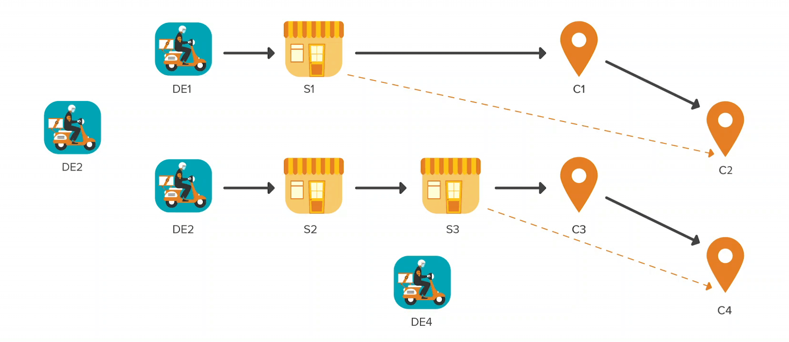
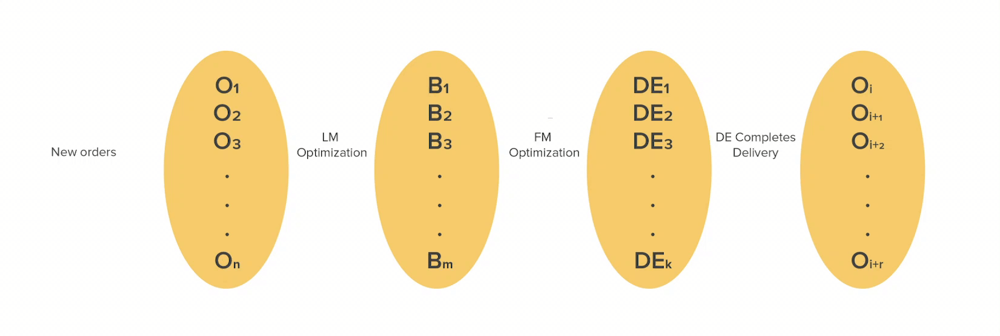

# Assignment & Routing Optimization for Swiggy Instamart Delivery — Part I

Many of us have been regularly ordering from Swiggy InstaMart (IM) and are pretty happy with the delivery experience from both scheduled & instant delivery.

Have you ever wondered how Swiggy InstaMart (IM) fulfils your order by selecting the right Delivery Executive (DE) for your order? Or how is a trip (aka route or batch) decided for a given DE (i.e. if Mr Yuvraj’s order should be delivered first or Mr Kohli’s)?

Consider, if Yuvraj and Kohli both ordered from the same IM store and only 1 DE is available, then we can fulfil their orders in the following combinations:

1. DE — -> Store — -> Yuvraj — -> Kohli
2. DE — -> Store — -> Kohli — -> Yuvraj
3. DE — -> Store — -> Yuvraj — -> Store — -> Kohli
4. DE — -> Store — -> Kohli — -> Store — -> Yuvraj

Now, imagine if you have just 100 DEs, then these combinations will be replicated for all DEs (besides combinations where each order can be delivered by separate DEs). Further, we also have multiple IM fulfilment stores.

Even for a handful of orders and DEs, it becomes a daunting task to devise such plans within a short time manually. Imagine if you have to solve for more than 200K+ Orders with 150K+ DEs and 100+ IM stores every day. We definitely need an algorithm to automate this process, right?

This blog will explain how we solve this problem at scale in near real-time in Swiggy.

The overall problem can be conceptualized via the following diagram (see Fig. 1) where we have a set of customer orders (i.e., O = {O1, O2, O3, O4}), a corresponding set of stores (i.e., S = {S1, S2, S3}), and a set of available DEs (i.e., DE = {DE1, DE2, DE3, DE4}). Customer locations corresponding to order set O are denoted by C (i.e., C = {C1, C2, C3, C4}).

The overall objective is to deliver groceries within promised time but at minimal delivery cost. Moreover, finding the optimal route for a given large set of orders and available DEs in real-time.

*Fig. 1: Process view of the IM delivery optimization*

This problem can be modelled as a Multi-Depot Pickup Delivery Problem with Time Windows (MDPDPTW), where each DE location can be treated as a depot, stores as the pickup locations, and customers as the delivery locations. However, a discerning reader might see the problem with solving thousands of DEs and Orders in near real-time with MDPDPTW is infeasible. One can argue to break the problem down into multiple smaller problems (via clustering) and solve them. The challenge will be partitioning the DEs as they will not be mutually exclusive among clusters. Also, the more clusters we make, the more suboptimal the solution becomes.

So, we break the problem down into two stages: (i) **Last-Mile (LM) delivery optimization for optimal batching and routing of orders**, (ii) First-Mile (FM) delivery optimization for doing Just-In-Time (JIT) assignment of nearby DE to a batch. Then, we solve these two problems sequentially. This helps us to meet the requirement of near-real-time solutions (i.e. less than a minute) and obtain a good quality solution.

We solve these problems on a rolling horizon basis. The sequential steps in every decision cycle (aka cron) are shown in Fig. 2. That is, after every time **_t_** (i.e. cron time), we run the steps shown in Fig. 2.

*Fig. 2: Decision cycle view*

## Last Mile Optimization

We use two different batching algorithms to solve the stage-I LM optimization problem depending on the scale and solution time. The two algorithms are (i) Dynamic Pickup and Delivery Problem with Time Windows (DPDPTW) and (ii) a greedy heuristic algorithm to maximize the batching percentage. This blog focuses only on the DPDPTW algorithm.

For solving the DPDPTW, we have used a two-phase method comprising a construction heuristic and a meta-heuristic.

One important tradeoff to note in Stage-I is that as we delay the decision cycle run time (i.e. increase the cron length), we will accumulate more orders and result in a better optimal solution. However, this delay in the decision cycle would increase the Order-to-Assignment (O2A) time of orders and eventually result in delaying some orders’ delivery.

**We are solving for on-demand delivery with a continuous stream of orders. So instead of increasing the decision cycle run time, we explore new order batching with existing batches until an order is picked up**. In DPDPTW model, we constrain certain parts of the route to achieve this (e.g., if we have the existing route as DE — -> Store — -> Yuvraj and DE has started towards the store, so we freeze the route upto store location and explore batching with new orders say, Kohli. This could provide a modified route as DE — -> Store — -> Yuvraj — -> Kohli or DE — -> Store — -> Kohli — -> Yuvraj).

An erudite reader could already see that the more we batch, the less we pay per order (i.e. we reduce FM distance, LM distance, and wait time per order with the increase in batch size). That is, if we deliver only one order in a batch and DE travels a certain FM distance (say 1 KM), then the FM distance per order is 1 KM. Instead, if we deliver two orders in a batch, the DE has to travel the same FM distance, and the FM distance per order becomes 0.5 KM.

Some of the practical business constraints that we apply in our model are:

- Weight Constraint: DE can carry a maximum W kg weight.
- Volumetric Weight Constraint: DE can carry a maximum of It volume.
- Capacity Constraint: DE should not carry more than k orders at any point in time.
- Constant service time per order is spent at every customer and batch at every store.
- Last In First Out (LIFO) Constraint: Orders with perishable items should be delivered first.
- Time Window Constraints: Earliest Pickup Time (EPT), Latest Pickup Time (LPT), Earliest Drop Time (EDT), Latest Drop Time (LDT)
- Dynamic VRP regards all constraints based on the current state while forming routes with new incoming orders.

For Time Windows constraints, we heavily rely on the time prediction models to estimate FM time, LM time, wait time, customer-to-customer travel time, store-to-store travel time, etc.

The LM optimization from stage-I returns a set of batches (i.e. routes) that optimizes the LM. Finally, these batches are fed to stage II.

---

Stay tuned for part II, where the solution technique for stage II (i.e. FM delivery optimization problem) will be explained.

I sincerely thank my colleague [Goda Doreswamy Ramkumar](mailto:goda.doreswamy@swiggy.in) for her input and help in various stages of this work. We at the Swiggy data science team are working on various exciting problems like the one mentioned in this blog. If you are intrigued by this problem and interested in solving some of these problems, do check out the [_Swiggy career page_](https://careers.swiggy.com/#/careers?src=careers&career_page_category=Technology).

---
**Tags:** Swiggy Data Science · Quick Commerce · Routing Optimization · Hyperlocal Delivery · Technology
