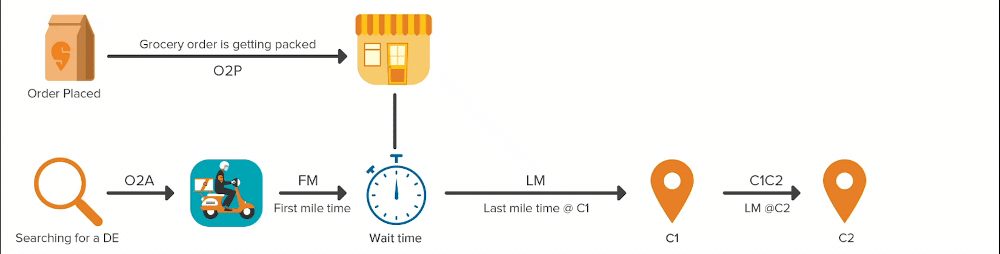
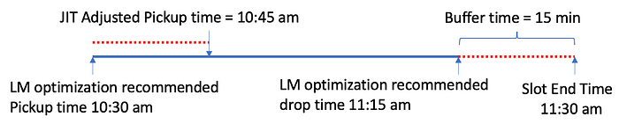
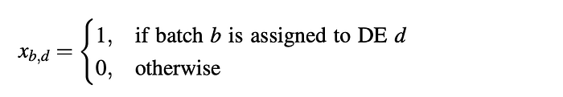
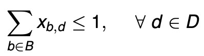
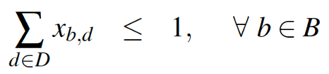
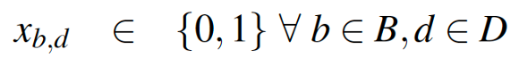
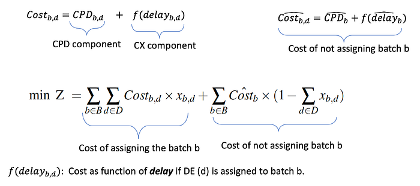

# Assignment & Routing Optimization for Swiggy Instamart Delivery — Part II

This blog continues our previous blog on [Assignment & Routing Optimization for Swiggy Instamart Part I](./assignment-routing-optimization-for-swiggy-instamart-delivery-part-i-2e8fb3115463.md). The last post described the Multi-Depot Pickup Delivery Problem with Time Windows (MDPDPTW), challenges for solving the problem, and a two-stage solution methodology (i.e. Last-Mile (LM) delivery optimization and First-Mile (FM) delivery optimization). This post describes the FM delivery optimization part and completes the solution approach for MDPDPTW.

## First-Mile Optimization

Once your order is placed, the activities take place in the following sequence

1. Pickers at the IM stores pack and keep the orders ready.
2. Order batches (i.e. routes) are formed
3. Delivery Executive (DE) is assigned to orders for shipment.
4. Orders are finally delivered within the promised slot.

Fig. 1 shows the timeline view of the system.

*Fig. 1: Timeline view of IM delivery*

It should be noted that in this stage, Step 1 (i.e. picker assignment and order packing), Step 2 (batching), and Step 3 (DE assignment) happen parallelly.

This stage aims to do a Just-In-Time (JIT) assignment of nearby DE to a batch while ensuring timely delivery. It is straightforward to understand that pulling a closer DE directly helps us to reduce our FM distance and hence Cost Per Delivery (CPD). The JIT is important to minimize the DE wait time at the store. An increase in wait time directly affects our CPD and system efficiency (i.e. indirectly reduces our capability to serve more orders). Ideally, we want to assign the DE so that the DE reaches the store just when the order is packed (i.e. Order to Assignment (O2A)+FM time = Order to Pack time).

So, we need an optimization algorithm to decide the optimal “O2A” and “which DE should get which batch”.

The decision on O2A is made by two types of JIT: external and internal.

## External JIT Heuristic:

We are postponing the pickup of a batch to leverage its optimal batching potential till the slot end or Promised SLA (pSLA)time. Fig. 2 illustrates how we can defer the pickup of this batch by 15 minutes. Our time prediction model suggests the FM and O2A time as 3 and 2 mins, respectively. Then we can hold the batch for 10 (i.e. 15–3–2) mins and send it to the assignment cron.

*Fig. 2: JIT Heuristic for Postponement of Batch Pickup*

As we have learned in the LM optimization stage, delaying this batch pickup would also help us improve our batching (i.e., we can batch more orders or form more efficient routes).

## Internal JIT and Optimization Model:

For internal JIT, we solve a multi-objective assignment problem.

Decision variable:

Model Constraints:

- A DE should be assigned to only one Batch

- A batch should be assigned to only one DE

Objective Function:

So, the objective function Z does an implicit JIT by trading off the cost of assigning a batch in the present cron vs not assigning the order in the present cron. Further, our objective function combines the CPD and Customer Experience (CX) components. The CX is measured as a function of the estimated delay.

## Conclusion

These two blog posts (Part I and Part II) discuss a high-level overview of the on-demand grocery delivery problem, challenges, potential solutions, and explained a two-stage solution strategy in detail. Stage I is modelled as an LM delivery optimization for batching and sequencing of orders. The LM delivery optimization is solved as a Dynamic Pickup and Delivery Problem with Time Windows (DPDPTW). Stage II is solved using a JIT heuristic and multi-objective assignment optimization model.

I sincerely thank my colleague [Goda Doreswamy Ramkumar](mailto:goda.doreswamy@swiggy.in) for her input and help in various stages of this work. We at the Swiggy data science team are working on various interesting problems like the one mentioned in this blog. If you are intrigued by this problem and interested in solving some of these problems, do check out the [_Swiggy career page_](https://careers.swiggy.com/#/careers?src=careers&career_page_category=Technology).

---
**Tags:** Swiggy Data Science · Quick Commerce · Routing Optimization · Hyperlocal Delivery · Technology
