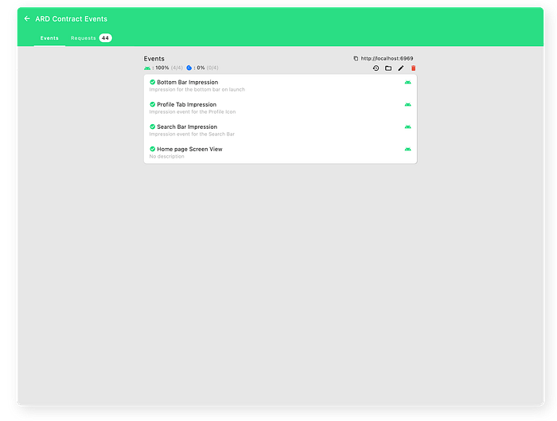
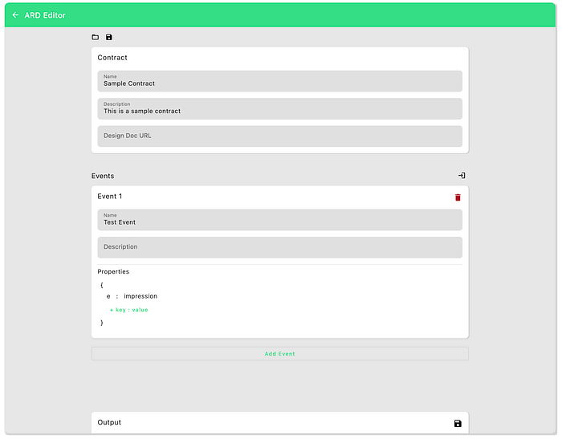
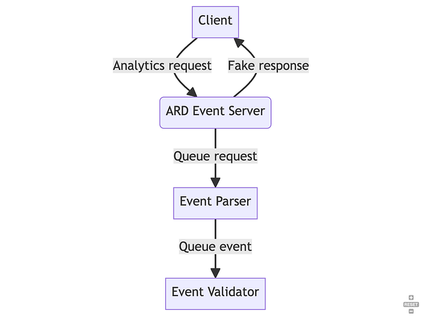
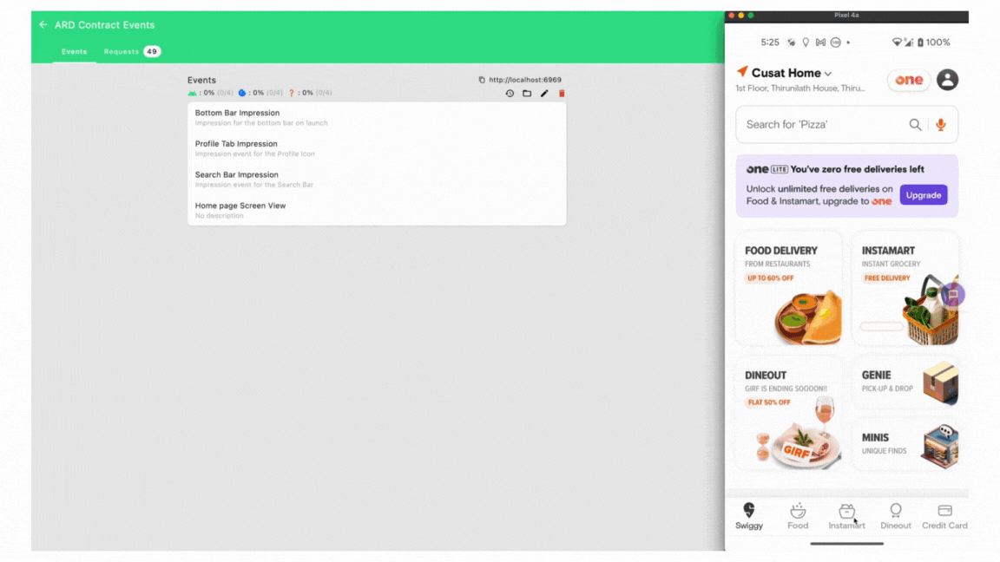
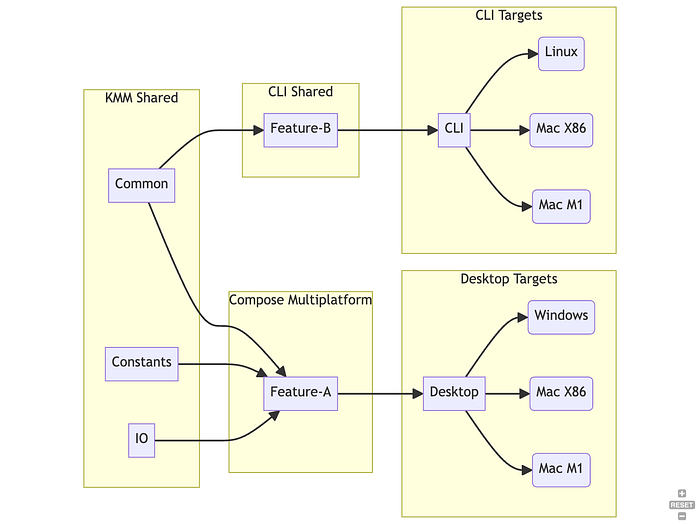

# Automating Mobile Event Verification

> Improving event coverage through automation


As Swiggy grows to become a convenience super app, so do its events. We send thousands of events per session which include analytics, performance metrics, useful logs and more. These events act like a feedback loop for us to understand our users' experiences.

Our previous Analytics workflow consists of manual and fragmented processes, resulting in numerous challenges, such as:

1. **Lack of a Single Source of Truth**: Analytics requirements and specifications are scattered across various documents making it challenging to maintain a clear understanding of expected data.
2. **Absence of Change History**: Eventual changes to analytics specification go undocumented, leading to inconsistencies among platforms.
3. **Manual Verification and Regression Testing**: There are thousands of events to verify and the need for manual verification and regression testing consumes valuable time and resources. Manual verification was done by QA, Analytics and Engineering to verify a set of changes to our events.
4. **Limited Coverage**: Due to the sheer number of events flowing through, it wasn’t possible to cover the entire set of events in regression testing. This meant our events coverage was very low, mostly covering critical events only.

The divergence in event data between platforms creates substantial workloads for the analytics team since they now have to pre-compute the data before being used for their analysis. This also accumulates technical debt on both teams. Loss of events can also go unnoticed, leading to long-term regressions. These limitations forced us to rethink our workflow and build our internal tool ARD Automator



## Features

### Event Contract Schema

We wanted to make the specifications more concrete with proper contracts between the Analytics and Engineering teams. These contracts should be generic and machine-readable to enable automation and other usages later on.

The contracts have 2 sections, the contract metadata in `details` and the individual `events` part of the contract.

```
{
    "details": {
        "name": "Launch Events",
        "description": "Events on app launch",
        "designDocumentUrl": "<url to specification>",
        "version": 2,
    },
    "events": [
        {
            "name": "Bottom Bar Impression",
            "description": "Impression for the bottom bar on launch",
            "properties": {
                "e": {
                    "type": "string",
                    "value": "impression"
                },
                "on": {
                    "type": "string",
                    "value": "impression-bottom-bar"
                },
                "op": {
                    "type": "regex",
                    "value": "\\d+"
                },
                "cx": {
                    "type": "list",
                    "values": [
                        "Swiggy",
                        "Food"
                    ]
                }
            }
        },
        ......
}
```

### Single Source of Truth

We leveraged Git to establish a central repository for these contracts. This repository will serve as the authoritative source for Analytics specifications, ensuring clarity and consistency across platforms. GitHub already gives us a good workflow to review the changes, run CI checks to verify the contract schema and deploy the changes when merged into master.

### Easy contract Maintenance

We wanted to ensure creation and modification of contracts are easy with tooling with GUI forms, bulk imports, and local testing workflows. This tooling would also ensure the serialisation of the contract would be accurate.



### Complex Payload Validators

To support almost all of our complex analytics requirements, we have built-in complex payload validators. The payload validators allow for matching complex structures, enabling us to cover almost all types of events.

**Supported Validators**

- String Validator — This can be used to match the exact value

```
validator = "impression"

{
 "event" : "impression"
}
or
{
 "object_position" : "5"
}
```

- Regex Validator — This is useful to match patterns instead of exact values like we saw in string validator

```
validator = [A-Fa-f0–9]{8}-[A-Fa-f0–9]{4}-[A-Fa-f0–9]{4}-[A-Fa-f0–9]{4}-[A-Fa-f0–9]{12}

{
 "object_value" : "87053a44-e738–4525–8885–83a6890d7b23"
}
or
{
 "object_name" : "food_card_8932"
}
```

- Exhaustive List Validator — Useful to match a list of values, instead of a single string

```
validator = [ "food-page", "home-page" ]

{
 "rf" : "food-page"
}
or
{
 "rf" : "home-page"
}
```

- JSON Object / Array Validator — A powerful nested validator. All values can be any other validator. Supports any amount of nesting and any structure that regular JSON supports.

```
Json Validator where title can be string validator and request_id be regex validator

{
 "exp": "{
    "request_id": "4e3f12a0-bbed-438c-acf5-772ef644b654",
    "title": "Idli "
  }"
}
```

## Workflow

### Automated Contract Verification

Our workflow includes tooling and processes that automate the verification of contracts, reducing manual effort and increasing accuracy. This will significantly enhance our efficiency and reliability in verification and regression testing. Thanks to the automated process, we can now efficiently handle a significantly larger number of events than we could before.



- We remap the endpoint on the client so that it sends the request to the tool instead of the actual server. You can also utilise a proxy tool like Charles or ProxyMan to do the same without making app changes.
- There is a fake analytics server on the tool which listens for the event and sends back a fake successful response. This ensures that the functionality of the app is not affected.
- We now queue the payload to be parsed by our KMM module. After parsing the payload, we then queue the event to handle the verification.
- The event validator uses the above-mentioned validators to check if the payload matches any of the events.
- The last step is to visualise the data after verification.



### Powered by Kotlin and Compose Multiplatform

Since this tool has to be used by multiple teams on multiple platforms (Mac x86, M1, Windows) we wanted to enable support but not maintain different codebases.

Written entirely in Kotlin, backed by multiplatform support, we can deploy the tooling on any platform. We reuse the shared KMM modules to generate two flavours of our tool, desktop and CLI. The validator, editor and request viewers are part of the desktop tool.



### Future scope

Currently, we have it on all desktop platforms, but we have plans to expand to CI and Mobile to improve testing automation soon. We also export a CLI tool to enable validations on CI very easily.

Since the contracts are generic, we are also looking at generating the event handler automatically at build time, to avoid implementation differences and improve speed of execution.

### Adoption

Thanks to our amazing team, we were able to adopt the tool across Swiggy. We now have high event coverage in Cx Android and iOS Apps and gaining adoption in other business lines like Dineout, Instamart, Minis and business apps like Restaurant Partner App and Delivery Partner App.

### Impact

- 66% reduction in QA regression time unlocking the speed of execution
- The QA team has found 12 bugs including parity issues, missing events, and events triggered with incorrect values.
- We were able to detect disparities/gaps in Ads Analytics SDK

“The existing Ads automation was a UT test and maintaining that and adding new events are hard. ARD Automator makes it super fast and easy to create and maintain contracts without any programming knowledge.” — Consumer Tech QA

### Conclusion

We are excited to see ARD Automator getting widely adopted and eliminate these challenges once and for all. We are working towards moving the verification to CI and improving the UX of maintaining contracts.

> **_Acknowledgements_**This couldn’t have been possible without the help and support of [Raj Gohil](https://medium.com/u/1bf9bdb89775), [Sambuddha Dhar](https://medium.com/u/723d70adf627), and [Tushar Tayal](https://medium.com/u/400467f4ffab). Huge thanks to [Suresh Thangavelu](https://in.linkedin.com/in/suresh-thangavelu-08335967) and [Vijay Selvam](https://www.linkedin.com/in/vijay-selvam-b53a9740?utm_source=share&utm_campaign=share_via&utm_content=profile&utm_medium=android_app) who tested and helped with company wide adoption.I’d also like to express my gratitude to all the team members who played a role in creating contracts for their respective teams, as well as those who contributed to making this possible. Special thanks to the Consumer Tech team for beta-testing the tool.

---
**Tags:** Android · Testing · Swiggy Mobile · Kotlin · Swiggy Analytics
