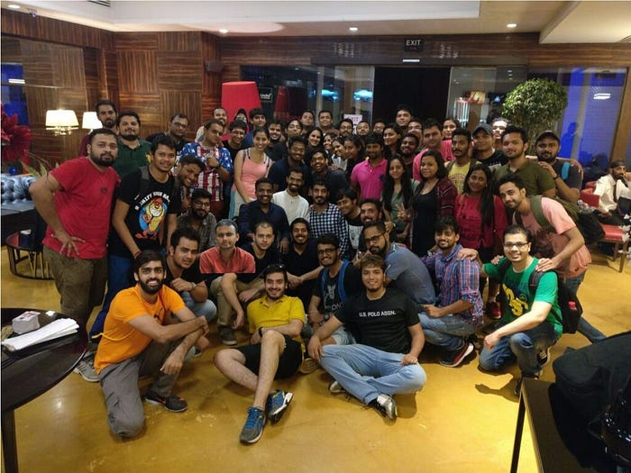
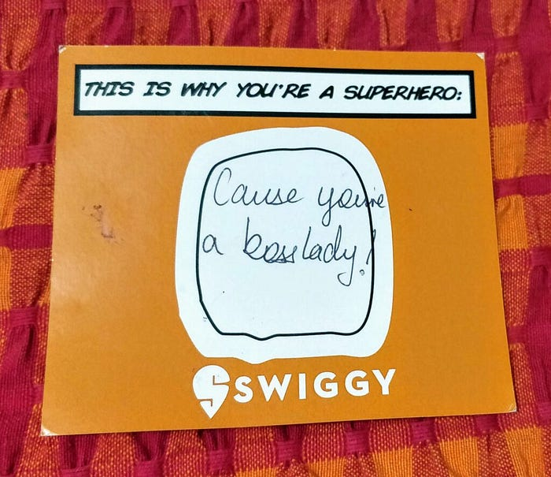
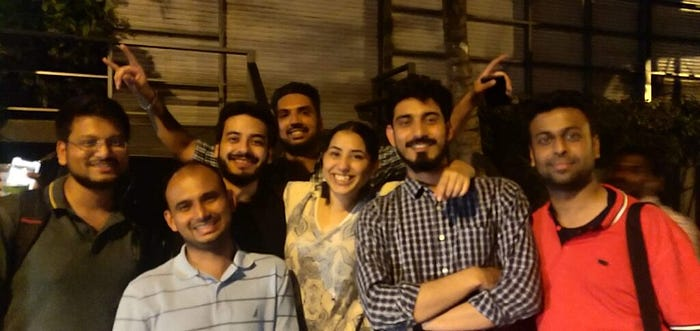
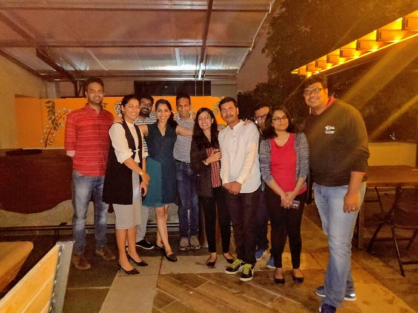

# Becoming a Product Manager, without being one — an interview with Sabrina Sayed

_From a space of all things literary and imaginative to the result-oriented and target-driven world of Sales. From the fiercely competitive tennis court where wins and losses go hand-in-hand, to the innovative realm of complex problem-solving that is product management. Swiggster Sabrina Sayed has worn many hats, all with finesse and the constant pursuit of excellence. And before she ultimately carved a niche for herself in her present role, her journey was filled with instinct-led decisions, curiosity & experimentation, and a whole lot of career shifts that are sure to inspire every aspiring polymath!_

_Read on for an extraordinary conversation that takes you through an even more extraordinary career trajectory!_

## Let’s go back to the start. Tell us a bit about what you studied and where your career journey began.

Well, my career journey started back on the campus of St. Xavier’s, Calcutta — a premier institution with a rich legacy where I studied literature. Now if you are imagining me nestled beside a pile of books, reading them day-in-and-out, errr… you can’t be more wrong. Unfortunately, I’m not a bookworm. But I thoroughly enjoyed my rendezvous with the field of literature and I’m really thankful that my parents were also supportive in this regard. Literature is the art of learning to understand human beings. Studying literature doesn’t teach you how to earn money, but it enriches you in every aspect of life — especially while you navigate through the corporate world. And true enough, I for one can tell you how those lessons from Literature help me navigate through both life and work. Here’s how the story went… literally!

So, in between my academics, I applied for an internship with Citibank. They’d come to the campus with an opportunity that was open to people across departments and streams. I was fortunate to get through and joined the Operations Team for a stint of about 6–8 months. This internship, in one of the largest and perhaps the most formal organisations in the world, helped me inculcate some strong work values, which I might have missed had I jumped right into the startup bandwagon.

## You did a few interesting things in the time between your internship and joining Swiggy, right? Tell us about the post-Citibank phase.

Once through with the timeless college years and having finished an interesting stint through my internship, my life took a slightly adventurous turn. I joined a few friends to build our very own start-up. The idea was to organize the unorganized sector of parallel education, and our answer was this start-up, which we named Pedagog. The aim was to enable parents and young learners to make informed choices by looking at community-based reviews of institutes, tutors, and even alternative interests such as tennis coaches and piano teachers.

As you might imagine how start-ups most often end up for first-timers, we soon shut shop, only to take away a bunch of learnings. After Pedagog, I jumped on to the East India marketing team at Uber! From improving workflows for the return of lost items to owning Uber’s biggest global marketing campaign for Kolkata (uber ICECREAM), this phase was a steep learning curve. After a crazy and fruitful trip with Uber, I got into the hyperlocal zone with Swiggy and shifted base to Mumbai.

The said role was actually in sales and I was initially very hesitant to take it up, thanks to all the preconceived notions that cloud almost every graduate’s mind. Most folks [at least the ones I’ve known] view Sales as something that’s not worth their while. If you had the same stereotypical notions, then I hope my story can change your mind!

## Sounds intriguing! So, how did the sales journey unfold for you?

It did take me a while to find my feet in sales. In all honesty, for the first few months, I was struggling. I had to break down my mental barriers, and I persisted only because of the immense support that I received from my manager and team. And a few weeks into the game of sales, I felt like I found my own niche in it.

*Raw & unedited — The amazing Mumbai A-team*

Strengthened by the faith that others had in me, I forayed ahead. At the time, we were just entering the Navi Mumbai market, and I was assigned to the Vashi market specifically. Very soon, we started making serious inroads and witnessed promising wins in the market. As my confidence in the job grew, I also managed to onboard a lot of big brands across mainland Mumbai, some of which we hadn’t been able to get on board earlier.

## Amazing! Tell us a bit about the team and your overall experience through this period.

The freedom and flexibility we all enjoyed in that team were tremendous and unparalleled, and I owe a lot of this to my mentors and some amazing managers. It was an absolutely phenomenal team with truly impactful leaders. This just bolstered my passion and commitment to the job, leading to another important milestone that came soon after — we successfully got some of Mumbai’s leading 5-star restaurants on board! A lot of the Taj Group restaurants had been reluctant to join forces with us earlier, quite simply because they didn’t see the need [This was the pre-COVID era, remember, so 5-star restaurants were content with how they were functioning]. Getting them to join us was a breakthrough for me, for the team, and for the company.

*The joy of a coveted restaurant partner proudly announcing their arrival on Swiggy*

It didn’t stop there, I brought on board many of the local, heritage restaurants that became our top-grossing partners in the city. It was not all seamless though — one hurdle I faced was misogyny. One heavyweight hospitality chain with several brands that were critical for us once told me, to my face, that they were open to set up a meeting, but I should send back a male colleague because they ‘don’t allow women in their business and don’t think women can do business’. I somehow managed to keep my anger in check and responded ‘I will be there for the meeting. You get to choose the date & time though’. That account was critical to us and we had been chasing it for almost three years. So I called up my manager and told him how I thought I had been brash, to which he responded ‘Tell them that if they have to do business with Swiggy, it will have to be through you’. We got them on board and even today in these Covid times they are doing great business every month on Swiggy.

*“Walked to my desk one morning to find this note from my manager.” ~ Sabrina Sayed.*

This led to the next step which was truly exciting. I was asked to handle the Bandra West market. To give you a view of the business — Bandra was and continues to be the highest order value grossing market in the country and strategically a critical market for us to establish the image of our brand. Yes, this was a huge honor for me. I think this is when it really hit me that I was perhaps doing well at my job, and I began to shed my imposter syndrome.

## Having found your space and comfort in Sales, how did the shift happen? What led to it?

Yes, I was beginning to get comfortable in my space, but my managers and mentors in the Mumbai team kept egging me on to explore newer opportunities at HQ — they really were the wind beneath my wings. I personally didn’t feel the need to move to another function, but my managers and leaders convinced me to give a newly formed function, ‘Product Ops’, a shot. To be honest, I didn’t have a clue about the product domain, but my mentor reminded me of some app recommendations that I had made at Uber. The fact that he actually remembered such an old conversation was enough conviction for me. People ask me, all the time, what’s made me stay at Swiggy for so long. It is people like him and the other mentor-manager-friends I have been lucky to have here. People who have relentlessly believed in me, selflessly invested in me, and been my biggest cheerleaders no matter which team I went to. The people who have played these roles in my journey include — Anirudh Vijayaraghavan, Anirudh Puppala, Sameer Contractor, Siddharth Pareek, Anuj Rathi.

*The folks from Team Mumbai who backed Sabrina on her next innings at the Swiggy HQ.*

And so, I landed in the Product Operations team with no tech knowledge whatsoever. I recall one of the early instances in this team. We were in a product brainstorming session and I’d given a few ideas, asked a few questions, and generally participated actively despite my lack of tech know-how. What seemed to me like some stray ideas was actually enough for others to see the true potential for newer roles. That’s when I got the opportunity to shift gears to full-fledged Product Management. However, I needed time, learning, and exposure. I stayed on the product ops team for the next 9 months or so to make the most of my learnings. I took this time to learn all that I could, worked closely with product managers, asked questions, upskilled, and then I was finally ready — for the Storefront team in Product Management.

## Give us all the details of the Product Manager’s life and of course, the Swiggster life in general.

Today, as a part of the Product Management team, I continue to be in a space filled with the freedom to innovate and experiment. Possible only due to the untiring support of such brilliant leaders and team members here at Swiggy. The kind of people I’ve worked and interacted with, I can tell they’re all good human beings — because who you are is who you bring to work each day.

I think what sets Swiggy apart in that sense is the fact that everyone here has a voice. Each and every individual is heard irrespective of age or seniority or experience. If you have a suggestion, there will always be someone in the room who will back you up and treat your idea with the respect it deserves. That gives birth to a strong sense of ownership and passion for the job. And I think that’s a unifying feeling that is also reflected in the values of the company. I see all these values around me every day, and while I deeply believe in all of them, I guess I do have one that I especially resonate with — Always Be Curious, Always Be Learning.

*Sabrina reliving some good old, fun moments with the Product Ops team.*

That value sums up my journey in a lot of ways. Let me tell you how: Unlike an engineering or business grad, I have had to learn everything on the go, I have explored and started new roles from scratch, have kept coming up with ideas, asking questions, always wondering what we could do next, always wanting to make something better out of what we had at hand. When I realized this, is when I really and truly took the leap, and in product development, I could actually get the ball rolling on solving user problems first-hand!

## Any projects or experiences that are especially close to your heart?

For me, one of the most wholesome and important memories created at Swiggy was the entire StatEATstics project. This wasn’t so much about what we achieved, or what the project drove. It may not have moved the needle on metrics as such, but I’ll tell you what it meant to me.

For me, it was the incredible story of how over 30 people across functions, came together in a matter of two weeks to build something that although not as ambitious as some other projects, still had to be thought through from scratch. People joined in because it was fun and because they felt heard right from the outset. We had a code-freeze to beat, folks on Christmas vacations, multiple big projects to release in the next 2–4 weeks — but we did it.

When you give people the chance to voice their ideas when you allow them to talk, make them feel like it’s their story — they will always come up with ideas! Data analysts, engineers, marketers, everyone from across teams joined the project and brought such a beautiful medley of ideas to the table. This immense sense of ownership came from the fact that we brought everyone together in equal capacity right from scratch. Involving everyone from the get-go is the key to great collaboration, I believe.

This project told us what we’re truly capable of, and if I can execute every project in this manner then it’d be the most cherished of all wins.

## What’s a lesson (or more than one) that you think would help aspiring product managers?

The truth is that a Product Manager’s life is all about learning from the losses. You can invest six months of your heart and soul in a project and yet it never sees the light of day. The key is to power on, undeterred. Those projects are just as dear to me as the successes — the ones where I learned, innovated, created, ideated — even if they never fully came to life. A parallel phase of learnings from my life — I competed on the national tennis circuit while growing up, and it taught me so much about what I apply in my life and my work today — from fair play and integrity to the importance of tackling failures head-on. As long as you have a strong sense of purpose, no one can discourage you from doing something. And no failure can supersede your resolve.

As some of my favorite leaders at Swiggy have rightly taught me — Don’t fall in love with the product, because then you’ll think sentimental, not rational. Essentially, don’t marry yourself to the solution; marry yourself to the user’s problem. And that helps us move from one project to another with ease.

After all, what is Product Management if not an unrelenting series of problems just waiting to be solved?

---
**Tags:** Swiggy Product · Employee Experience · Product Management · Career Change · Product
