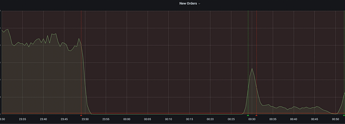
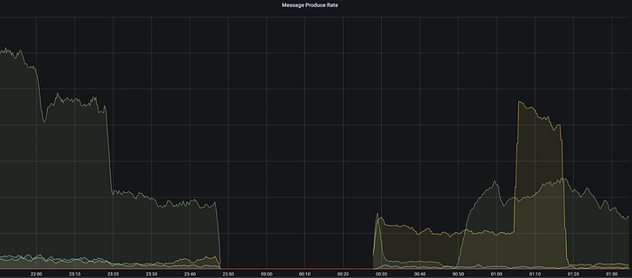

# #BehindTheBug: Breaking the Event Pipeline: A Migration Gone Wrong

In November 2022, Swiggy experienced a significant system outage that lasted for 95 minutes. The incident began when the Order Data Service (ODS), a service that handles the processing and management of order data, stopped publishing events in several Kafka topics, including checkout — ods — order, checkout — ods — order_cancel, and checkout — ods — order_edit. The impact was immediate and widespread as many services that relied on the checkout — ods — order topic for new orders stopped receiving these events. In this blog, we will discuss the challenges faced during this downtime, the steps taken to resolve the issue, and the lessons learned to prevent future occurrences.

Before we dive into the incident details, here’s some background information to set the context:

There was an initiative running in the org that involved migrating topics that belong to point-to-point communication from Kafka to SQS. The migration was motivated by issues encountered with Kafka clusters and the desire to capitalize on the advantages of SQS, especially its scalability, cost efficiency, and enhanced developer experience.

As part of the migration, three topics had already been migrated in Order Data Service, and the last one to be migrated was the order-sync-failed topic. We approached this migration in stages: initially activating the SQS consumer for the specific topic followed by deactivating the Kafka consumer process for that same topic.

For the ‘order-sync-failed’ topic, the initial step of enabling the SQS consumer had been completed successfully. Subsequently, a deployment started late at night to stop the Kafka flow for this topic. This was done by introducing a feature flag to turn off the Kafka consumer for the ‘order-sync-failed’ topic. In just 15 minutes, the changes were rolled out to the canary, handling 30% of the traffic. By the 45-minute mark, the full deployment was rolled out. Log observations confirmed that Kafka had stopped receiving messages for this topic, while SQS was functioning correctly, receiving and processing messages as anticipated.

_Post Deployment Chaos!_

After the full deployment, the vendor’s on-call team received an alert highlighting a significant drop in new orders to the vendor system, eventually reaching zero. In addition, the Customer Relationship Management (CRM) team reported an error with their API, leading to a buildup of customer queries. Figure 1 illustrates the decline in the order flow, which plummeted to zero right after the deployment. This situation was immediately brought to the attention of the central war-room channel. As numerous services (Delivery, CRM, Vendor) are tuned into the checkout — ods — order topic for new orders, they stopped receiving these order notifications. As a result, various teams mistakenly assumed the deployment originated from their end.

*Figure 1: Number of new orders flowing to vendor system went to Zero*

A call was initiated, and after reviewing the deployment history, it was identified that the problem was with the Order Data Service. Steps were then taken to roll back the deployment. Rollback was completed in 5 Mins. From the graphs, we saw events were started published again after the successful rollback:

In the meantime, there was a backlog of customer chats that kept growing. To minimize the effect on incoming orders and to manage the customer chat load, we temporarily shut down all cities. We executed a script to cancel orders that were still being processed. As soon as the system load decreased, we began to reactivate the cities sequentially. Within 10 minutes, all cities were back online.

Upon having a sigh of relief, the teams initiated an investigation into the root cause, a question that was on everyone’s mind. The investigation led to the discovery that the issue started from an incorrect configuration of the feature flag. Instead of just disabling the ‘order-sync-failed’ topic, it unintentionally stopped the processing of events for all topics within ODS. Consequently, no consumer events were processed, causing ODS to stop publishing events across all topics.

_But Why did the issue go unnoticed during the testing stages?_

The primary focus during Development testing was on the SQS and Kafka flows for this specific topic. Consequently, the testing of other Kafka flows was overlooked.

Now, with all the necessary information, let’s apply the 5 Whys analysis to determine the root cause of this incident.

**Why 1: Why have restaurants stopped receiving orders?  
Ans**: Restaurants stopped receiving orders because vendors stopped relaying order events to the restaurants as vendors stopped receiving order events from the ODS.

**Why 2: Why did the vendor stop receiving order events?  
Ans: **Vendor stopped receiving order events because ODS stopped publishing events to checkout–ods–order topic. It was because of the bad deployment that disabled all topics Kafka flow in ODS instead of only the order-sync-failed topic’s Kafka flow. That’s why all Kafka consumers stopped publishing events in ODS.

**Why 3: Why did the ODS stop publishing the events to check out–ods–order?  
Ans: **There was an initiative running in the org that involved migrating topics that belong to point-to-point communication to SQS.order-sync-failed topic was to be migrated from Kafka to SQS. For this, a feature flag was added to disable the processing of events of this topic after they are consumed from Kafka. The flag was configured incorrectly and instead of disabling only order-sync-failed topics, it disabled event processing from all topics in ODS. As events from any consumer were not processing, ODS stopped publishing events in checkout -ods -order, checkout -ods-order-cancel, and checkout-ods-order-edit topics.

**Why 4: Why was it not caught in dev testing / QA testing / Canary ?  
Ans: **In Dev testing, the major focus was on SQS flow and the Kafka flow for this topic. It was missed in testing the other Kafka flows. QA doesn’t have any regression suite for ODS to test E2E. (will be doing the same with checkout-service regression now)

### Key Learnings:

1. Ensure that Unit Tests (UT) and System Level Tests (SLTs) are included in every release. Before a feature undergoes developer testing, obtain approval from the QA team for all associated test cases
2. Ensure that your feature flag is set up correctly and rigorously test it in the preliminary environment.

---
**Tags:** Swiggy Engineering · Kafka · Learning · Migration · Behind The Bug
