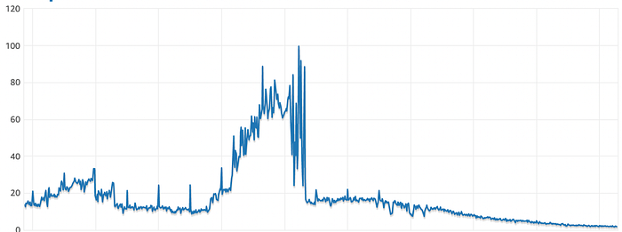
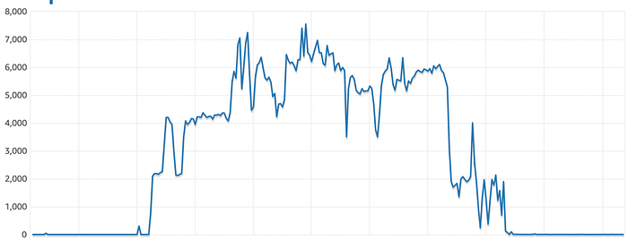

# #BehindTheBug — Indexing Gone Wrong


In [our first blog](./behindthebug-kafka-under-the-water-288c3d05b202.md) in the **#BehindTheBug **series, we explained how a bug brought our entire messaging system down and how we came back to an operational state. In this blog, we will discuss how incorrect indexing caused disruptions to our Instamart business pan India and how we recovered.

At Swiggy Instamart, pickers are the key pillar to our success. Not only do we strive to give them the top-notch app experience possible, but we also ensure that their earnings reflect the effort they put in. The product managers and executives brainstormed and came up with a solution to reward the pickers in the IM pod based on certain metrics. The PRD was thoroughly discussed with the tech and design teams before being frozen. Everyone was aligned and started working diligently to get it delivered as promptly as possible.

Before we jump in, here are some key terms to remember:

**Pickers**: People who pack the items after the order is received at the pods.

**Picker service**: Backend service for serving all the API traffic required by picker apps. In our case, it is responsible for creating and assigning Picking Jobs for pickers.

**Picker Master DB**: Which contains all data on all picking jobs.

_Let’s dive in!_

In the picker service, we introduced a new API that calculates picker performance metrics. The API performs a query in the backend that fetches data from the picker master database (a Relational Database Service) for the last 30 days’ worth of jobs performed by any picker and creates performance metrics that will be used to reward the picker. We knew that retrieving the last 30 days of data was not going to be easy because the number of records was in millions. So, to reduce search time, we created a composite Index on picker identifier and picking timestamp based on discussion with DBA and query pattern. In the composite index, we kept the picked timestamp first and the picker Identifier second as the picked timestamp has higher cardinality.

The query is as follows:

```
SELECT * FROM MasterDB WHERE picked_timestamp > {30Days} AND picker_identifier = "pickerid""
```

We ran a benchmark test on our staging environment with a test picker ingesting 26 days of data and the query returned successfully. It was now time to put it through its paces on a live database. We chose stores based in a selected city as a pilot for this feature and went live. The engineers owning this feature were on the edge of their seats.

We enabled the feature flag in the selected city. As the API had just been newly introduced, there were no calls for the first few minutes. Then, we noticed 1–5 rpm in the API. Everything was going as planned and then,

PING!

We received an alert about significant Kafka consumer lag in the order topic. This is a critical alert because the Kafka topic uses the same Picker master DB to assign orders to pickers across all pods in Instamart, but it got auto-resolved after a few mins, so we assumed it was due to an AWS issue going on at the same time.

However, after 30 minutes, we received the same alerts along with the RDS High CPU Utilization.

Again! What could be the reason?

The team started debugging right away. The CPU Utilization Percent and Read IOPS metrics, as shown in Figures 1.1 and 1.2, were immediately retrieved by the team.


*Fig 1.1 CPU Utilization Percent*


*Fig 1.2 Read IOPS*

From the graph, we discovered that the CPU utilization percentage was hovering over 90%. On normal days it does go above 20–30%. Moreover, the read IOPS reached a high of 8000 (configured max: 10000).

Now things were looking serious!

The expectation was that queries will run smoothly on the master DB but upon debugging, the team found that when the actual queries ran, we were not using the indexes all of the time and the index was only being used intermittently.

_But why was it the case?_

Upon investigating further, we found out that the composite Index was in the wrong order. We had put picked_timestamp first in the index due to its higher cardinality but it should have been in the reverse order i.e. (picked_identifier, picked_timestamp) instead of (picked_timestamp, picked_identifier). **The reason was when a condition has equality checks (=) and range/inequality checks (>, >=, <, <=, IN), then the columns involved in the equality checks should be first in the index and the inequality columns afterward.**

When the index was used, the system was still scanning millions of records, which increased service latency and caused APIs to become very slow. The spike in latency also affected the picker assignment service, which does all the assignments of orders.

But we can disable the flag, right?

Yes, We did! We immediately disabled the feature flag to stop the query, but it had no impact.

At this point, we started breaking out in a cold sweat.

We called the application team to understand the behavior and found out that the feature flag reversal would take effect only if the pickers logged out and logged in again from the app. The problem was that the control was on the UI side and the backend was not integrated with the flag. As a result, even after we disabled the flag, queries continued to flow to the database.

_1 hour after the incident_

Since this issue affected the database which processes pan-India picking jobs, it affected all the pods. To further reduce the load on the DB, we shut down the Instamart business pan-India. With the help of the DBA team, we started killing long-running queries to reduce the load DB. Also, in parallel, the team started the reversal of the backend build to cut off the calls from reaching the DB.

_After 20 more mins_

We restored the Instamart pods across India after the CPU Utilization returned to the normal level following the termination of running queries by the DBA team. Within 15 mins, the build got reverted and we were back to an operational state.

Certainly, the deployment did not go as planned, but the team learned a lot of lessons, jotted them down, and called it a day.

**RCA Process**

In the [first blog](./root-cause-analysis-swiggy-2fac5fe4510b.md), we highlighted the 5 why analysis as one of the key steps in our RCA process. Let’s apply the analysis here:

**Why 1: Why was Instamart shut down for 20 mins?_  
_**Ans: We had to shut down Instamart since our pickers were not being assigned to orders in time which would ultimately result in bad CX. The reason for this was that the async assignment was happening very slowly resulting in a lag in an assignment because of the load on the Database resulting in high latency.

**Why 2: Why were pickers not getting orders assigned / slow assignments to them?  
**Ans: Pickers weren’t getting orders assigned to them because the assignment service require them to fetch the unassigned job. These unassigned jobs are served from the picker master DB. However, DB was responding very slowly and sometimes not at all.

**Why 3: Why was the picker master DB responding slowly / not at all?  
**Ans: We released a change in the picker service, for the feature picker payout which calculates picker performance metrics. Due to issues in this change picker master DB got degraded due to High ~90% CPU utilization and IOPS utilization.

**Why 4: Why did the picker DB get degraded?  
**Ans: In the picker payout feature, we run a query to fetch past(30 days) order metrics for a picker. For this, we got an index created on the relevant columns. But we observed that the query was not using the index every time and was thus scanning the entire table. When it did use the index, it still scanned 30% of the rows.

**Why 5: Why was the index not working properly?**  
Ans: The index we created was wrongly configured. We used two fields in it (picker_identifier and picked_timestamp). We had put picked_timestamp first in the index due to its higher cardinality but It should have been in the reverse order i.e. (picker Identifier, picked_timestamp) instead of (picked_timestamp, picker Identifier). The reason is When a condition has equality checks (=) and range/inequality checks (>, >=, <, <=, IN), then the columns involved in the equality checks should be first in the index and the inequality columns afterward.

When the ordering is incorrect (picked_timestamp, picker Identifier), the DB optimizer takes a call after a certain percentage of rows to not use the index at all. i.e. if the filter by create_time is returning > X rows, it will do a full table scan instead, which is why we saw inconsistent use of the index for the same query. If we use the correct order of index (picker Identifier, picked_timestamp), then the optimizer always picks the index.

### Key Learnings:

- OLAP use cases MUST not run on transactional DBs: For analytics or reporting use cases, data should be pre-computed and stored in a data store. With the request of the end-user to view the data, we should serve only pre-computed data.
- Analyze query performance regularly: Use the [explain statement](https://dev.mysql.com/doc/refman/8.0/en/explain.html) to evaluate SQL queries before deciding to use them in production. This will help to evaluate whether the index will be used or not while running the actual query.
- Feature flag should immediately prevent the feature from degrading the service. Toggling the flag should not require any end-user-level action like logging out and logging in. Similarly, a single feature flag should be honored by the front end as well as the back end.

Co-authored with [Abhay Baiju](https://medium.com/u/a724d83d29b6?source=post_page---user_mention--6b4d682fd805---------------------------------------), Gaurav Ranjan, [Aniket Sinha](https://medium.com/u/fb28a5080d80?source=post_page---user_mention--6b4d682fd805---------------------------------------)

---
**Tags:** Behind The Bug · Swiggy Engineering · Sql Query Performance · Rca · Learning
