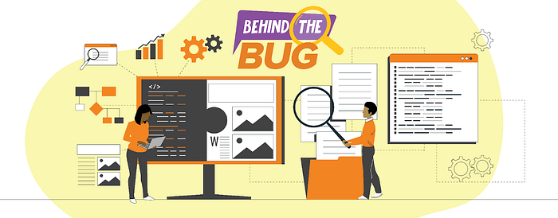
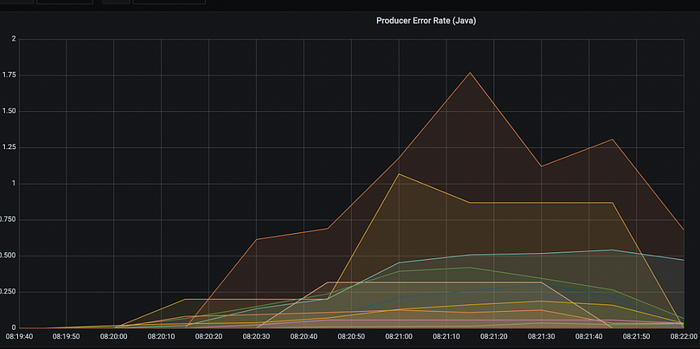
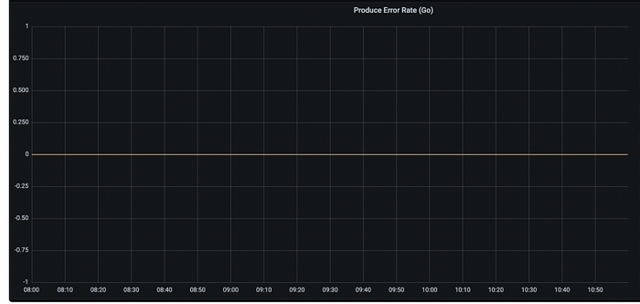
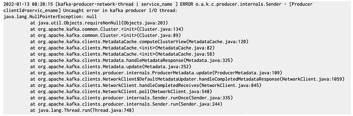
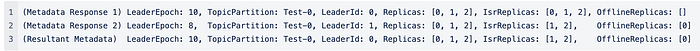
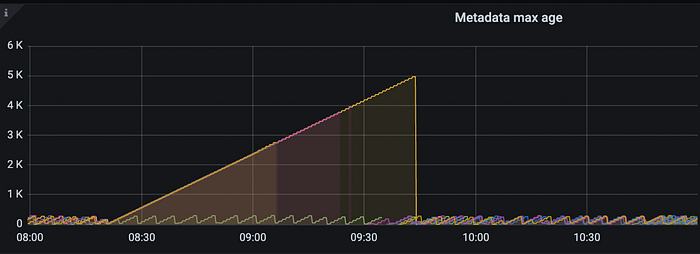

# #BehindTheBug — Kafka Under The Water

As part of our **_#BehindTheBug _**series, this blog will go behind the scenes on one of the issues we faced with our cloud messaging platform, how everything unfolded, and our key learnings. So, here is how it all started.

It was a nice warm January day in Bangalore. Atul had just finished his scrum meeting for the day. He had the day’s tasks cut out for him and decided to browse through his Slack messages for a few minutes before starting on deepwork. _#random_ channel had some really funny memes. Few reminders from the HR teams to update leaves on the HR system. He saw a link from Linkedin upvoted by many of his colleagues and he just clicked on it when he received a pager alert.

PING!

Having been in Swiggy for 6+ years, he knew that usually means trouble. It was a pager from a service that manages driver trips alerting us to an increase in Kafka publish failures. The service’s logs showed that the requests were timing out. Many of his colleagues had also received this and messages were now flowing on the #_warroom_ channel. Within 15 mins, the checkout service received a second alert regarding confirm order exceptions. On checking the monitoring dashboards, Atul found that the issue was not restricted to the checkout service alone. This was quite widespread. Atul closed his to-do list, sipped on some water, straightened his seat, and went into debug mode.

_Before we go ahead, here is some background._

Swiggy uses an Apache Kafka-based cloud messaging platform for event streaming and processing, microservice orchestration, and choreography. The key concepts of the platform are as follows: producers, consumers, topics, partitions, offsets, etc. To learn more about Apache Kafka’s internals, refer to this [**book**](https://www.oreilly.com/library/view/kafka-the-definitive/9781491936153/).

(_Back to the Incident_)

On this particular day, we experienced an issue with its pub-sub messaging system. A few partitions in one of the Kafka clusters went offline for 4 minutes. It took down 18 services internally. The services were not able to publish messages to the Kafka cluster resulting in increased retry requests. Despite setting the linear back off at 100 ms over a period of 10 mins, we observed a 100X increase in the overall ingress to the cluster and clients being throttled. To reduce the load from the cluster, we reduced the coverage of ordering services in the top 20 cities for nearly an hour and restarted the impacted services one by one.

_(Diving deep)_

The impacted cluster was one of the most important ones as there are more than 50 services that interact with each other using this Kafka cluster in the order fulfilment journey. When the partitions went offline, the producer clients started to receive the _NOT_ENOUGH_REPLICAS_ exception. It was understandable as we had configured a minimum number of in-sync replicas for produce requests to succeed to ensure higher durability of the messages and there were not enough in-sync replicas at the time. The Kafka client library that we use handles this retryable exception gracefully and we expected our services to recover automatically. However, there were few services that did not recover.

While debugging the issue, the first thing we noticed was all the impacted services were Java clients only. Interesting that the Go clients were not impacted. Why could this be?

Let’s pull out the producer error rate of Java and Go clients (shown in Figures 1.1 and 1.2)

*Fig 1.1*

*Fig 1.2*

We discovered that although Go clients can handle retryable errors, not all Java clients were affected. The services affected were a subset of all Java clients.Why is that so?.It’s time to do some more debugging and go through logs.

_(More coffee for the team)_

We then started going through the logs of the impacted Java services. We noticed that these producer clients were continuously observing _NOT_LEADER_FOR_PARTITION_ exceptions. This exception indicates that the producers were trying to send messages for a partition to the wrong leaders in the Kafka cluster. We usually get this exception when there is a new leader elected for a partition in the cluster but the clients are not yet aware of it. This is again a retryable error and the clients are expected to get the latest information from the cluster about the new leader of the partition. This information is commonly referred to as [**metadata**](https://kafka.apache.org/documentation/#gettingStarted) in Kafka parlance. However, the strange thing in our case was that despite repeated requests from clients to update the metadata, it was never updated, resulting in ongoing _NOT_LEADER _FOR_PARTITION_ exceptions and increased producer retries.

_(1 hour since the incident)_

We still did not have the root cause. We needed to gather more evidence that could lead us to the actual problem. We decided to look at the time period just before the services started observing _NOT_LEADER_FOR_PARTITION_ exceptions. We identified that all these clients which did not recover automatically had the following error in common:

The client assumes that if the broker has returned a non-null leader for a partition in the metadata response, it must also include the details about the leader node in the same response. But that assumption did not seem to be holding true as we got the NullPointerException while accessing details about the leader node. We also found a [**bug**](https://issues.apache.org/jira/browse/KAFKA-9261) report for the same issue which describes two scenarios in which the above assumption will not hold true. The scenarios are (quoted from the [ticket](https://medium.com/r?url=https%3A%2F%2Fissues.apache.org%2Fjira%2Fbrowse%2FKAFKA-9261)):

> “1. The client is able to detect stale partition metadata using leader epoch information available. If stale partition metadata is detected, the client ignores it and uses the last known metadata. However, it cannot detect stale broker information and will always accept the latest update. This means that the latest metadata may be a mix of multiple metadata responses and therefore the invariant will not generally hold.2. There is no lock that protects both the fetching of partition metadata and the live broker when handling a Metadata request. This means a UpdateMetadata request can arrive concurrently and break the intended invariant.It seems case 2 has been possible for a long time, but it should be extremely rare. Case 1 was only made possible with KIP-320, which added the leader epoch tracking. It should also be rare, but the window for inconsistent metadata is probably a bit bigger than the window for a concurrent update.”

BINGO!

It’s highly likely that we hit the first scenario because it coincides with a few partitions going offline. The following sequence of metadata responses can help explain the first scenario:

*Fig 1.3*

The stale metadata on the client side explains the continuous _NOT_LEADER_FOR_PARTITION_ exceptions that the clients received.

We also observed that after the occurrence of this _NullPointerException_, there was a continuous increase in the Metadata age on the client applications. As we can see in Fig 1.3 above, the metadata maximum age increased to 5000 seconds. For a Kafka cluster operating in optimal condition, the metadata age usually never goes above 300 seconds.

Now, we began to identify the impacted clients and did a force restart. The restarts that we had performed on the impacted clients forced them to recover from the inconsistent state and get fresh metadata updates from the cluster which resulted in the clients being back to the normal operational state immediately and within two hours of the incident, we were fully operational.As an action item, we also upgraded the Kafka client library used by the services to the latest version to avoid this issue from recurring in the future.

Phew!

Atul collects his thoughts and jots down the action items and learnings for the team, while the to-do list for the day stares back at him.

### Our RCA Process:

In [_our previous blog_](./root-cause-analysis-swiggy-2fac5fe4510b.md), we highlighted the 5 why analysis as one of the key steps in the RCA process. Let’s apply that here :

**Why 1: Why did the retry and error rates increase for a few Java clients sending messages to the primary cluster?  
A**: These java producer clients were sending the messages for a few partitions to the wrong partition leaders.

**Why 2: Why were the producer clients sending the messages to the wrong partition leaders?  
A**: The producer clients had incorrect metadata which led to the producer sending messages to the wrong partition leaders.

**Why 3: Why did the producer clients have incorrect metadata?  
A**: We discovered that the Java Apache Kafka client library contains a [_bug_](https://issues.apache.org/jira/browse/KAFKA-9261) that led to the producer clients receiving _NullPointerException_. After receiving NPE, The clients went to an inconsistent state making all subsequent attempts to update the metadata unsuccessful. This resulted in a continuous increase in the Metadata age / incorrect metadata in the client applications.

### Key learnings:

1. Review your client retry policy to ensure that you do not overload the cluster in case of an issue like the one we faced. [**_KIP-580_**](https://cwiki.apache.org/confluence/display/KAFKA/KIP-580%3A+Exponential+Backoff+for+Kafka+Clients)**_ _**would make it easier to set up exponential backoff for clients to avoid making unnecessarily high numbers of requests when they are not able to recover gracefully from failures.
2. Ensure that you are always keeping an eye on the major updates on the Kafka client libraries to proactively avoid any unwanted issues(For e.g in this scenario all the producer clients with the latest version of the Kafka library were able to auto recover).
3. Building a wrapper on top of the internal apache Kafka client library helped us in debugging the issue and managing the clients which use a shared system like the Kafka cluster. Additionally, for each client, we were able to set up monitoring and alerting using the common library. Hence we recommend building a wrapper on top of the apache client library as best practices.

---

Co-authored with [Atul Kumar](https://medium.com/u/147b05499897?source=post_page---user_mention--288c3d05b202---------------------------------------)

---
**Tags:** Swiggy Engineering · Apache Kafka · Behind The Bug · Rca · Learning
